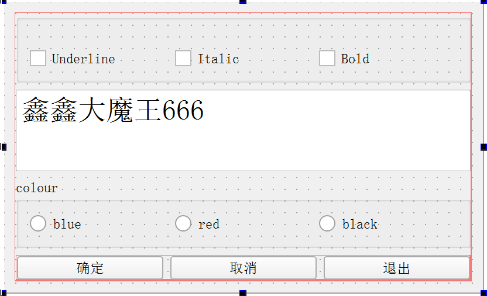

## 一、认识Qt

Qt实质上是用C++编写的大型库类，为跨平台应用开发提供了一个完整的框架，QT框架包含了大量的类，支持GUI、数据库、网络、多媒体等各种应用的编程

### 1.1 Qt简介

Qt跨平台能力：在一个主机平台上编写的Qt项目的源代码，在另一个主机平台或目标平台上经过重新编译，就可以得到在不同目标平台上运行的引用软件

* Qt还对标准C++语言进行了扩展，引入了信号和槽、属性等机制，为跨平台和GUI程序的对象间通信提供了极大的方便
* Qt还提供了一种自创的编程语言QML，它是类似于JavaScript的声明性语言，QT提供了用QML编写的Qt Quick ，它类似于Qt C++类库，区别是Qt Quick中的各种控件被称为QML类型。QML用于描述程序的用户界面，将用户界面描述为对象树，每个对象具有自己的各种属性

### 1.2 第一个项目

项目类型：

* Qt Widget Application：基于界面组件的应用，也就是具有窗口的GUI程序，项目编程使用C++语言
* Qt Console Application：控制台应用，没有GUI。一般是在学习C/C++语言的基本语法，只需简单的输入输出操作时才创建此应用
* Qt Quick Application：基于Qt Quick的应用，需要使用QML编程

Qt Widget Application的三个窗口基类：

* QMainWindow：是主窗口类，主窗口类具有菜单栏、工具栏和状态栏
* QWidget：所有界面组件类的基类，QWidget可以作为独立的窗口，就是一个空白的窗口
* QDialog：对话框类，窗口具有对话框的具体效果，例如没有最大化按钮

构建(build)是一个项目就是根据构建系统（qmake或Cmake）的配置，对项目内的源程序文件进行编译和连接，生成可执行文件或库的完整过程。构建过程包括编译过程，编译是对单个文件的操作，构建是对整个项目的操作


## 二、GUI程序设计基础

### 2.1 GUI程序结构和运行机制

#### 2.1.1 GUI项目组成

* samp.pro：是qmake构建系统的项目配置文件，其中存储了项目的各种设置内容
* widget.ui：是UI文件，这是用于窗口界面的可视化设计的文件
* main.cpp：主程序文件，包含main函数
* widget.h：是窗口类定义头文件，他用到了UI文件widget.ui中的一个可视化设计的窗口界面
* widget.cpp：对应于widget.h的源程序文件

#### 2.1.2 项目配置文件

在使用向导创建项目时，如果选择qmake构建系统，就会生成一个后缀为".pro"的项目配置文件，文件明就是项目的名称。内容如下：

```properties
QT       += core gui
greaterThan(QT_MAJOR_VERSION, 4): QT += widgets
CONFIG += c++11
DEFINES += QT_DEPRECATED_WARNINGS

SOURCES += \
    main.cpp \
    widget.cpp

HEADERS += \
    widget.h

FORMS += \
    widget.ui

# Default rules for deployment.
qnx: target.path = /tmp/$${TARGET}/bin
else: unix:!android: target.path = /opt/$${TARGET}/bin
!isEmpty(target.path): INSTALLS += target
```

qmake是构建项目的工具软件，qmake的作用是根据项目配置文件中的设置生成Makefile文件，然后C++编译器就可以根据makefile文件进行编译和连接。

qmake配置文件中常见变量(配置文件中都是大写的，这里小写)的含义：

| 变量        | 含义                                                         |
| ----------- | ------------------------------------------------------------ |
| qt          | 使用的QT模块列表，再用到某些模块时需要手动添加               |
| config      | 通用配置选项                                                 |
| defines     | 项目中的预定义处理列表，例如可以定义一些用于预处理的宏       |
| template    | 项目中使用的模板，项目模板可以是应用程序（app）或库（lib），如果不设置就默认为应用程序 |
| headers     | 头文件列表                                                   |
| sources     | 源文件列表                                                   |
| forms       | UI文件列表                                                   |
| resources   | 资源文件列表                                                 |
| target      | 项目构建后生成的应用程序的可执行文件名称，默认与项目名称相同 |
| destdir     | 目标可执行文件的存放路径                                     |
| includepath | 项目中用到的其他头文件的搜索路径列表                         |
| dependpath  | 项目其他依赖文件（如源程序文件）的搜索路径列表               |

#### 2.1.3 UI文件

Qt Designer功能区域：

* 组件面板：分为多个组，如Layouts、Buttons、Display Widgets等，界面设计的常用组件都可以在组件面板中找到
* 待设计窗口：可以将组件放置到窗口上
* Action编辑器（Action Editor）：可以可视化设计Action
* 信号和槽编辑器（Signals and Slots Editor）：用于可视化地进行信号和槽地关联
* 布局和界面设计工具栏：工具栏上的按钮主要用于实现布局和界面设计
* 对象检查栏（Object Inspector）：用树状视图显示窗体上各组件布局和层级关系。视图有两列，显示了每个组件的对象名称（objectName）和类名称
* 属性编辑器（Property Editor）：属性编辑器显示窗体上选中的组件或窗体的各种属性，可以在属性编辑器里修改这些属性的值

#### 2.1.4 主程序文件

main.cpp完整代码：

```c++
#include "widget.h"
#include <QApplication>
int main(int argc, char *argv[])
{
    QApplication a(argc, argv);
    Widget w;
    w.show();
    return a.exec();
}
```

* main函数是C++程序的入口，主要功能是定义并创建应用程序，定义并创建窗口对象和显示窗口，运行应用程序，开始应用程序的消息循环和事件处理
* QApplication应用程序类：
  1. 管理图形用户界面应用程序和控制流和主要设置
  2. 是Qt生命，一个程序要确保一直运行，就肯定至少得有一个循环，这就是Qt主消息循环，在其中完成的来自窗口系统和其他资源的所有事件消息处理和调度。它也处理应用程序的初始化和结束，并且提供对话管理
  3. 对于任何一个使用Qt的图形用户界面应用程序，都正好存在一个QApplication对象，不论这个应用程序在同一时刻存在多少个窗口
* 定义的Widget类型的变量w创建窗口对象，Widget是窗口的类名称，w.show()显示此窗口
* a.exec()：消息进入循环，等待对用户输入进行响应。这里main()把控制权转交给QT，QT完成事件处理工作，当应用程序退出的时候exec()的值就会返回。在exec()中，Qt接收并处理用户和系统的事件并且把它们传递给适当的窗口部件

#### 2.1.5 窗口相关的文件

在Qt Creator的Projects设置界面，取消勾选Shadow build复选框，然后一release模式构建项目，项目的根目录会产生一个文件ui_widget.h

| 文件        | 说明                                                         |
| ----------- | ------------------------------------------------------------ |
| widget.h    | 定义了窗口类Widget                                           |
| widget.cpp  | 实现了Widget类的功能的源程序文件                             |
| widget.ui   | 窗口UI文件，用于在QT Designer中进行UI可视化设计。widget.ui是一个XML文件，存储界面上各个组件的属性和布局内容 |
| ui_widget.h | UI文件经过UIC编译后生成的文件，这个文件定义了一个类，类的名称是Ui_Widget，用C++语言描绘UI文件中界面组件的属性设置、布局以及信号和槽的关联等内容 |

##### 2.1.5.1 文件widget.h

```c++
#ifndef WIDGET_H
#define WIDGET_H

#include <QWidget>

QT_BEGIN_NAMESPACE
namespace Ui { class Widget; }//一个命名空间UI，包含一个类Widget
QT_END_NAMESPACE

class Widget : public QWidget
{
    Q_OBJECT//这是使用Qt元对象系统的类时必须插入的一个宏，插入这个宏后，Widget类中就可以使用槽、属性等功能

public:
    Widget(QWidget *parent = nullptr);
    ~Widget();

private:
    Ui::Widget *ui;//这个指针使用前面声明的命名空间Ui里的类Widget定义的，所以ui是窗口UI类的对象指针， 它指向可视化设计的窗口界面。要访问界面上的组件，就需要通过这个指针来实现
};
#endif // WIDGET_H
```

##### 2.1.5.2 文件widget.cpp

```c++
#include "widget.h"
#include "ui_widget.h"

Widget::Widget(QWidget *parent)
    : QWidget(parent)
    , ui(new Ui::Widget)//功能是运行父类QWidget的构造函数，创建一个Ui::Widget类的对象ui，这个ui就是Widget类中的private部分定义的指针变量ui
{
    ui->setupUi(this);//setupUi()函数里会创建窗口上所有组件的界面组件，并且以Widget窗口作为所有组间的父容器
}

Widget::~Widget()
{
    delete ui;
}
```

##### 2.1.5.3 文件widget.ui

文件widget.ui是窗口界面定义文件，是一个XML文件，它存储了界面所有组件的属性设置、布局、信号与槽函数的关联等内容。用Qt Designer打开UI文件进行窗口界面可视化设计，保存修改后会重新生成UI文件。

##### 2.1.5.4 ui_widget.h

它是构建项目的一个中间文件

```c++
/********************************************************************************
** Form generated from reading UI file 'widget.ui'
**
** Created by: Qt User Interface Compiler version 5.14.2
**
** WARNING! All changes made in this file will be lost when recompiling UI file!
********************************************************************************/

#ifndef UI_WIDGET_H
#define UI_WIDGET_H

#include <QtCore/QVariant>
#include <QtWidgets/QApplication>
#include <QtWidgets/QLabel>
#include <QtWidgets/QWidget>

QT_BEGIN_NAMESPACE

class Ui_Widget//用于封装和可视化设计，它并没有继承QWidget，并不是一个窗口类
{
public://为每个public组件定义了一个指针变量，变量的名称就是UI可视化设计时为组件设置的对象名称
    QLabel *label;

    void setupUi(QWidget *Widget)
    {
        if (Widget->objectName().isEmpty())
            Widget->setObjectName(QString::fromUtf8("Widget"));
        Widget->resize(800, 600);
        QFont font;
        font.setPointSize(15);
        font.setBold(true);
        font.setWeight(75);
        Widget->setFont(font);
        label = new QLabel(Widget);//创建界面组件时必须为组件设置父容器，容器可以嵌套，没有父容器的界面组件就是独立的窗口
        label->setObjectName(QString::fromUtf8("label"));
        label->setGeometry(QRect(-50, 40, 461, 141));
        label->setFont(font);

        retranslateUi(Widget);//设置界面上各组件的文字属性

        QMetaObject::connectSlotsByName(Widget);
    } // setupUi

    void retranslateUi(QWidget *Widget)
    {
        Widget->setWindowTitle(QCoreApplication::translate("Widget", "Widget", nullptr));
        label->setText(QCoreApplication::translate("Widget", "          Hello world", nullptr));
    } // retranslateUi

};

namespace Ui {
    class Widget: public Ui_Widget {};
} // namespace Ui

QT_END_NAMESPACE

#endif // UI_WIDGET_H
```

### 2.2 可视化UI设计

#### 2.2.1 窗口界面可视化设计



ui文件中各组件的名称、属性设置和说明

| 对象名称      | 类名称         | 属性设置                                  | 说明                                                   |
| ------------- | -------------- | ----------------------------------------- | ------------------------------------------------------ |
| plainTextEdit | QPlainTextEdit | text="鑫鑫大魔王666"<br>font.PointSize=20 | 简单的多行文本编辑器，设计师双击组件可设置其显示的文字 |
| chkBoxUnder   | QCheckBox      | text="Underline"                          | 设置文字带有下划线                                     |
| chkBoxItalic  | QCheckBox      | text="Italic"                             | 设置文件为斜体                                         |
| chkBoxBold    | QCheckBox      | text="Bold"                               | 设置文件为粗体                                         |
| radioBlack    | QRadioButton   | text="Black"                              | 设置文件颜色为黑色                                     |
| radioRed      | QRadioButton   | text="Red"                                | 设置文件颜色为红色                                     |
| radioBlue     | QRadioButton   | text="Blue"                               | 设置文件颜色为蓝色                                     |
| btnClear      | QPushButton    | text="清空"                               | 清楚编辑器的文字                                       |
| btnOK         | QPushButton    | text="确定"                               | 返回确定，并关闭窗口                                   |
| btnExit       | QPushButton    | text="退出"                               | 退出程序                                               |
| Dialog        | Dialog         | windowTitle="信号与槽的使用"              | 窗体，其对象名称与窗口类名称同名                       |

对于界面组件的属性设置，注：

* 对象名称是窗口组件的实例名称，界面上的每一个组件都需要有唯一的对象名称，程序里访问界面组件时都是通过其对象名称进行的，自动生成的槽函数名称里也有对象名称
* 窗口的对象名称会影响窗口UI的名称。dialog.ui被UIC编译后生成文件ui_dialog.h。窗体的对象名称与文件ui_widget.h中定义的窗口UI类有关
* 设置窗体的font属性后，界面上其他组件的默认字体就是窗体的字体，无需再单独设置，除非要为某个组件设置单独的字体
* 组件的属性都有默认值，一个组件的属性被修改后，属性编辑器里的属性名称会以粗体显示。如果像恢复属性的默认值，点击要恢复属性的默认值，点击属性值右端的还原按钮

#### 2.2.2 界面组件布局管理

Layouts和Spacers两个分组里的布局组件

Qt Designers有一个工具栏，用于使界面进入不同的设计状态

####  2.2.3 信号和槽简介

信号和槽是Qt编程的基础，也是Qt的创新，使得Qt中的组件交换变得直观简单

* 信号：在特定情况下被发射的通知，如QPushButton较常见的就是点击信号click()
* 槽：对信号响应的函数。槽就是函数，与一般的C++函数一样，可以具有任何参数，也可以直接被调用

```c++
QObject::connect(sender, SIGNAL(signal()), receiver, SLOT(slot()));
```

1. connect()是QObject类中的一个静态函数，而QObject是大部分Qt类中的Qt类的基类，在实际调用时可以忽略前面的限定符部份

2. sender是发射对象的信号的名称，signal()是信号，receiver是接收对象的信号的名称，slot()是槽函数。当信号和槽函数带有参数时，要指明各参数的类型，但不用指明参数名称

3. SIGNAL，SLOT是Qt的宏，分别用于指明信号和槽函数，并将它们的参数转换为相应的字符串

4. 一个信号可以连接多个槽函数，多个信号可以连接同一个槽函数，一个信号可以连接另一个信号

5. 当一个信号被发射时，与其关联的槽函数通常被立即执行，就像正常调用函数一样。只有当信号关联的所有槽函数运行完毕后，才运行发射处后面的代码

6. 函数connect()的另一种形式，使用函数指针：

   ```c++
   QObject::connect(btnClose, &QPushButton::clicked, Widget, qOverload<>(&QWidget::close))
   ```

为Underline设计槽函数：

```c++
void Dialog::on_checkBoxUnderline_clicked(bool checked)
{
    QFont font=ui->plainTextEdit->font();
    font.setUnderline(checked);
    ui->plainTextEdit->setFont(font);
}
```

使用自定义槽函数：

```c++
void Dialog::setTextFontColor()
{
    QPalette plet=ui->plainTextEdit->palette();
    if(ui->radioblack->isChecked())
       plet.setColor(QPalette::Text,Qt::black); 
    else if(ui->radioblue->isChecked())
        plet.setColor(QPalette::Text,Qt::blue);   
    else if(ui->radiored->isChecked())
        plet.setColor(QPalette::Text,Qt::red);   
    ui->plainTextEdit->setPalette(plet);
}
```

自定义的参函数需要手动关联：

```c++
QObject::connect(ui->radioblack, SIGNAL(clicked()), this, SLOT(setTextFontColor())) QObject::connect(ui->radiored, SIGNAL(clicked()), this, SLOT(setTextFontColor())) QObject::connect(ui->radioblue, SIGNAL(clicked()), this, SLOT(setTextFontColor()));
```

#### 2.2.4 Qt构建项目基本过程


1. 元对象系统和MOC

   Qt对标准C++语言进行了扩展，引入了元对象系统（meta-object system,MOS），所有从QObejct继承的类都可以利用元对象系统提供的功能

   Qt提供了元对象编译器（MOC），构建项目时，项目中的头文件会先被MOC预编译

2. UIC文件和UIC

   在构建项目时，可视化设计的窗口UI文件会被用户界面编译器（UIC）转换为一个C++源程序文件

3. 资源文件和RCC

   Qt中的资源文件（.qrc文件）会被资源编译器（RCC）转换为一个C++程序文件

4. 标准C++编译器


## 三、Qt框架功能概述

### 3.1 QT类库中的模块

* Qt基础模块（Qt Essentials）：提供了Qt所在平台上的的基本功能
* Qt附加模块（Qt Add-Ons）：实现了特定功能的模块

#### 3.1.1 Qt基础模块

| 模块    | 功能                                                |
| ------- | --------------------------------------------------- |
| Qt Core | Qt框架中的核心，定义了元对象的系统对标准C++进行扩展 |
|Qt GUI|提供了用于GUI设计的机基础类，可用与窗口系统集成、事件办理、字体和文字处理等|
|Qt Widgets|提供用于创建GUI的各种界面组件类|
|Qt QML|提供用QML编程的框架，定义了QML和基础引擎|
|Qt Quick|这个模块适用于开发QML应用程序的标准库，提供创建UI的一些基本类型|

####3.1.2 Qt附加模块

| 模块          | 功能                               |
| ------------- | ---------------------------------- |
| Qt charts     | 提供用于数据显示的一些二维图标组件 |
| Qt SQL        | 提供一些使用SQL操作数据库的类      |
| Qt multimedia | 提供一些处理多媒体功能的类         |

### 3.2 Qt全局定义

头文件`<QtGlobal>`包含Qt框架中的一些全局定义，包括基本数据类型、函数和宏

#### 3.2.1 数据类型定义

为了确保在各个平台上各种基本数据类型都有统一的长度，QT为各种常见数据类型定义了类型符号

| Qt数据类型           | 字节数  |
| -------------------- | ------- |
| qint8/16/32/64       | 1/2/4/8 |
| qlonglong            | 8       |
| quint8/16/32/64      | 1/2/4/8 |
| qulonglong           | 8       |
| uchar/short/int/long | 1/2/4/8 |
| qreal(double)        | 8       |
| qsizetype(ssize_t)   | 8       |
| qfloat16             | 2       |

* qreal默认表示八字节double类型的浮点数，如果Qt使用-qreal float选项进行配置，就表示4字节float类型的浮点数
* qfloat16用于表示16位的浮点数，使用它要包含`<QFloat16>`
* qsizetype等效于sszie_t，表示有符号整数

#### 3.2.2 函数

头文件`<QtGlobal>`包含一些常用函数的定义，这些函数多半以模板类型作为输入和输出参数类型

| 函数原型                                                  | 功能                                   |
| --------------------------------------------------------- | -------------------------------------- |
| T qAbs(const T &value)                                    | 返回变量的value的绝对值                |
| const T &qBound(const T &min,const T &value,const T &max) | 返回value限定在在min-max的值           |
| T qExchange(T &obj,U &&newValue)                          | 将obj的值用newValue替换，返回obj的旧值 |
| int qFpClassify(double val)                               | 返回val的分类                          |
| int qFuzzyCompare(double p1,double p2)                    | 若p1与p2近似相等，返回true             |
| bool qFuzzyIsNull(double d)                               | 若参数d约等于0，返回true               |
| double qInf()                                             | 返回无穷大的数                         |
| bool qIsFinite(double d)                                  | 若d是一个有限的数，返回true            |
| bool qIsInf(double d)                                     | 若d是一个无穷大的数，返回true          |
| bool qIsNaN(double d)                                     | 若d为非数，返回true返回value           |
| const T &qMax(const T &value1,const T &value2)            | 返回value1和value2中的较大值           |
| const T &qMin(const T &value1,const T &value2)            | 返回value1和value2中的较小值           |
| qint64 QRound64(double value)                             | 将value近似为最接近的的qint64类型整数  |
| int qRound(double value)                                  | 将value近似为最接近的的int类型整数     |

#### 3.2.3 宏定义

`<QtGlobal>`头文件中定义了很多宏

* QT_VERSION表示qt版本
* Q_BYTE_ORDER表示系统内部中的数据的字节序。Q_BIG_ENDIAN表示大端字节序，Q_LITTLE_EBDIAN表示小段字节序
* Q_DECL_IMPORT和Q_DECL_EXPORT分别用于在使用或设计共享库时导入或导出库的内容
* Q_UNUSED(name)用于声明函数中未被使用的参数。当函数输入参数在函数自身的代码里未被使用时，需要用这个宏声明，否则会出现编译警告
* foreach(variable,container)用于遍历容器的内容
* qDebug(const char*message,...)用于在debugger窗口显示信息。在Qt Creator中，debugger窗口相当于Application Output窗口

### 3.3 Qt元对象系统

#### 3.3.1 元对象系统概述

Qt元对象系统的功能建立在以下三个方面：

* QObject类是所有使用元对象的类的基类
* 必须在一个类中的开头部分插入宏Q_OBJECT，这样这个类才可能使用元对象系统中的特性
* MOC为每个QObject的子类提供必要的代码来实现原对象系统中的特性

##### 3.3.1.1 QObject类

QObject类是所有原对象系统的类的基类，也就是说，如果一个类的父类或上层父类是QObject，可以使用信号与槽、属性等特性

| 函数                    | 功能 |
| ----------------------- | ---- |
| QMetaObject *metaObejct() | 返回这个对象的元对象 |
|QMetaObject *staticMetaObject||
|bool inherits()||
|QString tr()||
|QObjectList &children()||
|QObject *parent||
|void setParent()||
|T findChild()||
|QList<T> findChildren()||
|QMetaObejct::Connetction connect()||
|bool disconnect()||
|bool blockSignals()||
|QList<QByteArray> dynamicPropertyNames()||
|bool setProperty()||
|QVariant property()||


##### 3.3.1.2.QMetaObject类

每个QObject及其子类的实例都有一个自动创建的元对象，元对象是QMetaObejct类型的实例

|      |      |
| ---- | ---- |
|      |      |
|      |      |
|      |      |
|      |      |
|      |      |
|      |      |
|      |      |
|      |      |
|      |      |
|      |      |
|      |      |
|      |      |
|      |      |
|      |      |
|      |      |
|      |      |
|      |      |
|      |      |
|      |      |
|      |      |
|      |      |
|      |      |
|      |      |
|      |      |


#### 3.3.2 运行时类型信息

通过使用QObject和QMetaObejct提供的以下一些提供的以下一些接口函数，可以在运行时获得一个对象的类名称以及其父类的名称，判断其是否从某个类继承而来

1. QMetaObject::className()，运行时返回类名称的字符串
2. QObject::inherits()，判断一个对象一个对象是不是继承某个类的实例，顶层的父类是QObject
3. QMetaObejct::superClass()，返回该元对象所描述类的父类的元对象，通过父类的元对象可以获得父类的一些元数据
4. qobject_cast()，是头文件`<QObject>`中定义的一个非成员函数，对于QObject及其子类的对象，可以使用qobject_cast()进行动态类型转换

#### 3.3.3 属性系统

##### 3.3.3.1 属性定义

属性是QtC++的一个扩展的特性，是基于元对象系统实现的，标准C++语言中没有属性。在QObject的子类中，我们可以使用Q_PROPERTY定义属性

```properties
Q_PROPERTY(typename
			(READ getFunction [WRITE setFunction] |
			MEMBSR memberName [(READ getFunction | WRITE setFunction)])
			[RESET resetFunction])
			.....
```

宏Q_PROPERTY定义一个值类型为type，名称为name的属性，用READ、WRITE关键字分别定义属性的读取、写入函数，还有一些其他关键字用于定义属性的一些操作特性。属性值类型为可以是QVariant支持的任何类型

主要关键字（小写形式）的含义：

* read：指定一个读取属性值的函数，没有member关键字时必须设置read
* write：指定一个设置属性值的函数，只读属性没有write配置
* member：指定一个成员变量与属性相关联，使之称为可读可写的属性
* reset：可选，用于指定一个设置属性默认值的函数
* notify：可选，用于设置一个信号，当属性变化时发射此信号
* designable：表示属性是否在QT Designer的属性编辑器里可见，默认值为true
* user：表示这个属性是不是用户编辑的属性，默认值为false
* constant：表示属性值是不是一个常数
* final：所以定义的属性不可被重载：

案例：

```c++
Q_PROPERTY(quint32 age READ age WRITE setAge NOTIFY ageChanged)
Q_PROPERTY(QString name MEMBER m_name)
Q_PROPERTY(quint32 score MEMBER m_score)
```

##### 3.3.3.2 属性的使用

可读可写的属性通常有一个用于读取属性值的函数，函数名一般与属性值相同，还有一个设置属性的函数：

```C++
int age();
void setAge(quint8 ageValue)
```

QObject类提供了两个函数直接通过属性名字字符串来访问属性

```c++
bool isFlat=ui->btnProperty->property("flat").toBool();
ui->btnProperty->setProperty("flat",!isFlat);
```

QMetaObject类中的一些函数可以提供元对象所描述类的属性元数据，属性元数据用QMetaProperty类描述，它有各种函数可反应属性的一些特性

```c++
const QMetaObject *meta=ui->spinBoy->metaObject();
int index=meta->indexOfProperty("value");
QMetaProperty prop=meta->property(index);
bool res=prop.isWritable();
res=prop.isDesignable();
res=prop.hasNotifySignal();
```

##### 3.3.3.3 动态属性

函数QObject::setProperty()设置属性值时，如果属性名称不存在，就会为对象定义一个新的属性并设定属性值，这个就称为动态属性

Property可以读取动态属性的属性值

##### 3.3.3.4 附加的类属性

元对象系统还支持使用宏Q_CLASSINFO()在类中定义一些类信息

例：

```c++
class QMyClass : public QObject
{
	Q_OBJECT
    Q_CLASSINFO("author","WANG")
    Q_CLASSINFO("comapny","WIT")
    Q_CLASSINFO("author","2.0.0")
 public:
 	...
}
```

使用QMetaObject的一些函数可以获取类信息元数据，一条类信息用QMetaClassInfo类描述，这个类只有两个函数

```c++
char *MetaClassInfo::name()//返回类信息的名称
char *MetaClassInfo::value()//返回类信息的值
```

#### 3.3.4 信号和槽

##### 3.3.4.1 connect函数

1. 多种静态函数形式：

   ```c++
   connect(sender, SIGNAL(signal()), receiver, SLOT(slot));
   connect(sender, &QLineEdit::textChanged, this, &Widget::do_textChanged);
   //textChanged(QString)不存在信号不同的其他textChanged()信号，所以无需出现函数参数
   ```

2. 一种作为QObject成员函数的connect():
   这个函数可以省略接收者的参数，接收者就是本身

   ```c++
   this->connect(spinNum, SIGNAL(valueChanged(int)),SLOT(uodateStatus(int)));
   ```

* 如果在窗口类Widget里设计了如下的两个自定义槽函数：

```c++
void do_click(bool checked);
void do_click();
```

进行槽与信号的连接时，需要使用模板qOverload()来明确参数类型

```c++
connect(ui->checkBox, &QCheckBox::click, this, qOverload<bool>(&Widget::do_click));
```

这是因为clicked()与do_click()分别是overload型信号和overload型槽函数，需要使用qOverload()来明确overload型函数的类型

* connect函数最后一个参数是type，表示信号与槽的关联方式，不写默认值为Qt::AutoConnection()
  1. Qt::AutoConnection
  2. Qt::DirectConnection
  3. Qt::QueuedConnection
  4. Qt::BlockingQueuedConnection

##### 3.3.4.2 disconnect()函数的使用

myObect是发射信号的对象，myReceiver是接收信号的对象

1. 解除与一个发射者所有信号的连接

   ```c++
   disconnect(myObject,nullptr, nullptr，nullptr)；//静态函数形式
   myObject->disconnect();						  //成员函数形式
   ```

2. 解除与一个特定信号的所有连接

   ```c++
   disconnect(myObject,SIGNAL(mySignal()), nullptr，nullptr)；
   myObject->disconnect(SIGNAL(mySignal()));
   ```

3. 解除与一个特定接收者的所有连接

   ```c++
   disconnect(myObject,nullptr, myReceiver，nullptr)；
   myObject->disconnect(myReceiver);
   ```

4. 解除特定的一个信号与槽的所有连接

   ```c++
   disconnect(lineEdit, &QLineEdit::textChanged, label, &QLabel::setText);
   ```

#### 3.3.5 对象树

使用QObject及其子类创建的对象是以对象树的形式组织的

QObject类里的构造函数里面有一个参数parent，用于这个对象的父对象。QObject类有一些函数可以在运行时访问对象树中的对象

1. children()，这个函数返回对象的子对象列表

   函数原型：`const QObjectList &QObject::children()`

2. findChild()，用于在对象的子对象中查找可以转换为类型T的子对象

   函数原型：`template <typename T> T QObject::findChild(const QString &name=QString(), Qt::FindChildOptions options =Qt::finsChildrenRecursively)`

   上述表示用递归查找，即出查找子对象的子对象，若设置Qt::FindDirectChildrenOnly表示只查找子对象

3. findchildren()，用于在对象的子对象中查找可以转换为类型T的子对象。可以指定对象名称，还可以使用正则表达式来匹配对象名称。**如果不设置要查找的对象名称，就返回能转换为类型T的对象**

   函数原型：`template <typename T> T QObject::findChildren(const QString &name=QString(), Qt::FindChildOptions options =Qt::finsChildrenRecursively)`

   `template <typename T> T QObject::findChildren(const QRegularExpression &re, Qt::FindChildOptions options =Qt::finsChildrenRecursively)`

### 3.4 容器类

#### 3.4.1 顺序容器类

1. QList类
2. QStack类
3. QQueue类

#### 3.4.2 关联容器类

1. QSet
2. QMap
3. QMultiMap
4. QHash

#### 3.4.3 遍历容器中的数据

* STL类型的迭代器概述

  每一个容器类有两个STL类型的迭代器

  | 容器类                         | 只读迭代器                   | 读写迭代器             |
  | ------------------------------ | ---------------------------- | ---------------------- |
  | QList<T>,QStack<T>,QQueue<T>   | QList<T>::const_iterator     | QList<T>::iterator     |
  | QSet<T>                        | QSet<T>::const_iterator      | QSet<T>::iterator      |
  | QMap<Key,T>,QMultiMap<Key,T>   | QMap<Key,T>::const_iterator  | QMap<Key,T>::iterator  |
  | QHash<Key,T>,QMultiHash<Key,T> | QHash<Key,T>::const_iterator | QHash<Key,T>::iterator |

  1. 此外还可以使用const_reverse_iterator和reverse_iterator定义相应地反向迭代器
  2. STL类型的迭代器是数组的指针，所以“++”运算符表示迭代器指向下一个数据项，“*”运算符返回数据项内容
  3. begin()和end()分别指向迭代器的开头和末尾

* 顺序容器类的迭代器用法

  ```C++
  QList<QString> list;
  list << "A" << "B" << "C" << "D";
  QList<QString>::const_iterator i;
  for(i = list.constBegin(); i != list.constEnd(); ++i)
      qDebug()<<*i;
  ```

* 关联容器类的迭代器用法

  ```c++
  QMap<int,int> map;
  ...
  QMap<int,int>::const_iterator i;
  for(i = map.constBegin(); i!=map.constEnd(); ++i)
      qDebug()<< i.key()<< :<<i.value();
  ```

* 隐式共享

  Qt中很多函数的返回值为QList或QStringList类型，要遍历返回的这些容器类，必须先复制。

  Qt使用了隐式共享，复制不会产生较大消耗

  隐式共享是对象的管理方法。一个对象被隐式共享，意味着只传递该对象的一个指针给使用者，而不实际复制对象数据，只有在使用者修改数据时，才会实际复制共享对象给使用者

  注：当一个迭代器操作一个容器变量时，不要复制这个容器变量


### 3.5 其他常用基础类

#### 3.5.1 QVariant类

QVariant是Qt的一种万能数据类型，可以存储任何类型的数据，很多函数的返回值是QVariant类型

* QObject::property()函数：可以通过属性名称返回属性值

  `QVariant QObject::property(const char *name)`

* 一个QVariant变量在任何时候只能存储一个值，可以使用toT函数将数据类型转换为具体类型的数据

* 可以使用value()返回某些类型的数据，setvalue()给QVariant变量赋值

实例：

```c++
QVariant var(173);
QString str=var.toString();//str="173"
int val=var.value<int>()；//val=173
    
QStringList strList;
strList<<"One"<<"Two"<<"Three";
var.setValue(strList);
QStringList value= var.toStringList();
```

#### 3.5.2 QFlags类

QFlags<Enum>是一个模板类，Enum是一个枚举类型。

#### 3.5.3 QRandomGenerator类