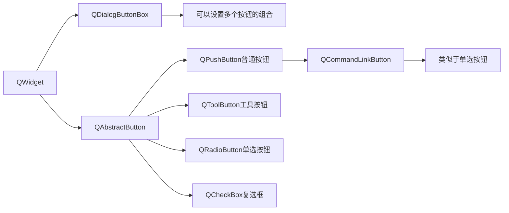
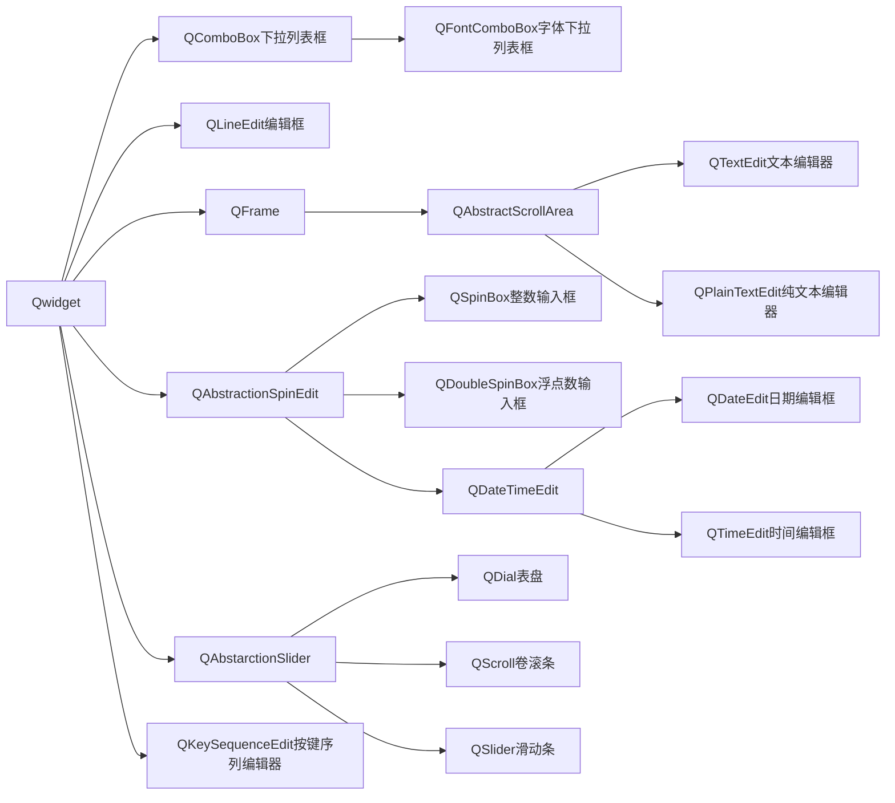
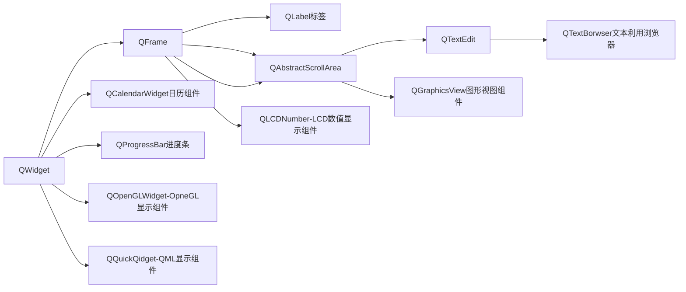
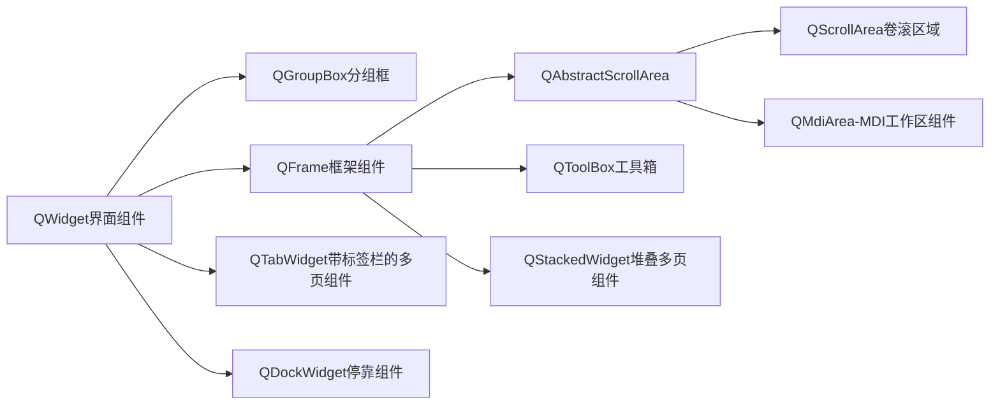
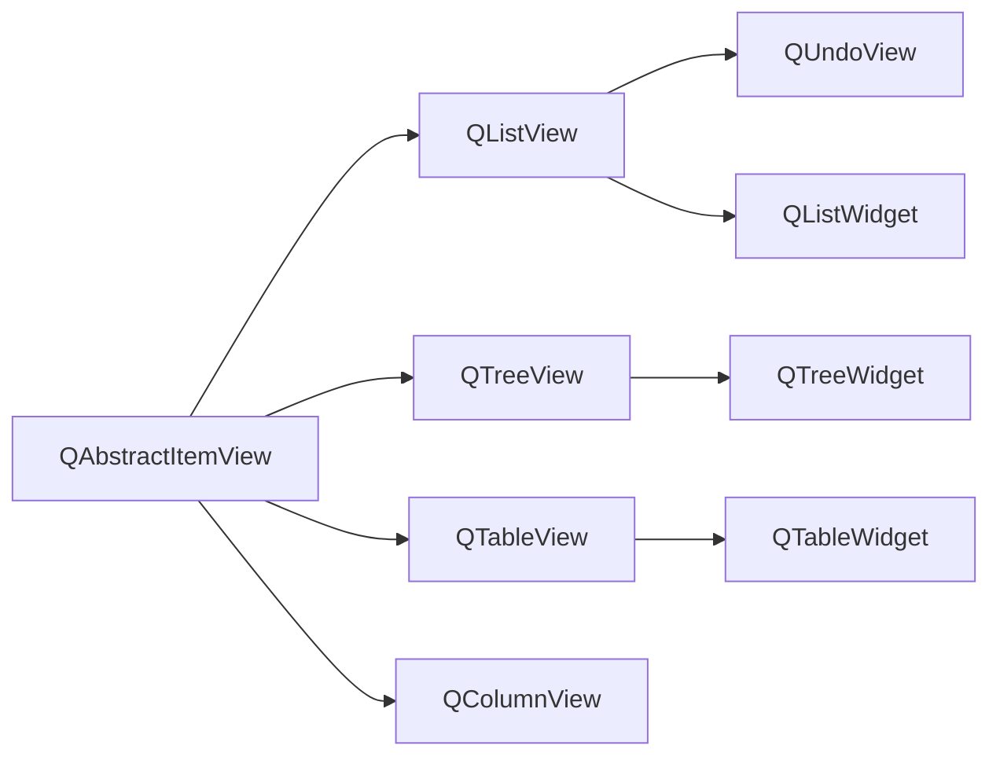
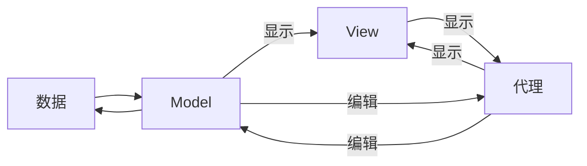
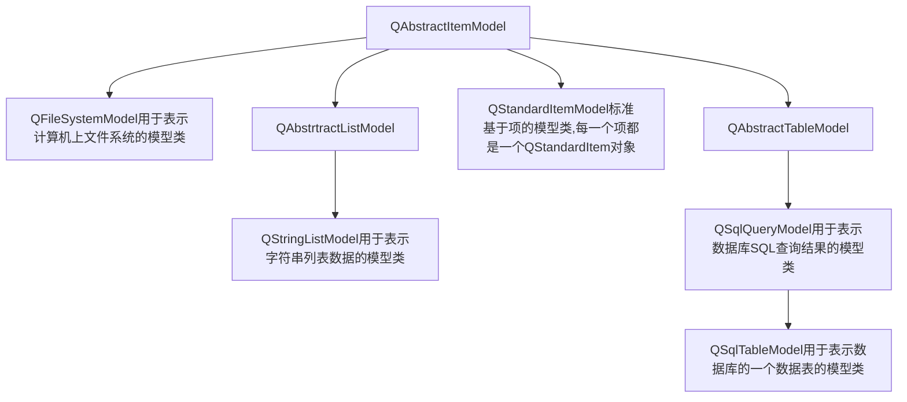

## 四、常用界面组件的使用

### 4.1 界面组件概述

QWidget是所有界面组件类的直接或间接父类，QWidget的父类是QObject和QPaintDevice

QWidget组件：所有界面组件的统称，他从操作系统接收鼠标、键盘和其他事件，并在屏幕上显示自己。每个组件都是矩形的，并且按z轴顺序排列

window：没有嵌入到父组件中的组件。通常，他有一个frame和一个标题栏，可以使用window flags创建没有这两个装饰的窗口。在Qt中，QMainWindow和QDialog的各种子类是常见的window类型

#### 按钮类组件：



#### 输出类组件:



#### 显示类组件:



#### 容器类组件:



#### Item组件:



QWidget类的主要属性和接口函数：

QSizePolicy类用于描述布局中的水平和垂直大小调整策略。包含两个枚举值（垂直、水平），其值是枚举类型QSizePolicy::Policy，还包含stretch值：

| Constant                      | Description            |
| ----------------------------- | ---------------------- |
| QSizePolicy::Fixed            | 固定大小               |
| QSizePolicy::Minimum          | 最小值，但可扩展       |
| QSizePolicy::Maximum          | 最大值，可缩小         |
| QSizePolicy::Preferred        | 最佳大小，可缩小可增大 |
| QSizePolicy::Expanding        | 合理的大小             |
| QSizePolicy::MinimumExpanding | 最小可扩展尺寸         |
| QSizePolicy::Ignored          | 组件占据尽可能大的空间 |

QWidget作为窗口的一些函数和属性：

| Context           | Function and Properties               |
| ----------------- | ------------------------------------- |
| Window functions  | show(),hide(),reasie()                |
| Top-level windows | windowTitle,windowIcon,isActiveWindow |
| Window contents   | update(),repaint(),scroll()           |

### 4.2 布局管理

表单（Form）：表单不会占满空间

网格（Grid）：网格会占满整个空间

堆叠布局（QStackedLayout）：在Designer里没有体现，它提供了组件堆叠，其中一次只有一个可见

容器组件（Containers）：可以将一组需要布局管理的组件放在一个容器组件中，里面的组件也会自动变化

水平布局/垂直布局：layoutSretch属性（延展因子）

### 4.3 QString字符串操作

QChar使用的是UTF-16编码，一个字符包括两字节数据，对于超过65535的Unicode编码，QString使用两个连续的QChar字符表示

QString使用隐式共享减少内存占用

1. QString的创建和初始化：

   `QString str="Hello Qt";`

2. QString的字符串索引：

   `QString str="dimple,酒窝"；`

   `Qchar ch0=str[0];//'d'`

   `Qchar ch7=str.at(7);//'酒'`

#### 4.3.1 QChar的功能

QChar的主要接口函数：

| 函数原型             | 功能 |
| -------------------- | ---- ---- |
| isDigit()            | 判断是否为0-9的数字 |
| isLetter()           |          |
| isLetterOrNumber()   |          |
| isLetter()/isUpper() |          |
| isMark()             | 是否为记号 |
| isNonCharacter()     | 是否为非文字字符 |
| isNull()             |          |
| isNumber             |          |
| isPrint()            | 判断是否为可打印字符 |
| isSpace()            | 判断是否为空格或制表符 |
|isPunct()|判断是否为标记符号|
| isSymbol()           | 判断是否为符号,包括特殊符号,如♥,※ |
| char toLantin()      | 返回与QChar等效的Latin1字符 |
| QChar toLower()/to Upper()          | 返回大写或小写形式字符,不是字母,则返回字符串 |
|char16_t unicode()|返回字符的16位Unicode编码数值|

静态函数:

QChar::fromLantin1()可将Latin1字符转换为Qchar字符

QChar::fromUsc2()可返回字符的UTF-16编码

QChar的逻辑运算符:

```c++
QString HuStr="河to湖";//将汉字"河"替换为"湖"
QChar He=QChar(HuStr[0].unicode());
QChar Hu=QChar(HuStr[3].unicode());
QString str="高鑫来自河南和河北";
for(int i=0;i<str.size();i++){
    if(str.at(i)==He)
        str[i]=Hu;
}
```

#### 4.3.2 QString常用操作

1. 字符串拼接

   `append(str)`:在当前字符串的后面加

   `prepend(str)`:在当前字符串的前面加

2. 字符串截取

   `front()/back()`:返回都一个或最后一个字符

   `left(n)/right(n)`:从开头或末尾提取n个字符

   `first(n)/last(n)`:从开头或末尾提取n个字符,last是Qt6新加的,从代码中输入时,要注意转义字符"\",从组件中输入时则无需注意

   `mid(pos,n)`:返回从pos字符串开始的n个字符串,不加n则表示返回到末尾的字符串,如果pos+n>字符串的长度,则返回null

   `sliced(n)`:

   `section(sep,start,end)`:

3. 存储相关的函数

   `isNull()/isEmpty()`:

   `count()/lenght()/size()`:

   `clear()`:

   `resize(size)`:

   `fill(char,size)`:

4. 搜索和判断

   `indexOf(str)/lastIndexOf(str)`:返回字符串最开始出现的位置或最后出现的位置

   `contains(str)`:

   `endsWith(str)\startsWith(str)`:

   `count(str)`:

5. 字符串的转换和修改

   `toUpper()/toLower()`:

   `trimmed()/simplified()`:

   `chop(int n)`:

   `insert(Qsizetype pos, QString &str)`:

   `replace(Qsizetype pos,qsizetype n,QString &str):`

   `remove(pos,n)`

#### 4.3.3 QString字符串与数值的转换

* 字符串转换为整数

  ```c++
  int toInt(bool *ok=nullptr,int base=10);
  uint toUInt(bool *ok=nullptr,int base=10);
  long toLong(bool *ok=nullptr,int base=10);
  ulong toUlong(bool *ok=nullptr,int base=10);
  short toShort(bool *ok=nullptr,int base=10);
  ushort toUShort(bool *ok=nullptr,int base=10);
  qlonglong toLongLong(bool *ok=nullptr,int base=10);
  qulonglong touLongLong(bool *ok=nullptr,int base=10);
  ```

  1. 如果参数ok不为nullptr,则返回bool类型,表示转换是否成功
  2. base表示使用的进制范围为2-36,base还可设置为0,表示使用c语言的表示法
  3. 当参数ok为null时,转换成功返回转换成功的数,不成功,则返回0

* 字符串转换为浮点数

  ```c++
  float toFloat(bool *ok=nullptr);
  float toDouble(bool *ok=nullptr)
  ```

  ok用于获取返回值,表示转换是否成功

* 成员函数setNum()

  功能:将浮点数或整数转换为字符串

  1. 将整数转换为字符串:

     ```c++
     int N=243;
     QString str;
     str.setNum(N);//"243
     str.setNum(N,16);//"f3"
     str.setNum(N,2)//"11110011
     ```

  2. 将浮点数转化为字符串:

     ```c++
     QString &setNum(float/double n,char format='g',int precision=6)
     ```

* 静态函数number()

  参数形式和功能与成员函数setNum()类似

  `QString QString::number()`

* 静态函数asprintf()

  用于构造格式化输出各种数据的字符串

  函数原型:`QString QString::asprintf(const char*cformat,...)`

  cformat是格式化字符串,后面可以有任意多个变量,用法与printf类似,可以使用转义字符

  %s后只能跟UTF-8编码的字符串,也就是说变量的字符串中不能存在汉字

  ```c++
  QString UPC="UPC";
  QString str=QString::asprintf("Hello,welcome to %s",UPC.toLocalBit().data());
  //Hello,welcome to UPC
  ```

* 成员函数arg

  功能与asprintf()类似

### 4.4 QSpinBox和QDoubleSpinBox

QSpinBox和QDoubleSpinBox都是QAbstractSpinBox的子类

#### 4.4.1 QSpinBox和QDoubleSpinBox的主要属性

| 属性名称           | 描述                                                 |
| ------------------ | ---------------------------------------------------- |
| prefix             | 显示前缀                                             |
| suffix             | 显示后缀                                             |
| buttonSymbols      | 保存当前按钮的符号模式,默认是上下箭头                |
| text               | 只读属性.保存SpinBox的文本,包括前缀和后缀,没有默认值 |
| cleanText          | 只读属性.保存SpinBox的文本,不包括前缀和后缀,前尾空格 |
| minimum            | 数值范围的最小值                                     |
| maximum            | 数值范围的最大值                                     |
| singlestep         | 上下调整按钮时的单步改变值                           |
| stepType           | 步长类型可以是单步或自适应十进制步长                 |
| value              | 当前显示的值                                         |
| displayIntegerBase | QSpinBox特有属性,显示整数使用的进制                  |
| decimals           | QDoubleSpinBox特有属性,显示数值的小数位数            |

#### 4.4.2 QSpinBox的信号

| 信号                             | 描述                                       |
| -------------------------------- | ------------------------------------------ |
| valueChanged(int i)              | 当value的属性值变化时发射，i是变化之后的值 |
| textChanged(const QString &text) | 显示的文字发生变化时发射，                 |

[地址](D:\qtfile\Chapter4\samp4_5)

### 4.5 常用的按钮组件

常用的四个按钮组件是QPushButton、QToolButton、QRadioButton、QCheckBox，都继承于QAbstractButton ，它们都有一些共同的特性

#### 4.5.1 各按钮类的属性

| 属性          | 属性值类型   | 功能                                                         |
| ------------- | ------------ | ------------------------------------------------------------ |
| text          | QString      | 按钮的显示文字                                               |
| icon          | QIcon        | 按钮的图标                                                   |
| shortcut      | QKeySequence | 按钮的快捷键                                                 |
| checkable     | bool         | 按钮是否可复选                                               |
| checked       | bool         | 按钮是否为复选的状态                                         |
| autoExclusive | bool         | 在一个布局或一个容器组件内的同类按钮是否是互斥的，互斥表示在一个按钮的值设为true时，其他按钮会自动设置为false |
| autoRepeat    | bool         | clicked(),pressed(),released()<br>初次重复延迟时间由属性autoRepeatDely决定<br>重复的周期由属性autoRepeatInterval决定，事件单位都是ms |

#### 4.5.2 按钮的信号

```c++
void clicked(bool checked = false)//点击按钮时
void pressed()//按下Space键或鼠标左键时
void released()//释放Space键或鼠标左键时
void toggled(bool checked)//按钮的checked属性值变化时
```

### 4.6 QSlider和QProgressBar

滑动条QSlider、表盘QDial和卷滚条QProgressBar是3个滑动行输入组件，可用于输入数值，它们的基类都是QAbstractSilder

进度条QProgressBar是常见的用于显示数值的组件

QProgressBar的format属性类型为QString，其中占位符的含义如下：

* %p，完成的百分比
* %v，当前值
* %m，总步骤数
* 默认值为“%p%”

[地址](D:\qtfile\Chapter4\samp4_6)

### 4.7 日期时间类

QTime：表示时间数据的类

QDate：表示日期时间的类

QDateTime：表示日期时间数据的类

QTime、QDate、QDateTime都有一个函数toString(),用于将当前的日期时间数据转换为字符串

`time.toString("yyyy-MM-dd")`

QTime、QDate、QDateTime都有一个静态函数fromString()将字符串转换为相应类的对象

`QDateTime::fromString(str,"yyyy-MM-dd")`

* QDateTimeEdit：编辑和显示日期时间的时间类


* QTimeEdit：编辑和显示时间的组件类
* QDateEdit：编辑和显示日期的时间类
* QCalendarWidget：一个用日历形式显示和选择日期的组件类

[地址](D:\qtfile\Chapter4\samp4_7)

### 4.8 QTimer和QElapsedTimer

#### 4.8.1 QTimer

QTimer是软件定时器，主要功能是设置以毫秒为单位的定时周期，然后进行连续定时和单次定时。启动定时器后，定时溢出的QTimer会发出timeout()信号，为timeout()信号关联槽函数就可以进行定时处理

QTimer属性：

| 属性          | 属性值类型    | 功能                                                         |
| ------------- | ------------- | ------------------------------------------------------------ |
| interval      | int           | 定时周期单位为ms                                             |
| singleShot    | bool          | 定时器是否为单词定时，true表示单词定时                       |
| timerType     | Qt::TimerType | 定时器精度类型                                               |
| active        | bool          | 返回true表示定时器正在运行，也就是start()启动了定时器        |
| remainingTime | int           | 只读属性，到发生时溢出的剩余时间，单位是毫秒，若定时器未启动，属性值为-1；发生定时溢出，属性值为0 |

* start(int mesc)：启动定时器，定时周期为msec

* stop()：停止计时器

* singleShot()：静态函数，用于创建和启动单词定时器，将定时器的timeout()信号和指定的槽函数关联

   `void QTimer::singleShot(int msec,Qt::TimerType,timerType,const QObject*receiver,const char *member)`

  msec是定时周期，单位是毫秒；timerType是定时器精度类型；receiver是接收定时器的信号timeout()信号的对象；member是与timeout()信号关联的槽函数指针

#### 4.8.2 QElapsedTimer

QElapsedTimer用于快速计算两个事件的间隔函数，是软件定时器。QElapsedTimer没有父类，其计时精度可以达到纳秒级

主要接口函数：

| 函数                  | 描述                                                |
| --------------------- | --------------------------------------------------- |
| void start()          | 复位并启动计时器                                    |
| qint64 elapsed        | 返回自上次运行start()之后计时器运行的时间，单位毫秒 |
| qint64 nsecsElapsed() | 返回自上次运行start()之后计时器运行的时间，单位纳秒 |
| qint64 restart()      | 重新启动计时器                                      |

[地址](D:\qtfile\Chapter4\samp4_8)

### 4.9 QComboBox

QComboBox是下拉列表框组件，它提供一个下拉列表供用户选择输入，也可以提供一个编辑框用于输入文字。ComboBox下拉列表框的每个项（item）还可以存储一个或多个QVariant类型的用户数据，用户数据不显示在界面上

主要属性：

| 属性              | 属性值类型   | 功能                                               |
| ----------------- | ------------ | -------------------------------------------------- |
| editable          | bool         | 是否可编辑                                         |
| currentText       | QString      | 显示当前的名字                                     |
| currentIndex      | int          | 显示当前选中项的序号，从0开始，到-1表示没有项选中  |
| maxVisibleItems   | int          | 下拉列表显示出项的最大数                           |
| maxCount          | int          | 下拉列表项的最大数                                 |
| insertPolicy      | InsertPolicy | 文字插入列表的方式                                 |
| placeholderText   | QString      | 属性值为-1时。框中显示的文字，这个文字会显示下拉框 |
| duplicatesEnabled | bool         | 是否允许列表出现重复的项                           |
| modelColum        | int          | 下拉列表中的数据在数据模型中的列编号，默认值为0    |

主要信号：

| 信号                                    | 描述                                                         |
| --------------------------------------- | ------------------------------------------------------------ |
| activated(int index)                    | 选择下拉列表的一个项时，即使项没有发生变化，组件也会发射该信号 |
| cutrrentIndexChanged(int index)         | 当currentIndex属性变化时，会发射该信号                       |
| currentTextChanged(const QString &text) | 当currentText属性变化时，会发射该信号                        |
| editTextChanged(const QString &text)    | 在编辑框修改文字时                                           |
| highlighted(int index)                  | 移动鼠标使一项高亮但没有完成选择时                           |
| textActivated(const QString &text)      | 选择下拉列表的一个项时，即使项没有发生变化，组件也会发射该信号 |
| textHighlighted(const QString &text)    | 一项高亮但没有完成选择时                                     |

[地址](D:\qtfile\Chapter4\samp4_9)

## 4.10 QMainWindow和QAction

QMainWIndow是主窗口类，具有菜单栏、工具栏、状态栏等主窗口常见的界面元素，这三中对应的类分别是QMenuBar、QToolBar、QStatusBar，都是直接从QWidget中继承来的

QAction对象就是实现某个功能的动作

#### 4.10.1 QAction类

QACtion的父类是QObject，支持QT的元对象系统

在UI可视化设计时就可创建Action，使用设计好的Action可以创建菜单项和工具按钮

QAction的信号：

| 函数                                  | 注释                                           |
| ------------------------------------- | ---------------------------------------------- |
| void changed()                        | Action的text、tooTip、font等属性的值发生变化时 |
| void checkableChanged(bool checkable) | checkable的值发生变化时                        |
| void enabledChanged(bool enabled)     | enabled属性值变化时                            |
| void hovered()                        | 鼠标移动到用此Action创建的菜单栏和工具栏上时   |
| void toggled(bool checked)            | checked属性值变化时                            |
| void triggered(bool check = false)    | 点击用此Action创建的菜单项或工具按钮时         |
| void visibleChanged()                 | visible属性值变化时                            |

QAction的共有槽：

这些共有槽可以在程序中直接被调用，也可以在UI可视化设计时在信号与槽编辑器里设置其与其他组件信号相关联

#### 4.10.2 QToolBar类

在UI可视化界面时，可以用Action可视化地创建工具栏上的按钮，但是不能放置其他组件

QToolBar提供了接口函数，可以通过代码添加组件：

| 函数                                                   | 描述                                               |
| ------------------------------------------------------ | -------------------------------------------------- |
| void adAction(QAction *action)                         | 添加一个Action，并根据Action地设置自动创建工具按钮 |
| QAction *addWidget(QWidget *widget)                    | 添加一个界面组件                                   |
| QAction *insertWidget(QAction *before,QWidget *widget) | 插入一个界面组件                                   |
| QAction *addSeparator()                                | 添加一个分隔条                                     |
| QAction *insertSeparator(QAction *before)              | 插入一个分割条                                     |

#### 4.10.3 QStatusBar类

在UI可视化设计时，不能直接在状态栏上放置任何组件，只能通过接口函数项状态栏添加组件：

| 函数原型                                                  | 描述         |
| --------------------------------------------------------- | ------------ |
| void addWidget(QWidget *widget, int stretch = 0)          | 添加正常组件 |
| void addPermanentWidget(QWidget *widget, int stretch = 0) | 添加永久组件 |

widget可以是任何从QWidget继承来地任何组件，stretch是伸展因子，确定组件所占的空间

#### 4.10.4 QPlainText的使用

QPlainText的信号定义如下：

| 信号                                          | 注释                     |
| --------------------------------------------- | ------------------------ |
| void blockCountChanged(int newBlockCount)     | 段落数变化时             |
| void copyAvailiable(bool yes)                 | 有文字被选择或取消选择时 |
| void cursorPositionChanged()                  | 光标位置变化时           |
| void modificationChanged(bool changed)        | 文档的修改状态变化时     |
| void redoAvailable(bool available)            | redo操作状态变化时       |
| void selectionChanged()                       | 选择的内容变化时         |
| void text textChanged()                       | 文档内容变化时           |
| void undoAvailable(bool available)            | undo操作状态变化时       |
| void updateRequest(const QRect &rect, int dy) | 需要更新显示时           |

[地址](D:\qtfile\Chapter4\samp4_10)

### 4.11 QToolButton和QListWidget

Qt中用于处理项数据（item data）的组件有两类：一类是Item Views组件，包括QListView、QTreeView、QTableView等；另一类是Item Widget组件，包括QListWidget、QTreeWidget、QTableWidget等

#### 4.11.1 QToolBox组件

QToolButton是工具箱组件类，工具箱是一种垂直分页的多页组件容器

工具箱的每个页面就是一个QWidget组件，在页面的工作区可以放置任何其他界面组件

信号：

| 信号                     | 描述                                                    |
| ------------------------ | ------------------------------------------------------- |
| currenChanged(int index) | 在切换当前页面时发射组件发射此信号，index是当前页面序号 |

#### 4.11.2 QListWidget组件

QListWidget是组件列表，每一行是一个QListWidgetItem类型的对象，称为列表或列表项

##### 4.11.2.1 QListWidgetIteml类

QListWidget组件的列表项是QListWidegtItem对象

QListWidget类没有父类，所以没有属性，但是有一些读取函数和设置函数：

| 读取函数     | 设置函数        | 数据类型       | 功能                                   |
| ------------ | --------------- | -------------- | -------------------------------------- |
| text()       | setText()       | QString        | 设置项的文字                           |
| icon()       | setIcon()       | QIcon          | 设置项的图标                           |
| data()       | setData()       | QVariant       | 为项的不同角色设置数据，可设置用户数据 |
| flags()      | setFlags()      | QT::ItemFlags  | 设置项的特性，如是否可选，可编辑       |
| checkState() | setCheckState() | QT::CheckState | 设置项的复选状态                       |
| isSelected() | setIsSelected() | bool           | 设置为当前项，相当于点击了这个项       |

##### 4.11.2.2 QListWidget组件

在QListWidget组件上点击一个项，这个项就是当前项，其所在行是当前行

主要接口函数：

| 函数名                     | 描述 |
| -------------------------- | ------------------------------------------------------------ |
| addtem()/addItems() |                                                              |
| insertItem()/insertItems() |                                                              |
| clear                      |                                                              |
| *takeItem()                | 从列表组件中移除一个项，并返回这个项的对象指针，但是并不会从内存中删除这个项 |
| count               | 组件列表中的项的个数                               |
| *item() / *currentItem()  | 根据行号返回一个项/返回当前项                                         |
|currentRow()/Row()|返回当前行的行号/返回一个项所在的行号|
#### 4.11.3 QToolButton

QToolButton属性：

1. popupMode：当按钮有下拉菜单时，这个属性决定了弹出菜单的模式，几个枚举值的含义：
   * DelayedPopup：没有任何附加内容，按下按钮后，延时一会才显示下拉菜单
   * MenuButtonPopup：会在按钮右侧显示一个带箭头的下拉按钮，点击按钮才显示下拉菜单，点击工具按钮会执行按钮关联的Action，而不会显示下拉菜单
   * InstantPopup：会在按钮的右下角显示一个很小的下拉箭头图标，点击按钮会立刻显示下拉菜单，即使工具栏关联了一个Action也不会执行这个Action
2. toolButtonStyle：表工具按钮上文字与图标的显示方式
3. autoRaise：为true时表示没有边框，但鼠标移到按钮上时会显示出来
4. arrowType：可以在按钮上显示表示方向的箭头

QToolButton接口函数：

1. setDefaultAction()函数：用于为工具按钮设置关联的Action，按钮上的文字、图标、toolTip等属性都会与Action的一样，工具按钮上的triggered()信号自动关联Action的triggered()信号

   函数原型：`void QToolButton::setDefaultAction(QAction *action)`

2. setMenu()函数：用于为工具按钮设置下拉菜单

   函数原型：`void QToolButton::setMenu(QMenu *menu)`

#### 4.11.4 QMenu类

QMenu是菜单类，直接从QWidget继承而来

在QtDesigner里，可以通过Action设计窗口的菜单栏，但是不能可视化设计下拉菜单或某个组件里的快捷菜单

创建菜单常用函数：

| 函数                                     | 描述                 |
| ---------------------------------------- | -------------------- |
| void QWidget::addAction(QAction *action) | 添加Action创建菜单项 |
| QAction *Menu::addMenu(QMenu *menu)      | 添加菜单，创建子菜单 |
| QAction *QMenu::addSeparator()           | 添加一个分割条       |

显示菜单可以使用函数exec(),其函数原型为：

`QAction *Menu::exec(const QPoint &p,QAction *action = nullptr)`

参数p表示菜单的左下角坐标，一般使用QCursor::pos()作为参数p的值

#### 4.11.5 创建右键快捷菜单

每个继承自QWidget的类都有customContextMenuRequested()信号，在一个组件上点击右键时，组件会发射这个信号，用于请求创建快捷菜单

```c++
void MainWindow::on_listWidget_customContextMenuRequested(const QPoint &pos)
{
    Q_UNUSED(pos);
    QMenu *menuList=new QMenu();//创建菜单
    menuList->addAction(ui->actListIni);//添加Action将作为菜单项
    menuList->addAction(ui->actListClear);
    menuList->addAction(ui->actListInsert);
    menuList->addAction(ui->actListAppend);
    menuList->addAction(ui->actListDelete);
    menuList->addSeparator();
    menuList->addAction(ui->actSelAll);
    menuList->addAction(ui->actSelNone);
    menuList->addAction(ui->actSellnvs);

    menuList->exec(QCursor::pos());
    delete menuList;//菜单显示完，需要删除对象

}
```

[地址](D:\qtfile\Chapter4\samp4_11)

### 4.12 QTreeWidget

[地址](D:\qtfile\Chapter4\samp4_12)

#### 4.12.1 QTreeWidget树形组件

QTreeWidget是一种Item Widget组件，即树形结构，他的项（item）被称为节点，树形组件适合于显示具有层级结构的数据

##### 4.12.1.1 QTreeWidget的可视化设计

双击QTreeWidget组件可编辑Columns和Items属性：

* Columns页面用于设计树形组件的列。在编辑器里可以添加、删除、移动列，以及设置每一列的属性
* Items页面用于设计树形组件的节点

树形组件的每一行是一个节点，一个节点可以有多列，每一列可以单独设置文字、图标、复选状态等属性

##### 4.12.2 QTreeWidget的显示结构

一个QTreeWidget组件的显示内容分为表头和目录树两部分，表头和目录树都是QTreeWidgetItem对象

* 表头：树形组件有表头，表头有两种：

  1. 简单的文字：使用setHeaderLabels()将字符串列表的内容作为表头各列的标题

     `void QTreeWidegt::setHeaderLabels(const QString &labels)`

  2. QWidgetItem对象：可以使用该对象的接口函数设置表头的字体、对齐方式等属性

     `void QTreeWidegt::setHeaderItem(const QString &labels)` 设置表头结点

     `QTreeWidgetItem *QTreeWidget::headerItem()`	返回表头节点

* 顶层节点：目录树最上层的节点就是顶层节点，顶层节点没有父节点

  | 接口函数                        | 描述                       |
  | ------------------------------- | -------------------------- |
  | topLevelItemCount()             | 返回顶层节点的个数         |
  | addTopLevelItem(*item)          | 添加一个顶层节点           |
  | insertTopLevelItem(index,*item) | 插入一个顶层节点           |
  | indexOfTopLevelItem(*item)      | 返回一个顶层节点的索引号   |
  | *topLevelItem(index)            | 根据索引号获取一个顶层节点 |
  | *takeTopLevelItem(index)        | 移除一个顶层节点           |

  获取一个顶层节点可以访问他的所有子节点

* 次级节点：可以通过递归的方式遍历其所有直接和间接的子节点

* 隐藏的根节点：目录树中还有一个隐藏的根节点，可以看作所有顶层节点的父节点

  ```C++
  invisibleRootItem()//返回这个隐藏的节点
  ```

##### 4.12.1.2 QTreeWidget的接口函数

| 接口函数                              | 描述                   |
| ------------------------------------- | ---------------------- |
| columnCount()                         | 返回表头列数           |
| selColumnCount(columns)               | 设置表头列数           |
| sortItems(column,Qt::SortOrder order) | 将目录树按照某一列排序 |
| sortColumn()                          | 返回用于排列的列的序号 |
| *currentItem()                        | 返回当前节点           |
| selectedItems()                       | 返回选择的节点的列表   |

注：如果属性组件允许多选，函数selectedItems会返回选择节点的列表，通过上层父类QAbstactItemView的selectMode属性能够设置选择模式

##### 4.12.1.3 QTreeWidget的公有槽

##### 4.12.1.4 QTreeWidget的信号

#### 4.12.2 QTreeWidgetItem类

QTreeWidget组件的表头和目录树节点都是QTreeWidgetItem类对象

1. 创建QTreeWidgetItem对象

   `QTreeWidgetItem *topItem=new QTreeWidgetItem(int type);`

   可以传递一个整数表示节点的类型，这个类型参数是一个自定义类型。

   创建节点后，还需要要调用QTreeWidgetItem的各类接口函数设置节点各列的属性

   ```C++
   QIcon icon(":/images/icon/15.ico");
       QTreeWidgetItem *topItem=new QTreeWidgetItem();
       topItem->setIcon(colItem,icon);
       topItem->setText(colItem,"图片");
       topItem->setText(colItemType,"Top Item");
   ```

   然后通过函数将创建的节点添加成目录树的节点

   ```C++
   ui->treeWidget->addTopLevelItem(topItem);//顶层节点
   ui->treeWidget->addChild(item);//子节点
   ```

2. 节点各列的接口函数

   函数中的整形参数表示column是列的编号

   ```C++
   setBackground/setForeground(column，&brush);//设置背景色/前景色
   setText(column,&text);//设置文字
   setTextAlignment(column,alignment);//设置文字对齐方式
   setToolTip(column,&toolTip);//设置toolTip文字
   setStatusTip(column,&statusTip);//设置statusTip文字
   setIcon(column,&icon);//设置图标
   setCheckState(column,Qt::CheckState state);//设置复选状态
   setFont(column,&font);//设置字体
   ```

   setData()可以为节点的某一列设置用户数据

   ```C++
   //设置用户数据，存储完整目录名称
   item->setData(colItem,Qt::UserRole,QVariant(dirName));
   ```

   ​

#### 4.12.3 QDockWidget停靠组件 

##### 4.12.3.1 QDockWidget属性

| 属性         | 描述                                                         |
| ------------ | ------------------------------------------------------------ |
| floating     | 停靠区组件是否处于浮动状态<br>isFloating()可以返回此属性值，setFloatiing(bool)设置此属性值 |
| features     | 停靠区组件的特性                                             |
| allowedAreas | 允许停靠函数                                                 |
| windowTitle  | 停靠区窗口的标题                                             |

##### 4.12.3.2 QDockWidget信号

```C++
void MainWindow::on_dockWidget_visibilityChanged(bool visible)//是否可视化
{//停靠区visible属性值变化时
    ui->actWinVisible->setChecked(visible);
}

void MainWindow::on_dockWidget_topLevelChanged(bool topLevel)//是否浮动
{//停靠区floating属性值变化时
    ui->actWinFloat->setChecked(topLevel);
}
```


### 4.13 QTableWidget

[地址](D:\qtfile\Chapter4\samp4_13)

QTableWidget是一种Item Widget组件，以表格形式显示和管理数据，称为表格组件。

一个网格是一个单元格，表格每个单元格关联一个QTableWidgetItem对象，可以设置每个单元格的文字内容、字体、文字颜色、背景色、图表等，还可以有复选框。每个单元格还可以存储用户数据

#### 4.13.1 QTableWidget类

QTableWidget是QTableView的遍历类，QTableWidget的属性和接口函数主要是父类中定义的

* 表格的行和列

  | 公有槽函数                      | 描述              |
  | ------------------------------- | ----------------- |
  | insert/removeColumn(int column) | 插入一个空列/删除 |
  | insert/removeRow(int row)       | 插入一个空行/删除 |

* 单元格和当前项

  QTableWidget表格数据区有一个当前单元格，也就是获得输入焦点的单元格

  | 函数                                 | 描述                         |
  | ------------------------------------ | ---------------------------- |
  | int currentRow()                     | 返回当前单元格的行号         |
  | int currentColumn()                  | 返回当前单元格的列号         |
  | void setCurrentCell(int row,int col) | 通过行号和列号设置当前单元格 |

  当前单元格关联的QTableWidget对象就是当前项，可以返回当前项的对象指针

  | 函数                                   | 描述                     |
  | -------------------------------------- | ------------------------ |
  | *currentItem()                         | 返回当前单元格的项       |
  | setCurrentItem(QTableWidgetItem *item) | 设置当前项改变单元各位置 |

* 单元格的索引

  | 函数               | 描述                   |
  | ------------------ | ---------------------- |
  | *item(row, column) | 通过行和列号返回项     |
  | row/column (*item) | 返回一个项的行号或列号 |

* 水平/垂直表头

  | 函数                                  | 描述                         |
  | ------------------------------------- | ---------------------------- |
  | setHorizontalHeaderItem(column,*Item) | 为某列设置项                 |
  | *HorizontalHeaderItem(column)         | 返回column列的表头项         |
  | *takeHorizontalHeaderItem(column)     | 移除column列的表头项         |
  | setHorizontalHeaderLabels(&labels)    | 用一个字符串列表设置表头标题 |

  垂直表头类似

* QTableWidget的信号

#### 4.13.2 QTableWidgetItem类

与QTreeWidgetItem类似

[QTreeWidgetItem类](#### 4.12.2 QTreeWidgetItem类)


## 五、模型/视图结构

### 5.1模型/视图结构概述

数据（data）：如数据库的一个数据表或SQL查询语句，内存中的一个字符串，或磁盘文件结构等

模型（model）：与数据通信，并为视图组件提供数据接口

视图（view）：是屏幕上的界面组件，视图从数据模型获得每个数据项的模型索引（model index），通过模型索引获取数据

代理（delegate）：在视图与模型之间交互操作是提供的临时编辑器。模型项视图提供数据是单向的，一般仅用于显示。当需要在视图编辑数据时，代理会为需要编辑的数据提供一个编辑器



#### 5.1.1 模型

所有基于项（item）的模型类都属于QAbstractItemModel类的，这个类定义了视图组件和代理存取数据的接口



#### 5.1.2 视图

视图就是用于显示模型中的数据的界面组件

- QListView：用于显示单列的列表数据，适用于一维数据的操作
- QTreeView：用于显示树状结构数据，适用于树状结构数据的操作
- QTableView：用于显示表格数据，适用于二维表格数据的操作

* QColumnView：用多个QListView显示树状结构数据，树状结构的一层用一个QListView显示
* QUndoView：用于显示undo指令栈内数据的视图组件，是QListView的子类

注：

* QListView、QTreeView、QTableView的三个子类QListWidegt...称为视图类的便利类
* 视图组件的数据来源于模型，视图组件不能存储数据
* 便利类为组建的每个节点或单元格创建一个项，用项存储数据
* 遍历类没有模型，实际上是利用项的方式替代了模型的功能，将界面与数据绑定

#### 5.1.3 代理

代理负责从模型获取相应的数据，然将其显示在编辑器里，修改数据后又将编辑器里的数据保存到模型中

QAbstractItemDelegate是所有代理类的基类，两个子类的功能基本相同：

* QItemDelegate：
* QStyledItemDelegate：

#### 5.1.5 一些基本概念

AbstractItemModel是所有模型类的基类,不管底层的数据结构是如何组织数据的,QAbstractItemModel的子类都以表格的层次结构展示数据,视图组件按照这种规则规则来存取模型中的数据,但是展示给用户的形式不一样.

模型的三种常见展示形式:

- 列表模型(list model)
- 表格模型(table model)
- 树状模型(tree model)

不管模型的表现形式是怎样的,模型中存储数据的基本单元都是项(item),每个项有一个行号和一个列号,还有一个父项(parent item).三个模型都有一个隐藏的根项(item).

为了确保数据的展示与数据存取方式分离,模型中引入了模型索引(model index)的概念.通过模型索引,视图组件和代理都通过模型索引来获取数据.

QModelIndex是表示模型索引的类.模型索引提供访问数据的临时指针,用于通过模型提取或修改数据.

因为模型内部组织数据的结构可能随时改变,所以模型索引是临时的.

模型的基本形式是用行和列定义的表格数据,但这并不意味着底层的数据是用二维数据存储的,是用行与列只是

为了组件之间交互方便.一个模型索引包含行号与列号.

在创建模型索引的函数中需要传递行号,列号和父项的模型索引.

当模型为列表或表格结构时,是用行号、列号访问数据比较直观,所有项的父项就是顶层项.

当模型为树状结构时情况比较复杂,一个节点有父节点,其他可以是其他节点的父节点,在构造节点的模型索引时,需要指定正确的行号,列号和父节点.

在为模型的一个项设置数据时,可以为项设置不同的角色数据.QAbstractItemModel定义了设置项的数据的函数setData():

- bool QAbstractItemModel:::setData(const QModelIndex& index,const
  QVariant &value,int role =Qt::EditRole)

其中,index是项的模型索引,value是需要设置的数据,role是设置数据的角色.

可以为一个项设置不同角色的数据,角色参数role用枚举类型Qt::ItemDataRole的枚举类型表示.枚举类型Qt::ItemDataRole常用的一些枚举值及其含义如表所示,表中的橘色数据类型用于相应数据的数据的类型:

- bool QAbstractItemModel::setData(const QModelIndex &index,const QVariant &value,int role=Qt::EditRole)

枚举类型Qt::ItemDataRole常用的一些枚举值

| 枚举值                | 角色数据类型   | 含义                           |
| --------------------- | -------------- | ------------------------------ |
| Qt::DisplayRole       | QString        | 界面上显示的字符串             |
| Qt::DecorationRole    | QIcon,QColor   | 在界面上期装饰作用的数据       |
| Qt::EditRole          | QString        | 界面上适合在编辑器中显示的数据 |
| Qt::ToolTipRole       | QString        | 项的toolTip                    |
| Qt::StatusTipRole     | QString        | 项的statusTip                  |
| Qt::FontRole          | QFont          | 项的字体                       |
| Qt::TextAlignmentRole | Qt::Alignment  | 项的对齐方式                   |
| Qt::BackgroundRole    | QBrush         | 项的背景色                     |
| Qt::ForegroundRole    | QBrush         | 项的前景色                     |
| Qt::CheckStateRole    | Qt::CheckState | 项的复选状态                   |
| Qt::UserRole          | QVariant       | 自定义的用户数据               |

在获取一个项的数据时也需要指定角色,以获取不同角色的数据.QAbstractItemModel定义了函数data()可以返回一个项的不同角色的数据.

- QVariant QAbstractItemModel::data(const QModelIndex &index,int role=Qt::DisplayRole)

通过为一个项的不同角色定义数据,可以告知试图组件和代理如何展示数据.

#### 5.1.6 QAbstractItemModel类

QAbstractItemModel是所有模型类的字节或间接父类,它定义了模型的通用接口函数,作为抽象类不能直接用来创建对象实例.

由于QAbstractItemModel是抽象类,所以它的很多函数都是虚函数.

下面给出一些关于QAbstractItemModel的接口函数:

- int rowCount(const QModelIndex &parent=QModelIndex())//返回行数
- int columnCount(const QModelIndex &parent=QModelIndex())//返回列数
- bool insertRow(int row,const QModelIndex &parent=QModelIndex())//插入行
- bool insertRows(int row,int count,const QModelIndex &parent=QModelIndex())//插入多行
- bool removeRow(int row,const QModelIndex &parent=QModelIndex())//移除行
- bool removeRows(int row,int count,const QModelIndex &parent=QModelIndex())//移除多行
- bool insertColumn(int column,const QModelIndex &parent=QModelIndex())//插入列
- bool insertColumns(int column,int count,const QModelIndex &parent=QModelIndex())//插入多列
- bool removeColumn(int column,const QModelIndex &parent=QModelIndex())//移除列
- bool removeColumns(int column,int count,const QModelIndex &parent=QModelIndex())//移除多列
- bool moveRow(const QModelIndex &sourceParent,int sourceRow,const QModelIndex &destinationParent,int destinationChild)//移动行
- bool moveColumn(const QModelIndex &sourceParent,int sourceColumn,const QModelIndex &destinationParent,int destinationChild)//移动列
- void sort(int column,Qt::SortOrder order=Qt::AscendingOrder)//排序项
- bool setData(const QModelIndex &index,const QVariant &value,int role=Qt::EditRole)//设置数据
- QVariant data(const QModelIndex &index,int role=Qt::EditRole)//返回数据
- bool clearItemData(const QModelIndex &index)//清楚项的数据

#### 5.1.7 QAbstractItemView类

QAbstractView类是所有视图组件类的父类,它定义了视图组件类共有的一些接口.

下面是其常用的一些函数:

- void setModel(QAbstractItemModel *model)//设置数据模型
- QAbstractItemModel *model()//返回关联模型的数据对象指针
- void setSelectionModel(QItemSelectionModel *selectionModel)//设置选择模型
- QItemSelectionModel *selectionModel()//返回选择模型的对象指针
- QModelIndex currentIndex()//返回当前项的模型索引
- void setCurrentIndex(const QModelIndex &index)//设置模型索引为index的项为当前项
- void selectAll()//选择视图中的所有项
- void clearSelection()//清除所有选择

下面是一些常用的属性:

- editTriggers属性:表示视图组件是否可以编辑数据以及进入编辑状态的方式等.
  - 常用函数有:
    - void setEditTriggers(QAbstractItemView::EditTriggers triggers)//
    - QAbstractItemView::EditTriggers editTriggers()
  - QAbstractItemView::EditTriggers的值有:
    - NoEditTriggers:不允许编辑
    - CurrentChanged:当前项变化时进入编辑状态
    - DoubleClicked:点击一个已选择的项时进入编辑状态
    - SelectedClicked:点击一个已选择的项时进入编辑状态
    - EditKeyPressed:当平台的编辑按键被按下时进入编辑状态
    - AnyKeyPressed:任何键被按下时进入编辑状态
    - AllEditTriggers:发生以上任何动作时进入编辑状态
- alternatingRowColors属性:这个属性设置各行是否需要交替使用不同背景色.
- selectionMode属性:这个属性表示在视图组件上选择项的操作模式,该属性值一般为SelectionMode类型
  - QAbstractItemView::SelectionMode的值有:
    - SingleSelection:单选
    - ContiguousSelection:连续选择,如按住shift
    - ExtendedSelection:扩展选择,如按住ctrl
    - MultiSelection:多选
    - NoSelection:不允许选择
- selectionBehavior属性:这个属性表示点击鼠标时操作的行为,属性值为SelectionBehavior类型.
  - QAbstractItemView::SelectionBehavior的值有:
    - SelectItems:选择单个项
    - SelectRows:选择行,点击单个单元格选择对应行
    - SelectColumns:选择列,点击单个单元格选择对应列

QAbstractItemView常用的信号有:

- void clicked(const QModelIndex &index)//点击某个项时
- void doubleClicked(const QModelIndex &index)//双击某个项时
- void entered(const QModelIndex &index)//鼠标移动到某个项时
- void pressed(const QModelIndex &index)//鼠标单击某个项时

### 5.2 QStringListModel和QListView

[地址](D:\qtfile\Chapter5\samp5_1)

#### 5.2.1 QStringListModel类

QStringListModel是处理字符串列表的模型类，其实例可以作为QListView组件的数据模型。

QSttringListModel内部存储了字符串列表，这个字符串列表的内容自动显示在关联的QListView组件上，在QListView组件上双击某一行时，可以通过默认的代理组件（QLineEdit组件）修改这一行的字符串的内容，修改后的这行字符串自动保存到数据模型的字符串列表里

QStringListModel有两种参数形式的构造函数：

```C++
explicit QStringListModel(QObject *parent = nullptr);
explicit QStringListModel(const QStringList &strings, QObject *parent = nullptr);
//可以在创建QStringListModel对象时传递一个QstringList对象初始化其内部字符串列表数据
```

QStringLisyModel新定义的函数：

| 函数原型                                        | 描述                           |
| ----------------------------------------------- | ------------------------------ |
| void setStringList(const QStringList &strings); | 设置字符串列表，初始化模型数据 |
| QStringList stringList() const;                 | 返回模型内部的字符串列表       |

### 5.3 QTableView和QStandardItemModel

* QStandardItemModel：基于项的模型类。它维护一个二维的项数组，每一个项是一个QStandardItem对象，用于存储文字、字体、对齐方式等各种角色的数据
* QTabeleView：二维表格视图组件类，基本显示单元是单元格。通过函数setModel()设置一个QStandardItemModel类的数据模型之后，一个单元格显示数据模型中的一个项
* QItemSelectionModel：项选择模型类。用于追踪视图组件的单元格选择状态的类，需要指定一个QStandardItemModel类的数据模型。当在QTableView组件选择一个或多个单元格时，通过项选择模型可以获得选中单元格的模型索引

#### 5.3.1 QTableView类

QTableView继承自QAbstractItemView类，新定义的属性主要用于控制显示效果

QTableView组件有水平表头和垂直表头，都是QHeaderView对象，可以设置和返回表头对象

当QTableView组件使用一个QStandardItemModel对象作为数据模型时，它会自动创建表头对象，垂直表头一般显示行号，水平表头一般显示列的标题

#### 5.3.2 QStandardItemModel类

新定义的接口函数：

1. 设置行数和列数

   `setRowCount(int rows)`：设置数据模型的行数

2. 设置项

   `setItem(int row,int column,QStandardItem *item)`：用于表格模型

   `setItem(int row,QStandardItem *item)`：用于列表模型

3. 获取项

   `*item(int row, int column=0)`：根据行号和列好返回项

   `*itemFromIndex(const QModelIndex) &index`：根据模型索引返回项

4. 添加行和列

   `appendRow(const QList<QstandardItem*> &items)`：用于表格模型

   `appendRow(QStandardItem *item)`：用于列表模型

   如果是表格模型，一行有多列，需要传递一个对象列表

   如果是列表模型，只需传递一个QStandardItem对象

5. 插入行或列

   `insertRow(int row, *item)`

6. 移除行、列或项

   可以从表格模型中移除一行或一列，模型的行数或列数就会相应的减一，但是移除的QStandardItem对象不会被删除，需要单独使用delete删除，返回值是被移除的QStandardItem对象列表

   `takeRow(int row)`：移除一行，适用于表格模型

   `takeItem(int row,int column=0)`：移除一个项，适用于列表模型

7. 水平表头和垂直表头

   `setHorizontalHeaderItem(int column,const QStringItem *item)`：为表头某列设置项

   `setHorizontalHeaderLabels(const QStringList &labels)`：用字符串列表的内容设置水平表头个列的文字

   `horizontalHeaderItem(int column)`：返回水平表头中的一个项

   `takeHorizontalHeaderItem(int column)`：移除水平表头中的一个项

8. 函数clear()

   `clear()`：清楚模型内的所有项，行数和列数都会变为0

9. 信号

   QStandItemModel新定义了一个信号itemChanged()，再任何一个项的数据发生变化时，此信号会被封发射

   `itemChanged(QStandardItem *item)`：

#### 5.3.3 QStandardItem类

QStandItem存储了一个项的各种特性参数，还可以存储用户自定义数据。一个项可以添加子项，子项也是QStandardItem类型的对象，QStandardItem也可以作为树状模型的项

1. 特性读写函数

2. 用户自定义数据

   `setData(const QVariant &value,int role=Qt::UserRole+1)`

3. 管理子项的函数

#### 5.3.4 QItemSelectionModel类

一个视图组件需要设置一个数据模型，还可以设置一个选择模型。QItemSelectionModel是选择模型类，它的功能是跟踪视图组件上的选择操作，给出选择范围。

`setModel(QAbstractItemModel *model)`：为选择模型设置数据模型

接口函数：

| 函数                                 | 描述                                       |
| ------------------------------------ | ------------------------------------------ |
| hasSelection()                       | 是否有被选择的项，例如被选择的单元格       |
| currentIndex()                       | 返回当前项的模拟索引，例如当前单元格       |
| isSelected(const QModelIndex &index) | 模型索引为index的项是否被选中              |
| selectedIndexes()                    | 返回所有被选择项的模型索引列表，列表未排序 |
| selectedRows(int column=0)           | 返回column列所有被选择项的模拟索引列表     |
| selectedColumns(int row=0)           | 返回row行所有被选择项的模拟索引列表        |

信号：

| 信号                                                         | 描述                 |
| ------------------------------------------------------------ | -------------------- |
| curentChanged(current,previous)//参数分别是当前项的模型索引和之前项的模型索引 | 当前项发生变化时触发 |
| selectionChanged(selected,deselected)//参数分别是被选择的项和取消选择的项 | 选择项发生变化时触发 |

