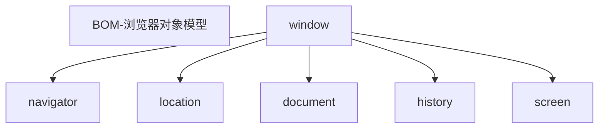

## 一、操作DOM对象

web-API作用：就是使用JS去操作html和浏览器

分类：DOM（文档对象模型）、BOM（浏览器对象模型）

### 1.1 DOM树和DOM对象

DOM（Document Object Model--文档对象模型）是用来呈现以及与任意HTML或XML文档交互的API

DOM作用：开发网页内容特效和实现用户交互

**DOM树**：

* 将HTML文档以树状结构直观的表现出来，称之为文档树或DOM树
* 描述网页内容关系的名词
* 作用：文档树直观的体现了标签与标签之间的关系


**DOM对象**：浏览器根据html标签生成的JS对象

* 所有的标签属性都可以在这个对象上面找到
* 修改这个对象的属性会自动映射到标签身上

DOM的核心思想：把网文内容当作对象处理

document对象：

* 是DOM里面提供的一个方法
* 所以它提供的属性和方法都是用来访问和操作网页内容的，例：document.write()
* 网页所有内容都在document里面

### 1.2 获取DOM元素

#### 1.2.1 根据CSS选择器来获取DOM元素

1. 选择匹配的第一个元素

   ```js
   document.querySelector('CSS选择器')
   ```

   参数：包含一个或多个有效的CSS选择器字符串

   返回值：CSS选择器匹配的第一个元素，一个HTMLElement对象

2. 选择匹配的多个元素

   ```javascript
   document.querySelectorAll('CSS选择器')
   ```

   参数：包含一个或多个有效的CSS选择器字符串

   返回值：CSS选择器匹配的NodeList 对象集合,得到的是一个伪数组：

   * 有长度有索引号的数组
   * 但是没有pop(),push()等数组方法
   * 想要得到里面的每一个对象，则需要遍历（for）的方式获得

#### 1.2.2 其他获取DOM元素方法（了解）

```html
<script>
//根据id来获取第一个元素
document.getElementById('nav')
//根据 标签获取第一类元素 获取页面 所有div
document.getElementByTagName('div')
//根据 类名获取元素 获取页面 所有类名为w的
document.getElementByClassName('w')
</script>
```

### 1.3 操作元素内容

* 对象.innerText属性：

将文本内容添加/更新到任意标签位置

显示纯文本，不解析标签

* 对象.innerHTML属性：

将文本内容添加/更新到任意标签位置

会解析标签，多标签建议使用模板字符

### 1.4 操作元素属性

#### 1.4.1操作元素常用属性

* 还可以通过JS属性/修改标签元素属性，比如通过src更换图片

* 最常见的属性比如：href、title、src等

* 语法：

  ```javascript
  对象.属性=值
  ```

#### 1.4.2 操作元素样式属性

##### 1.4.2.1 通过style属性操作CSS

```javascript
对象.style.样式属性=值
```
注：

1. 修改样式通过style属性引出
2. 如果属性有-连接符，需要转换为小驼峰命名法
3. 赋值的时候，不要忘记加CSS单位

##### 1.4.2.2 通过类名（className）操作CSS

如果修改的样式比较多，直接通过style属性修改比较繁琐，我们可以通过借助于CSS类名的形式

```javascript
元素.className='active'
```

注：

1. 由于class是关键字，所以使用className去代替
2. className是使用新值换旧值，如果需要添加一个类，需要保持之前的类名

实例：

```html
<!DOCTYPE html>
<html lang="en">

<head>
  <meta charset="UTF-8">
  <meta name="viewport" content="width=device-width, initial-scale=1.0">
  <title>Document</title>
  <style>
    div {
      width: 200px;
      height: 200px;
      background-color: pink;
    }
    .box{
      width: 300px;
      height: 300px;
      background-color: skyblue;
      margin: 100px auto;
      padding: 10px;
      border: 1px solid #000;
    }
  </style>
</head>

<body>
  <div></div>
  <script>
    const div=document.querySelector('div')
    //添加类名
    div.className='box'
  </script>
</body>

</html>
```

##### 1.4.2.3 通过classList修改样式（重要）

为了解决className容易覆盖以前的类名，我们可以通过classList方式追加和删除类名

```javascript
//追加一个类
元素.classList.add('类名')
//删除一个类
元素.classList.remove('类名')
//切换一个类
元素.classList.toggle('类名')
```

注：

1. 类名不加点，并且是字符串
2. toggle()表示有就删掉，没有就就上


#### 1.4.3 操作表单元素属性

表单很多情况，也需要修改属性

```javascript
DOM对象.属性名=新值
```

注：innerHTML得不到表单的内容

示例：

```html
<input type="text" value="请输入">
<script>
  const uname = document.querySelector('input')
  //获取值
  console.log(uname.value);
  //设置表单的值
  uname.value='请输入合法的数字'
</script>
```

表单属性中添加就有效果，移除就没有效果的，一律使用布尔值表示，如果为true代表添加了该属性，如果是false代表移除了该属性。比如：disabled、checked、selected

button按钮特殊，仍用innerHTML获取里面的文字

#### 1.4.4 自定义属性

标准属性：表填天生自带的属性，比如class id title等，可以直接使用点语法操作比如：disabled、checked、selected

自定义属性：

* 在html5中推出来了专门的data-自定义属性
* 在标签上一律以data-开头
* 在DOM对象上一律以dataset对象方式获取

```html
  <div data-id="1">1</div>
  <div data-id="2">2</div>
  <div data-id="3">3</div>
  <div data-id="4">4</div>
  <div data-id="5">5</div>
  <script>
    const one = document.querySelector('div')
    console.log(one.dataset.id)//dataset获取该标签中所有的自定义属性
  </script>
```

### 1.5 定时器

#### 1.5.1 间歇函数

定时器函数可以开启和关闭定时器

1. 开启定时器

   ```javascript
   setInterval(函数名,间隔函数)
   ```

   * 作用；每个一段时间调用这个函数一次
   * 间隔时间单位是毫秒

   注：

   1. 函数名不需要加小括号
   2. 定时器返回的是一个id数字

2. 关闭定时器

   ```javascript
   let 变量名=setInterval(函数,间隔时间)
   clearInterval(变量名)
   ```


#### 1.5.2 延时函数

JavaScript内置的一个用来让代码延迟执行的函数，叫setTimeout

```javascript
setTimeout(回调函数，等待的毫秒数)
```

setTimeout仅仅只**执行一次**，所以可以理解为就是把一段代码延迟执行，平时省略window

清除定时函数：

```javascript
let timer=setTimeout(回调函数，等待的毫秒数)
clearTimeout(timer)
```

注：

1. 延时器需要等待，所以后面的代码先执行
2. 每一次调用延时器都会产生一个新的延时器

## 二、事件

### 2.1 事件监听

事件：事件是在编程时系统内发生的动作或者发生的事情；

​            比如用户在网页上单击一个按钮

事件监听：就是让程序检测是否有事件发生，一旦有事件触发，就立即调用一个函数做出响应，也称为绑定事件或者注册事件

​            比如鼠标经过显示下拉菜单，比如点击可以播放轮播图等等

语法：

```javascript
元素对象.addEventListener('事件类型',要执行的函数)
```

事件监听三要素：

* 事件源：哪个dom元素被事件触发了，要获取dom元素
* 事件类型：用什么方式触发，比如鼠标点击click，鼠标经过mouseover等
* 事件调用的函数：要做什么事

注意：

1. 事件类型要加引号
2. 函数是点击之后再去执行，每次点击都会执行一次


### 2.2 事件类型

鼠标事件：鼠标触发：click-鼠标点击，mouseenter-鼠标经过，mouseleave-鼠标离开

焦点事件：表单获得光标：focus-获得焦点，blur-失去焦点

键盘事件：键盘触发：Keydown-键盘按下触发，Keyup-键盘抬起触发

文本事件：表单输入触发：input

鼠标经过事件的区别：

* mouseover和mouseout会有冒泡效果
* mouseenter和mouseleave没有冒泡效果

### 2.3 事件对象

#### 2.3.1 获取事件对象

事件对象：

* 也是一个对象，这个对象里有事件触发时的相关信息
* 例如：鼠标点击事件中，事件对象就存了鼠标点在那个位置等消息


使用场景：

* 可以判断用户按下哪个键，比如按下回车键可以发布新闻
* 可以判断鼠标点击了那个元素，从而做出相应的操作

如何获取：

* 在事件绑定的回调函数的第一个参数就是事件对象

* 一般命名为event、ev、e

  ```javascript
  元素.addEventListener('click',function(e){
      
  })
  ```

#### 2.3.2 事件对象常用属性

部分常用属性：

* type：获取当前事件的类型
* clientX，clientY：获取光标相对于浏览器可见窗口左上角的位置
* offsetX，offseY：获取光标相对于当前DOM元素左上角的位置
* key：用户按下的键盘的值

### 2.4 环境对象

环境对象：指的是函数内部特殊的变量this，它代表着当前函数运行时所处的环境

作用：弄清楚this的指向，可以让我们的代码更简洁

* 函数的调用方式不同，this指代的对象也不同
* 【谁调用，this就是谁】是判断this的粗略规则
* 直接调用函数，其实就是相当于是window函数，所以this指代window

### 2.5 回调函数

如果将函数A作为函数传递给函数B时，我们称函数A为回调函数

实例：

```javascript
function fn(){
	console.log("我是回调函数...")
}
//fn传递给了setInterval，fn是回调函数
setInterval(fn,1000)
```

回调函数本质还是函数，只不过把它当成参数使用

使用匿名函数作为回调函数比较常见

### 2.6 事件流

事件流指的是事件完整的执行过程中的流动路径

#### 2.6.1 事件流的两个阶段

 

* 说明：假设页面里有个div，当触发事件时，会经历两个阶段，分别是捕获阶段、冒泡阶段
* 简单来说：捕获就是从父到子，冒泡阶段是从子到父
* 实际工作都是使用事件冒泡为主

事件捕获（了解）：

事件捕获需要写对应代码才能看到效果

```javascript
DOM.addEventListener(事件类型，事件处理函数，是否使用捕获机制)
```

* 第三个参数传入true代表捕获阶段触发
* 第三个参数传入false代表冒泡阶段触发，默认是false

事件冒泡：

当一个元素的事件触发时，**同样的事件**将会在该元素的**所有祖先元素**中**依次向上**被触发，这一个过程被称为事件冒泡

#### 2.6.2 阻止冒泡

阻止冒泡可以将事件限制在当前元素内，阻止事件冒泡拿到事件对象

```javascript
事件对象.stopPropagation()
```

此方法可以阻断事件的流动传播，冒泡和捕获阶段都有效

阻止元素默认行为：在某些情况下需要阻止默认行为的发生，比如阻止链接的跳转，表单域翻转

```javascript
e.preventDefault()
```

#### 2.6.3 事件解绑

```javascript
removeEventListener(事件类型，事件处理函数[，获取捕获或者冒泡阶段])
```

示例：

```javascript
function fn(){
	alert('点击了')
}
btn.addEventListener('click',fn})
btn.removeEventListener('click',fn)
```

注：匿名函数无法解绑

### 2.7 事件委托

事件委托是利用事件流的特征解决一些开发需求的知识技巧

* 优点：减少注册次数，可以提高程序性能

* 原理：事件委托其实就是利用事件冒泡的特点

  ​	给时间注册事件，当我们触发子元素的时候，会冒泡到父元素身上，从而触发父元素的事件

* 实现：事件对象.target.tagName可以获得真正触发事件的元素

示例：将li变为红色，而p不变色

```html
<body>
  <ul>
    <li>第1个孩子</li>
    <li>第2个孩子</li>
    <li>第3个孩子</li>
    <li>第4个孩子</li>
    <li>第5个孩子</li>
    <p>我不需要变色</p>
  </ul>
  <script>
    const ul = document.querySelector('ul')
    ul.addEventListener('click', function (e) {
      if (e.target.tagName === 'LI') {
        e.target.style.color = 'red'
      }
    })
  </script>
</body
```

### 2.8 其他事件

#### 2.8.1 页面加载事件

1. 加载外部资源（如图片、外联CSS和JavaScript等）加载完毕时触发的事件

事件名：load

监听页面所有资源加载完毕：给window添加load事件

```javascript
window.addEventListener('load',function(){
    //执行的操作
})
```

注：不光可以监听整个页面资源加载完毕，也可以针对某个资源绑定load事件

2. 当初始的HTML文档被完全加载和解析完成之后，DOMContentLoaded事件触发，而无需等待样式表、图像

   等完全加载

事件名：DOMContenLoaded

监听页面DOM加载完毕：给document添加DOMContentLoaded事件

```javascript
document.addEventListener('DOMContentLoaded',function(){
    //执行的操作
})
```

#### 2.8.2 页面滚动事件

滚动条在滚动的时候触发的事件

事件名：scroll

监听整个页面的滚动

```javascript
window.addEventListener('scroll',function(){
    //执行的操作
})
```

监听某个元素的额你不滚动直接给某个元素加即可

获取滚动位置：

* scrolleft和scrollTop（属性）
  1. 获取被卷去的大小
  2. 获取元素内容往左、往上滚出去看不到的距离
  3. 这两个值是可读写的

开发中，我们经常检测页面滚动的距离，比如页面滚动的100像素，就可以显示一个元素，或者固定一个元素

```javascript
window.addEventListener('scroll',function(){
    const n = document.documentElement.scrollTop
    console.log(n)
})
```

滚动到指定的目标

* scrollTo() 方法 	

  可把内容滚动到指定的目标

  ```javascript
  //让页面y轴1000像素的位置
  window.scrollTo(0,1000)
  ```

#### 2.8.3 页面尺寸事件

会在窗口尺寸改变的时候触发事件：

* resize

  ```javascript
  window.addEventListener('resize',function(){
  	//执行的代码
  })
  ```

* 检测屏幕宽度或高度

  获取元素的可见部分宽高（不包含边框、margin、滚动条）

  clientWidth和clientHeight

  ```javascript
  window.addEventListener('resize', function () {
    let w = document.documentElement.clientWidth
    console.log(w)
  })
  ```

#### 2.8.4 元素的尺寸与位置

获取宽高：

* 获取元素的自身宽高、包含元素自身设置的宽高、padding、border
* offsetWidth和offsetHeight
* 获取出来的是数值，方便计算
* 获取的是可视宽高，如果盒子是隐藏的，获取的结果是0

获取位置：

* 获取元素距自己定义父级元素的左、上距离

* offsetLeft和offsetTop    注意是只读属性

* element.getBoundingClientRect()

  方法返回元素的大小及其相对于视口的位置

### 2.9 M端事件（移动端事件）

触屏事件touch，touch对象代表一个触摸点

| 触屏touch事件 | 说明                          |
| ------------- | ----------------------------- |
| touchstart    | 手指触摸到一个DOM元素时触发   |
| touchmove     | 手指在一个DOM元素上滑动时触发 |
| touchend      | 手指从一个DOM元素上移开触发   |

swiper插件的使用：

学习插件的基本过程：插件就是别人写好的代码

1. 熟悉官网，了解这个插件可以完成什么需求
2. 看在线演示，找到符合自己需求的demo
3. 查看基本使用流程
4. 查看API文档，去配置自己的插件

注：多个swiper同时使用的时候，类名需要注意区分

### 2.10 常见事件

> 鼠标事件

| 属性                                                         |                  描述                  |
| :----------------------------------------------------------- | :------------------------------------: |
| [onclick](https://www.runoob.com/jsref/event-onclick.html)   |  当用户点击某个对象时调用的事件句柄。  |
| [oncontextmenu](https://www.runoob.com/jsref/event-oncontextmenu.html) | 在用户点击鼠标右键打开上下文菜单时触发 |
| [ondblclick](https://www.runoob.com/jsref/event-ondblclick.html) |  当用户双击某个对象时调用的事件句柄。  |
| [onmousedown](https://www.runoob.com/jsref/event-onmousedown.html) |            鼠标按钮被按下。            |
| [onmouseenter](https://www.runoob.com/jsref/event-onmouseenter.html) |     当鼠标指针移动到元素上时触发。     |
| [onmouseleave](https://www.runoob.com/jsref/event-onmouseleave.html) |        当鼠标指针移出元素时触发        |
| [onmousemove](https://www.runoob.com/jsref/event-onmousemove.html) |              鼠标被移动。              |
| [onmouseover](https://www.runoob.com/jsref/event-onmouseover.html) |          鼠标移到某元素之上。          |
| [onmouseout](https://www.runoob.com/jsref/event-onmouseout.html) |           鼠标从某元素移开。           |
| [onmouseup](https://www.runoob.com/jsref/event-onmouseup.html) |            鼠标按键被松开。            |

> 键盘事件

| 属性                                                         |            描述            |
| :----------------------------------------------------------- | :------------------------: |
| [onkeydown](https://www.runoob.com/jsref/event-onkeydown.html) |    某个键盘按键被按下。    |
| [onkeypress](https://www.runoob.com/jsref/event-onkeypress.html) | 某个键盘按键被按下并松开。 |
| [onkeyup](https://www.runoob.com/jsref/event-onkeyup.html)   |    某个键盘按键被松开。    |

> 表单事件

| 属性                                                         | 描述                                                         |
| :----------------------------------------------------------- | :----------------------------------------------------------- |
| [onblur](https://www.runoob.com/jsref/event-onblur.html)     | 元素失去焦点时触发                                           |
| [onchange](https://www.runoob.com/jsref/event-onchange.html) | 该事件在表单元素的内容改变时触发( <input>, <keygen>, <select>, 和 <textarea>) |
| [onfocus](https://www.runoob.com/jsref/event-onfocus.html)   | 元素获取焦点时触发                                           |
| [onfocusin](https://www.runoob.com/jsref/event-onfocusin.html) | 元素即将获取焦点时触发                                       |
| [onfocusout](https://www.runoob.com/jsref/event-onfocusout.html) | 元素即将失去焦点时触发                                       |
| [oninput](https://www.runoob.com/jsref/event-oninput.html)   | 元素获取用户输入时触发                                       |
| [onreset](https://www.runoob.com/jsref/event-onreset.html)   | 表单重置时触发                                               |
| [onsearch](https://www.runoob.com/jsref/event-onsearch.html) | 用户向搜索域输入文本时触发 ( <input="search">)               |
| [onselect](https://www.runoob.com/jsref/event-onselect.html) | 用户选取文本时触发 ( <input> 和 <textarea>)                  |
| [onsubmit](https://www.runoob.com/jsref/event-onsubmit.html) | 表单提交时触发                                               |


## 三、日期对象和节点操作

### 3.1 日期对象

日期对象：用来表示日期的对象

作用：可以得到 当前系统时间

#### 3.1.1 实例化

在代码中发生了new关键字，一般将这个操作称为实例化

创建一个对象并获取时间

* 获得当前时间

  ```javascript
  const date =new Date()
  console.log(date)
  ```

* 获得指定时间

  ```javascript
  const date =new Date('2008-8-8')
  console.log(date)
  ```


#### 3.1.2 日期对象的方法

因为日期对象返回的数据我们不能直接使用，所以需要转换为实际开发中常用的格式

| 方法          | 作用               | 说明                 |
| ------------- | ------------------ | -------------------- |
| getFullYear() | 获得年份           | 获取四位年份         |
| getMonth()    | 获得月份           | 取值为0-11           |
| getDate()     | 获得月份中的每一天 | 不同月份取值也不相同 |
| getDay()      | 获得星期           | 取值为0-6            |
| getHours()    | 获得小时           | 取值为0-23           |
| getMinutes()  | 获取分钟           | 取值为0-59           |
| getSeconds()  | 获取秒             | 取值为0-59           |

#### 3.1.3 时间戳

是指1970年01月01日00时00分00秒起至现在的毫秒数，它是一种的特殊的计量时间的方式

计算倒计时：

* 将来的时间戳-现在的时间戳=剩余时间毫秒数
* 剩余时间毫秒数转换剩余时间的年月日时分秒就是倒计时时间
* 比如将来时间戳2000ms-现在的时间戳1000ms=1000ms
* 1000ms转换为0小时0分1秒

三种方式获取时间戳：

1. 使用getTime()方法

   ```javascript
   const date =new Date()
   console.log(date.getTime())
   ```

2. 简写+new Date()

   ```javascript
   console.log(+new Date())
   ```

3. 使用Date.now()

   ```javascript
   console.log(Date.now())
   ```

   注：

   1. 无需实例化
   2. 但是只能得到当前的时间戳，而前面两种可以返回指定时间的时间戳

### 3.2 节点操作

#### 3.2.1 DOM节点

DOM节点：

* DOM树里每一个内容都称之为节点

节点类型：

* 元素节点：所有的标签，比如body，div，html是根节点(**重要**)
* 属性节点：所有的属性比如href
* 文本节点：所有的文本
* 其他

#### 3.2.2 查找节点

目标：能够具备根据节点关系查找目标节点的能力

节点关系：针对的找亲戚返回的都是对象

* 父节点查找

  返回最近以及的父节点，找不到返回null

  ```javascript
  子元素.parentNode
  ```

* 子节点查找

  childNodes：获得所有子节点、包括文本节点（空格、换行）、注释节点

  childeren属性：仅获得所有元素节点，返回的还是一个伪数组

  ```javascript
  父元素.children
  ```

* 兄弟节点查找

  下一个兄弟节点：nextElementSibling属性

  上一个兄弟节点：previousElementSibling属性

#### 3.2.3 增加节点

目标：能够具备根据需求新增节点的能力

新增节点的步骤：

* 创建一个新的节点

  即创造出一个新的网页元素，在添加到网页内，一般先创建节点，然后插入节点

  ```javascript
  document.createElement('标签名')
  ```

* 把创建 的新的节点放入到指定的元素内部（追加节点）

  插入到父元素的最后一个子元素后：

  ```javascript
  父元素.appendChild(要插入的元素)
  ```

  插入到父元素的某个子元素前面：

  ```javascript
  父元素.insertBefore(要插入的元素，在哪个元素前面)
  ```

复制节点：

* 复制一个原有的节点

  ```javascript
  元素.cloneNode(布尔值)
  ```

  cloneNode会克隆出一个跟原标签一样的元素，括号内传入布尔值

  1. 若为true，则代表克隆时会包含后代节点一起克隆
  2. 若为false，则代表克隆时不包含后代节点
  3. 默认为false

* 把复制的节点放入到指定的元素内部

#### 3.2.4 删除节点

在JavaScript原生DOM操作中，要删除元素必须通过父元素删除

语法：

```javascript
父元素.removeChild(要删除的元素)
```

注：

* 如不存在父子关系则删除不成功
* 删除节点和隐藏节点（display:none）是有区别的：隐藏节点还是存在的，但是删除，则从html中删除节点

## 四 、Window对象

### 4.1 BOM

BOM（Browser Object Model）是浏览器对象模型



*  window对象是一个全局对象，也可以说是JavaScript中的顶级对象
* 像document、alert()、console.log()这些都是window的属性，基本BOM的属性和方法都是window的
* 所有通过var定义在全局作用域中的变量、函数都会变成window对象的属性和方法
* window对象下的属性和方法调用的时候可以省略window

### 4.2  JS执行机制

#### 4.2.1 同步和异步

JavaScript语言的一大特色就是单线程，也就是说同一时间只能做一件事

这是因为 Javascript 这门脚本语言诞生的使命所致——JavaScript 是为处理页面中用户的交互，以及操作DOM 而诞生的。比如我们对某个 DOM 元素进行添加和删除操作，不能同时进行。 应该先进行添加，之后再删除。

单线程就意味着，所有任务需要排队，前一个任务结束，才会执行后一个任务。这样所导致的问题是：如果 JS 执行的时间过长，这样就会造成页面的渲染不连贯，导致页面渲染加载阻塞的感觉。

为了解决这个问题，利用多核 CPU 的计算能力，HTML5 提出 Web Worker 标准，允许 JavaScript 脚本创建多个线程。于是，JS 中出现了同步和异步。

* 同步：前一个任务结束后在执行后一个任务，程序的执行顺序与任务的排列顺序是一致的同步的
* 异步：做一件事的同时，还可以处理其他的事情

同步任务：都在主线程上执行，形成一个执行栈

异步任务：JS的异步是通过回调函数实现的

异步任务的三个类型：

1. 普通时间，如click，resize等
2. 资源加载：如load、error等
3. 定时器，包括setInterval、setTimeout等

异步任务相关添加到任务队列中（任务队列也称为消息队列）

#### 4.2.2 JS执行机制

1. 先执行执行栈中的同步任务
2. 异步任务放入任务队列中
3. 一旦执行栈中所有的同步任务执行完毕，系统就会按次序读取任务队列中的异步任务，于是读取的异步任务等待状态进入执行栈，开始执行

由于主线程不断的重复获得任务，执行任务，再获取任务，再执行，所以这种机制被称为事件循环（event loop）

### 4.3 location对象

location的数据类型是对象，它拆分并保存了URL地址的各个组成部分

 常用属性和方法：

href属性获取完整的URL地址，对其赋值时用于地址的跳转

sarch属性获取地址中携带的参数，符号？后面部分

hash属性获取地址中的哈希值，符号#后面部分

reload方法用来刷新当前页面，传入参数true时表示强制刷新

### 4.4 navigator对象

navigator的数据类型是对象，该对象先记录了浏览器自身的相关信息

 常用属性和方法：通过userAgent检测浏览器的版本和平台

```javascript
// 检测 userAgent（浏览器信息）
!(function () {
  const userAgent = navigator.userAgent
  // 验证是否为Android或iPhone
  const android = userAgent.match(/(Android);?[\s\/]+([\d.]+)?/)
  const iphone = userAgent.match(/(iPhone\sOS)\s([\d_]+)/)
  // 如果是Android或iPhone，则跳转至移动站点
  if (android || iphone) {
    location.href = 'http://m.itcast.cn'
  }
})()
```

### 4.5 history对象

history数据类型时对象，主要管理历史记录，该对象与浏览器地址栏的操作相对应，如前进、后退、历史记录等

常用属性和方法：

| history对象方法 | 作用                                                         |
| --------------- | ------------------------------------------------------------ |
| back()          | 可以后退功能                                                 |
| forward()       | 前进功能                                                     |
| go(参数)        | 前进后退功能，参数如果是1，前进一个页面，参数如果是-1，后退一个页面 |

history对象一般再实际开发中比较少用，但是会在一些OA办公系统中见到


## 五、本地存储

### 5.1 本地存储介绍

1. 数据存储在用户浏览器中
2. 设置、读取方便、甚至网页刷新不丢失数据
3. 容量较大，sessionStorage和localStorage约5M左右

### 5.2 本地存储分类-localStroage

作用：可以数据永久存储在本地（用户的电脑），除非手动删除，否则关闭页面也会存在

特性：

* 可以多窗口（页面）共享（同一浏览器可以共享）
* 一键值对的形式存储使用

语法：

* 存储数据：

  `lcoalStorage.setItem(key,value)`

* 获取数据：

  `localStroage.getItem(key)`

* 删除本地存储：

  `localStorage.removeItem(key)`

* 修改数据：

  `localSorage.setItem(key,value)`		

  键已经存在，则是修改，未存在，则是添加

**本地存储只能存储字符串数据类型**

### 5.3 本地存储分类-sessionStroage

特性：

* 生命周期为关闭浏览器窗口
* 在同一个窗口（页面）下数据可以共享
* 以键值对的形式存储使用
* 使用方法与localstorage一致

### 5.4 本地存储处理复杂数据类型

本地存储只能存储字符串数据类型

可以把复杂数据类型转换成JSON字符串，在存储到本地

语法：

1. 复杂数据类型存储必须转换为JSON字符串存储

   `JSON.stringify(复杂数据类型)`

2. 把JSON字符串转换为对象

   `JSON.parse(JSON字符串)`


## 六、正则表达式

### 6.1 正则表达式的使用

正则表达式是用于匹配字符串中字符组合的模式。在JavaScript中，正则表达式也是对象

正则表达式的作用：

* 表单验证（匹配）
* 过滤敏感词（替换）
* 字符串中提取我们想要的部分（提取）

语法：

1. 定义正则表达式语法：

   ```javascript
   const regObj=/正则表达式/
   ```

2. 判断是否有符合规则的字符串：

   test()方法	用来查看正则表达式与指定的字符串是否匹配

   ```javascript
   regObj.test(被检测的字符串)
   ```

   如果正则表达式与指定的字符串匹配，返回true，否则返回false

3. 检索（查找）符合规则的字符串

   exec()方法	在一个指定字符串中执行一个搜索匹配

   ```javascript
   regObj.exec(被检测的字符串)
   ```

   如果匹配成功，exec()方法返回一个数组，否则返回null


### 6.2 元字符

普通字符：大多数的字符仅能描述他们本身，这些字符称作普通字符，例如所有字母和数字。也就是说普通字符只能够匹配字符串中与它们相同的字符

元字符：是一些具有特殊含义的字符，可以极大提高了灵活性和强大的匹配功能

* 比如规定能输入英文26个字母，普通字符的话 abcdefghijklmn
* 但是换成原字符写法：[a-z]

分类：

* 边界符（表示位置，开头和结尾，必须有什么开头，用什么结尾）
 量词（表示重复）
* 字符类（比如\d表示0-9）

#### 6.2.1 边界符

正则表达式中的边界符（位置符）用来提示字符所处的位置，主要有两个字符

| 边界符 | 说明               |
| ------ | ------------------ |
| ^      | 表示匹配行首的文本 |
| $      | 表示匹配行尾的文本 |

如果^和$在一起，表示必须是精确匹配

```javascript
console.log(/^哈$/.test('哈哈'))//false
console.log(/^哈$/.test('哈'))//只有这一种情况为true，否则全是false
```

#### 6.2.2 量词

量词用来设定某个模式出现的次数

| 量词   | 说明                 |
| ------ | -------------------- |
| ?     | 一次或0次          |
| *     | 零次或多次         |
| +     | 一次或多次         |
| {n}   | 正好n次            |
| {n,}  | 至少n次            |
| {n,m} | 至少n次，不超过m次 |

注：逗号两侧不能出现空格

#### 6.2.3 字符类

[] 匹配字符集合：

1. * 后面的字符串只要包含abc中任意一个字符，都返回true，但只选一个
   * []里面加上 - 连字符，表示一个范围
   * []里面加上^取反符号
   * . 匹配除换行符之外的另一个字符


预定义类：指的是某些常见模式的简写方式

| 预定义类 | 说明                                                        |
| -------- | ----------------------------------------------------------- |
| \d       | 一个数字：[0-9]                                             |
| \D       | 非数字：[ ^0-9 ]                                            |
| \w       | 英文数字下划线                                              |
| \W       | [^\w]一个非单词字符                                         |
| \s       | 一个空白字符(匹配换行符、制表符、空格符 等)：[\t\n\x0B\f\r] |
| \S       | 非空白字符:[ ^\s ]                                          |

### 6.3 修饰符

修饰符约束正则表执行的某些细节行为，如是否区分大小写、是否支持多行匹配等

语法：

```javascript
/表达式/修饰符
```

i是单词ignore的缩写，正则匹配时字母不区分大小写

g是单词global的缩写，匹配所有满足正则表达式的结果

实例：

```javascript
console.log(/a/i.test('A'))		//true
```

replace替换：

```javascript
字符串.replace(/正则表达式/,'替换的文本')
```

实例：

```javascript
const str='java是一门编程语言，学完JAVA工资很高'
const result=str.replace(/java/ig,'前端')
console.log(result)
//前端是一门编程语言，学完前端工资很高
```


