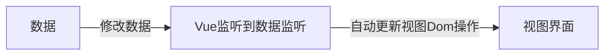

## 一、初识Vue

Vue是一个用于构建用户界面的渐进式框架，Vue的两种使用方式：

* Vue核心包开发：局部模块改造
* Vue核心包&Vue插件工程化开发：整站开发

### 1.1 Vue快速上手

#### 1.1.1 Vue实例

创建用户实例，初始化渲染：

1. 构建用户界面

2. 创建Vue实例，初始化渲染：

   * 准备容器，引包（官网）-开发版本/生产版本

   * 创建Vue实例 new Vue()

   * 指定配置项 → 渲染数据：el指定挂载点，data提供数据

```html
<body>
  <!-- 创建Vue实例，初始化渲染 -->
  <div class="box">
    {{msg}}
  </div>
  <div class="box2">
    {{count}}
  </div>
  <div id="app">
    <!-- 这里将来会编写一些代码 -->
    <h1>{{ msg }}</h1>
    <a href="#"> {{count}}</a>

  </div>

  <!-- 引入的是开发版本的包 -->
  <script src="https://cdn.jsdelivr.net/npm/vue@2.7.16/dist/vue.js"></script>
  <!-- <script src="vue.js"></script> -->

  <script>
    //一旦引入了VueJs核心包，在全局环境就有了Vue的构造函数
    const app = new Vue({
      // 通过el配置选择器，指定Vue管理的是哪个盒子
      el: "#app",
      //通过data提供渲染的数据
      data: {
        msg: 'hello Vue',
        count: 666
      }
    }
    )
  </script>

</body>
```

#### 1.1.2 插值表达式

插值表达式是一种Vue的模板语法

作用：利用表达式进行插值，渲染到页面上

表达式：是可以被求值的代码，JS引擎会将其计算出一个结果

语法：`{{表达式}}`

注：

* 使用的数据必须存在
* 支持的是表达式，而非语句，比如：if for
* 不能在标签属性中使用`{{ }}`插值

#### 1.1.3 响应式特征

数据的响应式处理 → 响应式：数据变化，视图自动更新



data中的数据，最终回添加到实例上

#### 1.1.4 开发者工具

### 1.2 Vue指令

Vue会根据不同的指令，针对标签实现不同的功能（指令：带有v-前缀的特殊标签属性）

为啥要学：提高程序员操作 DOM 的效率。

vue 中的指令按照不同的用途可以分为如下 6 大类：

- 内容渲染指令（v-html、v-text）内容渲染指令用来辅助开发者渲染 DOM 元素的文本内容
- 条件渲染指令（v-show、v-if、v-else、v-else-if）用来辅助开发者按需控制 DOM 的显示与隐藏
- 事件绑定指令（v-on）
- 属性绑定指令 （v-bind）
- 双向绑定指令（v-model）
- 列表渲染指令（v-for）

#### 1.2.1 内容渲染指令

内容渲染指令用来辅助开发者渲染 DOM 元素的文本内容。常用的内容渲染指令有如下2 个：

- v-text（类似innerText）


- - 使用语法：`<p v-text="uname">hello</p>`，意思是将 uame 值渲染到 p 标签中
  - 类似 innerText，使用该语法，会覆盖 p 标签原有内容


- v-html（类似 innerHTML）


- - 使用语法：`<p v-html="intro">hello</p>`，意思是将 intro 值渲染到 p 标签中
  - 类似 innerHTML，使用该语法，会覆盖 p 标签原有内容
  - 类似 innerHTML，使用该语法，能够将HTML标签的样式呈现出来。

#### 1.2.2 条件渲染指令

*  v-show
  * 作用：控制元素的显示隐藏
  * 语法：`v-show="表达式"`  表达式值true显示，false隐藏
  * 原理：  切换 display:none 控制显示隐藏
  * 适合场景：频繁切换显示隐藏的的场景
*  v-if
  * 作用：控制元素的显示隐藏（条件渲染）
  * 语法：`v-if="表达式"`  表达式值true显示，false隐藏
  * 原理：根据判断条件控制元素的创建和移除
  * 适合场景：要么显示，要么隐藏，不频繁切换的场景
*  v-else 和 v-else-if
   * 作用：辅助v-if进行判断渲染
   * 语法：v-else  v-else-if="表达式"
   * 需要紧接着v-if使用

#### 1.2.3 事件绑定指令

1. 作用：注册事件=添加监听+提供逻辑范围
2. 语法：
   1. v-on：事件名=“内联语句”
   2. v-on：事件名=“methods中的函数名”
   3. v-on：事件名="处理函数(实参)
3. 简称：@事件名
4. 注意：methods中的this指向Vue实例

#### 1.2.4 属性绑定指令

1. 作用：动态设置html的标签属性 比如：src、url、title
2. 语法**：**v-bind:属性名=“表达式”
3. v-bind:可以简写成 =>   ：

#### 1.2.5 列表渲染指令

Vue 提供了 v-for 列表渲染指令，用来辅助开发者基于一个数组来循环渲染一个列表结构。

v-for 指令需要使用 `(item, index) in arr` 形式的特殊语法，其中：

- item 是数组中的每一项
- index 是每一项的索引，不需要可以省略
- arr 是被遍历的数组

此语法也可以遍历**对象和数字**

```js
//遍历对象
<div v-for="(value, key, index) in object">{{value}}</div>
//value:对象中的值
//key:对象中的键
//index:遍历索引从0开始

//遍历数字
<p v-for="item in 10">{{item}}</p>
item从1 开始
```

语法： key="唯一值"

作用：给列表项添加的唯一标识。便于Vue进行列表项的正确排序复用。

为什么加key：Vue 的默认行为会尝试原地修改元素（就地复用）

实例代码：

```html
<ul>
  <li v-for="(item, index) in booksList" :key="item.id">
    <span>{{ item.name }}</span>
    <span>{{ item.author }}</span>
    <button @click="del(item.id)">删除</button>
  </li>
</ul>
```

注意：

1. key 的值只能是字符串 或 数字类型
2. key 的值必须具有唯一性
3. 推荐使用  id 作为 key（唯一），不推荐使用 index 作为 key（会变化，不对应）

#### 1.2.6 双向绑定指令

1. 作用：给表单元素使用，双向数据绑定→可以快速获取或设置表单元素内容

   ①数据变化：视图自动更新

   ②视图变化：数据自动更新

2. 语法：v-model="变量"

### 1.3 指令修饰符

通过“.”指明一些指令后缀，不同后缀封装了不同的处理操作→简化代码

1. 按键修饰符

   @keyup.enter	键盘回车监听

2. v-model修饰符

   v-model.trim		去除首尾空格

   v-model.number 	转数字

3. 事件修饰符

   @事件名.stop	阻止冒泡

   @事件名.prevent 	阻止默认行为

### 1.4 v-bind对于样式控制的增强

#### 1.4.1 操作class

语法：:class="对象/数组"

1. 对象→键就是类名，值是布尔值，如果值为true，有这个类，否则没有这个类

   ```html
   <div class="box" :class="{ 类名1: 布尔值, 类名2: 布尔值 }"></div>
   ```

   ​    适用场景：一个类名，来回切换

2. 数组→数组中的所有的类，都会添加到盒子上，本质上就是一个class类表

   ```html
   <div class="box" :class="[ '类名1', '类名2', '类名3' ]"></div>
   ```

      使用场景:批量添加或删除类

#### 1.4.2 操作style

语法：:style="样式对象"

```html
<div class="box" :style="{ CSS属性名1: CSS属性值, CSS属性名2: CSS属性值 }"></div>
```

使用场景：具体属性的动态配置

### 1.5 v-model应用于其他表单元素

常见的表单元素都可以用 v-model 绑定关联  →  快速获取或设置表单元素的值

它会根据控件类自动选取正确的方法来更新元素

```js
输入框  input:text   ——> value
文本域  textarea	 ——> value
复选框  input:checkbox  ——> checked
单选框  input:radio   ——> checked
下拉菜单 select    ——> value
...
```

### 1.6 计算属性

#### 1.6.1 计算属性

概念：基于现有的数据，计算出来的新属性。依赖的数据变化，自动重新计算

语法：

1. 生命在computed配置项中，一个计算属性对应一个函数
2. 使用起来和普通属性一样使用{{计算属性名}}

代码：

```javascript
computed:{
  计算属性名 () {
     计算代码
     return 结果
	}
}
```

注意：

1. computed配置项和data配置项是**同级**的
2. computed中的计算属性**虽然是函数的写法**，但他**依然是个属性**
3. computed中的计算属性**不能**和data中的属性**同名**
4. 使用computed中的计算属性和使用data中的属性是一样的用法
5. computed中计算属性内部的**this**依然**指向的是Vue实例**

特性：

* 缓存特性（提升性能），计算属性会对计算出来的结果缓存，再次使用直接读取缓存，依赖项变了，会自动重新计算→并在次缓存

#### 1.6.2 计算属性完整写法

计算属性默认的简写，只能读取访问，不能修改。要修改，需要写计算属性的完整写法

```js
computed: {
  //没有配置设置的逻辑
  // fullName() {
  //   return this.firstName + this.lastName
  // }
  //完整写法
  fullName: {
    //获取求值时,执行get,有缓存优先都缓存
    get() {
      return this.firstName + this.lastName
    },
    //被修改赋值时,执行set
    set(value) {
      console.log(value);
      this.firstName = value.slice(0, 1)
      this.lastName = value.slice(1)
    }
  }
}
```

### 1.7 watch监视器

#### 1.7.1 watch监视器

作用：监视数据变化，执行一些业务逻辑或异步操作

语法：

1. watch同样声明在跟data同级的配置项中
2. 简单写法： 简单类型数据直接监视
3. 完整写法：添加额外配置项

```js
watch: {
  // 该方法会在数据变化时，触发执行
  数据属性名 (newValue, oldValue) {
    一些业务逻辑 或 异步操作。 
  },
  '对象.属性名' (newValue, oldValue) {
    一些业务逻辑 或 异步操作。 
  }
}
```

#### 1.7.2 watch监视器完整写法

完整写法 —>添加额外的配置项

1. deep:true 对复杂类型进行深度监听
2. immdiate:true 初始化 立刻执行一次

```js
data: {
  obj: {
    words: '苹果',
    lang: 'italy'
  },
},
watch: {// watch 完整写法
  对象: {
    deep: true, // 深度监视
    immdiate:true,//立即执行handler函数
    handler (newValue) {
      console.log(newValue)
    }
  }
}
```


## 二、Vue生命周期和脚手架

### 2.1 生命周期及四个阶段

Vue生命周期：一个Vue实例从创建到销毁的整个过程

声明周期的四个阶段：创建、挂载、更新、销毁

1.创建阶段：创建响应式数据

2.挂载阶段：渲染模板

3.更新阶段：修改数据，更新视图

4.销毁阶段：销毁Vue实例


Vue生命周期过程中，会自动运行一些函数，被称为生命周期钩子→让开发者可以在特定需要的阶段运行自己的代码


### 2.2 工程化开发和脚手架

开发的Vue的两种方式：

1.核心包传统开发模式：基于html/css/js文件，直接引入核心包，开发Vue

2.工程化开发模式:基于构建工具（例如：webpack）的环境开发Vue

Vue CLI是Vue官方提供的一个全局命令工具，可以帮助我们快速创建一个开发Vue项目的标准化基础架子，集成了webpack配置

好处：

1. 开箱即用，零配置
2. 内置babel等工具
3. 标准化的webpack配置

使用步骤：

1. 全局安装（只需安装一次即可） yarn global add @vue/cli 或者 npm i @vue/cli -g
2. 查看vue/cli版本： vue --version
3. 创建项目架子：**vue create project-name**(项目名不能使用中文)
4. 启动项目：**yarn serve** 或者 **npm run serve**(命令不固定，找package.json)

### 2.3 脚手架目录文件


### 2.4 组件化开发和根组件

组件化：一个页面可以拆分称一个个组件，每个组件都有着自己独立的结构、样式、行为

好处：便于维护，利于复用→提升开发效率

组件分类：普通组件、根组件

根组件：整个引用最上层的组件，包裹所有普通小组件

App.vue 文件（单文件组件）的三个部分：

- 三部分构成

  - template：结构 （有且只能一个根元素）
  - script:   js逻辑 
  - style： 样式 (可支持less，需要装包)

- 让组件支持less

  （1） style标签，lang="less" 开启less功能 

  （2） 装包: yarn add less less-loader -D 或者npm i less less-loader -D

### 2.5 普通组件的注册

#### 2.5.1 局部注册

只能在注册的组件内使用

语法：

```js
// 导入需要注册的组件
import 组件对象 from '.vue文件路径'
import HmHeader from './components/HmHeader'

export default {  // 局部注册
  components: {
   //'组件名': 组件对象,
    HmHeader:HmHeaer,
    HmHeader
  }
}
```

#### 2.5.2 全局注册

所有组件内部都能使用

语法：

```js
// 导入需要全局注册的组件
import HmButton from './components/HmButton'
Vue.component('HmButton', HmButton)
```

### 2.6 组件的三大部分

注意点：

* 结构：只能有一个根元素
* 样式：全局样式（默认）：影响所有组件；局部样式：scoped下样式，只作用于当前组件
* 逻辑：el根实例独有，data是一个函数，其他配置项一致

#### 2.6.1 组件的样式冲突scoped

**默认情况**：

写在组件中的样式会 **全局生效** → 因此很容易造成多个组件之间的样式冲突问题。

1. **全局样式**: 默认组件中的样式会作用到全局，任何一个组件中都会受到此样式的影响
2. **局部样式**: 可以给组件加上**scoped** 属性,可以**让样式只作用于当前组件**

BaseOne.vue

```vue
<template>
  <div class="base-one">
    BaseOne
  </div>
</template>

<script>
export default {

}
</script>
<style scoped>
</style>
```

BaseTwo.vue

```vue
<template>
  <div class="base-one">
    BaseTwo
  </div>
</template>

<script>
export default {

}
</script>

<style scoped>
</style>
```

App.vue

```vue
<template>
  <div id="app">
    <BaseOne></BaseOne>
    <BaseTwo></BaseTwo>
  </div>
</template>

<script>
import BaseOne from './components/BaseOne'
import BaseTwo from './components/BaseTwo'
export default {
  name: 'App',
  components: {
    BaseOne,
    BaseTwo
  }
}
</script>
```

scoped原理：

1. 当前组件内标签都被添加**data-v-hash值** 的属性
2. css选择器都被添加 [**data-v-hash值**] 的属性选择器

最终效果: **必须是当前组件的元素**, 才会有这个自定义属性, 才会被这个样式作用到

#### 2.6.2 data是一个函数

一个组件的 **data** 选项必须**是一个函数**。目的是为了：保证每个组件实例，维护**独立**的一份**数据**对象。

每次创建新的组件实例，都会新**执行一次data 函数**，得到一个新对象。

代码演示：

BaseCount.vue

```vue
<template>
  <div class="base-count">
    <button @click="count--">-</button>
    <span>{{ count }}</span>
    <button @click="count++">+</button>
  </div>
</template>

<script>
export default {
  data: function () {
    return {
      count: 100,
    }
  },
}
</script>

<style>
.base-count {
  margin: 20px;
}
</style>
```

App.vue

```vue
<template>
  <div class="app">
    <BaseCount></BaseCount>
  </div>
</template>

<script>
import BaseCount from './components/BaseCount'
export default {
  components: {
    BaseCount,
  },
}
</script>

<style>
</style>
```


## 三、组件通信和进阶语法

### 3.1 组件通信

指组件与组件之间的数据传递

* 组件的数据是独立的，无法直接访问其他组件的数据。
* 想使用其他组件的数据，就需要组件通信

组件关系分为：父子关系，非父子关系

组件通信解决方案：

父子关系：props、$emit

非父子关系：provide&inject、eventbus

#### 3.1.1 父子通信流程

1. 父组件通过 **props** 将数据传递给子组件
2. 子组件利用 **$emit** 通知父组件修改更新

父向子传值步骤

1. 给子组件以添加属性的方式传值
2. 子组件内部通过props接收
3. 模板中直接使用 props接收的值

子向父传值步骤

1. $emit触发事件，给父组件发送消息通知
2. 父组件监听$emit触发的事件
3. 提供处理函数，在函数的性参中获取传过来的参数

#### 3.1.2 props详解

* Props定义：组件上注册的一些自定义属性
* Props作用：向子组件传递数据
* Props特点：可以 传递 **任意数量** 的prop、**任意类型** 的prop

props校验：组件的props不可以乱传

* 作用：为组件的 prop 指定**验证要求**，不符合要求，控制台就会有**错误提示** → 帮助开发者，快速发现错误
* 语法：**类型校验**、非空校验、默认值自定义校验

```js
props: {
  校验的属性名: {
    type: 类型,  // Number String Boolean ...
    required: true, // 是否必填
    default: 默认值, // 默认值
    validator (value) {
      // 自定义校验逻辑
      return 是否通过校验
    }
  }
},
```

注意：

1.default和required一般不同时写（因为当时必填项时，肯定是有值的）

2.default后面如果是简单类型的值，可以直接写默认。如果是复杂类型的值，则需要以函数的形式return一个默认值

#### 3.1.3 props&data、单向数据流

共同点：都可以给组件提供数据

区别：

- data 的数据是**自己**的 → 随便改
- prop 的数据是**外部**的 → 不能直接改，要遵循 **单向数据流**

单向数据流：父级props 的数据更新，会向下流动，影响子组件。这个数据流动是单向的

### 3.2 v-model详解

#### 3.2.1 v-model原理

v-model本质上是一个语法糖。例如应用在输入框上，就是value属性 和 input事件 的合写

```html
<template>
  <div id="app" >
    <input v-model="msg" type="text">

    <input :value="msg" @input="msg = $event.target.value" type="text">
  </div>
</template>
```

作用：提供数据的双向绑定

- 数据变，视图跟着变 :value
- 视图变，数据跟着变 @input

$event用于在模板中，获取事件的形参

#### 3.2.2 表单类组件封装

实现子组件和父组件数据的双向绑定 （实现App.vue中的selectId和子组件选中的数据进行双向绑定）

子组件

```html
<select :value="value" @change="handleChange">...</select>
props: {
  value: String
},
methods: {
  handleChange (e) {
    this.$emit('input', e.target.value)
  }
}
```

父组件

```vue
<BaseSelect v-model="selectId"></BaseSelect>
```

### 3.3 .sync修饰符

作用：可以实现子组件与父组件数据的双向绑定，简化代码

特点：prop属性名，可以自定义，非固定为value

场景：封装弹框类的基础组件， visible属性 true显示 false隐藏

本质：.sync修饰符 就是 **:属性名** 和 **@update:属性名** 合写

### 3.4 ref和$refs

作用：利用ref 和 $refs 可以用于 获取 dom 元素 或 组件实例

特点：查找范围 → 当前组件内(更精确稳定)

语法：

1.给要获取的盒子添加ref属性

```html
<div ref="chartRef">我是渲染图表的容器</div>
```

2.获取时通过 $refs获取 this.$refs.chartRef 获取

```js
mounted () {
  console.log(this.$refs.chartRef)
}
```

注意：之前只用document.querySelect('.box') 获取的是整个页面中的盒子

### 3.5 Vue异步更新和$nextTick

需求：编辑标题, 编辑框自动聚焦

1. 点击编辑，显示编辑框
2. 让编辑框，立刻获取焦点

代码实现：

```vue
<template>
  <div class="app">
    <div v-if="isShowEdit">
      <input type="text" v-model="editValue" ref="inp" />
      <button>确认</button>
    </div>
    <div v-else>
      <span>{{ title }}</span>
      <button @click="editFn">编辑</button>
    </div>
  </div>
</template>

<script>
export default {
  data() {
    return {
      title: '大标题',
      isShowEdit: false,
      editValue: '',
    }
  },
  methods: {
    editFn() {
        // 显示输入框
        this.isShowEdit = true  
        // 获取焦点
        this.$refs.inp.focus() 
    }  },
}
</script> 
```

问题："显示之后"，立刻获取焦点是不能成功的！

原因：Vue 是异步更新DOM (提升性能)

解决方案：$nextTick：**等 DOM更新后**,才会触发执行此方法里的函数体

**语法：** this.$nextTick(函数体)

```vue
this.$nextTick(() => {
  this.$refs.inp.focus()
})
```

**注意：**$nextTick 内的函数体 一定是**箭头函数**，这样才能让函数内部的this指向Vue实例


## 四、自定义指令、插槽

### 4.1 自定义指令

#### 4.1.1 基础语法

指令介绍：

- 内置指令：**v-html、v-if、v-bind、v-on**... 这都是Vue给咱们内置的一些指令，可以直接使用

- 自定义指令：同时Vue也支持让开发者，自己注册一些指令。这些指令被称为**自定义指令**

  每个指令都有自己各自独立的功能

自定义指令：

概念：自己定义的指令，可以**封装一些DOM操作**，扩展额外的功能

使用：`<input v-指令名 type="text">`

全局注册-语法：

```js
//在main.js中
Vue.directive('指令名', {
  "inserted" (el) {//当指令做绑定的元素添加到页面中自动调用
    // 可以对 el 标签，扩展额外功能
    el.focus()
  }
})
```

局部注册-语法：

```js
//在Vue组件的配置项中
directives: {
  "指令名": {
    inserted () {
      // 可以对 el 标签，扩展额外功能
      el.focus()
    }
  }
}
```

#### 4.1.2 指令的值

实现一个 color 指令 - 传入不同的颜色, 给标签设置文字颜色

1.在绑定指令时，可以通过“等号”的形式为指令 绑定 具体的参数值

```
<div v-color="color">我是内容</div>
```

2.通过 binding.value 可以拿到指令值，**指令值修改会 触发 update 函数**

```vue
<script>
export default {
  data () {
    return {
      color1:'red',
      color2:'green'
    }
  },
  directives:{
    color:{
      //1.inserted提供元素被添加到页面上的逻辑
      inserted(el,binding){
        console.log(el,binding.value);
        el.style.color=binding.value
        
      },
      //2.update指令的值修改时触发，提供值变化后，dom更新的逻辑
      update(el,binding){
        el.style.color=binding.value
      }
    }
  }
}
</script>
```

#### 4.1.3 loading指令封装

场景：实际开发过程中，发送请求需要时间，在请求的数据未回来时，页面会处于**空白状态** => 用户体验不好

需求：封装一个 v-loading 指令，实现加载中的效果

分析：

1.本质 loading效果就是一个蒙层，盖在了盒子上

2.数据请求中，开启loading状态，添加蒙层

3.数据请求完毕，关闭loading状态，移除蒙层

实现：

1.准备一个 loading类，通过伪元素定位，设置宽高，实现蒙层

2.开启关闭 loading状态（添加移除蒙层），本质只需要添加移除类即可

3.结合自定义指令的语法进行封装复用

```vue
<script>
// 安装axios =>  yarn add axios
import axios from 'axios'

// 接口地址：http://hmajax.itheima.net/api/news
// 请求方式：get
export default {
  data () {
    return {
      list: [],
      isLoading:true,
      isLoading2:true
    }
  },
  async created () {
    // 1. 发送请求获取数据
    const res = await axios.get('http://hmajax.itheima.net/api/news')
    
    setTimeout(() => {
      // 2. 更新到 list 中
      this.list = res.data.data
      this.isLoading=false
    }, 2000)
  },
  directives:{
    loading:{
      inserted(el,binding){
        binding.value ? el.classList.add('loading'):el.classList.remove('loading')
      },
      update(el,binding){
        binding.value ? el.classList.add('loading'):el.classList.remove('loading')
      }
    }
  }
}
</script>

```

### 4.2 插槽

#### 4.2.1 默认插槽

作用：让组件内部的一些结构支持自定义

基本语法：

1. 组件内需要定制的结构部分，改用**`<slot> </slot>`**占位
2. 使用组件时, **`<MyDialog></MyDialog>`**标签内部, 传入结构替换slot
3. 给插槽传入内容时，可以传入**纯文本、html标签、组**

```vue
 <!-- 在需要定制的位置进行slot占位 -->
      <slot></slot>
```

```vue
<template>
  <div>
    <!-- 在组件标签内填入内容 -->
    <MyDialog>你确认要退出本系统么?</MyDialog>
    <MyDialog>你确认删除吗</MyDialog>
  </div>
</template>
```

封装组件时，可以为预留的 `<slot>` 插槽提供后备内容（默认内容）。

在 标签内，放置内容, 作为默认显示内容

#### 4.2.2 具名插槽

需求：一个组件内有多处结构，需要外部传入标签，进行定制

具名插槽语法：

- 多个slot使用name属性区分名字

  

- template配合v-slot:名字来分发对应标签

  

v-slot写起来太长，vue给我们提供一个简单写法 **v-slot —> #**

#### 4.2.3  作用域插槽

定义slot 插槽的同时, 是可以**传值**的。给 **插槽** 上可以 **绑定数据**，将来 **使用组件时可以用**

使用步骤：

1. 给 slot 标签, 以 添加属性的方式传值

   ```vue
   <slot :id="item.id" msg="测试文本"></slot>
   ```

2. 所有添加的属性, 都会被收集到一个对象中

   ```json
   { id: 3, msg: '测试文本' }
   ```

3. 在template中, 通过 ` #插槽名= "obj"` 接收，默认插槽名为 default

   ```vue
   <MyTable :list="list">
     <template #default="obj">
       <button @click="del(obj.id)">删除</button>
     </template>
   </MyTable>
   ```

