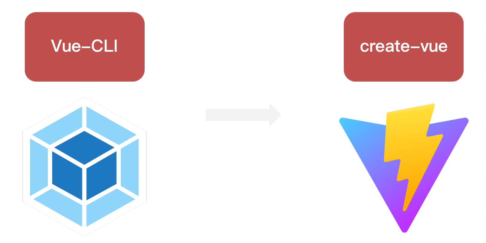
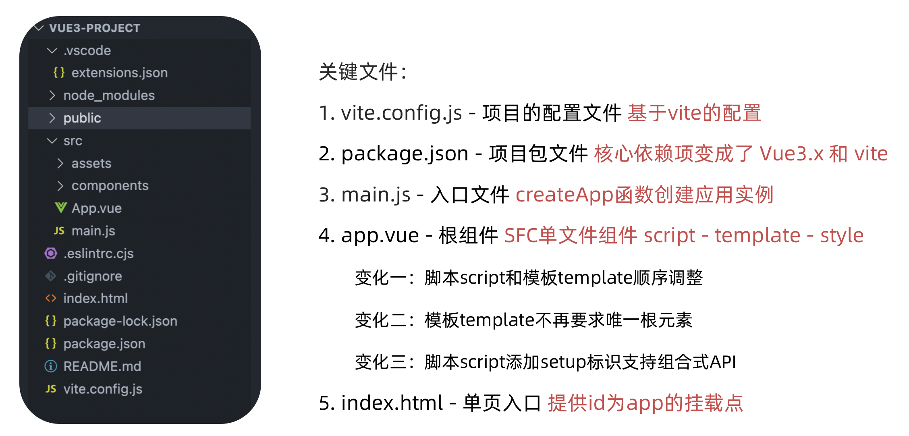

## 一、Vue入门

### 1.1 Vue优势


### 1.2 Vue2选项式API vs Vue3组合式API

```html
<script>
export default {
  data(){
    return {
      count:0
    }
  },
  methods:{
    addCount(){
      this.count++
    }
  }
}
</script>
```

```html
<script setup>
import { ref } from 'vue'
const count = ref(0)
const addCount = ()=> count.value++
</script>
```

特点：

1. 代码量变少
2. 分散式维护变成集中式维护


### 1.3 使用create-vue搭建Vue3项目

1. 认识create-vue

> create-vue是Vue官方新的脚手架工具，底层切换到了 vite （下一代前端工具链），为开发提供极速响应



2. 使用create-vue创建项目

> 前置条件 - 已安装16.0或更高版本的Node.js

执行如下命令，这一指令将会安装并执行 create-vue

```
npm init vue@latest
```

### 1.4 关键文件




## 二、组合式API

### 2.1 setup选项

#### 2.1.1setup选项的写法和执行时机

写法

```vue
<script>
  export default {
    setup(){
      
    },
    beforeCreate(){
      
    }
  }
</script>
```

执行时机

> 在beforeCreate钩子之前执行


#### 2.1.2 setup中写代码的特点

> 在setup函数中写的数据和方法需要在末尾以对象的方式return，才能给模版使用

```vue
<script>
  export default {
	  // setup函数无法获取不到this
      setup(){
      const message = 'this is message'
      const logMessage = ()=>{
        console.log(message)
      }
      // 必须return才可以
      return {
        message,
        logMessage
      }
    }
  }
</script>
```

#### 2.1.3 ` <script setup>`语法糖

> script标签添加 setup标记，不需要再写导出语句，默认会添加导出语句

```vue
<script setup>
  const message = 'this is message'
  const logMessage = ()=>{
    console.log(message)
  }
</script>
```

### 2.2 reactive和ref函数

#### 2.2.1 reactive()

* 作用：接收对象类型数据的参数传入并返回一个响应式的对象

* > 接受对象类型数据的参数传入并返回一个响应式的对象

  ```vue
  <script setup>
   // 导入
   import { reactive } from 'vue'
   // 执行函数 传入参数 变量接收
   const state = reactive({
     msg:'this is msg'
   })
   const setSate = ()=>{
     // 修改数据更新视图
     state.msg = 'this is new msg'
   }
  </script>

  <template>
    {{ state.msg }}
    <button @click="setState">change msg</button>
  </template>
  ```

#### 2.2.2 ref()

* 作用：接受简单类型或者对象类型的数据传入并返回一个响应式的对象

* 本质上是在原有数据的基础上，外层包了一层对象

  ```vue
  <script setup>
   // 导入
   import { ref } from 'vue'
   // 执行函数 传入参数 变量接收
   const count = ref(0)
   const setCount = ()=>{
     // 修改数据更新视图必须加上.value
     count.value++
   }
  </script>

  <template>
    <button @click="setCount">{{count}}</button>
  </template>
  ```

#### 2.2.3 reactive 对比 ref

相同点：

* 都是用来生成响应式数据

不同点

* reactive不能处理简单类型的数据
* ref参数类型支持更好，但是必须通过.value做访问修改
* ref函数内部的实现依赖于reactive函数

在实际工作中的推荐：推荐使用ref函数，减少记忆负担

### 2.3 computed

