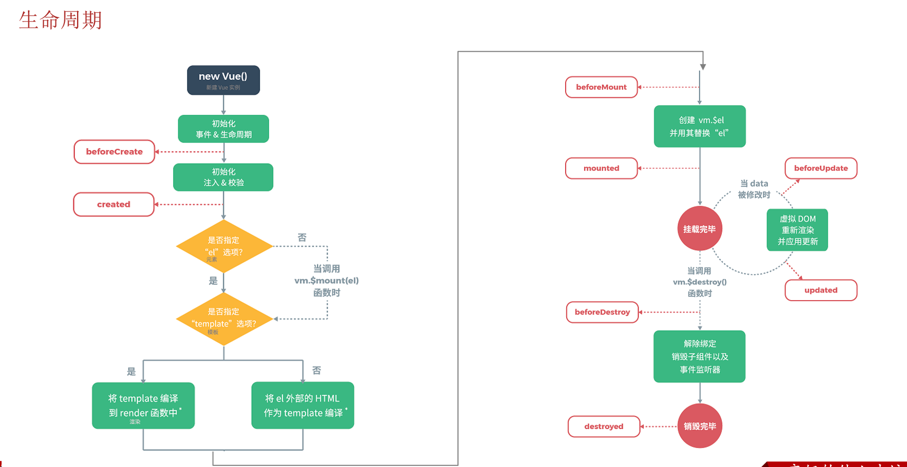
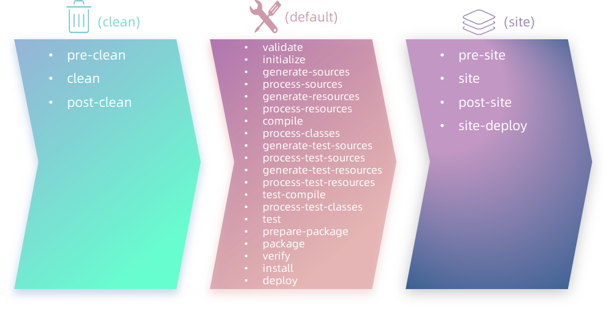

##  一、Vue框架

框架：是一个半成品软件；是一套可重用的、通用的、软件基础代码模型。基于框架进行开发，更加便捷，更加高效

Vue是一套前端框架，免除原生JavaScript中的DOM操作，简化书写

基于MVVM（Model-View-ViewModel）思想，实现数据的双向绑定，将编程的关注点放到数据上

### 1.1 Vue快速入门

* 新建HTML页面，引入Vue.js文件

  ```html
  <script src="js/vue.js"></script>
  ```

* 在JS代码区域，创建Vue核心对象，定义数据模型

  ```html
  <script>
    new Vue({
      el: "#app",//Vue接管区域
      data: {
        message: "Hello Vue"
      }

    })
  </script>
  ```

* 编写视图

  ```html
  <div id="app">
    <input type="text" v-model="message">
    {{message}}<!--插值表达式-->
  </div>
  ```

插值表达式：

* 形式：{{表达式}}
* 内容：变量、三元运算符、函数调用、算数运算

### 1.2 Vue常用指令

| 指令              | 作用                                                |
| ----------------- | --------------------------------------------------- |
| v-bind            | 为HTML标签绑定属性值，如设置href、css样式           |
| v-model           | 在表单元素上创建双向数据绑定                        |
| v-on              | 为HTML标签绑定数据                                  |
| v-if/else-if/else | 条件性的渲染某元素，判断为true时渲染，否则不渲染    |
| v-show            | 根据条件展示某元素，区别在于切换的是display属性的值 |
| v-for             | 列表渲染，遍历容器的元素或者对象的属性              |

#### 1.2.1 v-bind,v-model,v-on代码示例

```html
<body>
  <div id="app">
    <a v-bind:href="url">链接</a>
    <input type="text" v-model="url">
    <input type="button" value="点我" v-on:click="handle">
    <input type="button" value="点我" @click="handle">
  </div>
</body>
<script>
  new Vue({
    el: "#app",//Vue接管区域
    data: {
      url: "https://www.baidu.com"
    },
    methods: {
      handle: function () {
        alert("不许点我")
      }
    }

  })
</script>
```

#### 1.2.2 v-if/else-if/else,v-show代码示例

```html
<body>
  <div id="app">
    age<input type="text" v-model="age">judeged,for:
    <span v-if="age<=35">younger(less than 35 )</span>
    <span v-else-if="age>35&&age<=60">middle-aged(between 35 and 60)</span>
    <span v-else="">older(over 60)</span>
    <br><br>
    age<input type="text" v-model="age">judeged,for:
    <span v-show="age<=35">younger(less than 35 )</span>
    <span v-show="age>35&&age<=60">middle-aged(between 35 and 60)</span>
    <span v-show="age>60">older(over 60)</span>
  </div>
</body>
<script>
  new Vue({
    el: "#app",
    data: {
      age: 20
    },
    methods: {

    }
  })
</script>

age70		judeged,for: older(over 60)
age70		judeged,for: older(over 60)
```

#### 1.2.3 v-for代码示例

```html
<body>
  <div id="app">
    <div v-for="(addr,index) in addrs">{{index+1}} : {{addr}}</div>
  </div>
</body>
<script>
  new Vue({
    el: "#app",
    data: {
      addrs: ["Tokyo", "Shanghai", "New York", "Lundon", "Paris", "San Francisco", "Los Angeles"]
    },
    method: {

    }
  })
</script>

//1 : Tokyo
//2 : Shanghai
//3 : New York
//4 : Lundon
//5 : Paris
//6 : San Francisco
//7 : Los Angeles
```

### 1.3 Vue生命周期

生命周期：指一个对象从创建到销毁的整个过程

Vue声明周期的八个阶段：每触发一个生命周期事件，会自动执行一个生命周期方法（钩子）

| 状态          | 阶段周期     |
| ------------- | ------------ |
| beforeCreate  | 创建前       |
| created       | 创建后       |
| beforeMount   | 载入前       |
| ==mounted==   | ==挂载完成== |
| beforeUpdate  | 更新前       |
| updated       | 更新后       |
| beforeDestroy | 销毁前       |
| destroyed     | 销毁后       |



mounted：挂载完成，Vue初始化完成，HTML页面渲染成功


## 二、Vue_Element

### 2.1 Ajax

#### 2.1 介绍

概念：Asynchronous JavaScript And XML,异步的JavaScript和XML

作用：

* 数据交换：通过Ajax可以给服务器发送请求，并获取服务器响应的数据
* 异步交换：可以在不重新加载整个页面的情况下，与服务器交换数据并更新部分网页的技术，如搜索联想、用户名是否可以校验等等


#### 2.2 原生Ajax

```html
<body>
    
    <input type="button" value="获取数据" onclick="getData()">

    <div id="div1"></div>
    
</body>
<script>
    function getData(){
        //1. 创建XMLHttpRequest 
        var xmlHttpRequest  = new XMLHttpRequest();
        
        //2. 发送异步请求
        xmlHttpRequest.open('GET','http://yapi.smart-xwork.cn/mock/169327/emp/list');
        xmlHttpRequest.send();//发送请求
        
        //3. 获取服务响应数据
        xmlHttpRequest.onreadystatechange = function(){
            if(xmlHttpRequest.readyState == 4 && xmlHttpRequest.status == 200){
                document.getElementById('div1').innerHTML = xmlHttpRequest.responseText;
            }
        }
    }
</script>
```

#### 2.3 Axios

Axios对原生的Ajax进行了封装，简化书写，快速开发

Axios入门：

1. 引入Axios的js文件

     ~~~html
     <script src="js/axios-0.18.0.js"></script>
     ~~~

2. 使用Axios发送请求，并获取响应结果

    - 发送 get 请求

       ~~~js
       axios({
           method:"get",
           url:"http://localhost:8080/ajax-demo1/aJAXDemo1?username=zhangsan"
       }).then(function (resp){
           alert(resp.data);
       })
       ~~~

     - 发送 post 请求

       ```js
       axios({
           method:"post",
           url:"http://localhost:8080/ajax-demo1/aJAXDemo1",
           data:"username=zhangsan"
       }).then(function (resp){
           alert(resp.data);
       });
       ```

Axios还针对不同的请求，提供了别名方式的api,具体如下：

| 方法                               | 描述           |
| ---------------------------------- | -------------- |
| axios.get(url [, config])          | 发送get请求    |
| axios.delete(url [, config])       | 发送delete请求 |
| axios.post(url [, data[, config]]) | 发送post请求   |
| axios.put(url [, data[, config]])  | 发送put请求    |

我们可以将get请求代码改写成如下：

~~~js
axios.get("http://yapi.smart-xwork.cn/mock/169327/emp/list").then(result => {
    console.log(result.data);
})
~~~

post请求改写成如下：

~~~js
axios.post("http://yapi.smart-xwork.cn/mock/169327/emp/deleteById","id=1").then(result => {
    console.log(result.data);
})
~~~

### 2.2 前后端分离开发

#### 2.2.1 介绍

我们将原先的工程分为前端工程和后端工程这2个工程，然后前端工程交给专业的前端人员开发，后端工程交给专业的后端人员开发。

前端页面需要数据，可以通过发送异步请求，从后台工程获取。

但是，我们前后台是分开来开发的，那么前端人员怎么知道后台返回数据的格式呢？后端人员开发，怎么知道前端人员需要的数据格式呢？

所以针对这个问题，我们前后台统一指定一套规范！我们前后台开发人员都需要遵循这套规范开发，这就是我们的**接口文档**。接口文档有离线版和在线版本。

开发一个功能的具体步骤：

1. 需求分析：首先我们需要阅读需求文档，分析需求，理解需求。
2. 接口定义：查询接口文档中关于需求的接口的定义，包括地址，参数，响应数据类型等等
3. 前后台并行开发：各自按照接口文档进行开发，实现需求
4. 测试：前后台开发完了，各自按照接口文档进行测试
5. 前后段联调测试：前端工程请求后端工程，测试功能

#### 2.2.2 YAPI

Yapi是高效、易用、功能强大的api管理平台，旨在为开发、产品、测试人员提供更优雅的接口管理服务

[YApi官网](http://yapi.smart-xwork.cn/)

### 2.3 前端工程化

定义：指在企业级的前端项目开发中，把前端开发所需的工具、技术、流程、经验等进行规范化、标准化

现在企业开发中更加讲究前端工程化方式的开发，主要包括如下4个特点

- 模块化：将js和css等，做成一个个可复用模块
- 组件化：我们将UI组件，css样式，js行为封装成一个个的组件，便于管理
- 规范化：我们提供一套标准的规范的目录接口和编码规范，所有开发人员遵循这套规范
- 自动化：项目的构建，测试，部署全部都是自动完成

#### 2.3.1 环境准备

Vue-cli是Vue官方提供的一个脚手架，用于快速生成一个Vue的项目模板

Vue-cli主要提供了如下功能：

- 统一的目录结构
- 本地调试
- 热部署
- 单元测试
- 集成打包上线

#### 2.3.2 Vue项目

Vue项目-创建

命令行：`vue create vue-project`

图形化界面：`vue ui`

基于Vue脚手架创建出来的过程，有标准的目录结构

* node_modules；整个项目的依赖包
* public：存放项目的静态文件
* src：存放项目的源代码
  * assets：静态资源
  * components：可重用的组件
  * router：路由配置
  * views：视图组件（页面）
  * App.vue：入口页面（根组件）
  * main.js：入口js文件
* package.json：模块基本信息，项目开发所需要模块，版本信息
* vue.config.js：保存vue配置文件，如：代理、端口的配置等

Vue项目-配置端口

```js
const { defineConfig } = require('@vue/cli-service')
module.exports = defineConfig({
  transpileDependencies: true,
  devServer: {
    port: 7000
  }
})
```

#### 2.3.3 Vue项目开发流程

对于vue项目，index.html文件默认是引入了入口函数main.js文件，我们找到**src/main.js**文件，其代码如下：

```js
import Vue from 'vue'
import App from './App.vue'
import router from './router'

Vue.config.productionTip = false

new Vue({
  router,
  render: h => h(App)
}).$mount('#app')

```

上述代码中，包括如下几个关键点：

- import: 导入指定文件，并且重新起名。例如上述代码`import App from './App.vue'`导入当前目录下得App.vue并且起名为App
- new Vue(): 创建vue对象
- $mount('#app')：将vue对象创建的dom对象挂在到id=app的这个标签区域中，作用和之前学习的vue对象的le属性一致。
- router:  路由
- render: 主要使用视图的渲染的。

App.vue,注意的是.vue结尾的都是vue组件。而vue的组件文件包含3个部分：

- template: 模板部分，主要是HTML代码，用来展示页面主体结构的
- script: js代码区域，主要是通过js代码来控制模板的数据来源和行为的
- style: css样式部分，主要通过css样式控制模板的页面效果得

### 2.4 Element

Element：是饿了么公司前端开发团队提供的一套基于 Vue 的网站组件库，用于快速构建网页。

Element 提供了很多组件（组成网页的部件）供我们使用。例如 超链接、按钮、图片、表格等等。如下图所示就是我们开发的页面和ElementUI提供的效果对比：可以发现ElementUI提供的各式各样好看的按钮

#### 2.4.1 Element快速入门

安装ElementUI的组件库，打开VS Code，停止之前的项目，然后在命令行输入如下命令：

```
npm install element-ui@2.15.3 
```

然后我们需要在main.js这个入口js文件中引入ElementUI的组件库，其代码如下：

```js
import ElementUI from 'element-ui';
import 'element-ui/lib/theme-chalk/index.css';

Vue.use(ElementUI);
```

然后我们需要按照vue项目的开发规范，在**src/views**目录下创建一个vue组件文件，注意组件名称后缀是.vue，并且在组件文件中编写之前介绍过的基本组件语法，代码如下：

```vue
<template>
  <div>
    <element-view></element-view>
  </div>
</template>

<script>
import ElementView from './views/element/ElementView.vue'
export default {
  components: { ElementView },
}
</script>

<style></style>
```

#### 2.4.2 Element常见组件

* Table 表格：用于展示多条结构类似的数据，可对数据进行排序、筛选、对比或其他自定义操作
* Pagination 分页组件：主要提供分页工具条相关功能
* Dialog 对话框: 在保留当前页面状态的情况下，告知用户并承载相关操作
* Form 表单：由输入框、选择器、单选框、多选框等控件组成，用以收集、校验、提交数据。 

### 2.5 Vue路由

Vue Router是Vue的官方路由

组成：

* VueRouter：路由器类，根据路由请求在路由视图中动态渲染选中的组件
* `<router-link>`：请求链接组件，浏览器会解析成`<a>`
* `<router-view>`：动态视图组件，用来渲染展示与路由路径对应的组件

### 2.6 打包部署

Nginx是一款轻量级的Web服务器/反向代理服务器及电子邮件（IMAP/POP3）代理服务器。其特点是占用内存少，并发能力强，在各大型互联网公司都有广泛的使用


注：Nginx默认占用80端口号，如果80端口号被占用，可以在nginx.conf中修改端口号。

（netstat -ano|findStr 80）

## 三、Maven

### 3.1 Maven介绍

Maven是apache旗下的一个开源项目，是一款用于管理和构建java项目的工具。它基于项目对象模型（POM）的概念，通过一小段描述信息来管理项目的构建

Maven的作用：

* 依赖管理：方便快捷的管理项目依赖的资源（jar包），避免版本冲突问题
* 统一项目结构：提供标准，统一的项目标准
* 项目构建：标准跨平台（Linux\MacOS\windows）的自动化项目构建方式、


仓库：用于存储资源，管理各种jar包

* 本地仓库：自己计算机上的一个目录
* 中央仓库：由Maven团队维护的全球唯一的,[仓库地址](https://repo1.maven.org/maven2/)
* 远程仓库（私服）：一般由公司团队搭建的私有仓库

### 3.2 Maven集成

Maven坐标：

- Maven中的坐标是资源的唯一标识，通过该坐标可以唯一定义资源位置
- 使用坐标来定义项目或引入项目中需要的依赖

Maven坐标组成：

* groupId：定义当前Maven项目隶属组织名称(通常是域名反写，例如：com.itheima)
* artifactId：定义当前Maven项目名称（通常是模块名称，例如order-service、goods-service）
* version：定义当前项目版本号

```xml
  <groupId>org.example</groupId>
  <artifactId>untitled</artifactId>
  <version>1.0-SNAPSHOT</version>
```

### 3.3 maven依赖管理

#### 3.3.1 依赖配置

依赖：指当前项目运行所需要的jar包，一个项目中可以引入多个依赖

配置：

1. 在pom.xml中编写`<dependencies>`标签
2. 在`<dependencies>`标签中使用`<dependency>`引入坐标
3. 定义坐标的groupId、artifactId、version
4. 点击刷新按钮，引入最新加入的坐标

```xml
  <dependencies>
    <dependency>
      <groupId>junit</groupId>
      <artifactId>junit</artifactId>
      <version>3.8.1</version>
    </dependency>
  </dependencies>
```

注：

* 如果引入的依赖，在本地仓库不存在，将会连接远程仓库/中央仓库，然后下载依赖
* 如果不知道依赖的坐标信息，可以到[网站](htttps://mvnrepository.com/)搜索

#### 3.3.2 依赖传递

 依赖具有传递性

* 直接依赖：在当前项目中通过依赖配置建立的依赖关系
* 间接依赖：被依赖的资源如果依赖其他资源，当前项目间接依赖其他资源


#### 3.3.3 排除依赖

排除依赖指主动断开依赖的资源，被排除的资源无需指定版本--不需要

```xml
<dependency>
    <groupId>com.itheima</groupId>
    <artifactId>maven-projectB</artifactId>
    <version>1.0-SNAPSHOT</version>
   
    <!--排除依赖, 主动断开依赖的资源-->
    <exclusions>
    	<exclusion>
            <groupId>junit</groupId>
            <artifactId>junit</artifactId>
        </exclusion>
    </exclusions>
</dependency>
```

#### 3.3.4 可选依赖

- 可选依赖指对外隐藏当前所依赖的资源---不透明

的pom.xml,在引入`maven_03_pojo`的时候，添加`optional`

```xml
<dependency>
    <groupId>com.itheima</groupId>
    <artifactId>maven_03_pojo</artifactId>
    <version>1.0-SNAPSHOT</version>
    <!--可选依赖是隐藏当前工程所依赖的资源，隐藏后对应资源将不具有依赖传递-->
    <optional>true</optional>
</dependency>
```

#### 3.3.5 依赖范围

依赖的jar包，默认情况下，可以在任何地方使用。可以通过`<scope>...</scope>`设置其作用范围

作用范围：

* 主程序范围有效（main文件夹范围有效）
* 测试程序范围有效（test文件夹范围内）
* 是否参与打包运行（package指令范围内）

```xml
<dependency>
  <groupId>junit</groupId>
  <artifactId>junit</artifactId>
  <version>3.8.1</version>
  <scope>test</scope>
</dependency>
```

| scope值       | 主程序 | 测试程序 | 打包（运行） | 范例        |
| ------------- | ------ | -------- | ------------ | ----------- |
| compile(默认) | Y      | Y        | Y            | log4j       |
| test          | -      | Y        | -            | juint       |
| provided      | Y      | Y        | -            | servlet-api |
| runtime       | _      | Y        | Y            | jdbc驱动    |

#### 3.3.6 项目周期

Maven的生命周期就是为了对所有的maven项目构建过程进行抽象和统一

Maven中you3套相互独立的生命周期：

* clean：清理工作
* default：核心工作，例如：编译、测试、打包、安装、部署等
* site：生成报告、发布站点等

每套生命周期包含一些阶段（phase），阶段是有顺序的，后面的阶段依赖于前面的阶段



这三套生命周期，里面有很多很多的阶段，这么多生命周期阶段，其实我们常用的并不多，主要关注以下几个：

• clean：移除上一次构建生成的文件

• compile：编译项目源代码

• test：使用合适的单元测试框架运行测试(junit)

• package：将编译后的文件打包，如：jar、war等

• install：安装项目到本地仓库

注：在同一套生命周期中，运行后面的阶段时，前面的阶段都会运行


## 四、Web入门

Spring发展到今天已经形成了一种开发生态圈，Spring提供了若干个子项目，每个项目用于完成特定的功能

SpringBoot可以帮助我们非常快速的构建应用程序、简化开发、提高效率

### 4.1 SpringBoot Web入门

开发步骤：

第1步：创建SpringBoot工程项目

第2步：定义HelloController类，添加方法hello，并添加注解

第3步：测试运行

### 4.2 HTTP协议

#### 4.2.1 HTTP协议概念

概念：Hyper Text Transfer Protocol，超文本传输协议，规定了浏览器和服务器之间数据传输的规则

HTTP的第一个标准版本HTTP/1.1于1997年初发布，支持七种请求方式：OPTIONS、GET、HEAD、POST、PUT、DELETE和TRACE

HTTP/1.1是HTTP1.0的增强：

* 虚拟主机允许从单个IP地址中提供多个域
* 持久连接和流水线连接允许Web浏览器通过单个持久连接发送多个请求
* 缓存支持节省了宽带并使响应速度更快

在此期间出现了HTTPs（安全超文本传输协议）。他是使用SSL/TLS进行安全加密通信的HTTP的安全版本

TTP协议特点：

- **基于TCP协议: **   面向连接，安全

  > TCP是一种面向连接的(建立连接之前是需要经过三次握手)、可靠的、基于字节流的传输层通信协议，在数据传输方面更安全

- **基于请求-响应模型:**   一次请求对应一次响应（先请求后响应）

  > 请求和响应是一一对应关系，没有请求，就没有响应

- **HTTP协议是无状态协议:**  对于数据没有记忆能力。每次请求-响应都是独立的

  > 无状态指的是客户端发送HTTP请求给服务端之后，服务端根据请求响应数据，响应完后，不会记录任何信息。
  >
  > - 缺点:  多次请求间不能共享数据
  > - 优点:  速度快
  >
  > 请求之间无法共享数据会引发的问题：
  >
  > - 如：京东购物。加入购物车和去购物车结算是两次请求
  > - 由于HTTP协议的无状态特性，加入购物车请求响应结束后，并未记录加入购物车是何商品
  > - 发起去购物车结算的请求后，因为无法获取哪些商品加入了购物车，会导致此次请求无法正确展示数据

#### 4.2.2 HTTP请求协议

浏览器和服务器是按照HTTP协议进行数据通信的。

HTTP协议又分为：请求协议和响应协议

- 请求协议：浏览器将数据以请求格式发送到服务器
  - 包括：**请求行**、**请求头** 、**请求体** 
- 响应协议：服务器将数据以响应格式返回给浏览器
  - 包括：**响应行** 、**响应头** 、**响应体** 


在HTTP1.1版本中，浏览器访问服务器的几种方式： 

| 请求方式 | 请求说明                                                     |
| :------: | :----------------------------------------------------------- |
| **GET**  | 获取资源。<br/>向特定的资源发出请求。例：http://www.baidu.com/s?wd=itheima |
| **POST** | 传输实体主体。<br/>向指定资源提交数据进行处理请求（例：上传文件），数据被包含在请求体中。 |
| OPTIONS  | 返回服务器针对特定资源所支持的HTTP请求方式。<br/>因为并不是所有的服务器都支持规定的方法，为了安全有些服务器可能会禁止掉一些方法，例如：DELETE、PUT等。那么OPTIONS就是用来询问服务器支持的方法。 |
|   HEAD   | 获得报文首部。<br/>HEAD方法类似GET方法，但是不同的是HEAD方法不要求返回数据。通常用于确认URI的有效性及资源更新时间等。 |
|   PUT    | 传输文件。<br/>PUT方法用来传输文件。类似FTP协议，文件内容包含在请求报文的实体中，然后请求保存到URL指定的服务器位置。 |
|  DELETE  | 删除文件。<br/>请求服务器删除Request-URI所标识的资源         |
|  TRACE   | 追踪路径。<br/>回显服务器收到的请求，主要用于测试或诊断      |
| CONNECT  | 要求用隧道协议连接代理。<br/>HTTP/1.1协议中预留给能够将连接改为管道方式的代理服务器 |

**GET方式的请求协议：**


* 请求行 ：HTTP请求中的第一行数据。由：`请求方式`、`资源路径`、`协议/版本`组成（之间使用空格分隔）

  * 请求方式：GET  
  * 资源路径：/brand/findAll?name=OPPO&status=1
    * 请求路径：/brand/findAll
    * 请求参数：name=OPPO&status=1
      * 请求参数是以key=value形式出现
      * 多个请求参数之间使用`&`连接
        请求路径和请求参数之间使用`?`连接 			 
  * 协议/版本：HTTP/1.1  

* 请求头 ：第二行开始，上图黄色部分内容就是请求头。格式为key: value形式 

  - http是个无状态的协议，所以在请求头设置浏览器的一些自身信息和想要响应的形式。这样服务器在收到信息后，就可以知道是谁，想干什么了

  常见的HTTP请求头有:

  ~~~
  Host: 表示请求的主机名

  User-Agent: 浏览器版本。 例如：Chrome浏览器的标识类似Mozilla/5.0 ...Chrome/79 ，IE浏览器的标识类似Mozilla/5.0 (Windows NT ...)like Gecko

  Accept：表示浏览器能接收的资源类型，如text/*，image/*或者*/*表示所有；

  Accept-Language：表示浏览器偏好的语言，服务器可以据此返回不同语言的网页；

  Accept-Encoding：表示浏览器可以支持的压缩类型，例如gzip, deflate等。

  Content-Type：请求主体的数据类型

  Content-Length：数据主体的大小（单位：字节）
  ~~~


- 请求行(以上图中红色部分)：包含请求方式、资源路径、协议/版本
  - 请求方式：POST
  - 资源路径：/brand
  - 协议/版本：HTTP/1.1
- 请求头(以上图中黄色部分)   
- 请求体(以上图中绿色部分) ：存储请求参数 
  - 请求体和请求头之间是有一个空行隔开（作用：用于标记请求头结束）

GET请求和POST请求的区别：

| 区别方式     | GET请求                                                      | POST请求             |
| ------------ | ------------------------------------------------------------ | -------------------- |
| 请求参数     | 请求参数在请求行中。<br/>例：/brand/findAll?name=OPPO&status=1 | 请求参数在请求体中   |
| 请求参数长度 | 请求参数长度有限制(浏览器不同限制也不同)                     | 请求参数长度没有限制 |
| 安全性       | 安全性低。原因：请求参数暴露在浏览器地址栏中。               | 安全性相对高         |

#### 4.2.3 HTTP响应协议


- 响应行(以上图中红色部分)：响应数据的第一行。响应行由`协议及版本`、`响应状态码`、`状态码描述`组成

  - 协议/版本：HTTP/1.1
  - 响应状态码：200
  - 状态码描述：OK

- 响应头(以上图中黄色部分)：响应数据的第二行开始。格式为key：value形式

  - http是个无状态的协议，所以可以在请求头和响应头中设置一些信息和想要执行的动作，这样，对方在收到信息后，就可以知道你是谁，你想干什么

  常见的HTTP响应头有:

  ```
  Content-Type：表示该响应内容的类型，例如text/html，image/jpeg ；

  Content-Length：表示该响应内容的长度（字节数）；

  Content-Encoding：表示该响应压缩算法，例如gzip ；

  Cache-Control：指示客户端应如何缓存，例如max-age=300表示可以最多缓存300秒 ;

  Set-Cookie: 告诉浏览器为当前页面所在的域设置cookie ;
  ```


- 响应体(以上图中绿色部分)： 响应数据的最后一部分。存储响应的数据
  - 响应体和响应头之间有一个空行隔开（作用：用于标记响应头结束）

响应状态码：

| 状态码分类 | 说明                                                         |
| ---------- | ------------------------------------------------------------ |
| 1xx        | **响应中** --- 临时状态码。表示请求已经接受，告诉客户端应该继续请求或者如果已经完成则忽略 |
| 2xx        | **成功** --- 表示请求已经被成功接收，处理已完成              |
| 3xx        | **重定向** --- 重定向到其它地方，让客户端再发起一个请求以完成整个处理 |
| 4xx        | **客户端错误** --- 处理发生错误，责任在客户端，如：客户端的请求一个不存在的资源，客户端未被授权，禁止访问等 |
| 5xx        | **服务器端错误** --- 处理发生错误，责任在服务端，如：服务端抛出异常，路由出错，HTTP版本不支持等 |

关于响应状态码：

- 200    ok   客户端请求成功
- 404  Not Found  请求资源不存在
- 500  Internal Server Error  服务端发生不可预期的错误

#### 4.2.4 HTTP协议解析

说明：以下代码大家不需要自己写，我们主要是通过代码，让大家了解到服务器针对HTTP协议的解析机制

```java
/*
 * 自定义web服务器
 */
public class Server {
    public static void main(String[] args) throws IOException {
        ServerSocket ss = new ServerSocket(8080); // 监听指定端口
        System.out.println("server is running...");

        while (true){
            Socket sock = ss.accept();
            System.out.println("connected from " + sock.getRemoteSocketAddress());
            Thread t = new Handler(sock);
            t.start();
        }
    }
}

class Handler extends Thread {
    Socket sock;

    public Handler(Socket sock) {
        this.sock = sock;
    }

    public void run() {
        try (InputStream input = this.sock.getInputStream();
             OutputStream output = this.sock.getOutputStream()) {
                handle(input, output);
        } catch (Exception e) {
            try {
                this.sock.close();
            } catch (IOException ioe) {
            }
            System.out.println("client disconnected.");
        }
    }

    private void handle(InputStream input, OutputStream output) throws IOException {
        BufferedReader reader = new BufferedReader(new InputStreamReader(input, StandardCharsets.UTF_8));
        BufferedWriter writer = new BufferedWriter(new OutputStreamWriter(output, StandardCharsets.UTF_8));
        // 读取HTTP请求:
        boolean requestOk = false;
        String first = reader.readLine();
        if (first.startsWith("GET / HTTP/1.")) {
            requestOk = true;
        }
        for (;;) {
            String header = reader.readLine();
            if (header.isEmpty()) { // 读取到空行时, HTTP Header读取完毕
                break;
            }
            System.out.println(header);
        }
        System.out.println(requestOk ? "Response OK" : "Response Error");

        if (!requestOk) {// 发送错误响应:
            writer.write("HTTP/1.0 404 Not Found\r\n");
            writer.write("Content-Length: 0\r\n");
            writer.write("\r\n");
            writer.flush();
        } else {// 发送成功响应:
            //读取html文件，转换为字符串
            InputStream is = Server.class.getClassLoader().getResourceAsStream("html/a.html");
            BufferedReader br = new BufferedReader(new InputStreamReader(is));
            StringBuilder data = new StringBuilder();
            String line = null;
            while ((line = br.readLine()) != null){
                data.append(line);
            }
            br.close();
            int length = data.toString().getBytes(StandardCharsets.UTF_8).length;

            writer.write("HTTP/1.1 200 OK\r\n");
            writer.write("Connection: keep-alive\r\n");
            writer.write("Content-Type: text/html\r\n");
            writer.write("Content-Length: " + length + "\r\n");
            writer.write("\r\n"); // 空行标识Header和Body的分隔
            writer.write(data.toString());
            writer.flush();
        }
    }
}

```

#### 4.2.5 http长链接和短连接的问题

| 协议            | 概述           |
| --------------- | -------------- |
| http 应用层协议 |                |
| tcp 传输层协议  | 面向连接的协议 |
| ip 网络层协议   |                |

在HTTP1.0版本中，浏览器请求一个带有图片的网页，会由于下载图片而与服务器之间开启一个新的连接；但在HTTP1.1版本中，允许浏览器在拿到当前请求对应的全部资源后再断开连接，提高了效率。


### 4.3 Tomcat

Web服务器是一个软件程序，对HTTP协议的操作进行封装，使得程序员不必直接对协议进行操作，让Web开发更加便捷。主要功能是“提供网上信息浏览服务”

#### 4.3.1 Tomcat简介

Tomcat服务器软件是一个免费的开源的web应用服务器。是Apache软件基金会的一个核心项目。由Apache，Sun和其他一些公司及个人共同开发而成。

由于Tomcat只支持Servlet/JSP少量JavaEE规范，所以是一个开源免费的轻量级Web服务器。

> JavaEE规范：   JavaEE => Java Enterprise Edition(Java企业版)
>
> JavaEE规范就是指Java企业级开发的技术规范总和。包含13项技术规范：JDBC、JNDI、EJB、RMI、JSP、Servlet、XML、JMS、Java IDL、JTS、JTA、JavaMail、JAF

因为Tomcat支持Servlet/JSP规范，所以Tomcat也被称为Web容器、Servlet容器。JavaWeb程序需要依赖Tomcat才能运行。

Tomcat的官网: https://tomcat.apache.org/ 

#### 4.3.2 Tomcat基本使用

安装: Tomcat是绿色版，直接解压即安装

打开目录就能看到目录结构，每个目录中包含的内容需要认识下

* bin：可执行文件
* conf：配置文件
* lib：Tomcat依赖的jar包
* logs：日志文件
* temp：临时文件
* webapps：应用发布目录
* work：工作目录

HTTP协议默认端口号是80，如果将Tomcat端口号改为80，则将来访问Tomcat时，将不用输入端口号

#### 4.3.3 入门程序解析

spring-boot-starter-web和spring-boot-starter-test，在SpringBoot中又称为：起步依赖

- spring-boot-starter-web：包含了web应用开发所需要的常见依赖
- spring-boot-starter-test：包含了单元测试所需要的常见依赖

内嵌tomcat服务器：

基于Springboot开发的web应用程序，内置了tomcat服务器，当启动类运行时，会自动启动内嵌的tomcat服务器

### 4.3 XML（可扩展标记语言）

> XML是EXtensible Markup Language的缩写，翻译过来就是可扩展标记语言。所以很明显，XML和HTML一样都是标记语言，也就是说它们的基本语法都是标签。

- **可扩展** 三个字表面上的意思是XML允许自定义格式。但这不代表你可以随便写。
- 在XML基本语法规范的基础上，你使用的那些第三方应用程序、框架会通过XML约束的方式强制规定配置文件中可以写什么和怎么写
- XML基本语法这个知识点的定位是：我们不需要从零开始，从头到尾的一行一行编写XML文档，而是在第三方应用程序、框架已提供的配置文件的基础上修改。要改成什么样取决于你的需求，而怎么改取决XML基本语法和具体的XML约束。

#### 4.3.1 常见配置文件类型

1. properties文件,例如druid连接池就是使用properties文件作为配置文件
2. XML文件,例如Tomcat就是使用XML文件作为配置文件
3. YAML文件,例如SpringBoot就是使用YAML作为配置文件
4. json文件,通常用来做文件传输，也可以用来做前端或者移动端的配置文件


```xml
<?xml version="1.0" encoding="utf-8" ?>
<!--
1、根标签只能有一个
2、第一行永远都是 <?xml version="1.0" encoding="utf-8" ?>
3、xml是有约束的，约束用于限定xml内部能编写的内容
    dtd:上手简单。约束不够细致
    schema:复杂，上手慢，约束要比dtd约束细致
-->
<jdbc>
    <dev>
        <username>root</username>
        <password>123456</password>
        <driver>com.mysql.cj.jdbc.Driver</driver>
        <url>jdbc::mysql://localhost:3306/test</url>
    </dev>
</jdbc>
```

#### 4.3.2 xml_Dom4j解析

```java
 public void testRead() throws DocumentException {
        // 读取jdbc.xml配置文件，获取document对象
        SAXReader saxReader = new SAXReader();
        // 通过类加载器获得指向字节码根路径下的指定文件的输入流
        InputStream resourceAsStream = TestDom4j.class.getClassLoader().
                getResourceAsStream("jdbc.xml");
        // 通过输入流获得配置文件，解析成一个dom对象
        Document document = saxReader.read(resourceAsStream);
        // 从document对象上获取配置文件中的信息
        /*
         * Node 节点
         *  Element
         *  Text
         *  Attribute
         */
        Element rootElement = document.getRootElement(); // jdbc
        System.out.println(rootElement.getName());
        List<Element> elements = rootElement.elements();
        for (Element element : elements) { // dev formal test
            System.out.print("\t" + element.getName());
            // 从元素上获取属性
            Attribute idAttribute = element.attribute("id");// 获取dev里面的id属性
            System.out.println("\t" + idAttribute.getName() + "=" + idAttribute.getValue());
            // 继续存取子元素
            for (Element elementChild : (List<Element>) element.elements()) {// 获取dev里面的元素
                String name = elementChild.getName();// 获取子元素的名字
                String text = elementChild.getText();// 获取子元素的文本
                System.out.println("\t\t\t" + name + "=" + text);
            }
        }
    }
```

#### 4.3.3 IDEA关联tomcat

1. 建立tomcat和idea的关联
2. 使用idea创建一个javaweb工程，在web工程中开发代码
3. 使用idea将工程构建成一个可以发布的app
4. 使用idea将构建好的app部署到tomcat中，启动运行


## 五、SpringBoot请求响应

### 5.1 请求

#### 5.1.1 Postman

Postman是一款功能强大的网页调试工具与发送页面HTTP请求的Chrome插件

作用：常用于进行接口测试

#### 5.1.2 简单参数 

* 原始方式：在原始的javaweb程序中，获取请求参数，通过HttpServletRequest对象手动获取

  ```java
  @RestController
  public class RequestController {
      //原始方式
      @RequestMapping("/simpleParam")
      public String simpleParam(HttpServletRequest request){
          // http://localhost:8080/simpleParam?name=Tom&age=10
          // 请求参数： name=Tom&age=10   （有2个请求参数）
          // 第1个请求参数： name=Tom   参数名:name，参数值:Tom
          // 第2个请求参数： age=10     参数名:age , 参数值:10

          String name = request.getParameter("name");//name就是请求参数名
          String ageStr = request.getParameter("age");//age就是请求参数名

          int age = Integer.parseInt(ageStr);//需要手动进行类型转换
          System.out.println(name+"  :  "+age);
          return "OK";
      }
  }
  ```

* SpringBoot方式：简单参数，参数名与形参变量名相同，定义形参即可接收参数

  ```java
  @RestController
  public class RequestController {
      // http://localhost:8080/simpleParam?name=Tom&age=10
      // 第1个请求参数： name=Tom   参数名:name，参数值:Tom
      // 第2个请求参数： age=10     参数名:age , 参数值:10
      
      //springboot方式
      @RequestMapping("/simpleParam")
      public String simpleParam(String name , Integer age ){//形参名和请求参数名保持一致
          System.out.println(name+"  :  "+age);
          return "OK";
      }
  }
  ```

那么如果我们开发中，遇到了这种请求参数名和controller方法中的形参名不相同可以使用Spring提供的==@RequestParam==注解完成映射

在方法形参前面加上 @RequestParam 然后通过value属性执行请求参数名，从而完成映射。代码如下：

```java
@RestController
public class RequestController {
    // http://localhost:8080/simpleParam?name=Tom&age=20
    // 请求参数名：name

    //springboot方式
    @RequestMapping("/simpleParam")
    public String simpleParam(@RequestParam("name",required = false) String username , Integer age ){
        System.out.println(username+"  :  "+age);
        return "OK";
    }
}
```

@RequestParam中的required属性默认为true（默认值也是true），代表该请求参数必须传递，如果不传递将报错；如果该参数是可选的，可以将required属性设置为false

#### 5.1.3 实体参数

在使用简单参数做为数据传递方式时，前端传递了多少个请求参数，后端controller方法中的形参就要书写多少个。如果请求参数比较多，通过上述的方式一个参数一个参数的接收，会比较繁琐。 

此时，我们可以考虑将请求参数封装到一个实体类对象中。 要想完成数据封装，需要遵守如下规则：**请求参数名与实体类的属性名相同**

简单实体参数：请求参数名与形参对象属性名相同，定义POJO接收即可

复杂实体对象：请求参数名与形参对象属性名相同，按照对象层次结构关系即可接收嵌套POJO属性参数

#### 5.1.4 数组集合参数

数组参数：请求参数名与形参数组名称相同且请求参数为多个，定义数组类型形参即可接收参数

Controller方法：

```java
@RestController
public class RequestController {
    //数组集合参数
    @RequestMapping("/arrayParam")
    public String arrayParam(String[] hobby){
        System.out.println(Arrays.toString(hobby));
        return "OK";
    }
}
```
集合参数：请求参数名与形参集合名称相同且请求参数为多个，@RequestParam绑定参数关系

Controller方法：

```java
@RestController
public class RequestController {
    //数组集合参数
    @RequestMapping("/listParam")
    public String listParam(@RequestParam List<String> hobby){
        System.out.println(hobby);
        return "OK";
    }
}
```
#### 5.1.5日期参数

使用@DateTimeFormat注解完成日期参数格式转换

- @DateTimeFormat注解的pattern属性中指定了哪种日期格式，前端的日期参数就必须按照指定的格式传递。
- 后端controller方法中，需要使用Date类型或LocalDateTime类型，来封装传递的参数。

Controller方法：

```java
@RestController
public class RequestController {
    //日期时间参数
   @RequestMapping("/dateParam")
    public String dateParam(@DateTimeFormat(pattern = "yyyy-MM-dd HH:mm:ss") LocalDateTime updateTime){
        System.out.println(updateTime);
        return "OK";
    }
}
```

#### 5.1.6 Json参数

JSON数据键名与形参对象属性名相同，定义POJO类型形参即可接收参数，需要使用@RequestBody标识

Controller方法：

```java
@RestController
public class RequestController {
    //JSON参数
    @RequestMapping("/jsonParam")
    public String jsonParam(@RequestBody User user){
        System.out.println(user);
        return "OK";
    }
}
```

#### 5.1.7 路径参数

通过请求URL直接传递参数，使用{...}来标识该路径参数，需使用@PathVariable获取路径参数

Controller方法：

~~~java
@RestController
public class RequestController {
    //路径参数
    @RequestMapping("/path/{id}/{name}")
    public String pathParam2(@PathVariable Integer id, @PathVariable String name){
        System.out.println(id+ " : " +name);
        return "OK";
    }
}
~~~
### 5.2 响应

#### 5.2.1 @ResponseBody

类型：方法注解、类注解

位置：Controller方法上、类上

作用：将方法返回值直接响应，如果返回值类型是实体对象/集合，将会转换为JSON格式响应

说明：@RestController=@Controller+@ResponseBody

在类上添加@RestController就相当于添加了@ResponseBody注解。

类上有@RestController注解或@ResponseBody注解时：表示当前类下所有的方法返回值做为响应数据

- 方法的返回值，如果是一个POJO对象或集合时，会先转换为JSON格式，在响应给浏览器

下面我们来测试下响应数据：

```java
@RestController
public class ResponseController {
    //响应字符串
    @RequestMapping("/hello")
    public String hello(){
        System.out.println("Hello World ~");
        return "Hello World ~";
    }
    //响应实体对象
    @RequestMapping("/getAddr")
    public Address getAddr(){
        Address addr = new Address();//创建实体类对象
        addr.setProvince("广东");
        addr.setCity("深圳");
        return addr;
    }
    //响应集合数据
    @RequestMapping("/listAddr")
    public List<Address> listAddr(){
        List<Address> list = new ArrayList<>();//集合对象
        
        Address addr = new Address();
        addr.setProvince("广东");
        addr.setCity("深圳");

        Address addr2 = new Address();
        addr2.setProvince("陕西");
        addr2.setCity("西安");

        list.add(addr);
        list.add(addr2);
        return list;
    }
}
```

#### 5.2.2 统一响应结果

统一的返回结果使用类来描述，在这个结果中包含：

- 响应状态码：当前请求是成功，还是失败
- 状态码信息：给页面的提示信息
- 返回的数据：给前端响应的数据（字符串、对象、集合）

定义在一个实体类Result来包含以上信息。代码如下：

```java
public class Result {
    private Integer code;//响应码，1 代表成功; 0 代表失败
    private String msg;  //响应码 描述字符串
    private Object data; //返回的数据

    public Result() { }
    public Result(Integer code, String msg, Object data) {
        this.code = code;
        this.msg = msg;
        this.data = data;
    }

    public Integer getCode() {
        return code;
    }

    public void setCode(Integer code) {
        this.code = code;
    }

    public String getMsg() {
        return msg;
    }

    public void setMsg(String msg) {
        this.msg = msg;
    }

    public Object getData() {
        return data;
    }

    public void setData(Object data) {
        this.data = data;
    }

    //增删改 成功响应(不需要给前端返回数据)
    public static Result success(){
        return new Result(1,"success",null);
    }
    //查询 成功响应(把查询结果做为返回数据响应给前端)
    public static Result success(Object data){
        return new Result(1,"success",data);
    }
    //失败响应
    public static Result error(String msg){
        return new Result(0,msg,null);
    }
}
```

改造Controller：

```java
@RestController
public class ResponseController { 
    //响应统一格式的结果
    @RequestMapping("/hello")
    public Result hello(){
        System.out.println("Hello World ~");
        //return new Result(1,"success","Hello World ~");
        return Result.success("Hello World ~");
    }

    //响应统一格式的结果
    @RequestMapping("/getAddr")
    public Result getAddr(){
        Address addr = new Address();
        addr.setProvince("广东");
        addr.setCity("深圳");
        return Result.success(addr);
    }

    //响应统一格式的结果
    @RequestMapping("/listAddr")
    public Result listAddr(){
        List<Address> list = new ArrayList<>();

        Address addr = new Address();
        addr.setProvince("广东");
        addr.setCity("深圳");

        Address addr2 = new Address();
        addr2.setProvince("陕西");
        addr2.setCity("西安");

        list.add(addr);
        list.add(addr2);
        return Result.success(list);
    }
}
```

### 5.3 分层解耦

#### 5.3.1 三层架构

* controller：控制层，接收前端发送的请求，对请求进行处理，并响应数据
* service：业务逻辑层，处理具体的业务逻辑
* dao：数据访问层（Data Access Object）（持久层），负责数据访问操作，包括数据的增删改查

#### 5.3.2 分层解耦

内聚：软件中各个功能模块内部的功能联系

耦合：衡量软件中各个层/模块之间的依赖、关联的程度

**软件设计原则：高内聚低耦合。**

> 高内聚指的是：一个模块中各个元素之间的联系的紧密程度，如果各个元素(语句、程序段)之间的联系程度越高，则内聚性越高，即 "高内聚"。
>
> 低耦合指的是：软件中各个层、模块之间的依赖关联程序越低越好。

控制反转：Inversion Of Control，对象的创建控制权由程序自身转移到外部（容器）

依赖注入：Dependency Injection，容器为应用程序提供运行时，所依赖的资源

Bean对象：IOC容器中创建、管理的对象，称之为bean

#### 5.3.3 IOC&DI入门

* 使用Spring提供的注解：@Component ，就可以实现类交给IOC容器管理
* 使用Spring提供的注解：@Autowired ，就可以实现程序运行时IOC容器自动注入需要的依赖对象

#### 5.3.4 IOC详解

要把某个对象交给IOC容器管理，需要在对应的类上加上如下注解

| 注解        | 说明                 | 位置                                          |
| ----------- | -------------------- | --------------------------------------------- |
| @Component  | 声明的bean的基础注解 | 不属于以下三类时，用此注解                    |
| @Controller | @Component的衍生注解 | 标注在控制器类上                              |
| @Service    | @Component的衍生注解 | 标注在业务上                                  |
| @Repository | @Component的衍生注解 | 标注在数据访问类上(由于与mybatis整合，用的少) |

注：

* 在IOC容器中，每一个Bean都有一个属于自己的名字，可以通过注解的value属性指定bean的名字。如果没有指定，默认为类名首字母小写。
* 使用以上四个注解都可以声明bean，但是在springboot集成web开发中，声明控制器bean只能使用@Controller注解

Bean组件扫描：

* 声明bean的四大注解，要想生效，还需要扫描注解@ComponentScan扫描
* @ComponentScan注解虽然没有显示配置，但实际上已经包含在启动类声明注解@SpringBootApplication中，默认扫描的范围是启动类所在包及其子包

#### 5.4 DI详解

@Autowired注解，默认是按照类型进行，如果存在多个相同类型的bean，将会报错

通过以下几种方式解决（使用注解解决）：

* @Primary

  当存在多个相同类型的Bean注入时，加上@Primary注解，来确定默认的实现，加上@primary注解的优先实现

* @Qualifier

  指定当前要注入的bean对象。 在@Qualifier的value属性中，指定注入的bean的名称。

  @Qualifier注解不能单独使用，必须配合@Autowired使用

  ```java
  @Qualifier("empServiceA")
  @Autowired  //代表程序在运行时，会提供该类型的bean对象，并赋值给该变量——依赖注入
  private EmpService empService;
  ```

* @Resource

  是按照bean的名称进行注入。通过name属性指定要注入的bean的名称。

  ```java
  @Resource(name = "empServiceA")
  @Autowired  //代表程序在运行时，会提供该类型的bean对象，并赋值给该变量——依赖注入
  private EmpService empService;
  ```

@Autowird 与 @Resource的区别：

- @Autowired 是spring框架提供的注解，而@Resource是JDK提供的注解
- @Autowired 默认是按照类型注入，而@Resource是按照名称注入

## 六、MySQL数据库

数据库：DateBase，是存储和管理数据的仓库

[地址](C:\downFile\笔记本\数据库\Mysql基础语句.md)

