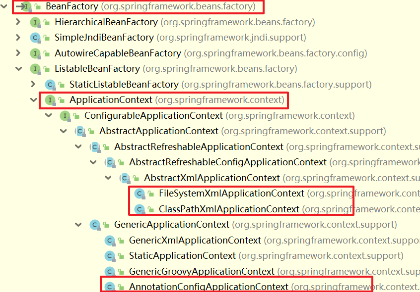
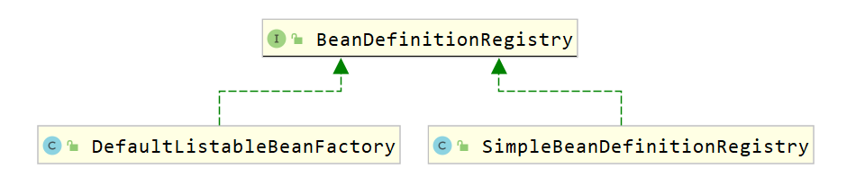

## 一、多线程

### 1.1 多线程概述

进程：进程是程序的基本执行实体

线程：线程是操作系统能够进行运算调度的最小单位，它被包含在进程中，是进程中的实际运作单元

可以简单理解为应用软件中相互独立，可以同时运行的功能，提高了程序的运行效率

只要想让多个事情同时运行就需要用到多线程，比如：

* 软件中的耗时操作
* 所有的聊天软件
* 所有的服务器


并发：在同一时刻，有多个指令在单个CPU上交替执行

并行：在同一时刻，有多个指令在多个CPU上同时执行

### 1.2 多线程的实现方式

#### 1.2.1 继承Thread类的方式实现

```java
public class MyThread1 extends Thread {
    @Override
    public void run() {
        //书写程序要执行的代码
        for (int i = 0; i < 100; i++) {
            System.out.println(getName()+"Hello World");
        }
    }
}
```

```java
public class demo1 {
    public static void main(String[] args) {
        //多线程的第一种启动方式：
        //1.自己定义一个类继承Thread
        //2.重写方法
        //3.创建子类的对象，并启动程序

        MyThread1 t1 = new MyThread1();
        MyThread1 t2 = new MyThread1();
        t1.setName("线程1：");
        t2.setName("线程2：");

        //start表示开启线程
        t1.start();
        t2.start();
    }
}
```

#### 1.2.2 实现Runnable接口的方式进行实现

```java
public class MyRun implements Runnable {
    @Override
    public void run() {
        //书写线程执行的代码
        for (int i = 0; i < 100; i++) {
            //先获取当前线程的对象
            Thread t = Thread.currentThread();
            System.out.println(t.getName()+"Hello World");
        }
    }

}
```

```java
public class demo2 {
    public static void main(String[] args) {
        //多线程的第二种启动方式：
        //1.自己定义一个类实现Runnable接口
        //2.重写里面的run方法
        //3.创建自己类的对象，
        //4.创建一个Thread类的对象，并启动线程

        //创建MyRun对象
        //表示多线程要执行的任务
        MyRun mr=new MyRun();
        //创建线程对象
        Thread t1=new Thread(mr);
        Thread t2=new Thread(mr);
        //线程设置名字
        t1.setName("线程1");
        t2.setName("线程2");

        //开启线程
        t1.start();
        t2.start();
    }

}
```

#### 1.2.3 利用Callable接口和Future接口方式实现

```java
import java.util.concurrent.Callable;

public class MyCallable implements Callable<Integer> {
    @Override
    public Integer call() throws Exception {
        //求1-100之间的和
        int sum = 0;
        for (int i = 1; i <= 100; i++) {
            sum += i;
        }
        return sum;
    }
}
```

```java
import java.util.concurrent.ExecutionException;
import java.util.concurrent.FutureTask;

public class demo3 {
    public static void main(String[] args) throws ExecutionException, InterruptedException {
        //多线程的第三种启动方式：
        //特点：可以获取到多线程执行的结果
        // 1.创建一个类MyCallable实现Callable接口
        // 2.重写call（有返回值，表示多线程运行的结果）
        //
        // 3.创建MyCallable的对象（表示多线程要执行的任务）
        // 4.创建FutureTask的对象（作用管理多线程运行的结果）
        // 5.创建Thread类的对象，并启动表示线程
        // /

        // 创建MyCallable的对象（表示多线程要执行的任务）
        MyCallable mc = new MyCallable();
        // 创建FutureTask的对象（作用管理多线程运行的结果）
        FutureTask<Integer> ft = new FutureTask<>(mc);
        // 创建Thread类的对象，并启动表示线程
        Thread thread = new Thread(ft);
        //启动线程
        thread.start();

        //获取多线程运行的结果
        Integer result = ft.get();
        System.out.println(result);
    }
}
```

#### 1.2.4 三种实现方法对比

|      | 优点 | 缺点 |
| ---- | ----  ---- | ----  ---- |
| 继承Thread类 |编程比较简单，可以直接使用Thread类中的方法|可扩展性较差，不能在继承其他的类|
| 实现Runnable接口<br>实现Callable接口 |扩展性强，实现该接口的同时还可以继承其他的类|编程相对复杂，不能直接使用Thread类中的方法|

### 1.3 常见的成员方法

| 方法名称                         | 说明                                                         |
| -------------------------------- | ------------------------------------------------------------ |
| String getName()                 | 返回此线程的名称<br>1. 如果没有给线程设置名字，线程也是有默认名字的<br>     格式：Thread-x(x序号，从0开始的) |
| void setName(String name)        | 设置姓名的名字（构造方法页可以设置名字）<br>2. 如果我们给线程设置名字，既可以用set方法进行设置，也可以通过构造方法设置 |
| static Thread currentThread()    | 获取当前线程的对象<br>3. 当JVM虚拟机启动后，会自动启动多条线程，其中有一条线程就是main线程，它的作用就是调用main方法，并执行里面的代码，以前我们写的所有代码，其实就是运行在main线程当中 |
| static void sleep(long time)     | 让线程休眠指定的时间，单位为毫秒<br>4. 哪条线程执行到这个方法，那么哪条线程就会在这里停留对应的时间 |
| setPriority(int newPriority)     | 设置线程的优先级<br>5. 线程优先级默认为5，最高为10，最低为1  |
| final int getPriority()          | 获取线程的优先级                                             |
| final void setDaemon(boolean on) | 设置为守护线程<br>6. 当其他非守护线程执行完毕后，守护线程会陆续结束（不会立马结束） |
| public static void yield()       | 出让线程/礼让线程                                            |
| public final void join()         | 插入线程/插队线程                                            |

### 1.4 线程的安全问题解决办法

#### 1.4.1 同步代码块

把操作共享数据的代码锁起来

```java
synchronized(锁对象){    //锁对象一定要是唯一的
    操作共享数据的代码
}
```

特点：

1. 锁默认打开，有一个线程进去，锁自动关闭
2. 里面的代码全部执行完毕，线程出来，锁自动打开

#### 1.4.2 同步方法

把synchronized关键字加到方法上

```java
修饰符 synchronized 返回值类型 方法名(方法参数){
    方法体
}
```

特点：

1. 同步方法是锁住方法里面的所有代码

2. 锁对象不能自己指定

   非静态方法：this

   静态方法：当前类的字节码文件对象

#### 1.4.3 Lock锁

虽然我们可以理解同步代码块和同步方法的锁对象问题，但是我们并没有直接看到在哪里加上了锁，在哪里释放了锁，所以java提供了新的锁对象Lock

Lock实现提供比使用synchronized方法和语句可以获得更广泛的碎丁操作，Lock中提供了获得锁和释放锁的方法：

```java
void lock();//获得锁
void unlock();//释放锁
```

Lock是接口不能实例化，一般采用它的实现类ReentrantLock来实例化

ReentrantLock的构造方法：

```java
ReentrantLock();//创建一个ReentrantLock的实例
```

### 1.5 生产者和消费者（等待唤醒机制）

生产者消费者是一个十分经典的多线程协作的模式

常见方法：

| 方法名称         | 说明                             |
| ---------------- | -------------------------------- |
| void wait()      | 当前线程等待，直到被其他线程唤醒 |
| void notify()    | 随机唤醒单个线程                 |
| void notifyAll() | 唤醒所有线程                     |

#### 1.5.1 代码示例

##### Cook类：

```java
package thread;

public class Cook extends Thread {
    @Override
    public void run() {
        /*
         * 1.循环
         * 2.同步代码块
         * 3.判断共享数据是否到末尾（到了末尾）
         * 4.判断共享数据是否到末尾（没到末尾，执行题目的核心逻辑）
         *
         */

        while (true) {
            synchronized (Desk.lock) {
                if (Desk.count==0){
                    break;
                }else{
                    //判断桌子上是否有食物
                    if(Desk.foodFlag==1) {
                        //如果有就等待
                        try {
                            Desk.lock.wait();
                        } catch (InterruptedException e) {
                            throw new RuntimeException(e);
                        }
                    }else {
                        //如果没有就制作食物
                        System.out.println("厨师做了一碗面条");
                        //修改桌子上的食物的状态
                        Desk.foodFlag=1;
                        //唤醒等待的消费者开吃
                        Desk.lock.notifyAll();
                    }
                }
            }
        }
    }
}
```
##### Desk类：

```java
package thread;

public class Desk {
    /*
     * 作用：控制生产者和消费者的执行
     */

    //表示桌子上是否有面条，0：表述没有面条，1：表示没有面条
    public static int foodFlag = 0;

    //总个数
    public static int count = 10;

    //锁对象
    public static final Object lock = new Object();
}
```
##### Foodie类:

```java
package thread;

public class Foodie extends Thread {
    @Override
    public void run() {
        /*
         * 1.循环
         * 2.同步代码块
         * 3.判断共享数据是否到末尾（到了末尾）
         * 4.判断共享数据是否到末尾（没到末尾，执行题目的核心逻辑）
         *
         */

        while (true) {
            synchronized (Desk.lock) {
                if (Desk.count == 0) {
                    break;
                } else {
                    //先去判断桌子上是否有面条
                    if (Desk.foodFlag == 0) {
                        //没有，等待
                        try {
                            Desk.lock.wait();//让当前线程跟锁绑定
                        } catch (InterruptedException e) {
                            e.printStackTrace();
                        }


                    } else {
                        //把吃的总数-1
                        Desk.count--;
                        //有，开吃
                        System.out.println("吃货在吃面条，还能再吃" + Desk.count + "碗!!!");
                        //吃完之后，唤醒厨师继续做
                        Desk.lock.notifyAll();//唤醒这把锁绑定的所有线程
                        //修改桌子的状态
                        Desk.foodFlag = 0;

                    }
                }
            }
        }

    }
}
```
##### 测试类：

```java
package thread;

public class demo {
    public static void main(String[] args) {
        /*
        * 需求：完成生产者和消费者（等待唤醒机制）的代码
        *      实现线程轮流交替执行的效果
         */

        //创建线程对象
        Cook c=new Cook();
        Foodie f=new Foodie();

        //给线程设置名字
        c.setName("厨师");
        c.setName("吃货");

        //开启线程
        c.start();
        f.start();
    }
}
```
#### 1.5.2 等待唤醒机制(阻塞队列实现)

##### demoFoodie类:

```java
public class demoFoodie extends Thread {

    ArrayBlockingQueue<String> queue;

    public demoFoodie(ArrayBlockingQueue<String> queue) {
        this.queue = queue;
    }

    @Override
    public void run() {
        while(true){
            //不断地从阻塞队伍当中获取面条
            try {
                String food = queue.take();
                System.out.println(food);
            } catch (InterruptedException e) {
                throw new RuntimeException(e);
            }
        }
    }
}
```

##### demoCook类:

```java
package thread;

import java.lang.reflect.Array;
import java.util.concurrent.ArrayBlockingQueue;

public class demoCook extends Thread{

    ArrayBlockingQueue<String> queue;

    public demoCook(ArrayBlockingQueue<String> queue) {
        this.queue = queue;
    }

    @Override
    public void run() {
        while(true){
            //不断地把面条放到阻塞队伍当中
            try {
                queue.put("面条");
                System.out.println("厨师放了一碗面条");
            } catch (InterruptedException e) {
                throw new RuntimeException(e);
            }
        }
    }
}
```

##### 测试类:

```java
package thread;

import java.util.concurrent.ArrayBlockingQueue;

public class demo11 {
    public static void main(String[] args) {
        /*
        * 需求:利用阻塞队伍完成生产者和消费者(等待唤醒机制)的代码
        * 细节:
        *       生产者和消费者必须使用同一个阻塞队伍
         */

        //1.创建阻塞队列的对象
        ArrayBlockingQueue<String> queue = new ArrayBlockingQueue<String>(10);

        //2.创建线程的对象,并把阻塞队列传递过去
        demoCook c=new demoCook(queue);
        demoFoodie f=new demoFoodie(queue);

        //3.开启线程
        c.start();
        f.start();
    }
}
```

### 1.6 线程的六种状态

- `NEW`	新建
  至今尚未启动的线程处于这种状态。 
- `RUNNABLE`      就绪
  正在 Java 虚拟机中执行的线程处于这种状态。 
- `BLOCKED`       阻塞
  受阻塞并等待某个监视器锁的线程处于这种状态。 
- `WAITING`         等待
  无限期地等待另一个线程来执行某一特定操作的线程处于这种状态。 
- `TIMED_WAITING`       计时等待
  等待另一个线程来执行取决于指定等待时间的操作的线程处于这种状态。 
- `TERMINATED`         死亡
  已退出的线程处于这种状态。


### 1.7 线程池

#### 1.7.1 基本概念

线程池主要核心原理:

①创建一个池子,池子中是空的

②提交任务时,池子会创建新的线程对象,任务执行完毕,线程归还池子下回提交任务时,不需要创建新的线程,直接复用已有的线程即可

③但是如果提交任务时,池子中没有空闲线程,也无法创建新的线程,任务就会排队

线程代码实现:

1. 创建线程池
2. 提交任务
3. 所有的任务全部执行完毕,关闭线程池

工具类Executors:线程池的工具类通过调用方法返回不同类型的线程池对象

| 方法名称                                                     | 说明                     |
| ------------------------------------------------------------ | ------------------------ |
| public static ExecutorService newCachedThreadPool()          | 创建一个没有上限的线程池 |
| public static ExecutorService newCachedThreadPool(int nThreads) | 创建有上限的线程池       |

#### 1.7.2 自定义线程池

```java
ThreadPoolExecutor pool=new ThreadPoolExecutor(核心线程数量,最大线程数量，空闲线程最大存活时间，事件单位，任务队列，创建线程工厂，任务的拒绝策略);
```

代码实例：

```java
ThreadPoolExecutor pool=new ThreadPoolExecutor(3,//核心线程数量
        6,//最大线程数量
        60,//空闲线程最大存活时间
        TimeUnit.SECONDS,//事件单位
        new LinkedBlockingDeque<>(3),//任务队列
        Executors.defaultThreadFactory(),//创建线程工厂
        new ThreadPoolExecutor.AbortPolicy()//任务的拒绝策略
);
```

七个重要参数：

* 核心线程数量（不能小于0）
* 线程池中的最大线程数量（最大数量>=核心线程数量）
* 空闲时间（值）（不能小于0）
* 空闲时间（单位）（用TimeUnit指定）
* 阻塞队伍（不能为null）
* 创建线程的方式（不能为null）
* 要执行的任务过多时的解决方案（不能为null）

不断地提交任务，会有三个临界点：

1. 当核心线程满时，在提交任务就会排队
2. 当核心线程满，队伍满时，会创建临时线程
3. 当核心线程满时，队伍满，临时线程满时，会触发任务拒绝策略

任务拒绝策略：

| 任务拒绝策略                          | 说明                                                   |
| ------------------------------------- | ------------------------------------------------------ |
| ThreadPoolExecuor.AbortPolicy         | 默认策略：丢弃任务并抛出RejectedExecutionException异常 |
| ThreadPoolExecuor.DiscardPolicy       | 丢弃任务，但是不抛出异常，这是不推荐的做法             |
| ThreadPoolExecuor.DiscardOldestPolicy | 抛弃队列中等待最久的任务，然后把当前任务加入队列中     |
| ThreadPoolExecuor.CallerRunPolicy     | 调用任务的run()方法绕过线程池直接执行                  |

#### 1.7.3 线程池多大合适

最大并行数：操作系统能支持地最大线程数

获取CPU的最大线程数：

```java
public class demo {
    public static void main(String[] args) {
        int count=Runtime.getRuntime().availableProcessors();
        System.out.println(count);
    }
}
```

CPU密集型运算：最大并行数+1

I/O密集型计算：最大并行数 * 期望CPU利用率 * （CPU计算时间+等待时间） / CPU计算时间


## 二、网络编程

### 2.1 初始网络编程

在网络通信协议上，不同计算机上运行的程序，进行的数据传输

**java中可以使用java.net包下的技术轻松开发出常见的网络应用程序**

常见的软件架构：

C/S：Client/Server（客户端/服务端）

在用户本地需要下载并安装用户端程序，在远程有一个服务器端程序

B/S：Browser/Server（浏览器/服务端）

只需要一个浏览器，用户通过不同的地址。客户访问不同的服务器

### 2.2 网络编程三要素

#### 2.2.1 IP

设备在网络中的地址，是唯一的标识

全称：Internet Protocol，是互联网协议地址，也称IP地址，是分配给上网设备的数字标签

分类：

1. IPv4：互联网通信协议第四版

   采用32位地址长度，分成4组

   IPv4的地址分类形式：

   * 公网地址（万维网使用）和私有地址（局域网使用）
   * 192.168.开头的就是私有地址，范围即位192.168.0.0-192.168.255.255，专门为组织机构内部使用，以此节省IP

   特殊IP地址：127.0.0.1，也可以是localhost：是回送地址也称本地回环地址，也称本地IP，永远只会寻找当前所在主机

2. IPv6：互联网通信协议第六版

   采用128为地址长度，分成8组

InetAddress类的使用

| 常用方法                                  | 描述                                                         |
| ----------------------------------------- | ------------------------------------------------------------ |
| static InetAddress getByName(String host) | 确定本地名称的IP地址，主机名称可以是机器名称，也可以是IP地址 |
| String getHostName()                      | 获取此IP地址的主机名                                         |
| String getHostAddress                     | 返回文本显示中的IP地址字符串                                 |

特殊IP地址：

127.0.0.1，也可以是localhost:是回送地址也成本地回环地址，也称本机IP，永远只会寻找当前所在本机

```java
public class Demo1 {

    public static void main(String[] args) throws UnknownHostException {
        // address表示ip的对象 一台电脑的对象
        InetAddress address = InetAddress.getByName("chen");
        System.out.println(address);

        System.out.println(address.getHostName());
        String hostAddress = address.getHostAddress();
        System.out.println(hostAddress);
    }
}
```

#### 2.2.2 端口号

应用程序在设备中唯一的标识

端口号：由两个字节表示的整数，取值名称：0-65535，其中0-1023之间的端口号用于一些知名的网络服务或者应用

一个端口号只能被一个应用程序使用

#### 2.2.3 协议

数据在网络中传输的规则，常见的协议有UDP、TCP、http、https、ftp

计算机网络中，连接和通信的规则被称为网络通信协议

* OSI参考模型：世界互联协议标准，全球通信规范，单模型过于理想化，未能在因特网上进行广泛推广
* TCP/IP参考模型：事实上的国际标准

UDP协议：

* 用户数据报协议（User Datagram Protocol）

* UDP是面向无连接通信协议

  速度快，有大小限制一次最多发送64K，数据不安全，易丢失数据

TCP协议：

- 传输控制协议（Transmission Control Protocol）

- TCP是面向连接通信协议

  速度慢，没有大小限制，数据安全

### 2.3 UDP协议

#### 2.3.1 发送数据

1. 创建发送端的DatagramSocket对象
2. 数据打包（DatagramPacket）
3. 发送数据
4. 释放数据

```java
import java.io.IOException;
import java.net.*;

public class demo {
    public static void main(String[] args) throws IOException {
        //发送数据：
        
        //1. 创建发送端的DatagramSocket对象
        //细节：
        //绑定端口：以后我们就是通过这个端口往外发送
        //空参：所有可用的端口中随机一个进行使用
        //有参：指定端口进行绑定
        DatagramSocket ds=new DatagramSocket();

        //2. 数据打包（DatagramPacket）
        String str="Hello World";
        byte[] bytes = str.getBytes();
        InetAddress address = InetAddress.getByName("127.0.0.1");
        int port=10086;

        DatagramPacket dp=new DatagramPacket(bytes,bytes.length,address,port);

        //3. 发送数据
        ds.send(dp);

        //4. 释放数据
        ds.close();
    }
}
```

#### 2.3.2 接收数据

1. 创建接收端的DatagramSocket对象
2. 接收打包好的数据（DatagramPacket）
3. 解析数据包
4. 释放数据

```java
import java.io.IOException;
import java.net.DatagramPacket;
import java.net.DatagramSocket;
import java.net.InetAddress;

public class demo3 {
    public static void main(String[] args) throws IOException {
//         接收数据
//        1. 创建接收端的DatagramSocket对象
        //细节:
        // 在接受数据的时候,一定要绑定端口
        // 接收绑定的端口,一定要跟发送的端口保持一致
        DatagramSocket ds = new DatagramSocket(10086);
//        2. 接收打包好的数据（DatagramPacket）
        byte[] bytes = new byte[1024];
        DatagramPacket dp = new DatagramPacket(bytes, bytes.length);
        
        //该方法是阻塞的，
        //程序执行到这一步的时候，会在这里死等
        //等发送端发送消息
        ds.receive(dp);

//        3. 解析数据包
        byte[] data = dp.getData();
        int length = dp.getLength();
        InetAddress address = dp.getAddress();
        int port = dp.getPort();

        System.out.println("接收到的数据:" + new String(data, 0, length));
        System.out.println("该数据是从:" + address + "这台电脑中的" + port + "这个端口发出的");
//        4. 释放数据
        ds.close();

    }
}
```

```执行结果
接收到的数据:Hello World
该数据是从:/127.0.0.1这台电脑中的56794这个端口发出的
```

#### 2.3.3 UDP练习（聊天室）

要求：

UDP发送数据：数据来自于键盘录入，直到输入的数据为886，发送数据结束

UDP接收数据：因为接收端不知道发送端什么时候停止发送，故采用死循环接收

```java
public class SendMessage {
    public static void main(String[] args) throws IOException {
        //发送端

        DatagramSocket ds = new DatagramSocket();

        Scanner sc = new Scanner(System.in);

        while (true) {
            System.out.println("请输入您要说的话:");
            String str = sc.nextLine();
            if("886".equals(str)) {
                break;
            }
            byte[] bytes = str.getBytes();

            InetAddress address = InetAddress.getByName("127.0.0.1");

            int port = 10086;
            DatagramPacket dp = new DatagramPacket(bytes, bytes.length, address, port);

            ds.send(dp);
        }


        ds.close();
    }
}
```

```java
public class ReceiveMessage {
    public static void main(String[] args) throws IOException {
        //接收端

        DatagramSocket ds = new DatagramSocket(10086);

        DatagramPacket dp = new DatagramPacket(new byte[1024], 1024);
        while (true) {
            ds.receive(dp);

            //解析数据包
            byte[] data = dp.getData();
            int len = dp.getLength();
            String ip = dp.getAddress().getHostAddress();
            String name = dp.getAddress().getHostName();
            int port = dp.getPort();

            System.out.println("ip为:" + ip + ",主机名为:" + name + ",端口名为:" + port + "的人" +
                    ",发送了的数据:" + new String(data, 0, len));
        }
    }
}
```

#### 2.3.4 UDP的三种通信方式

1. 单播：以前的代码就是单播

2. 组播：向局域网下的一组电脑发送数据

   组播地址：224.0.0.0-239.255.255.255，其中224.0.0.0-224.0.0.255为预留的组播地址

3. 广播：向所有电脑发送数据

   广播地址：255.255.255.255

### 2.4 TCP通信协议

TCP通信协议是一种可靠的网络协议，它在通信的两端各建立一个Socket对象

通信之前要保证连接已建立

通过Socket产生IO流来进行网络通信

#### 2.4.1 客户端发送数据

1. 创建客户端的Socket对象（Socket）与指定服务端连接

   `Socket(String host,int port)`

2. 获取输出流，写数据

   `OutputStream getOutputStream()`

3. 释放资源

   `void close()` 

```java
public class Client {
    public static void main(String[] args) throws IOException {
        //在创建对象的同时会连接服务器,如果连接不上,代码会报错
        Socket socket = new Socket("127.0.0.1",10086);

        OutputStream os = socket.getOutputStream();
        os.write("高鑫".getBytes());

        os.close();
        socket.close();
    }
}
```

#### 2.4.2 服务器接收数据

1. 创建服务器端的Socket对象（ServerSocket）

   `ServerSocket(int port)`

2. 监听客户端连接，返回一个Socket对象

   `Socket accept()`

3. 获取输入流，读数据，并把数据显示在控制台上

   `InputStream getInputStream()`

4. 释放资源

   `void close()` 

```java
public class Server {
    public static void main(String[] args) throws IOException {
        ServerSocket ss = new ServerSocket(10086);

        Socket socket = ss.accept();

        InputStream is = socket.getInputStream();
        InputStreamReader isr = new InputStreamReader(is);
        BufferedReader br = new BufferedReader(isr);

        int b;
        while ((b = br.read()) != -1) {
            System.out.print((char) b);
        }

        socket.close();
        ss.close();

    }
}
```

#### 2.4.3 三次握手与四次挥手

ICMP协议

三次握手：确保连接建立

四次挥手：确保连接断开，且数据处理完毕


## 三、反射

反射允许对成员变量，成员方法和构造方法的信息进行编程访问(获取/解剖)

### 3.1 获取class对象的三种方式

* Class.forName("全类名") 源代码阶段
* 类名.class 加载阶段
* 对象.getClass(); 运行阶段

```java
public class demo1 {
    public static void main(String[] args) throws ClassNotFoundException {
        // 1.第一种方式---最为常用的
        // 要写全类名：包名+类名
        Class<?> clazz1 = Class.forName("reflect.Student");
        // 打印
        System.out.println(clazz1);
        //结果：class reflect.Student

        // 2.第二种方式---一般更多的是当作参数进行传递
        Class<Student> clazz2 = Student.class;
        System.out.println(clazz1 == clazz2);
        //结果：true

        // 3.第三种方式---当我们已经有了这个类的对象时，才可以使用
        Student s=new Student();
        Class<? extends Student> clazz3 = s.getClass();
        System.out.println(clazz1 == clazz3);
        //结果：true
    }
}
```

### 3.2 反射获取构造方法

Class类中用于获取构造方法的方法：

| 方法                                                         | 描述                           |
| ------------------------------------------------------------ | ------------------------------ |
| Constuctor<?>[] getConstructors()                            | 返回所有公共构造方法对象的数组 |
| Constuctor<?>[] getDeclaredConstructors()                    | 返回所有构造方法对象的数组     |
| Constuctor<?>[] getConstructors(Class<?>...parameterTypes)   | 返回单个公共构造方法对象       |
| Constuctor<?>[] getDeclaredConstructor(Class<?>...parameterTypes) | 返回单个构造方法对象           |

Constructor类中用于创建对象的方法：

| 方法                             | 描述                                    |
| -------------------------------- | --------------------------------------- |
| T newInstance(Object...initargs) | 根据指定的构造方法创建对象              |
| setAccessible(boolean flag)      | 暴力反射，flag=true时，临时取消权限检验 |

```java
package web.reflect;

import java.lang.reflect.Constructor;
import java.lang.reflect.InvocationTargetException;
import java.util.Arrays;

/**
 * 反射演示类，用于展示如何获取和使用类的构造器信息
 */
public class Demo2 {

    /**
     * 主方法，演示反射获取构造器信息和实例化对象
     * @param args 命令行参数
     * @throws ClassNotFoundException 当指定的类未找到时抛出
     * @throws NoSuchMethodException 当指定的方法未找到时抛出
     * @throws InvocationTargetException 当目标方法抛出异常时抛出
     * @throws InstantiationException 当尝试创建抽象类或接口的实例时抛出
     * @throws IllegalAccessException 当访问控制阻止访问时抛出
     */
    public static void main(String[] args) throws ClassNotFoundException, NoSuchMethodException, InvocationTargetException, InstantiationException, IllegalAccessException {
        // 加载Student类
        Class<?> clazz = Class.forName("web.reflect.Student");
        
        // 获取所有公共构造器
        Constructor<?>[] cons1 = clazz.getConstructors();
        for (Constructor<?> con : cons1) {
            System.out.println(con);
        }
        
        // 分隔符
        System.out.println("------------------------");
        
        // 获取所有声明的构造器，包括公共、保护、默认和私有构造器
        Constructor<?>[] cons2 = clazz.getDeclaredConstructors();
        for (Constructor<?> con : cons2) {
            System.out.println(con);
        }
        
        // 分隔符
        System.out.println("------------------------");
        
        // 获取无参数的公共构造器
        Constructor<?> con1 = clazz.getConstructor();
        System.out.println(con1);
        
        // 分隔符
        System.out.println("------------------------");
        
        // 获取一个参数的构造器，参数为String类型
        Constructor<?> con2 = clazz.getDeclaredConstructor(String.class);
        System.out.println(con2);
        
        // 分隔符
        System.out.println("------------------------");
        
        // 获取两个参数的构造器，参数为String和int类型
        Constructor<?> con3 = clazz.getDeclaredConstructor(String.class, int.class);
        // 打印构造器的名称
        System.out.println(con3.getName());
        // 打印构造器的修饰符
        System.out.println(con3.getModifiers());
        // 打印构造器的参数列表
        System.out.println(Arrays.toString(con3.getParameters()));
        // 打印构造器的参数类型列表
        System.out.println(Arrays.toString(con3.getParameterTypes()));
        
        // 设置构造器可访问，即使它是私有的
        con3.setAccessible(true);
        
        // 使用反射调用构造器创建Student实例
        Student stu = (Student) con3.newInstance("高鑫", 12);
        // 打印创建的Student实例
        System.out.println(stu);
    }
}

```


### 3.3 反射获取构造成员变量

Class类中用于获取成员变量的方法：

| 方法                                  | 描述                           |
| ------------------------------------- | ------------------------------ |
| Field[] getFields()                   | 返回所有公共成员变量对象的数组 |
| Field[] getDeclaredFields()           | 返回所有成员变量对象的数组     |
| Field[] getField(String name)         | 返回单个公共成员变量对象       |
| Field[] getDeclaredField(String name) | 返回单个成员变量对象           |

Field类中用于创建对象的方法：

| 方法                              | 描述   |
| --------------------------------- | ------ |
| void set(Object obj,Object value) | 赋值   |
| Object get(Object obj)            | 获取值 |

````java
package web.reflect;

import java.lang.reflect.Field;

public class Demo3 {

    public static void main(String[] args) throws ClassNotFoundException, NoSuchFieldException, IllegalAccessException {
        Class<?> clazz = Class.forName("web.reflect.Student");
        Field[] fields1 = clazz.getFields();
        for (Field field : fields1) {
            System.out.println(field);
        }
        System.out.println("------------------------");
        Field[] fields2 = clazz.getDeclaredFields();
        for (Field field : fields2) {
            System.out.println(field);
        }
        System.out.println("---------------------------");
        System.out.println(clazz.getField("grade"));
        System.out.println(clazz.getDeclaredField("name"));
        Field tel = clazz.getDeclaredField("tel");
        System.out.println(tel);
        System.out.println("------------------------------");
        System.out.println(tel.getModifiers());
        System.out.println(tel.getType());
        Student stu = new Student("高鑫", 12,90,"wuhan","7572572414");
        tel.setAccessible(true);
        System.out.println(tel.get(stu));
        tel.set(stu, "15349840569");
        System.out.println(stu.getTel());
    }
}

````


### 3.4 反射获取成员方法

Class类中用于获取成员方法的方法：

| 方法                                                         | 描述                                         |
| ------------------------------------------------------------ | -------------------------------------------- |
| Method[] getMethod()                                         | 返回所有的公共成员方法对象的数组，包含继承的 |
| Method[] getDeclaredMethod()                                 | 返回所有的成员方法对象的数组，不包含继承的   |
| Method[] getMethod(String name,Class<?>... parameterTypes)   | 返回单个公共成员方法对象                     |
| Method[] getMethod(String name,Class<?>...     parameterTypes) | 返回单个成员方法对象                         |

Method类中用于创建对象的方法：

`Object invoke(Object obj,Object...args)`:运行方法

参数一：用obj对象调用该方法

参数二：调用方法的传递的参数（如果没有就不写）

返回值：方法的返回值（如果没有就不写）

```java
import java.lang.reflect.InvocationTargetException;
import java.lang.reflect.Method;
import java.util.Arrays;

public class Demo4 {

    public static void main(String[] args) throws ClassNotFoundException, NoSuchMethodException, InvocationTargetException, IllegalAccessException {
        Class<?> clazz = Class.forName("web.reflect.Student");
        Method[] methods = clazz.getMethods();
        for (Method method : methods) {
            System.out.println(method);
        }
        System.out.println("------------------------");
        Method eat = clazz.getDeclaredMethod("eat",String.class);
        System.out.println(eat);
        System.out.println(eat.getName());
        System.out.println(Arrays.toString(eat.getParameters()));
        System.out.println(eat.getModifiers());
        System.out.println(Arrays.toString(eat.getExceptionTypes()));
        System.out.println("------------------------");
        eat.setAccessible(true);
        Student s = new Student();
        Object res = eat.invoke(s, "pizza");
        System.out.println(res.toString());
    }
}

```


### 3.5 反射的作用

* 获取一个类里面的所有信息，获取到了之后，在执行其他业务逻辑
* 结合配置文件，动态的创建对象并调用方法

#### 常见单词

| 单词        | 意思     | 单词      | 意思   |
| ----------- | -------- | --------- | ------ |
| get         | 获取     | set       | 设置   |
| Constructor | 构造方法 | Parameter | 参数   |
| Field       | 成员变量 | Modifiers | 修饰符 |
| Method      | 方法     | Declared  | 私有的 |

#### 3.5.1 综合练习（保存任意对象数据）

对于任意一个对象，都可以把对象所有的字段名和值，保存到文件中

```java
package reflect;

import java.io.BufferedWriter;
import java.io.FileWriter;
import java.io.IOException;
import java.lang.reflect.Field;

public class demo3 {
    public static void main(String[] args) throws IllegalAccessException, IOException {
        Student s = new Student("小A", 23, '女', 167.5, "睡觉");
        Teacher t = new Teacher("波妞", 10000);

        saveObject(s);
    }

    // 对于任意一个对象，都可以把对象所有的字段名和值，保存到文件中
    public static void saveObject(Object obj) throws IllegalAccessException, IOException {
        //1.获取字节码文件的对象
        Class<?> clazz = obj.getClass();

        //创建IO流
        BufferedWriter bw=new BufferedWriter(new FileWriter("a.txt"));

        //2.获取所有的成员变量
        Field[] fields = clazz.getDeclaredFields();
        for (Field f : fields) {
            f.setAccessible(true);
            //获取成员变量的名字
            String name = f.getName();
            //获取成员变量的值
            Object value = f.get(obj);
            bw.write(name+"="+value);
            bw.newLine();
        }

        bw.close();
    }
}
```

a.txt中如下：

```txt
name=小A
age=23
gender=女
height=167.5
hobby=睡觉
```

#### 3.5.2 综合练习（跟配置文件结合动态创建）

反射可以跟配置文件结合的方式，动态的创建对象，并调用方法

```properties
classname=reflect.Student1
method=study
```

```java
package reflect;

import java.io.FileInputStream;
import java.io.IOException;
import java.lang.reflect.Constructor;
import java.lang.reflect.InvocationTargetException;
import java.lang.reflect.Method;
import java.util.Properties;

public class demo4 {
    public static void main(String[] args) throws IOException, ClassNotFoundException, NoSuchMethodException, InvocationTargetException, InstantiationException, IllegalAccessException {
        //1.读取配置文件中的信息
        Properties prop = new Properties();
        FileInputStream fis = new FileInputStream("src\\prop.properties");
        prop.load(fis);
        System.out.println(prop);
        //结果：{classname=reflect.Student1, method=study}

        //2.获取全类名和方法名
        String className = (String) prop.get("classname");
        String methodName = (String) prop.get("method");

        System.out.println(className);
        System.out.println(methodName);
        //结果：reflect.Student1
        //结果：study


        //3.利用反射创建对象并运行方法
        Class<?> clazz = Class.forName(className);

        //获取构造方法
        Constructor<?> con = clazz.getDeclaredConstructor();
        Object o = con.newInstance();
        System.out.println(o);
        //结果：Student1{name='null', age=0}


        //获取成员方法并运行
        Method method=clazz.getDeclaredMethod(methodName);
        method.setAccessible(true);
        method.invoke(o);
        //结果：学生在学习！

    }
}
```

## 四、动态代理

### 4.1 动态代理的思想分析

特点：无侵入式的给代码增加额外的功能

程序需要代理的原因：对象如果身上的事太多，可以通过代理来转移部分职责

代理的样子：对象有什么方法想被代理，代理就一定要有对应的方法

Java通过接口保证代理的样子，后面的对象和代理需要实现同一个接口，接口中就是被代理的所有方法

### 4.2 动态代理的代码实现

java.lang.reflect.Proxy类：提供了为对象产生代理的方法：

```java
public static Object newProxyInstance(classLoader loader,Class<?>[] interfaces,InvocationHandler h)
//参数一：用于指定用于哪个类加载器，去加载生成的代理类
//参数二：指定接口，这些接口用于指定生成的代理长什么样，也就是有哪些方法
//参数三：用来指定生成的代理对象要干什么事情
```

**明星经纪人案例实现**：

Star接口：

```java
package dynamicproxy;

public interface Star {
    //唱歌
    public abstract String sing(String name);
    //跳舞
    public abstract void dance();
}
```

BigStar:

```java
package dynamicproxy;

public class BigStar implements Star{
    private String name;
    public BigStar(){

    }

    public BigStar(String name) {
        this.name = name;
    }

    public String getName() {
        return name;
    }

    public void setName(String name) {
        this.name = name;
    }

    @Override
    public String toString() {
        return "BigStar{" +
                "name='" + name + '\'' +
                '}';
    }

    @Override
    public String sing(String name) {
        System.out.println(this.name+"正在唱"+name);
        return "谢谢";
    }

    @Override
    public void dance() {
        System.out.println(this.name+"正在跳舞");
    }
}
```

代理人对象：

```java
package dynamicproxy;

/*
 * 类的作用：
 *      就是创建一个代理
 */

import java.lang.reflect.InvocationHandler;
import java.lang.reflect.Method;
import java.lang.reflect.Proxy;

public class ProxyUtil {
    /*
     * 方法的作用：
     *       就是给明星对象，创建一个代理
     * 形参：
     *       就是被代理的明星对象
     * 返回值：
     *       给明星创建的代理
     * 需求：
     *       外面的人想要大明星唱歌
     * 1.获取代理的对象
     *          代理对象=ProxyUtil.createProxy(大明星的对象)
     * 2.在调用代理的唱歌方法
     *          代理对象.唱歌方法()
     */
    public static Star createProxy(BigStar bigStar) {
        //public static Object newProxyInstance(classLoader loader,Class<?>[] interfaces,InvocationHandler h)

        Star star = (Star) Proxy.newProxyInstance(
                ProxyUtil.class.getClassLoader(),//参数一：用于指定用于哪个类加载器，去加载生成的代理类
                new Class[]{Star.class},//参数二：指定接口，这些接口用于指定生成的代理长什么样，也就是有哪些方法
                new InvocationHandler() {//参数三：用来指定生成的代理对象要干什么事情
                    @Override
                    public Object invoke(Object proxy, Method method, Object[] args) throws Throwable {
                        /*
                        * 参数一：代理的对象
                        * 参数二：要运行的方法 sing
                        * 参数三：调用sing方法时，传递的实参
                         */
                        if("sing".equals(method.getName())){
                            System.out.println("准备话筒，收钱");
                        }else if("dance".equals(method.getName())){
                            System.out.println("准备场地，收钱");
                        }
                        //代码的表现形式：调用大明星里面的唱歌或者跳舞的方法
                        return  method.invoke(bigStar, args);
                    }
                });
        return star;
    }
}
```

测试类：

```java
package dynamicproxy;

public class Test {
    public static void main(String[] args) {
//              需求：
//            外面的人想要大明星唱歌
//            1.获取代理的对象
//              代理对象=ProxyUtil.createProxy(大明星的对象)
//            2.在调用代理的唱歌方法
//              代理对象.唱歌方法()

        BigStar bigStar = new BigStar("鸡哥");
        Star proxy = ProxyUtil.createProxy(bigStar);

        System.out.println(proxy.sing("只因你太美"));
        System.out.println("========================");
        proxy.dance();
    }
}
```


## 五、自定义Spring框架

### 5.1 spring使用回顾

自定义spring框架前，先回顾一下spring框架的使用，从而分析spring的核心，并对核心功能进行模拟。

- 数据访问层。定义UserDao接口及其子实现类

  ```java
  public interface UserDao {
      public void add();
  }

  public class UserDaoImpl implements UserDao {

      public void add() {
          System.out.println("userDaoImpl ....");
      }
  }
  ```

- 业务逻辑层。定义UserService接口及其子实现类

  ```java
  public interface UserService {
      public void add();
  }

  public class UserServiceImpl implements UserService {

      private UserDao userDao;

      public void setUserDao(UserDao userDao) {
          this.userDao = userDao;
      }

      public void add() {
          System.out.println("userServiceImpl ...");
          userDao.add();
      }
  }
  ```

- 定义UserController类，使用main方法模拟controller层

  ```java
  public class UserController {
      public static void main(String[] args) {
          //创建spring容器对象
          ApplicationContext applicationContext = new ClassPathXmlApplicationContext("applicationContext.xml");
          //从IOC容器中获取UserService对象
          UserService userService = applicationContext.getBean("userService", UserService.class);
          //调用UserService对象的add方法
          userService.add();
      }
  }
  ```

- 编写配置文件。在类路径下编写一个名为ApplicationContext.xml的配置文件

  ```java
  <?xml version="1.0" encoding="UTF-8"?>
  <beans xmlns:xsi="http://www.w3.org/2001/XMLSchema-instance"
         xmlns="http://www.springframework.org/schema/beans"
         xmlns:context="http://www.springframework.org/schema/context"
         xsi:schemaLocation="http://www.springframework.org/schema/beans
          http://www.springframework.org/schema/beans/spring-beans.xsd
          http://www.springframework.org/schema/context
          http://www.springframework.org/schema/context/spring-context.xsd">

      <bean id="userService" class="com.itheima.service.impl.UserServiceImpl">
          <property name="userDao" ref="userDao"></property>
      </bean>

      <bean id="userDao" class="com.itheima.dao.impl.UserDaoImpl"></bean>

  </beans>
  ```

  代码运行结果如下：

  

通过上面代码及结果可以看出：

- userService对象是从applicationContext容器对象获取到的，也就是userService对象交由spring进行管理。
- 上面结果可以看到调用了UserDao对象中的add方法，也就是说UserDao子实现类对象也交由spring管理了。
- UserService中的userDao变量我们并没有进行赋值，但是可以正常使用，说明spring已经将UserDao对象赋值给了userDao变量。

上面三点体现了Spring框架的IOC（Inversion of Control）和DI（Dependency Injection, DI）

### 5.2 spring核心功能结构

Spring大约有20个模块，由1300多个不同的文件构成。这些模块可以分为:

核心容器、AOP和设备支持、数据访问与集成、Web组件、通信报文和集成测试等，下面是 Spring 框架的总体架构图：


核心容器由 beans、core、context 和 expression（Spring Expression Language，SpEL）4个模块组成。

- spring-beans和spring-core模块是Spring框架的核心模块，包含了控制反转（Inversion of Control，IOC）和依赖注入（Dependency Injection，DI）。BeanFactory使用控制反转对应用程序的配置和依赖性规范与实际的应用程序代码进行了分离。BeanFactory属于延时加载，也就是说在实例化容器对象后并不会自动实例化Bean，只有当Bean被使用时，BeanFactory才会对该 Bean 进行实例化与依赖关系的装配。
- spring-context模块构架于核心模块之上，扩展了BeanFactory，为它添加了Bean生命周期控制、框架事件体系及资源加载透明化等功能。此外，该模块还提供了许多企业级支持，如邮件访问、远程访问、任务调度等，ApplicationContext 是该模块的核心接口，它的超类是 BeanFactory。与BeanFactory不同，ApplicationContext实例化后会自动对所有的单实例Bean进行实例化与依赖关系的装配，使之处于待用状态。
- spring-context-support模块是对Spring IoC容器及IoC子容器的扩展支持。
- spring-context-indexer模块是Spring的类管理组件和Classpath扫描组件。
- spring-expression 模块是统一表达式语言（EL）的扩展模块，可以查询、管理运行中的对象，同时也可以方便地调用对象方法，以及操作数组、集合等。它的语法类似于传统EL，但提供了额外的功能，最出色的要数函数调用和简单字符串的模板函数。EL的特性是基于Spring产品的需求而设计的，可以非常方便地同Spring IoC进行交互。

#### 5.1.1 bean概述

Spring 就是面向 `Bean` 的编程（BOP,Bean Oriented Programming），Bean 在 Spring 中处于核心地位。Bean对于Spring的意义就像Object对于OOP的意义一样，Spring中没有Bean也就没有Spring存在的意义。Spring IoC容器通过配置文件或者注解的方式来管理bean对象之间的依赖关系。

spring中bean用于对一个类进行封装。如下面的配置：

```xml
<bean id="userService" class="com.itheima.service.impl.UserServiceImpl">
    <property name="userDao" ref="userDao"></property>
</bean>
<bean id="userDao" class="com.itheima.dao.impl.UserDaoImpl"></bean>
```

为什么Bean如此重要呢？

- spring 将bean对象交由一个叫IOC容器进行管理。
- bean对象之间的依赖关系在配置文件中体现，并由spring完成。

### 5.3 Spring IOC相关接口分析

#### 5.3.1 BeanFactory解析

Spring中Bean的创建是典型的工厂模式，这一系列的Bean工厂，即IoC容器，为开发者管理对象之间的依赖关系提供了很多便利和基础服务，在Spring中有许多IoC容器的实现供用户选择，其相互关系如下图所示。


其中，BeanFactory作为最顶层的一个接口，定义了IoC容器的基本功能规范，BeanFactory有三个重要的子接口：ListableBeanFactory、HierarchicalBeanFactory和AutowireCapableBeanFactory。但是从类图中我们可以发现最终的默认实现类是DefaultListableBeanFactory，它实现了所有的接口。

那么为何要定义这么多层次的接口呢？

每个接口都有它的使用场合，主要是为了区分在Spring内部操作过程中对象的传递和转化，对对象的数据访问所做的限制。例如，

- ListableBeanFactory接口表示这些Bean可列表化。
- HierarchicalBeanFactory表示这些Bean是有继承关系的，也就是每个Bean 可能有父 Bean
- AutowireCapableBeanFactory 接口定义Bean的自动装配规则。

这三个接口共同定义了Bean的集合、Bean之间的关系及Bean行为。最基本的IoC容器接口是BeanFactory，来看一下它的源码：

```java
public interface BeanFactory {

	String FACTORY_BEAN_PREFIX = "&";

	//根据bean的名称获取IOC容器中的的bean对象
	Object getBean(String name) throws BeansException;
	//根据bean的名称获取IOC容器中的的bean对象，并指定获取到的bean对象的类型，这样我们使用时就不需要进行类型强转了
	<T> T getBean(String name, Class<T> requiredType) throws BeansException;
	Object getBean(String name, Object... args) throws BeansException;
	<T> T getBean(Class<T> requiredType) throws BeansException;
	<T> T getBean(Class<T> requiredType, Object... args) throws BeansException;
	
	<T> ObjectProvider<T> getBeanProvider(Class<T> requiredType);
	<T> ObjectProvider<T> getBeanProvider(ResolvableType requiredType);

	//判断容器中是否包含指定名称的bean对象
	boolean containsBean(String name);
	//根据bean的名称判断是否是单例
	boolean isSingleton(String name) throws NoSuchBeanDefinitionException;
	boolean isPrototype(String name) throws NoSuchBeanDefinitionException;
	boolean isTypeMatch(String name, ResolvableType typeToMatch) throws NoSuchBeanDefinitionException;
	boolean isTypeMatch(String name, Class<?> typeToMatch) throws NoSuchBeanDefinitionException;
	@Nullable
	Class<?> getType(String name) throws NoSuchBeanDefinitionException;
	String[] getAliases(String name);
}
```

在BeanFactory里只对IoC容器的基本行为做了定义，根本不关心你的Bean是如何定义及怎样加载的。正如我们只关心能从工厂里得到什么产品，不关心工厂是怎么生产这些产品的。

BeanFactory有一个很重要的子接口，就是ApplicationContext接口，该接口主要来规范容器中的bean对象是非延时加载，即在创建容器对象的时候就对象bean进行初始化，并存储到一个容器中。



要知道工厂是如何产生对象的，我们需要看具体的IoC容器实现，Spring提供了许多IoC容器实现，比如：

- ClasspathXmlApplicationContext : 根据类路径加载xml配置文件，并创建IOC容器对象。
- FileSystemXmlApplicationContext ：根据系统路径加载xml配置文件，并创建IOC容器对象。
- AnnotationConfigApplicationContext ：加载注解类配置，并创建IOC容器。

#### 5.3.2 BeanDefinition解析

Spring IoC容器管理我们定义的各种Bean对象及其相互关系，而Bean对象在Spring实现中是以BeanDefinition来描述的，如下面配置文件

```xml
<bean id="userDao" class="com.itheima.dao.impl.UserDaoImpl"></bean>

bean标签还有很多属性：
	scope、init-method、destory-method等。
```

其继承体系如下图所示。


#### 5.3.3 BeanDefinitionReader解析

Bean的解析过程非常复杂，功能被分得很细，因为这里需要被扩展的地方很多，必须保证足够的灵活性，以应对可能的变化。Bean的解析主要就是对Spring配置文件的解析。这个解析过程主要通过BeanDefinitionReader来完成，看看Spring中BeanDefinitionReader的类结构图，如下图所示。


看看BeanDefinitionReader接口定义的功能来理解它具体的作用：

```java
public interface BeanDefinitionReader {

	//获取BeanDefinitionRegistry注册器对象
	BeanDefinitionRegistry getRegistry();

	@Nullable
	ResourceLoader getResourceLoader();

	@Nullable
	ClassLoader getBeanClassLoader();

	BeanNameGenerator getBeanNameGenerator();

	/*
		下面的loadBeanDefinitions都是加载bean定义，从指定的资源中
	*/
	int loadBeanDefinitions(Resource resource) throws BeanDefinitionStoreException;
	int loadBeanDefinitions(Resource... resources) throws BeanDefinitionStoreException;
	int loadBeanDefinitions(String location) throws BeanDefinitionStoreException;
	int loadBeanDefinitions(String... locations) throws BeanDefinitionStoreException;
}
```


#### 5.3.4 BeanDefinitionRegistry解析

BeanDefinitionReader用来解析bean定义，并封装BeanDefinition对象，而我们定义的配置文件中定义了很多bean标签，所以就有一个问题，解析的BeanDefinition对象存储到哪儿？答案就是BeanDefinition的注册中心，而该注册中心顶层接口就是BeanDefinitionRegistry。

```java
public interface BeanDefinitionRegistry extends AliasRegistry {

	//往注册表中注册bean
	void registerBeanDefinition(String beanName, BeanDefinition beanDefinition)
			throws BeanDefinitionStoreException;

	//从注册表中删除指定名称的bean
	void removeBeanDefinition(String beanName) throws NoSuchBeanDefinitionException;

	//获取注册表中指定名称的bean
	BeanDefinition getBeanDefinition(String beanName) throws NoSuchBeanDefinitionException;
    
	//判断注册表中是否已经注册了指定名称的bean
	boolean containsBeanDefinition(String beanName);
    
	//获取注册表中所有的bean的名称
	String[] getBeanDefinitionNames();
    
	int getBeanDefinitionCount();
	boolean isBeanNameInUse(String beanName);
}
```

继承结构图如下：



从上面类图可以看到BeanDefinitionRegistry接口的子实现类主要有以下几个：

- DefaultListableBeanFactory

  在该类中定义了如下代码，就是用来注册bean

  ```java
  private final Map<String, BeanDefinition> beanDefinitionMap = new ConcurrentHashMap<>(256);
  ```

- SimpleBeanDefinitionRegistry

  在该类中定义了如下代码，就是用来注册bean

  ```java
  private final Map<String, BeanDefinition> beanDefinitionMap = new ConcurrentHashMap<>(64);
  ```

#### 5.3.5 创建容器

ClassPathXmlApplicationContext对Bean配置资源的载入是从refresh（）方法开始的。refresh（）方法是一个模板方法，规定了 IoC 容器的启动流程，有些逻辑要交给其子类实现。它对 Bean 配置资源进行载入，ClassPathXmlApplicationContext通过调用其父类AbstractApplicationContext的refresh（）方法启动整个IoC容器对Bean定义的载入过程。

### 5.4 自定义SpringIOC

现要对下面的配置文件进行解析，并自定义Spring框架的IOC对涉及到的对象进行管理。

```xml
<?xml version="1.0" encoding="UTF-8"?>
<beans>
    <bean id="userService" class="com.itheima.service.impl.UserServiceImpl">
        <property name="userDao" ref="userDao"></property>
    </bean>
    <bean id="userDao" class="com.itheima.dao.impl.UserDaoImpl"></bean>
</beans>
```

#### 5.4.1 定义bean相关的pojo类

##### 5.4.1.1 PropertyValue类

用于封装bean的属性，体现到上面的配置文件就是封装bean标签的子标签property标签数据。

```java
public class PropertyValue {

  private String name;
  private String ref;
  private String value;

  public PropertyValue() {
  }

  public PropertyValue(String name, String ref,String value) {
    this.name = name;
    this.ref = ref;
    this.value = value;
  }

  public String getName() {
    return name;
  }

  public void setName(String name) {
    this.name = name;
  }

  public String getRef() {
    return ref;
  }

  public void setRef(String ref) {
    this.ref = ref;
  }

  public String getValue() {
    return value;
  }

  public void setValue(String value) {
    this.value = value;
  }
}
```


##### 5.4.1.2 MutablePropertyValues类

一个bean标签可以有多个property子标签，所以再定义一个MutablePropertyValues类，用来存储并管理多个PropertyValue对象。

```java
public class MutablePropertyValues implements Iterable<PropertyValue> {

    private final List<PropertyValue> propertyValueList;

    public MutablePropertyValues() {
        this.propertyValueList = new ArrayList<PropertyValue>();
    }

    public MutablePropertyValues(List<PropertyValue> propertyValueList) {
        this.propertyValueList = (propertyValueList != null ? propertyValueList : new ArrayList<PropertyValue>());
    }

    public PropertyValue[] getPropertyValues() {
        return this.propertyValueList.toArray(new PropertyValue[0]);
    }

    public PropertyValue getPropertyValue(String propertyName) {
        for (PropertyValue pv : this.propertyValueList) {
            if (pv.getName().equals(propertyName)) {
                return pv;
            }
        }
        return null;
    }

    @Override
    public Iterator<PropertyValue> iterator() {
        return propertyValueList.iterator();
    }

    public boolean isEmpty() {
        return this.propertyValueList.isEmpty();
    }

    public MutablePropertyValues addPropertyValue(PropertyValue pv) {
        for (int i = 0; i < this.propertyValueList.size(); i++) {
            PropertyValue currentPv = this.propertyValueList.get(i);
            if (currentPv.getName().equals(pv.getName())) {
                this.propertyValueList.set(i, new PropertyValue(pv.getName(),pv.getRef(), pv.getValue()));
                return this;
            }
        }
        this.propertyValueList.add(pv);
        return this;
    }

    public boolean contains(String propertyName) {
        return getPropertyValue(propertyName) != null;
    }
}
```

##### 5.4.1.3 BeanDefinition类

BeanDefinition类用来封装bean信息的，主要包含id（即bean对象的名称）、class（需要交由spring管理的类的全类名）及子标签property数据。

```java
public class BeanDefinition {
    private String id;
    private String className;

    private MutablePropertyValues propertyValues;

    public BeanDefinition() {
        propertyValues = new MutablePropertyValues();
    }

    public String getId() {
        return id;
    }

    public void setId(String id) {
        this.id = id;
    }

    public String getClassName() {
        return className;
    }

    public void setClassName(String className) {
        this.className = className;
    }

    public void setPropertyValues(MutablePropertyValues propertyValues) {
        this.propertyValues = propertyValues;
    }

    public MutablePropertyValues getPropertyValues() {
        return propertyValues;
    }
}
```

#### 5.4.2 定义注册表相关类

##### 5.4.2.1 BeanDefinitionRegistry接口

BeanDefinitionRegistry接口定义了注册表的相关操作，定义如下功能：

- 注册BeanDefinition对象到注册表中
- 从注册表中删除指定名称的BeanDefinition对象
- 根据名称从注册表中获取BeanDefinition对象
- 判断注册表中是否包含指定名称的BeanDefinition对象
- 获取注册表中BeanDefinition对象的个数
- 获取注册表中所有的BeanDefinition的名称

```java
public interface BeanDefinitionRegistry {

    //注册BeanDefinition对象到注册表中
    void registerBeanDefinition(String beanName, BeanDefinition beanDefinition);

    //从注册表中删除指定名称的BeanDefinition对象
    void removeBeanDefinition(String beanName) throws Exception;

    //根据名称从注册表中获取BeanDefinition对象
    BeanDefinition getBeanDefinition(String beanName) throws Exception;

    boolean containsBeanDefinition(String beanName);

    int getBeanDefinitionCount();

    String[] getBeanDefinitionNames();
}
```

##### 5.4.2.2 SimpleBeanDefinitionRegistry类

该类实现了BeanDefinitionRegistry接口，定义了Map集合作为注册表容器。

```java
public class SimpleBeanDefinitionRegistry implements BeanDefinitionRegistry {

    private Map<String, BeanDefinition> beanDefinitionMap = new HashMap<String, BeanDefinition>();

    @Override
    public void registerBeanDefinition(String beanName, BeanDefinition beanDefinition) {
        beanDefinitionMap.put(beanName,beanDefinition);
    }

    @Override
    public void removeBeanDefinition(String beanName) throws Exception {
        beanDefinitionMap.remove(beanName);
    }

    @Override
    public BeanDefinition getBeanDefinition(String beanName) throws Exception {
        return beanDefinitionMap.get(beanName);
    }

    @Override
    public boolean containsBeanDefinition(String beanName) {
        return beanDefinitionMap.containsKey(beanName);
    }

    @Override
    public int getBeanDefinitionCount() {
        return beanDefinitionMap.size();
    }

    @Override
    public String[] getBeanDefinitionNames() {
        return beanDefinitionMap.keySet().toArray(new String[1]);
    }
}
```

#### 5.4.3 定义解析器相关类

##### 5.4.3.1 BeanDefinitionReader接口

BeanDefinitionReader是用来解析配置文件并在注册表中注册bean的信息。定义了两个规范：

- 获取注册表的功能，让外界可以通过该对象获取注册表对象。
- 加载配置文件，并注册bean数据。

```java
public interface BeanDefinitionReader {

	//获取注册表对象
    BeanDefinitionRegistry getRegistry();
	//加载配置文件并在注册表中进行注册
    void loadBeanDefinitions(String configLocation) throws Exception;
}
```

##### 5.4.3.2 XmlBeanDefinitionReader类

XmlBeanDefinitionReader类是专门用来解析xml配置文件的。该类实现BeanDefinitionReader接口并实现接口中的两个功能。

```java
public class XmlBeanDefinitionReader implements BeanDefinitionReader {

    private BeanDefinitionRegistry registry;

    public XmlBeanDefinitionReader() {
        this.registry = new SimpleBeanDefinitionRegistry();
    }

    @Override
    public BeanDefinitionRegistry getRegistry() {
        return registry;
    }

    @Override
    public void loadBeanDefinitions(String configLocation) throws Exception {

        InputStream is = this.getClass().getClassLoader().getResourceAsStream(configLocation);
        SAXReader reader = new SAXReader();
        Document document = reader.read(is);
        Element rootElement = document.getRootElement();
        //解析bean标签
        parseBean(rootElement);
    }

    private void parseBean(Element rootElement) {

        List<Element> elements = rootElement.elements();
        for (Element element : elements) {
            String id = element.attributeValue("id");
            String className = element.attributeValue("class");
            BeanDefinition beanDefinition = new BeanDefinition();
            beanDefinition.setId(id);
            beanDefinition.setClassName(className);
            List<Element> list = element.elements("property");
            MutablePropertyValues mutablePropertyValues = new MutablePropertyValues();
            for (Element element1 : list) {
                String name = element1.attributeValue("name");
                String ref = element1.attributeValue("ref");
                String value = element1.attributeValue("value");
                PropertyValue propertyValue = new PropertyValue(name,ref,value);
                mutablePropertyValues.addPropertyValue(propertyValue);
            }
            beanDefinition.setPropertyValues(mutablePropertyValues);

            registry.registerBeanDefinition(id,beanDefinition);
        }
    }
}
```

#### 5.4.4 IOC容器相关类

##### 5.4.4.1 BeanFactory接口

在该接口中定义IOC容器的统一规范即获取bean对象。

```java
public interface BeanFactory {
	//根据bean对象的名称获取bean对象
    Object getBean(String name) throws Exception;
	//根据bean对象的名称获取bean对象，并进行类型转换
    <T> T getBean(String name, Class<? extends T> clazz) throws Exception;
}
```

##### 5.4.4.2 ApplicationContext接口

该接口的所以的子实现类对bean对象的创建都是非延时的，所以在该接口中定义 `refresh()` 方法，该方法主要完成以下两个功能：

- 加载配置文件。
- 根据注册表中的BeanDefinition对象封装的数据进行bean对象的创建。

```java
public interface ApplicationContext extends BeanFactory {
	//进行配置文件加载并进行对象创建
    void refresh() throws IllegalStateException, Exception;
}
```

##### 5.4.4.3 AbstractApplicationContext类

- 作为ApplicationContext接口的子类，所以该类也是非延时加载，所以需要在该类中定义一个Map集合，作为bean对象存储的容器。

- 声明BeanDefinitionReader类型的变量，用来进行xml配置文件的解析，符合单一职责原则。

  BeanDefinitionReader类型的对象创建交由子类实现，因为只有子类明确到底创建BeanDefinitionReader哪儿个子实现类对象。

```java
public abstract class AbstractApplicationContext implements ApplicationContext {

    protected BeanDefinitionReader beanDefinitionReader;
    //用来存储bean对象的容器   key存储的是bean的id值，value存储的是bean对象
    protected Map<String, Object> singletonObjects = new HashMap<String, Object>();

    //存储配置文件的路径
    protected String configLocation;

    public void refresh() throws IllegalStateException, Exception {

        //加载BeanDefinition
        beanDefinitionReader.loadBeanDefinitions(configLocation);

        //初始化bean
        finishBeanInitialization();
    }

    //bean的初始化
    private void finishBeanInitialization() throws Exception {
        BeanDefinitionRegistry registry = beanDefinitionReader.getRegistry();
        String[] beanNames = registry.getBeanDefinitionNames();

        for (String beanName : beanNames) {
            BeanDefinition beanDefinition = registry.getBeanDefinition(beanName);
            getBean(beanName);
        }
    }
}
```

> 注意：该类finishBeanInitialization()方法中调用getBean()方法使用到了模板方法模式。

##### 5.4.4.4 ClassPathXmlApplicationContext类

该类主要是加载类路径下的配置文件，并进行bean对象的创建，主要完成以下功能：

- 在构造方法中，创建BeanDefinitionReader对象。
- 在构造方法中，调用refresh()方法，用于进行配置文件加载、创建bean对象并存储到容器中。
- 重写父接口中的getBean()方法，并实现依赖注入操作。

```java
public class ClassPathXmlApplicationContext extends AbstractApplicationContext{

    public ClassPathXmlApplicationContext(String configLocation) {
        this.configLocation = configLocation;
        //构建XmlBeanDefinitionReader对象
        beanDefinitionReader = new XmlBeanDefinitionReader();
        try {
            this.refresh();
        } catch (Exception e) {
        }
    }

    //根据bean的id属性值获取bean对象
    @Override
    public Object getBean(String name) throws Exception {

        //return singletonObjects.get(name);
        Object obj = singletonObjects.get(name);
        if(obj != null) {
            return obj;
        }

        BeanDefinitionRegistry registry = beanDefinitionReader.getRegistry();
        BeanDefinition beanDefinition = registry.getBeanDefinition(name);
        if(beanDefinition == null) {
            return null;
        }
        String className = beanDefinition.getClassName();
        Class<?> clazz = Class.forName(className);
        Object beanObj = clazz.newInstance();
        MutablePropertyValues propertyValues = beanDefinition.getPropertyValues();
        for (PropertyValue propertyValue : propertyValues) {
            String propertyName = propertyValue.getName();
            String value = propertyValue.getValue();
            String ref = propertyValue.getRef();
            if(ref != null && !"".equals(ref)) {

                Object bean = getBean(ref);
                String methodName = StringUtils.getSetterMethodNameByFieldName(propertyName);
                Method[] methods = clazz.getMethods();
                for (Method method : methods) {
                    if(method.getName().equals(methodName)) {
                        method.invoke(beanObj,bean);
                    }
                }
            }

            if(value != null && !"".equals(value)) {
                String methodName = StringUtils.getSetterMethodNameByFieldName(propertyName);
                Method method = clazz.getMethod(methodName, String.class);
                method.invoke(beanObj,value);
            }
        }
        singletonObjects.put(name,beanObj);
        return beanObj;
    }

    @Override
    public <T> T getBean(String name, Class<? extends T> clazz) throws Exception {

        Object bean = getBean(name);
        if(bean != null) {
            return clazz.cast(bean);
        }
        return null;
    }
}
```

#### 5.4.5 自定义Spring IOC总结

##### 5.4.5.1 使用到的设计模式

- 工厂模式。这个使用工厂模式 + 配置文件的方式。
- 单例模式。Spring IOC管理的bean对象都是单例的，此处的单例不是通过构造器进行单例的控制的，而是spring框架对每一个bean只创建了一个对象。
- 模板方法模式。AbstractApplicationContext类中的finishBeanInitialization()方法调用了子类的getBean()方法，因为getBean()的实现和环境息息相关。
- 迭代器模式。对于MutablePropertyValues类定义使用到了迭代器模式，因为此类存储并管理PropertyValue对象，也属于一个容器，所以给该容器提供一个遍历方式。

spring框架其实使用到了很多设计模式，如AOP使用到了代理模式，选择JDK代理或者CGLIB代理使用到了策略模式，还有适配器模式，装饰者模式，观察者模式等。

##### 5.4.5.2 符合大部分设计原则

##### 5.4.5.3 整个设计和Spring的设计还是有一定的出入

spring框架底层是很复杂的，进行了很深入的封装，并对外提供了很好的扩展性。而我们自定义SpringIOC有以下几个目的：

- 了解Spring底层对对象的大体管理机制。
- 了解设计模式在具体的开发中的使用。
- 以后学习spring源码，通过该案例的实现，可以降低spring学习的入门成本。

