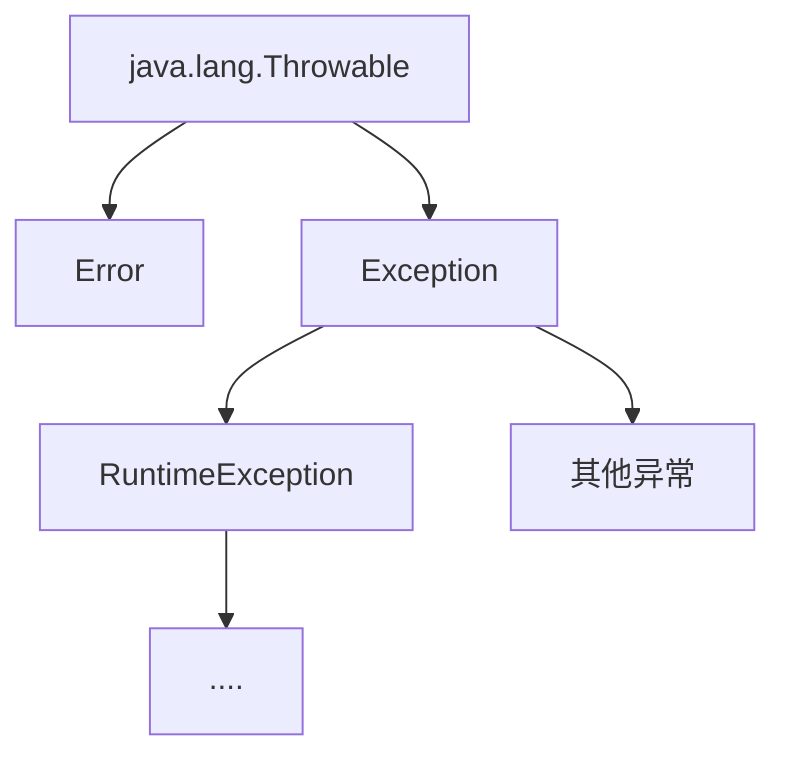
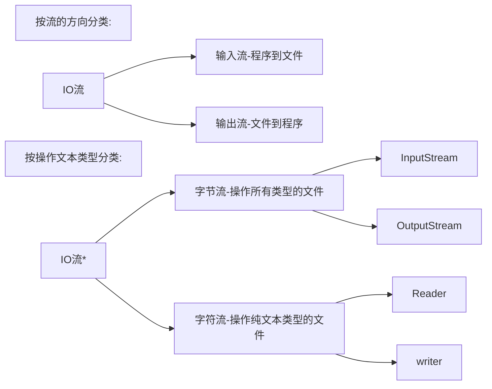

## 一、Stream流

作用：结合了Lambda表达式，简化集合、数组的操作

### 1.1 获取Stream流对象

先得到一条Stream利用（流水线），并把数据放上去，利用stream流中的API进行各种操作

| 获取方式     | 方法名                                       | 说明                     |
| ------------ | -------------------------------------------- | ------------------------ |
| 单列集合     | default Stream<E> stream()                   | Collction中的默认方法    |
| 双列集合     | 无                                           | 无法直接使用stream流     |
| 数组         | public static <T> Stream stream (T[] array)  | Arrays工具类中的静态方法 |
| 一堆零散数据 | public static <T> Stream <T> of(T... values) | Stream接口中的静态方法   |

注：Stream接口上静态方法of的细节

- 方法的形参是一个可变参数，可以传递一堆零散的数值，也可以传递数组
- 但是数组必须使是引用数据类型，如果传递基本数据类型，是会把整个数组当作一个元素，放到Stream流

### 1.2 使用中间方法处理数据

使用中间方法对流水线上的数据进行各种操作

Stream流的中间方法：

| 名称                                               | 说明                                        |
| -------------------------------------------------- | ------------------------------------------- |
| Stream<T> filiter (Predicate<? super T> predicate) | 过滤                                        |
| Stream<T> limit(long maxSize)                      | 获取前几个元素                              |
| Stream<T> skip(long n)                             | 跳过前几个元素：返回值为true表示数据liu'xia |
| Stream<T> distinct()                               | 元素去重，依赖（hashCode和equals方法）      |
| static<T> Stream<T> concat (Stream a,Stream b)     | 合并a和b两个流为一个流                      |
| Stream<R> map(Function<T,R> mapper)                | 转换流中的数据类型                          |

注：

* 中间方法，返回新的Stream流，原来Stream流只能使用一次，建议使用链式编程
* 修改Stream流中的数据，不会影响原来集合或者数组中的数据
* map方法演示：

```java
public class demo {
    public static void main(String[] args) {
        ArrayList<String> list = new ArrayList<String>();
        Collections.addAll(list,"张无忌-31","周芷若-13",
                "赵敏-11","张强-22","张三丰-31","张翠山-313","王二麻子-12","谢广坤-100");
        
        //只获取里面的年龄并进行打印

        //第一个类型：流中原本的数据类型
        //第二个类型：要转成之后的类型
        list.stream().map(new Function<String, Integer>() {
            @Override
            //方法的形参s依次表示流里面每一个数据
            public Integer apply(String s) {
                String[] arr = s.split("-");
                String ageString = arr[1];
                int age = Integer.parseInt(ageString);
                //返回值表示转换之后的数据
                return age;
            }
            //当map方法执行后，流上的数据变成了整数
            //在下面的forEach当中，s依次表示流中的每个数据，这个数据就是现在的整数
        }).forEach(s->System.out.print(s+" "));

        System.out.println();
        System.out.println("================================");
        //lambda表达式
        list.stream().map(s->Integer.parseInt(s.split("-")[1])).forEach(s->System.out.print(s+" "));
    }
}

//31 13 11 22 31 313 12 100 
//================================
//31 13 11 22 31 313 12 100 
```
### 1.3 使用终结方法处理数据

使用终结方法对流水线上的数据进行各种操作

| 名称                          | 说明                       |
| ----------------------------- | -------------------------- |
| void forEach(Consumer action) | 遍历                       |
| long count()                  | 统计                       |
| toArray()                     | 收集流中的数据，放到数组中 |
| collect(Collector collector)  | 收集流中的数据，放到集合中 |

```java
import java.util.ArrayList;
import java.util.Arrays;
import java.util.Collections;
import java.util.function.IntFunction;

public class demo {
    public static void main(String[] args) {
        ArrayList<String> list = new ArrayList<String>();
        Collections.addAll(list,"张无忌","周芷若","赵敏","张强","张三丰","张翠山","王二麻子","谢广坤");

        //遍历
        list.stream().forEach(System.out::println);
        //张无忌
        //周芷若
        //赵敏
        //张强
        //张三丰
        //张翠山
        //王二麻子
        //谢广坤
            
        //统计
        long count = list.stream().count();
        System.out.println(count);
        //8

        //toArray 无参
        Object[] arr1 = list.stream().toArray();
        System.out.println(Arrays.toString(arr1));
        //[张无忌, 周芷若, 赵敏, 张强, 张三丰, 张翠山, 王二麻子, 谢广坤]

        //toArray 有参
        //IntFunction的泛型：具体类型的数组
        String[] arr = list.stream().toArray(new IntFunction<String[]>() {
            @Override
            //apply的新参：流中数据的个数，要跟数组的长度保持一致
            public String[] apply(int value) {
                //方法体：创建数组

                //apply的返回值：具体类型的数组
                return new String[value];
            }
        });
        System.out.println(Arrays.toString(arr));
        //[张无忌, 周芷若, 赵敏, 张强, 张三丰, 张翠山, 王二麻子, 谢广坤]

        //toArray方法的参数的作用：夫准则创建自定类型的数组
        //toArray方法的底层，会依次得到流里面的每一个数组，并把数据放到数组中
        //toArray方法的返回值：是一个装着流里面所有数据的数组

        //toArray 有参 lambda表达式
        String[] array = list.stream().toArray(value -> new String[value]);
        System.out.println(Arrays.toString(array));
        //[张无忌, 周芷若, 赵敏, 张强, 张三丰, 张翠山, 王二麻子, 谢广坤]
    }
}
```
### 1.4 收集方法collect

```java
import java.util.*;
import java.util.function.Function;
import java.util.stream.Collectors;

public class demo {
    public static void main(String[] args) {
        //如果我们要收集Map集合中，键不能重复

        ArrayList<String> list = new ArrayList<>();
        Collections.addAll(list, "张无忌-男-12", "赵敏-女-22", "张强-男-13", "张辽-男-33", "谢广坤-男-44");

        //收集到list集合中-把所有男性收集起来
        List<String> newList1 = list.stream().
                filter(s -> "男".equals(s.split("-")[1])).
                collect(Collectors.toList());

        System.out.println(newList1);
        //[张无忌-男-12, 张强-男-13, 张辽-男-33, 谢广坤-男-44]


        //收集到Set集合中-把所有男性收集起来
        Set<String> newList2 = list.stream().
                filter(s -> "男".equals(s.split("-")[1])).
                collect(Collectors.toSet());

        System.out.println(newList2);
        //[张强-男-13, 张辽-男-33, 张无忌-男-12, 谢广坤-男-44]

        //收集到map集合中-把所有男性收集起来 键：姓名 值：年龄
        Map<String, Integer> map = list.stream().
                filter(s -> "男".equals(s.split("-")[1])).
                /*
                 *  toMap:参数1表示键的生成规则
                 *       :参数2表示值的生成规则
                 */
                        collect(Collectors.toMap(
                        //Function泛型1：表示流中每一个数据的类型
                        //        泛型2：表示Map集合中键的数据类型
                        new Function<String, String>() {
                            @Override
                            //方法apply形参：依次表示流里面的每一个数据
                            //方法体：生成键的代码
                            //返回值：已经生成的键
                            public String apply(String s) {

                                return s.split("-")[0];
                            }
                        },
                        //Function泛型1：表示流中每一个数据的类型
                        //        泛型2：表示Map集合中值的数据类型
                        new Function<String, Integer>() {
                            @Override
                            //方法apply形参：依次表示流里面的每一个数据
                            //方法体：生成值的代码
                            //返回值：已经生成的值
                            public Integer apply(String s) {
                                return Integer.parseInt(s.split("-")[2]);
                            }
                        }));

        System.out.println(map);
        //{张强=13, 张辽=33, 张无忌=12, 谢广坤=44}


        //lambda 表达式
        Map<String, Integer> map1 = list.stream().
                filter(s -> "男".equals(s.split("-")[1])).
                collect(Collectors.toMap(s->s.split("-")[0],
                        s->Integer.parseInt(s.split("-")[2])));
        System.out.println(map1);
        //{张强=13, 张辽=33, 张无忌=12, 谢广坤=44}

    }
}
```


## 二、方法引用

### 2.1方法引用概述

概念：把已经有的方法拿过来用，当作函数式接口中抽象方法的方法体

条件：

* 引用处必须是函数式接口
* 被引用的方法需要已经存在
* 被引用方法的形参和返回值需要跟抽象方法的形参和返回值保持一致
* 被引用方法的功能需要满足当前需求

`::`：方法引用符

### 2.2 引用静态方法

格式：类名::静态方法

```java
public class demo {
    public static void main(String[] args) {
        ArrayList<String> list = new ArrayList<>();
        Collections.addAll(list,"1","2","3","4","5","6","7","8","9");

//        常规方法

        list.stream().map( s-> Integer.parseInt(s)).forEach(System.out::print);
        System.out.println();

        list.stream().map(Integer::parseInt).forEach(System.out::print);

    }
}

//123456789
//123456789
```

### 2.3 引用成员方法

格式：对象::成员方法

* 其他类：其它类对象::方法名
* 本类：this::方法名(引用处不能是静态方法)
* 父类：super::方法名(引用处不能是静态方法)

```java
//打印出姓张且名字长度为3的人

public class demo3 {
    public static void main(String[] args) {
        ArrayList<String> list = new ArrayList<>();

        Collections.addAll(list, "张无忌", "周芷若", "赵敏", "张强", "张三丰", "张翠山", "王二麻子", "谢广坤");

        list.stream().filter(s -> s.startsWith("张")).filter(s -> s.length() == 3).forEach(System.out::println);

        list.stream().filter(new Predicate<String>() {
            @Override
            public boolean test(String string) {
                return string.startsWith("张") && string.length() == 3;
            }
        }).forEach(System.out::println);

        StringOperation stringOperation = new StringOperation();
        list.stream().filter(stringOperation::stringJudge).forEach(System.out::println);

  		//list.stream().filter(this::stringJudge).forEach(System.out::println);
        //静态方法中没有this方法
    }

    public boolean stringJudge(String str) {
        return str.startsWith("张") && str.length() == 3;
    }

}
```

```java
public class StringOperation {
    public boolean stringJudge(String str) {
        return str.startsWith("张")&&str.length()==3;
    }
}
```

### 2.4 引用构造方法

格式：类名::new

```java
import java.util.ArrayList;
import java.util.Collections;
import java.util.List;
import java.util.function.Function;
import java.util.stream.Collectors;

public class demo {
    public static void main(String[] args) {
        ArrayList<String> list = new ArrayList<>();
        Collections.addAll(list, "张无忌-12", "赵敏-22", "张强-13", "张辽-33", "谢广坤-44");

        List<Student> newList = list.stream().map(new Function<String, Student>() {
            @Override
            public Student apply(String s) {
                return new Student(s.split("-")[0], Integer.parseInt(s.split("-")[1]));
            }
        }).collect(Collectors.toList());
        System.out.println(newList);
       // [Student{name='张无忌', age=12}, Student{name='赵敏', age=22}, Student{name='张强', age=13}, Student{name='张辽', age=33}, Student{name='谢广坤', age=44}]


        list.stream().map(Student::new).forEach(System.out::println);
         //Student{name='张无忌', age=12}
		//Student{name='赵敏', age=22}
		//Student{name='张强', age=13}
		//Student{name='张辽', age=33}
		//Student{name='谢广坤', age=44}

    }
}
```

```java
public Student(String s) {
    new Student(s.split("-")[0], Integer.parseInt(s.split("-")[1]));
}
```

### 2.5 类名引用成员方法

格式：类名::成员方法

```java
public class demo {
    public static void main(String[] args) {
        ArrayList<String> list = new ArrayList<String>();
        Collections.addAll(list,"aaa","bbb","ccc");
        //拿着流里面的每一个数据，去调用String类中的toUpperCase方法，方法的返回值就是转换之后的结果
        list.stream().map(String::toUpperCase).forEach(System.out::println);
    }
}

//AAA
//BBB
//CCC
```

类名引用成员方法的规则：

- 引用处必须是函数式接口
- 被引用的方法需要已经存在
- 被引用方法的形参，需要跟抽象方法的第二个形参到最后一个形参保持一致，返回值需要保持一致
- 被引用方法的功能需要满足当前需求

抽象方法形参的详解：

* 第一个参数：表示被引用方法的调用者，决定了可以应用那些类中的方法；

  在Stream流当中，第一个参数一般都表示流里面的每一个数据

  假设流里面的数据是字符串，那么使用这种方式进行方法引用，只能引用String这个类中的方法

* 第二个参数到最后一个参数：跟被引用方法的形参保持一致，如果没有第二个参数，说明被引用的方法需要是无参的成员方法

### 2.6 引用数组构造方法

格式：数据类型[]::new

```java
import java.util.ArrayList;
import java.util.Arrays;
import java.util.Collections;
import java.util.function.IntFunction;

public class demo {
    public static void main(String[] args) {
//        集合中存取一些整数收集到数组中
//        目的：创建指定类型的数组

        ArrayList<Integer> list = new ArrayList<Integer>();
        Collections.addAll(list, 1, 2, 3, 4, 5, 6, 7, 8, 9, 10);

        Integer[] arr = list.stream().toArray(Integer[]::new);
        
        System.out.println(Arrays.toString(arr));

    }
}

//[1, 2, 3, 4, 5, 6, 7, 8, 9, 10]
```


## 三、异常


异常就代表程序出现问题



**Error**:代表的系统级别错误,与开发人员无关

**Exception**:-叫做异常,代表程序可能出现的问题,通常会用Exception以及它的子类来封装程序出现的问题

**RuntimeException**:运行时异常，编译阶段不会出现异常提醒，运行时出现的异常（如数组越界异常）

**编译时异常**：没有继承RuntimeException的异常，直接继承于Exception，编译阶段就会出现的异常（如日期解析异常）

### 3.1 编译时异常和运行时异常

Java文件 --Javac命令-->字节码文件 --Java命令-->运行结果

编译时异常和运行时异常的区别：

* 编译时异常：除了RuntimeException和它的子类，其他都是编译时异常。编译阶段需要进行处理，作用在于提醒程序员
* RuntimeException本身和所有子类，都是运行时异常。编译阶段不报错，是程序运行时出现的。一般都是参数传递错误带来的问题

异常的作用：

* 异常用来查询bug的关键参考信息
* 异常可以作为方法内部的一种特殊返回值，以便通知调用者底层的执行情况

### 3.2 异常处理方式

#### 3.2.1 JVM默认的处理方式

* 把异常的名称，异常原因及异常出现的位置等信息输出在控制台上
* 程序停止执行，程序下面的代码不会在执行

#### 3.2.2 自己处理（捕获异常）

```java
try{
    可能出现异常的代码;
}catch(异常类名 变量名){
	异常的处理代码;
}finally{
    
}
//finally里面的代码一定会被执行，除非虚拟机停止
```

目的：当代码出现异常，可以让程序继续往下执行

注：

* 如果try中没有遇到问题，会把try里面的代码全部执行完毕，不会执行catch里面的代码
* 如果我们要捕获多个异常，这些异常中如果存在父子关系，那么父类一定要写在下面
* 如果try中遇到的问题没有被捕获，相当于try...catch的代码白写，最终还是会交给虚拟机处理
* 如果try中遇到了问题，那么try下面的代码就不会被执行，直接跳转到对应的catch中在，执行catch里面的语句体，但是如果没有对应的catch语句与之匹配，那么还是会交给虚拟机进行处理

#### 3.2.3 抛出异常

- throws:写在方法定义处，表示声明一个异常，告诉调用者，使用本方法可能会有哪些异常

  编译时异常：必须要写

  运行时异常：可以不写

- throw:写在方法内，结束方法，手动抛出异常，交给调用者，方法中下面的代码就不在执行了

```java
package Exception;

public class demo6 {
    public static void main(String[] args) {
        int[] a={1,2,3,535,31,366,4,7,4,241};

        System.out.println(getMax(a));
//        535

        int[] b={};
        try {
            System.out.println(getMax(b));
        } catch (Exception e) {
            System.out.println("参数异常");
        }
//		参数异常      
    }

    public static int getMax(int[] a) /*throws IllegalArgumentException,ArrayIndexOutOfBoundsException*/{
        if(a==null || a.length==0){
            //手动创建一个异常对象，并把这个异常交给方法的调用者处理
            //此时方法就会结束，下面的代码就不会被执行
            throw new IllegalArgumentException();
        }

        int max=a[0];
        for(int i=1;i<a.length;i++){
            if(a[i]>max){
                max=a[i];
            }
        }
        return max;
    }
}
```

### 3.3 异常的常见方法

Throwable的成员方法：

| 方法名称                      | 说明                            |
| ----------------------------- | ------------------------------- |
| public String getMessage()    | 返回此throwable的详细信息字符串 |
| public String toString()      | 返回此可抛出的简短描述          |
| public void printStackTrace() | 把异常的错误信息输出在控制台上  |

代码演示：

```java
public class demo5 {
    public static void main(String[] args) {
        int[] arr={1,2,3,4,5};
        try {
            System.out.println(arr[10]);
        } catch (ArrayIndexOutOfBoundsException e) {
            String message = e.getMessage();
            System.out.println(message);

            String string = e.toString();
            System.out.println(string);

            e.printStackTrace();//仅仅是打印信息，不会停止程序运行
        }
        
        System.out.println("看看我执行了吗");
    }
}
```

执行结果：

```
Index 10 out of bounds for length 5 
java.lang.ArrayIndexOutOfBoundsException: Index 10 out of bounds for length 5
看看我执行了吗
java.lang.ArrayIndexOutOfBoundsException: Index 10 out of bounds for length 5
	at Exception.demo5.main(demo5.java:7)
```

### 3.4 自定义异常

意义：就是为让控制台的报错信息更加的见名知意

自定义异常的步骤：

1. 定义异常类
2. 写继承关系
3. 空参构造
4. 带参构造

```java
public class NameFormatException extends RuntimeException{
    public NameFormatException() {
    }

    public NameFormatException(String message) {
        super(message);
    }
}
```

### 3.5 不同JDK捕获异常的方式

finally里面的异常一定会被执行

```java
public class FileCopy{
	// try里面的流会自动关闭
    public static void main(String[] args) {
        try (FileInputStream fis = new FileInputStream("myFile/c1.png");
             FileOutputStream fos = new FileOutputStream("myFile/c2.png")) {
            byte[] bytes = new byte[1024];
            int b;
            while ((b = fis.read(bytes)) != -1) {
                fos.write(bytes, 0, b);
            }
        } catch (IOException e) {
            throw new RuntimeException(e);
        }
    }
}
```


## 四、FILE文件操作

### 4.1 FILE概述和构造方法

file对象就表示一个路径，可以是文件的路径、也可以是文件夹的路径；这个路径可以是存在的，也允许是不存在的

构造方法：

| 构造方法                                 | 描述                                                         |
| ---------------------------------------- | ------------------------------------------------------------ |
| public File(String pathname)             | 根据文件路径创建对象                                         |
| public File(String parent, String child) | 根据父路径名字符串和子路径名字串创建文件对象                 |
| public File(File parent, String child)   | 根据父路径对应文件对象和子路径名字符串创建文件对象根据父路径对应文件对象和子路径名字符串创建文件对象 |

### 4.2 File常见成员方法

#### 4.2.1 判断/获取相关方法

| 方法名称                        | 说明                                               |
| ------------------------------- | -------------------------------------------------- |
| public boolean isDirectory()    | 判断此路径名表示的File是否为文件夹                 |
| public boolean isFile()         | 判断此路径名表示的File是否为文件                   |
| public boolean exists()         | 判断此路径名表示的File是否存在                     |
| public long length()            | 返回文件的大小（字节数量）（无法获取文件夹的大小） |
| public String getAbsolutePath() | 返回文件的绝对路径                                 |
| public String getPath()         | 返回定义文件时使用的路径                           |
| public String getName()         | 返回文件的名称，带后缀                             |
| public long lastModified()      | 返回文件的最后修改时间（时间毫秒值）               |

#### 4.2.2 创建/删除相关方法

| 方法名称                       | 说明                                                         |
| ------------------------------ | ------------------------------------------------------------ |
| public boolean createNewFile() | 创建一个新的空的文件<br>如果当前路径表示的文件是不存在的，则创建成功，方法返回true，反之失败<br>如果父级路径是不存在的，那么方法会有异常的IOException<br>createNewFile方法创建的一定是文件，如果路径中不包含后缀名，则创建一个没有后缀的文件 |
| public boolean mkdir()         | 创建单级文件夹<br>windows当中路径是唯一的，如果当前路径已经存在，则创建失败，返回false<br>mkdir只能创建单级文件夹，无法创建多级文件夹 |
| public boolean mkdirs()        | 创建多级文件夹<br>既可以创建单级的，又可以创建多级文件夹     |
| public boolean delete()        | 删除文件、空文件夹<br>如果删除的是文件和文件夹，则直接删除，不走回收站<br>如果删除的是有内容的文件夹，则删除失败 |

delete方法默认只能删除文件和空文件夹，delete方法直接删除不走回收站

#### 4.2.3 获取并遍历相关方法

| 方法名称                  | 说明                       |
| ------------------------- | -------------------------- |
| public File[] listFiles() | 获取当前该路径下的所有内容 |

注：

* 当调用者File表示的路径不存在时，返回null
* 当调用者File表示的路径是文件时，返回null
* 当调用者File表示的路径是一个空文件时，返回一个长度为数组
* 当调用者File表示的路径是一个有内容的文件夹时，将里面所有文件和文件夹的路径放在File数组中返回，包含隐藏文件
* 当调用者File表示的路径是需要权限才能访问的文件夹时，返回null


## 五、IO流

### 5.1 IO流概述

IO流：用于读写文件中的数据（可以读写文件，或网络中的数据...）

输入input：读取外部数据（磁盘、光盘等外部设备的数据等）到程序（内存）中

输出流output：将程序（内存）数据输出到磁盘、光盘等存储设备中

字节流：按字节操作，能实现无损操作

字符流：操作文本文件

**IO流的分类**：



注：纯文本文件是用windows系统自带的记事本打开并且能读懂的文件

### 5.2 字节流

#### 5.2.1  字节输出流  FileOutputStream

操作本地文字的字节输出流，可以把程序中的数据写到本地文件中

##### 5.2.1.1 FileOutputStream操作步骤

1. 创建字节输出流对象

   ```java
   FileOutputStream fos=new FileOutputStream("src/io/byteStream/a.txt");
   ```

   注：

   * 参数是字符串表示的路径或者File对象都是可以的
   * 如果文件不存在会创建一个新的文件，但是要保证父级路径是存在的
   * 如果文件已经存在，则会清空文件


2. 写数据

   ```java
   fos.write(97);
   ```

   注：

   * write方法的参数是整数，但是实际上写到本地文件中的是整数在ASCⅡ上对应的字符 	97--'a'

3. 释放资源

   ```java
   fos.close();
   ```

   注：

   * 每次使用完流之后都要释放资源

##### 5.2.1.2 FileOutputStream写数据的三种方式

| 方法名称                             | 说明                         |
| ------------------------------------ | ---------------------------- |
| void write (int b)                   | 一次写一个字节数据           |
| void write (byte[] b)                | 一次写一个字节数组数据       |
| void write(byte[] b,int off,int len) | 一次写一个字节数组的部分数据 |

##### 5.2.1.3  FileOutputStream写数据的两个问题

换行写：写一个换行符

* Windows：\r\n
* Linux:\n
* Mac:\r

在windows操作系统中，java对回车换行进行了优化，虽然完整的是\r\n，但是我们写其中一个就行\r或\n

续写：想要续写打开续写开关即可

开关位置：创建对象的第二个参数

默认false：表示关闭续写，此时创建对象会清空文件

手动传递true：表示打开续写，此时创建对象不会清空文件

#### 5.2.1 字节输入流 FileInputStream

操作本地文字的字节输入流，可以把本地文件中的数据写到程序中

```java
public class FileStream {
    public static void main(String[] args) throws IOException {
        FileOutputStream fos = new FileOutputStream("myFile/p.python",true);
        String text = "gaoxin is good\n";
        fos.write(text.getBytes());

        FileInputStream fis = new FileInputStream("myFile/p.python");
        byte[] bytes = new byte[1024];
        int b;
        while ((b = fis.read(bytes)) != -1) {
            System.out.println(new String(bytes, 0, b));
        }
        fos.close();
        fis.close();
    }
}
```

1. 创建字节输入流对象

   * 如果文件不存在，就直接报错

     输出流：文件不存在会创建，把数据写到文件中；

     输入流：文件不存在会报错，因为创建出来的文件是没有数据的，没有任何意义

2. 写数据

   * 一次读一个字节，读出来的数据是在ASCⅡ上对应的数字
   * 读到文件末尾，read方法返回-1

3. 释放资源

   * 每次使用完流之后都要释放资源

FileInputStream一次读多个字节：

| 方法名称                       | 说明                                               |
| ------------------------------ | -------------------------------------------------- |
| public int read()              | 一次写一个字节数据，此时返回的数据                 |
| public int read(byte[] buffer) | 一次写一个字节数组数据，返回的是读取到了多少个数据 |

### 5.3 文件拷贝

```java
public class demo {
    public static void main(String[] args) throws IOException {
        //将chess.mp4拷贝到指定模块上

        FileInputStream fis=new FileInputStream("chess.mp4");
        FileOutputStream fos=new FileOutputStream("src\\io\\byteStream\\copy.mp4");

        //边读边写
        int b;
        while((b=fis.read())!=-1){
            fos.write(b);
        }

        //释放资源
        fos.close();
        fis.close();
    }
}
```

文件拷贝改良：

```java
import java.io.FileInputStream;
import java.io.FileNotFoundException;
import java.io.FileOutputStream;
import java.io.IOException;

public class demo {
    public static void main(String[] args) throws IOException {
        FileInputStream fis = new FileInputStream("chess.mp4");
        FileOutputStream fos = new FileOutputStream("src\\io\\byteStream\\copy.mp4");

        int len;
        byte[] buf = new byte[1024 * 1024 * 5];

        while ((len = fis.read(buf)) != -1) {
            fos.write(buf, 0, len);
        }

        fos.close();
        fis.close();
    }
}
```
### 5.4 字符集

* ASCⅡ字符集

* GBK字符集：简体中文版Windows系统默认使用的是GBK

  英文使用一个字节存储，完全兼容ASCⅡ；英文编码规则：不足8位，前面补0

  汉字使用两个字节存储；高位字节二进制一定以1开头，转成十进制后是个负数

  ```mermaid
  graph LR
  汉--查询GBK-->47802
  47802--编码-->10111010-10111010
  ```

* Unicode字符集：国际标准字符集，它将世界各种语言的每个字符定义一个唯一的编码，以满足跨平台、跨语言的文本信息转换

  `UTF-8`:unicode的一种编码方式，使用1-4个字节保存

  英文字母一个字节表示，简体中文使用三个字节表示

  | UTF-8编码方式（二进制)              |
  | ----------------------------------- |
  | 0xxxxxxx                            |
  | 110xxxxx 10xxxxxx                   |
  | 1110xxxx 10xxxxxx 10xxxxxx          |
  | 11110xxx 10xxxxxx 10xxxxxx 10xxxxxx |

如何不产生乱码：

* 不要用字节流读取文本文件
* 编码解码时使用同一个码表，同一个编码方式

Java中编码的方法

| String类中的方法                           | 说明                 |
| ------------------------------------------ | -------------------- |
| public byte[] getBytes()                   | 使用默认方式进行编码 |
| public byte[] getBytes(String charsetName) | 使用指定方式进行编码 |

Java中解码的方法

| String类中的方法                        | 说明                 |
| --------------------------------------- | -------------------- |
| String(byte[] bytes)                    | 使用默认方式进行解码 |
| String(byte[] bytes,String charsetName) | 使用指定方式进行解码 |

### 5.5 字符流

字符流：字符流的底层其实就是字节流，字符流 = 字节流 + 字符集

特点：

* 输入流：一次读一个字节，遇到中文时，一次读多个字节
* 输出流：底层会把数据按照指定的编码方式进行编码，变成字节在写到文件中

使用场景：对于纯文本文件进行读写操作

#### 5.5.1 字符输入流FileReader

1. 创建字符输入流对象

   | 构造方法                           | 说明                       |
   | ---------------------------------- | -------------------------- |
   | public FileReader(File file)       | 创建字符输入流关联本地文件 |
   | public FIleReader(String pathname) | 创建字符输入流关联本地文件 |

   如果文件不存在直接报错

2. 读取数据

   | 成员方法                       | 说明                                                         |
   | ------------------------------ | ------------------------------------------------------------ |
   | public int read()              | 读取数据，读到末尾返回-1                                     |
   | public int read(char[] buffer) | 读取多个数据，读到末尾返回-1<br>读取数据，解码，强转三步合并，把强转之后的数据放到数组中 |

   按字节进行读取，遇见中文，一次读多个字节，读取后解码，返回一个整数

   读到文件末尾返回 -1

3. 释放资源

   | 成员方法           | 说明          |
   | ------------------ | ------------- |
   | public int close() | 释放资源/关流 |

#### 5.5.2 字符输出流FileWriter

1. 创建字符输出流对象

   * 参数是字符串表示的路径或者File对象都是可以的
   * 如果文件不存在会创建一个新的文件，但是要保证父级路径是存在的
   * 如果文件已经存在，则会清空文件，如果不清空可以打开续写开关


2. 写数据

   * write方法的参数是整数，但是实际上写到本地文件中的是整数在ASCⅡ上对应的字符 	97--'a'

3. 释放资源

   * 每次使用完流之后都要释放资源

| 方法    | 描述                             |
| ------- | -------------------------------- |
| flush() | 将缓冲区的数据，刷新到本地文件中 |
| close() | 释放资源/关流                    |

IO流随用随创建，随用随关闭

### 5.6 综合练习

#### 5.6.1 拷贝文件夹

```java
public class demo1 {
    public static void main(String[] args) throws IOException {
        File src=new File("D:\\aaa");
        File dest=new File("D:\\aaaa");

        copyDir(src,dest);
    }

    public static void copyDir(File srcPath,File destPath) throws IOException {
        destPath.mkdirs();

        File[] files = srcPath.listFiles();

        for (File file : files) {
            if(file.isDirectory()){
                copyDir(file,new File(destPath,file.getName()));
            }else{
                FileInputStream fis=new FileInputStream(file);
                FileOutputStream fos=new FileOutputStream(new File(destPath,file.getName()));
                byte[] bytes=new byte[1024];
                int len;
                while((len=fis.read(bytes))!=-1){
                    fos.write(bytes,0,len);
                }

                fos.close();
                fis.close();
            }
        }
    }
}
```

#### 5.6.2 加密文件

```java
public class demo2 {
    public static void main(String[] args) throws IOException {

        //解密文件
        FileInputStream fis=new FileInputStream("ency.jpg");
        FileOutputStream fos=new FileOutputStream("ency1.jpg");//ency1就是解密后的文件

        int b=0;
        while((b=fis.read())!=-1){
            fos.write(b^2);
        }

        fos.close();
        fis.close();
    }
}
```

#### 5.6.3 排序修改文件中的数据

方法1：

```java
public class demo {
    public static void main(String[] args) throws IOException {
        FileReader fr = new FileReader("a.txt");

        StringBuilder sb=new StringBuilder();
        int ch;
        while((ch=fr.read())!=-1){
            sb.append((char)ch);
        }
        fr.close();

        //利用集合获取数据
        String str=sb.toString();
        String[] arrStr=str.split("-");

        ArrayList<Integer> list=new ArrayList<>();
        for (String string : arrStr) {
            int i=Integer.parseInt(string);
            list.add(i);
        }

        System.out.println(list);

        //排序
        Collections.sort(list);
        System.out.println(list);

        //写出数据
        FileWriter fw=new FileWriter("a.txt");

        for (int i = 0; i < list.size(); i++) {
            if(i==list.size()-1){
                //加双引号是为了使其变成字符串
                fw.write(list.get(i)+"");
            }else{
                fw.write(list.get(i)+"-");
            }
        }
        fw.close();
    }
}
```

方法2：

```java
public class demo {
    public static void main(String[] args) throws IOException {
        FileReader fr = new FileReader("a.txt");

        StringBuilder sb = new StringBuilder();
        int ch;
        while ((ch = fr.read()) != -1) {
            sb.append((char) ch);
        }
        fr.close();

        Integer[] arr = Arrays.stream(sb.toString()
                .split("-"))
                .map(Integer::parseInt)
                .sorted()
                .toArray(Integer[]::new);

        FileWriter fw=new FileWriter("a.txt");
        String s=Arrays.toString(arr).replace(", ","-")
                .replace("[","").replace("]","");
        fw.write(s);
        System.out.println(s);
        fw.close();
    }
}
```

### 5.7 缓冲流

#### 5.7.1 字节缓冲流

| 方法名称                                     | 说明                                     |
| -------------------------------------------- | ---------------------------------------- |
| public BufferedInputStream(InputStream is)   | 把基本流包装成高级流，提高读取数据的性能 |
| public BufferedOutputStream(OutputStream os) | 把基本流包装成高级流，提高写出数据的性能 |

底层自带了长度为8192的缓冲区提高性能，可以显著提高字节流的读写速度，但对于字符流提升不明显

```java
import java.io.*;

public class demo {
    public static void main(String[] args) throws IOException {
        BufferedInputStream bis = new BufferedInputStream(new FileInputStream("a.txt"));
        BufferedOutputStream bos = new BufferedOutputStream(new FileOutputStream("b.txt"));
        
        int b;
        while ((b = bis.read()) != -1) {
            bos.write(b);
        }

        bos.close();
        bis.close();
    }
}
```

#### 5.7.2 字符缓冲流

构造方法：

| 方法名称                        | 说明                                     |
| ------------------------------- | ---------------------------------------- |
| public BufferedReader(Reader r) | 把基本流包装成高级流，提高读取数据的性能 |
| public BufferedWriter(Writer w) | 把基本流包装成高级流，提高写出数据的性能 |

字符缓冲流特有方法：

| 字符缓冲输入流特有方法   | 说明                                                         |
| ------------------------ | ------------------------------------------------------------ |
| public String readLine() | 读取一行数据，如果没有数据可读，会返回null<br>readLine方法在读取的时候，一次读一整行，遇到回车换行结束，但是他不会把回车换行读到内存中 |

| 字符缓冲输出流特有方法  | 说明         |
| ----------------------- | ------------ |
| public String newLine() | 跨平台的换行 |

### 5.8 转换流

转换流是字符流和字节流之间的桥梁

作用：

1. 指定字符集读写（了解）
2. 字节流想要使用字符流的方法

* 字符转换输入流：InputStreamReader
* 字符转换输出流：OutputStreamWriter

```java
public class ConvertStream {

    public static void main(String[] args) throws IOException {
        InputStreamReader isr = new InputStreamReader(
                new FileInputStream("my-file/test.txt"), "GBK");
        OutputStreamWriter osw = new OutputStreamWriter(
                new FileOutputStream("my-file/t.txt"), StandardCharsets.UTF_8);

        int b = 0;
        while ((b = isr.read()) != -1) {
            System.out.print((char) b);
            osw.write(b);
        }
        osw.close();
        isr.close();


        isr.close();
    }
}

```

```java
public class ConvertStream {

    public static void main(String[] args) throws IOException {
        FileReader fr = new FileReader("my-file/test.txt", Charset.forName("GBK"));
        FileWriter fw = new FileWriter("my-file/t.txt", StandardCharsets.UTF_8);

        int b = 0;
        while ((b = fr.read()) != -1) {
            fw.write(b);
        }

        fw.close();
        fr.close();
    }
}

```

```java
public class Test7 {

    public static void main(String[] args) throws IOException {
        BufferedReader br = new BufferedReader(new InputStreamReader(
                new FileInputStream("my-file/test.txt"), Charset.forName("GBK")));
        String line = br.readLine();
        System.out.println(line);


        br.close();
    }
}
```

### 5.9 序列化流/对象操作输出流

#### 5.9.1序列化流/对象操作输出流

可以把Java中的对象写到本地文件中

**细节**：使用对象输出流将对象保存到文件时会出现NotSerializableException异常；

解决方案：需要让Javabean类实现Serializable接口

Serializable接口里面没有抽象方法，标记型接口，一旦实现了这个接口，那么就表示当前的Student类可以被序列化，可以理解一个物品的合格证

| 构造方法                                     | 说明                 |
| -------------------------------------------- | -------------------- |
| public Object OutputStream(OutputStream out) | 把基本流包装成高级流 |

| 成员方法                                  | 说明                       |
| ----------------------------------------- | -------------------------- |
| public final void writeObject(object obj) | 把对象序列化写出到文件中去 |

#### 5.9.2 反序列化流

可以把序列化到本地文件中的对象，读取到程序中来

| 构造方法                                   | 说明                 |
| ------------------------------------------ | -------------------- |
| public Object InputStream(InputStream out) | 把基本流包装成高级流 |

| 成员方法                   | 说明                                       |
| -------------------------- | ------------------------------------------ |
| public Object readObject() | 把序列化到本地文件中的对象，读取到程序中去 |

#### 5.9.3 序列化流/反序列化流细节汇总

```java
package review.io.iostream;

import java.io.*;

//@SuppressWarnings("all")
public class ObjectStream {

    /**
     * 一旦实现了Serializable接口，该类可被序列化
     * 序列化流读到文件中的数据是不能被修改的，一旦修改就无再次读回来
     */
    static class Student implements Serializable {

        @Serial
        private static final long serialVersionUID = 0xd61d12646915340aL;

        String name;
        int age;
        // 瞬态关键字，不会把当前的属性序列化到本地文件中
        private transient String address;

        public Student(String name, int age) {
            this.name = name;
            this.age = age;
        }

        @Override
        public String toString() {
            return "Student{" +
                    "name='" + name + '\'' +
                    ", age=" + age +
                    '}';
        }
    }

    public static void main(String[] args) throws IOException, ClassNotFoundException {
        Student s1 = new Student("高息", 12);

        ObjectOutputStream oos = new ObjectOutputStream(new FileOutputStream("my-file/test.txt"));
        oos.writeObject(s1);

        ObjectInputStream ois = new ObjectInputStream(new FileInputStream("my-file/test.txt"));
        System.out.println(ois.readObject());

        oos.close();
        ois.close();
    }
}

```


* 使用序列化流将对象写到文件时，需要让javabean类实现Serializable接口，否则会出现NotSerializableException异常

* 序列化流写到文件中的数据是不能修改的，一旦修改就无法再次都回来了

* 序列化对象后，修改了Javabean类，再次反序列化，会抛出InvalidClassException异常

  解决方案：给javabean类添加serialVersionUID（序列号、版本号）

* 如果一个对象中的某个成员变量的值不想被序列化

  解决方案：给该成员变量加transient关键字修饰，该关键字标记的成员变量不参与序列化过程

#### 5.9.4 （综合练习）读写多个对象 

将多个自定义对象序列化到文件中，但是由于对象的个数不确定，反序列流如何操作

```java
package review.io.test;

import review.io.iostream.ObjectStream;
import java.io.*;
import java.util.ArrayList;
import java.util.Collections;

/**
 * Test8类演示了如何使用ObjectOutputStream和ObjectInputStream来序列化和反序列化对象
 * 该类主要功能是序列化学生对象列表到文件，并从文件中反序列化这些对象
 */
@SuppressWarnings("all")
public class Test8 {

    /**
     * 主函数执行序列化和反序列化操作
     * @param args 命令行参数
     * @throws IOException 当文件操作失败时抛出
     * @throws ClassNotFoundException 当反序列化过程中找不到类时抛出
     */
    public static void main(String[] args) throws IOException, ClassNotFoundException {
        // 创建学生对象
        ObjectStream.Student tom = new ObjectStream.Student("Tom", 12);
        ObjectStream.Student jack = new ObjectStream.Student("Jack", 12);
        ObjectStream.Student john = new ObjectStream.Student("John", 12);

        // 创建学生列表并添加学生对象
        ArrayList<ObjectStream.Student> students = new ArrayList<>();
        Collections.addAll(students, tom, jack, john);

        // 创建ObjectOutputStream用于将学生列表序列化到文件
        ObjectOutputStream oos = new ObjectOutputStream(new FileOutputStream("my-file/test.txt"));
        oos.writeObject(students);
        oos.close();

        // 创建ObjectInputStream用于从文件中反序列化学生列表
        ObjectInputStream ois = new ObjectInputStream(new FileInputStream("my-file/test.txt"));
        ArrayList<ObjectStream.Student> list = (ArrayList<ObjectStream.Student>) ois.readObject();

        // 遍历反序列化后的学生列表并打印每个学生信息
        for (ObjectStream.Student student : list) {
            System.out.println(student);
        }
        ois.close();
    }
}
```


### 5.10 打印流

打印流一般是指：PrintStream，PrintWrite两个类

特点：

1. 打印流只能操作文件目的地，不操作数据源，打印流不能读只能写出

2. 特有的写出方法可以实现，数据原样写出

   打印：97 	文件中：97			打印：true	文件中：true

3. 特有的写出方法，可以实现自动刷新，自动换行

   打印一次数据=写出+换行+刷新

#### 5.10.1 字节打印流

**构造方法**：

| 构造方法                                                     | 说明                         |
| ------------------------------------------------------------ | ---------------------------- |
| public PrintStream(OutputStream/File/String)                 | 关联字节输出流/文件/文件路径 |
| public PrintStream(String fileName,Charset charset)          | 指定字符编码                 |
| public PrintStream(OutputStream out,boolean autoFlush)       | 自动刷新                     |
| public PrintStream(OutputStream out,boolean autoFlush,String encoding) | 指定字符编码，且自动刷新     |

字节流底层没有缓冲区，开不开自动刷新都一样

**成员方法**：

| 成员方法                                         | 说明                             |
| ------------------------------------------------ | -------------------------------- |
| public void write(int b)                         | 将指定的字节写出                 |
| public void println(Xxx xx)                      | 打印任意数据，自动刷新，自动换行 |
| public void print(Xxx xx)                        | 打印任意数据，不换行             |
| public void printf(String format,Object... args) | 带有占用符的打印数据，不换行     |

#### 5.10.2 字符打印流

字符流底层有缓冲区，想要自动刷新需要开启

| 构造方法                                               | 说明                         |
| ------------------------------------------------------ | ---------------------------- |
| public PrintWriter(Write/File/String) | 关联字节输出流/文件/文件路径 |
| public PrintWriter(String fileName,Charset charset) | 指定字符编码                 |
| public PrintWriter(OutputStream out,boolean autoFlush) | 自动刷新                     |
| public PrintWriter(OutputStream out,boolean autoFlush,String encoding) | 指定字符编码，且自动刷新    |

| 成员方法                                         | 说明                             |
| ------------------------------------------------ | -------------------------------- |
| public void write(int b)                         | 将指定的字节写出                 |
| public void println(Xxx xx)                      | 打印任意数据，自动刷新，自动换行 |
| public void print(Xxx xx)                        | 打印任意数据，不换行             |
| public void printf(String format,Object... args) | 带有占用符的打印数据，不换行     |

打印流的输出语句的关系

```java
import java.io.PrintStream;

public class Demo {
    public static void main(String[] args) {
        System.out.println("123");

        //获取打印流的对象，此打印流在虚拟机开启的时候，有虚拟机创建时，默认指向控制台
        //特殊的打印流，系统中的标准输出流，是不能关闭的，在系统中是唯一的
        PrintStream ps= System.out;

        //调用打印中的方法println
        //写出数据，自动换行，自动刷新
        ps.println(1232);

//        ps.close();

        System.out.println("123");
    }
}
```

### 5.11 解压缩流/压缩流

#### 5.11.1 解压缩流

```java
public class demo1 {
    public static void main(String[] args) throws IOException {
        File src = new File("D:\\aaa.zip");
        File dest = new File("D:\\");

        //调用方法
        unzip(src, dest);
        
    }

    public static void unzip(File zipFile, File destDir) throws IOException {
        //解压的本质：把压缩包的里面的每一个文件或文件夹读取出来，按照层级拷贝到目的地中

        //创建一个解压缩流用来读取压缩包里面的数据
        ZipInputStream zip = new ZipInputStream(new FileInputStream(zipFile));
        //要先获取到压缩包里面的每一个zipEntry对象
        ZipEntry entry;

        while ((entry = zip.getNextEntry()) != null) {
            if (entry.isDirectory()) {
                //文件夹：需要在目的地dest处创建一个同样的文件夹
                File file=new File(destDir, entry.getName());
                file.mkdirs();
            }else{
                //文件：需要读取到压缩包中的文件，并把他存放到目的地dest文件夹中（按照层级目录进行存放）
                FileOutputStream fos=new FileOutputStream(new File(destDir, entry.getName()));
                int b;
                while((b=zip.read())!=-1){
                    fos.write(b);
                }
                fos.close();
                //表示在压缩包中的一个文件处理完毕
                zip.closeEntry();
            }
        }

        zip.close();

    }
}
```

#### 5.11.2 压缩流

将a.txt打包成一个压缩包：

```java
public class demo2 {
    public static void main(String[] args) throws IOException {
        File src=new File("D:\\a.txt");

        File dest=new File("D:\\");

        toZip(src,dest);
    }

    //压缩文件
    public static void toZip(File src, File dest) throws IOException {
        ZipOutputStream out = new ZipOutputStream(new FileOutputStream(new File(dest,"a.zip")));

        //创建ZipEntry对象，表示压缩包里面的每个文件和文件夹
        ZipEntry entry = new ZipEntry("a.txt");
        //把ZipEntry对象放到压缩包当中
        out.putNextEntry(entry);
        //把src中的数据写到压缩包当中
        FileInputStream in = new FileInputStream(src);
        int b;
        while ((b = in.read()) != -1) {
            out.write(b);
        }

        in.close();
        out.closeEntry();
        out.close();
    }
}
```

将aaa文件夹打包成一个压缩包：

```java
package review.io.iostream;

import java.io.*;
import java.util.Objects;
import java.util.zip.ZipEntry;
import java.util.zip.ZipOutputStream;

/**
 * ZipStreamPackDir类用于将指定目录下的所有文件和子目录压缩成一个ZIP文件
 */
public class ZipStreamPackDir {

    /**
     * 程序的入口点
     * @param args 命令行参数，未使用
     * @throws IOException 如果文件读写操作失败
     */
    public static void main(String[] args) throws IOException {
        // 源目录的路径
        File src = new File("my-file/dd/qq-mutation-app");
        // 目标ZIP文件的路径，基于源目录生成
        File dest = new File(src + ".zip");

        // 创建ZipOutputStream对象，用于将压缩数据写入目标ZIP文件
        ZipOutputStream zos = new ZipOutputStream(new FileOutputStream(dest));
        
        // 调用beZipEntry方法开始压缩源目录下的文件和子目录
        beZipEntry(src, zos, src.getName());

        // 关闭ZipOutputStream，释放与之关联的资源
        zos.close();
    }

    /**
     * 递归地将指定目录下的所有文件和子目录压缩到ZIP输出流中
     * @param src 要压缩的源文件或目录
     * @param zos ZipOutputStream对象，用于将压缩数据写入ZIP文件
     * @param name 当前处理的文件或目录的名称，用于构建ZIP条目的路径
     * @throws IOException 如果文件读写操作失败
     */
    private static void beZipEntry(File src, ZipOutputStream zos, String name) throws IOException {
        // 遍历源目录下的所有文件和子目录
        for (File file : Objects.requireNonNull(src.listFiles())) {
            // 如果当前文件是一个普通文件，则将其压缩到ZIP输出流中
            if (file.isFile()) {
                // 创建ZIP条目，并写入ZIP输出流
                zos.putNextEntry(new ZipEntry(name + "\\" + file.getName()));
                // 读取文件内容，并写入ZIP输出流
                FileInputStream fis = new FileInputStream(file);
                byte[] bytes = new byte[1024];
                int len;
                while ((len = fis.read(bytes)) != -1) {
                    zos.write(bytes, 0, len);
                }
                // 关闭文件输入流，释放与之关联的资源
                fis.close();
            } else if (file.isDirectory()) {
                // 如果当前文件是一个目录，则递归地压缩其下的文件和子目录
                beZipEntry(file, zos, name + "\\" + file.getName());
            }
        }
    }
}

```

### 5.12 常用工具包

#### 5.12.1 Commons-io

Commons-io是apache开源基金组织提供的一组有关IO操作的开源工具包

作用：提高IO流的开发效率

Commons-io常见方法：

| Commons-io方法                                               | 描述                       |
| ------------------------------------------------------------ | -------------------------- |
| static void copyFile(File srcFile,File destFile)             | 复制文件                   |
| static void copyDirectory(File srcDir,File destDir)          | 复制文件夹                 |
| static void copyDirectoryToDirectory(File srcDir,File destDir) | 复制文件夹                 |
| static void deleteDirectory(File directory)                  | 删除文件夹                 |
| static void cleanDirectory(File directory)                   | 清空文件夹                 |
| static String readFileToString(FIle file,Charset encoding)   | 读取文件中的数据变成字符串 |
| static void write(File file, CharSequence data,String encoding) | 写出数据                   |

#### 5.12.2 Hutool工具包

Hutool工具包io相关类：

| 相关类            | 说明                          |
| ----------------- | ----------------------------- |
| IoUtil            | 流操作工具类                  |
| FileUtil          | 文件读写和操作的工具类        |
| FileTypeUtil      | 文件类型判断工具类            |
| WatchMonitor      | 目录、文件监听                |
| ClassPathResource | 争对ClassPath中资源的访问封装 |
| FileReader        | 封装文件读取                  |
| FileWriter        | 封装文件写入                  |

FileUtil类中常用方法：

| 常用方法      | 描述                                        |
| ------------- | ------------------------------------------- |
| file          | 根据参数创建一个file对象                    |
| touch         | 根据参数创建文件                            |
| writelines    | 把集合中的数据写出到文件中，覆盖模式        |
| appendlines   | 把集合中的数据写出到文件中，续写模式        |
| readlines     | 指定字符编码，把文件中的数据，读到集合中    |
| readUtf8Lines | 按照Utf-8的形式，把文件中的数据，读到集合中 |
| copy          | 拷贝文件或文件夹                            |

```

```


## 六、小项目

### 6.1 网络爬虫

```java
package review.io.project;

import java.io.*;
import java.net.URL;
import java.net.URLConnection;
import java.util.*;
import java.util.regex.Matcher;
import java.util.regex.Pattern;
import java.util.stream.Stream;

/**
 * Project1类用于演示网络爬虫抓取姓名数据并进行处理
 */
public class Project1 {
    /**
     * 主函数执行姓名数据的抓取和处理
     * @param args 命令行参数
     * @throws IOException 当网络抓取过程中发生I/O错误
     */
    public static void main(String[] args) throws IOException {
        // 定义抓取姓名数据的URL
        String familyNameNet =
                "https://hanyu.baidu.com/shici/detail?pid=0b2f26d4c0ddb3ee693fdb1137ee1b0d";
        String boyNameNet = "http://www.haoming8.cn/baobao/10881.html";
        String girlNameNet = "http://www.haoming8.cn/baobao/7641.html";

        // 使用webCrawler函数抓取网页数据
        String familyNameStr = webCrawler(familyNameNet);
        String boyNameStr = webCrawler(boyNameNet);
        String girlNameStr = webCrawler(girlNameNet);

        // 使用正则表达式提取姓名数据
        ArrayList<String> familyNameTempList = getDate(familyNameStr,
                "([^\\w]{4})(，|。)", 1);
        ArrayList<String> boyNameTempList = getDate(boyNameStr,
                "([\\u4e00-\\u9fa5]{2})(、|。|,|，|。)", 1);
        ArrayList<String> girlNameTempList = getDate(girlNameStr,
                "(.. ){4}..", 0);

        // 处理家族姓名数据
        ArrayList<String> familyNameList = new ArrayList<>();
        for (String s : familyNameTempList) {
            for (int i = 0; i < s.length(); i++) {
                familyNameList.add(String.valueOf(s.charAt(i)));
            }
        }
        familyNameList = new ArrayList<>(familyNameList.stream().limit(
                familyNameList.size() - 4).toList());

        // 处理男孩姓名数据
        List<String> boyNameList = boyNameTempList.stream().limit(
                boyNameTempList.size() - 38).skip(17).toList();

        // 处理女孩姓名数据
        ArrayList<String> girlNameList = new ArrayList<>();
        for (String s : girlNameTempList) {
            String[] split = s.split(" ");
            girlNameList.addAll(Arrays.asList(split));
        }

        // 获取处理后的姓名信息
        ArrayList<String> infos = new ArrayList<>(getInfos(familyNameList, new ArrayList<>(boyNameList),
                girlNameList, 70, 50));
        Collections.shuffle(infos);
        BufferedWriter br = new BufferedWriter(new FileWriter("my-file/name.txt"));
        for (String info : infos) {
            br.write(info);
            br.newLine();
        }
        br.close();
    }

    /**
     * 生成指定数量的男孩和女孩的信息列表
     * 该方法通过合并男孩和女孩的名字列表（根据给定的数量）来生成一个综合信息列表
     *
     * @param familyNameList 家庭名字列表，用于组合名字
     * @param boyNameList 男孩名字列表，从中选择名字进行组合
     * @param girlNameList 女孩名字列表，从中选择名字进行组合
     * @param boyNum 需要生成的男孩名字的数量
     * @param girlNum 需要生成的女孩名字的数量
     * @return 返回一个包含男孩和女孩信息的列表
     */
    private static List<String> getInfos(ArrayList<String> familyNameList
            , ArrayList<String> boyNameList, ArrayList<String> girlNameList
            , int boyNum, int girlNum) {
        // 使用Stream API合并男孩和女孩的名字列表，并转换为List
        return Stream.concat(getName(familyNameList, boyNameList, boyNum, 1).stream()
                , getName(familyNameList, girlNameList, girlNum, 2).stream()).toList();
    }

    /**
     * 生成姓名列表
     * @param familyNameList 家族姓名列表
     * @param nameList 姓名列表
     * @param num 姓名数量
     * @param sex 性别标识，1为男，其他为女
     * @return 生成的姓名列表
     */
    private static List<String> getName(ArrayList<String> familyNameList, ArrayList<String> nameList,
                                        int num, int sex) {
        // 使用HashSet来存储姓名，以确保姓名的唯一性
        HashSet<String> Name = new HashSet<>();
        // 当集合中的姓名数量未达到所需数量时，继续生成姓名
        while (Name.size() != num) {
            // 打乱姓氏列表和名字列表的顺序，以获得随机性
            Collections.shuffle(familyNameList);
            Collections.shuffle(nameList);
            // 从打乱后的列表中取第一个元素组合成姓名，并添加到集合中
            Name.add(familyNameList.get(0) + nameList.get(0));
        }
        // 将集合转换为流，映射每个姓名到包含性别和随机年龄的信息，然后收集为List
        return Name.stream().map(s -> s + "-" + (sex == 1 ? "男" : "女") + "-" +
                new Random().nextInt(15, 30)).toList();
    }

    /**
     * 从给定字符串中提取日期
     * 该方法使用正则表达式来查找字符串中所有符合指定模式的日期，并将它们添加到一个列表中返回
     *
     * @param str 包含日期的字符串
     * @param regex 用于匹配日期的正则表达式
     * @param index 匹配结果中日期的组索引
     * @return 包含所有匹配日期的列表
     */
    private static ArrayList<String> getDate(String str, String regex, int index) {
        // 初始化一个空的字符串列表，用于存储匹配到的日期
        ArrayList<String> list = new ArrayList<>();
        // 编译正则表达式
        Pattern pattern = Pattern.compile(regex);
        // 创建一个匹配器，用于在给定字符串上执行匹配操作
        Matcher matcher = pattern.matcher(str);
        // 遍历字符串，查找所有匹配的日期
        while (matcher.find()) {
            // 将匹配到的日期添加到列表中
            list.add(matcher.group(index));
        }
        // 返回包含所有匹配日期的列表
        return list;
    }

    /**
     * 网页爬虫函数，用于从指定的URL中提取内容
     *
     * @param net 字符串类型的URL地址，表示要爬取的网页地址
     * @return 返回爬取到的网页内容字符串
     * @throws IOException 如果在打开URL连接或读取内容时发生I/O错误
     */
    public static String webCrawler(String net) throws IOException {
        // 创建StringBuilder对象，用于存储网页内容
        StringBuilder sb = new StringBuilder();
        // 创建URL对象，使用传入的字符串参数初始化
        URL url = new URL(net);
        // 打开URL连接
        URLConnection conn = url.openConnection();
        // 使用BufferedReader读取URL连接的内容
        BufferedReader br = new BufferedReader(new InputStreamReader(conn.getInputStream()));
        int len;
        // 定义字符数组，用于存储从网页读取的内容
        char[] chars = new char[1024];
        // 循环读取网页内容，直到结束
        while ((len = br.read(chars)) != -1) {
            // 将读取的内容追加到StringBuilder中
            sb.append(new String(chars, 0, len));
        }
        // 关闭BufferedReader
        br.close();
        // 返回爬取到的网页内容字符串
        return sb.toString();
    }
}

```

### 6.2 用Hutools写假数据

```java
package review.io.project;

import cn.hutool.core.io.FileUtil;
import cn.hutool.core.util.ReUtil;
import cn.hutool.http.HttpUtil;

import java.util.*;
import java.util.stream.Stream;

public class Project2 {

    public static void main(String[] args) {
        // 定义抓取姓名数据的URL
        String familyNameNet =
                "https://hanyu.baidu.com/shici/detail?pid=0b2f26d4c0ddb3ee693fdb1137ee1b0d";
        String boyNameNet = "http://www.haoming8.cn/baobao/10881.html";
        String girlNameNet = "http://www.haoming8.cn/baobao/7641.html";

        String familyNameStr = HttpUtil.get(familyNameNet);
        String boyNameStr = HttpUtil.get(boyNameNet);
        String girlNameStr = HttpUtil.get(girlNameNet);

        List<String> familyNameTempList = ReUtil.findAll(
                "([^\\w]{4})(，|。)", familyNameStr, 1);
        List<String> boyNameTempList = ReUtil.findAll(
                "([\\u4e00-\\u9fa5]{2})(、|。|,|，|。)", boyNameStr, 1);
        List<String> girlNameTempList = ReUtil.findAll("(.. ){4}..", girlNameStr, 0);

        // 处理家族姓名数据
        ArrayList<String> familyNameList = new ArrayList<>();
        for (String s : familyNameTempList) {
            for (int i = 0; i < s.length(); i++) {
                familyNameList.add(String.valueOf(s.charAt(i)));
            }
        }
        familyNameList = new ArrayList<>(familyNameList.stream().limit(
                familyNameList.size() - 4).toList());

        // 处理男孩姓名数据
        List<String> boyNameList = boyNameTempList.stream().limit(
                boyNameTempList.size() - 38).skip(17).toList();

        // 处理女孩姓名数据
        ArrayList<String> girlNameList = new ArrayList<>();
        for (String s : girlNameTempList) {
            String[] split = s.split(" ");
            girlNameList.addAll(Arrays.asList(split));
        }

        // 获取处理后的姓名信息
        ArrayList<String> infos = new ArrayList<>(getInfos(familyNameList, new ArrayList<>(boyNameList),
                girlNameList, 70, 50));
        FileUtil.writeLines(infos, "my-file/name.txt","UTF-8");
    }

    /**
     * 生成指定数量的男孩和女孩的信息列表
     * 该方法通过合并男孩和女孩的名字列表（根据给定的数量）来生成一个综合信息列表
     *
     * @param familyNameList 家庭名字列表，用于组合名字
     * @param boyNameList 男孩名字列表，从中选择名字进行组合
     * @param girlNameList 女孩名字列表，从中选择名字进行组合
     * @param boyNum 需要生成的男孩名字的数量
     * @param girlNum 需要生成的女孩名字的数量
     * @return 返回一个包含男孩和女孩信息的列表
     */
    private static List<String> getInfos(ArrayList<String> familyNameList
            , ArrayList<String> boyNameList, ArrayList<String> girlNameList
            , int boyNum, int girlNum) {
        // 使用Stream API合并男孩和女孩的名字列表，并转换为List
        return Stream.concat(getName(familyNameList, boyNameList, boyNum, 1).stream()
                , getName(familyNameList, girlNameList, girlNum, 2).stream()).toList();
    }

    /**
     * 生成姓名列表
     * @param familyNameList 家族姓名列表
     * @param nameList 姓名列表
     * @param num 姓名数量
     * @param sex 性别标识，1为男，其他为女
     * @return 生成的姓名列表
     */
    private static List<String> getName(ArrayList<String> familyNameList, ArrayList<String> nameList,
                                        int num, int sex) {
        // 使用HashSet来存储姓名，以确保姓名的唯一性
        HashSet<String> Name = new HashSet<>();
        // 当集合中的姓名数量未达到所需数量时，继续生成姓名
        while (Name.size() != num) {
            // 打乱姓氏列表和名字列表的顺序，以获得随机性
            Collections.shuffle(familyNameList);
            Collections.shuffle(nameList);
            // 从打乱后的列表中取第一个元素组合成姓名，并添加到集合中
            Name.add(familyNameList.get(0) + nameList.get(0));
        }
        // 将集合转换为流，映射每个姓名到包含性别和随机年龄的信息，然后收集为List
        return Name.stream().map(s -> s + "-" + (sex == 1 ? "男" : "女") + "-" +
                new Random().nextInt(15, 30)).toList();
    }
}
```

### 6.3 随机点名器

```java
package review.io.project;

import java.io.*;
import java.util.ArrayList;
import java.util.Arrays;
import java.util.Random;

/**
 * Project3类用于执行学生信息的读取、处理和写入操作
 * 该程序从文件中读取学生信息，根据学生的体重进行随机抽选，并更新抽中学生的体重，
 * 最后将更新后的学生信息写回文件
 */
public class Project3 {

    /**
     * Student类用于表示学生的基本信息
     */
    static class Student {
        private String name;
        private String gender;
        private int age;
        private double weight;

        /**
         * 默认构造函数
         */
        public Student() {
        }

        /**
         * 构造函数，用于创建并初始化学生对象
         *
         * @param name     学生姓名
         * @param gender   学生性别
         * @param age      学生年龄
         * @param weight   学生体重
         */
        public Student(String name, String gender, int age, double weight) {
            this.name = name;
            this.gender = gender;
            this.age = age;
            this.weight = weight;
        }

        // 以下为getter和setter方法，用于获取和设置学生属性

        public String getName() {
            return name;
        }

        public void setName(String name) {
            this.name = name;
        }

        public String getGender() {
            return gender;
        }

        public void setGender(String gender) {
            this.gender = gender;
        }

        public int getAge() {
            return age;
        }

        public void setAge(int age) {
            this.age = age;
        }

        public double getWeight() {
            return weight;
        }

        public void setWeight(double weight) {
            this.weight = weight;
        }

        /**
         * 重写toString方法，用于以字符串形式输出学生信息
         *
         * @return 学生信息的字符串表示
         */
        @Override
        public String toString() {
            return "Student{" +
                    "name='" + name + '\'' +
                    ", gender='" + gender + '\'' +
                    ", age=" + age +
                    ", weight=" + weight +
                    '}';
        }
    }

    /**
     * 主函数执行学生信息的读取、处理和写入操作
     *
     * @param args 命令行参数
     * @throws IOException 当文件读写操作发生错误时抛出
     */
    public static void main(String[] args) throws IOException {
        ArrayList<Student> list = new ArrayList<>();
        // 从文件中读取学生信息并创建学生对象
        BufferedReader br = new BufferedReader(new FileReader("my-file/name.txt"));
        String line;
        while ((line = br.readLine()) != null && !line.isEmpty()) {
            String[] split = line.split("-");
            Student student = new Student(split[0], split[1], Integer.parseInt(split[2]),
                    Double.parseDouble(split[3]));
            list.add(student);
        }
        br.close();

        // 计算所有学生的总体重
        double weight = 0;
        for (Student stu : list) {
            weight += stu.getWeight();
        }
        // 根据学生的体重计算每个学生的抽中概率范围
        double[] range = new double[list.size() + 1];
        for (int i = 0; i < list.size(); i++) {
            range[i + 1] = range[i] + list.get(i).getWeight() / weight;
        }
        // 随机生成一个数字，根据该数字抽中一个学生
        double rand = new Random().nextDouble(1);
        int targetIndex = -Arrays.binarySearch(range, rand) - 2;
        Student stu = list.get(targetIndex);
        System.out.println(stu.getName());
        // 将抽中学生的体重减半
        stu.setWeight(stu.getWeight() / 2);

        // 将更新后的学生信息写回文件
        BufferedWriter bw = new BufferedWriter(new FileWriter("my-file/name.txt"));
        for (Student student : list) {
            String stuStr = student.getName() + "-" + student.getGender() + "-" +
                    student.getAge() + "-" + student.getWeight();
            bw.write(stuStr);
            bw.newLine();
        }
        bw.close();
    }
}
```

### 6.4 登录注册

```java
package review.io.project;

import java.io.*;
import java.util.Scanner;

public class Project4 {

    public static void main(String[] args) throws IOException {
        BufferedReader br = new BufferedReader(new FileReader("my-file/userinfo.txt"));
        Scanner sc = new Scanner(System.in);

        String data = br.readLine();
        String[] userArr = data.split("&");
        int count = Integer.parseInt(userArr[2].split("=")[1]);
        while (count-- > 0) {
            System.out.println("please input your username");
            String name = sc.nextLine();
            if(!userArr[0].split("=")[1].equals(name)) {
                System.out.println("username error, you have " + count + " chances");
                continue;
            }
            System.out.println("please input you password");
            String password = sc.nextLine();
            if(!userArr[1].split("=")[1].equals(password)) {
                System.out.println("password error, you have " + count + " chances");
                continue;
            } else{
                System.out.println("successful login");
                break;
            }
        }
        StringBuilder returnStr = new StringBuilder(data);
        if (count == -1) {
            System.out.println("you chances already was exhausted, please connect managers " +
                    "modify the password!");
            BufferedWriter bw = new BufferedWriter(new FileWriter("my-file/userinfo.txt"));
            StringBuilder replace = returnStr.replace(returnStr.length() - 1
                    , returnStr.length(), String.valueOf(0));
            bw.write(replace.toString());
            bw.close();
        }

        br.close();
    }
}

```

### 6.5 Properties

properties是一个双列集合，拥有Map集合所有的特点

重点：有一些特有的方法，可以把集合中的数据，按照键值对的形式写到配置文件中，也可以把配置文件中的数据读取到集合中来

```java 
public class PropertiesExample {
    public static void main(String[] args) {
        Properties prop = new Properties();

        // 加载属性文件
        try (FileInputStream fis = new FileInputStream("src/config.properties")) {
            prop.load(fis);

            // 读取属性
            String dbUrl = prop.getProperty("url");
            String dbUser = prop.getProperty("username");
            String dbPassword = prop.getProperty("password");

            System.out.println("Database URL: " + dbUrl);
            System.out.println("Database User: " + dbUser);
            System.out.println("Database Password: " + dbPassword);
        } catch (IOException e) {
            throw new RuntimeException(e);
        }

        // 修改或添加属性
        prop.setProperty("url", "jdbc:mysql://localhost:3306/test");

        // 保存属性文件
        try (FileOutputStream fos = new FileOutputStream("src/config.properties")) {
            prop.store(fos, "Updated properties");
        } catch (IOException e) {
            throw new RuntimeException(e);
        }
    }
}

```

