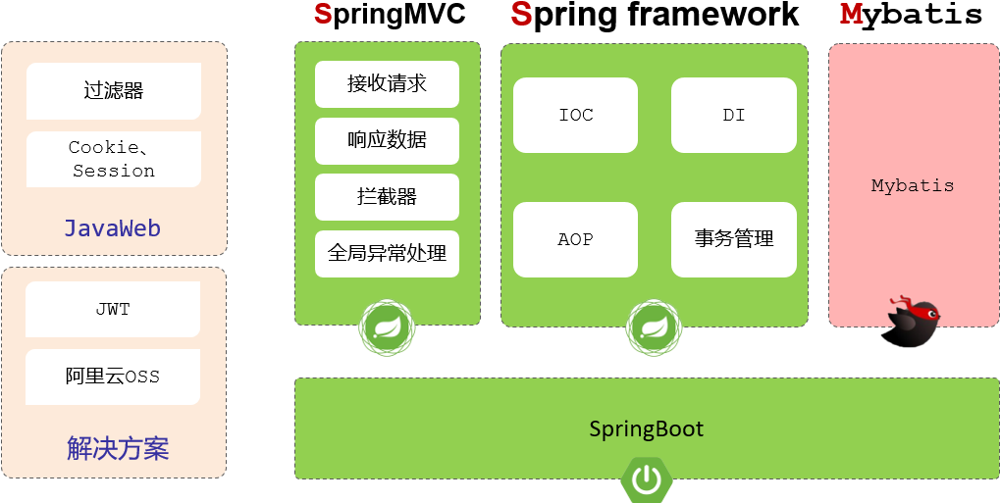
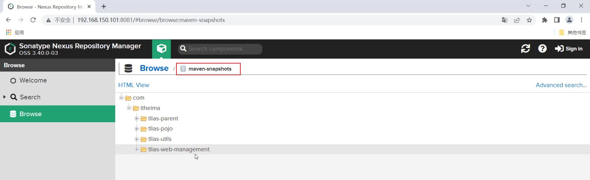

## 十、AOP

### 10.1 Spring事务管理

注解：@Transactional

位置：业务（service）层的方法上、类上、接口上

作用：将当前方法交给spring进行事务管理，方法执行前，开启事务；成功执行完毕，提交事物；出现异常，回滚事务

- rollbackFor：默认情况下，只有出现RuntimeException才回滚异常，rollbackFor属性用于控制出现何种异常类型，回滚事务

  ```java
   @Transactional (rollbackFor = Exception.class)//所有的异常都会继续进行事务回滚操作，默认情况下只有运行时异常才会进行事务回滚
  ```

- propagation：事务传播行为，指的是当一个事务方法被另一个事务方法调用时，这个事务方法应该如何进行事务控制

  | **属性值**    | **含义**                                                     |
  | ------------- | ------------------------------------------------------------ |
  | REQUIRED      | 【默认值】需要事务，有则加入，无则创建新事务                 |
  | REQUIRES_NEW  | 需要新事务，无论有无，总是创建新事务                         |
  | SUPPORTS      | 支持事务，有则加入，无则在无事务状态中运行                   |
  | NOT_SUPPORTED | 不支持事务，在无事务状态下运行,如果当前存在已有事务,则挂起当前事务 |
  | MANDATORY     | 必须有事务，否则抛异常                                       |
  | NEVER         | 必须没事务，否则抛异常                                       |
  | …             |                                                              |

### 10.2 AOP基础

#### 10.2.1 AOP快速入门

AOP：Aspect Oriented Programming（面向切面编程、面向方面编程），其实就是面向特定方法编程

动态代理是面向切面编程最主流的实现，而SpringAOP是Spring框架的高级技术，旨在管理bean对象的过程中，主要通过底层的动态代理机制，对特点的方法进行编程

**SpringAOP快速入门：统计各个业务层方法执行耗时：**

- 导入依赖：在pom.xml中导入AOP的依赖

- 编写AOP程序：针对于特定的方法根据业务需要进行编程

  ```java
  @Slf4j
  @Component
  @Aspect
  public class TimeAspect {
      @Around("execution(* com.itheima.service.*.*(..))")//切入点表达式、
      //第一个点：方法的返回值、类名、方法名
      public Object recordTime(ProceedingJoinPoint joinPoint) throws Throwable {
          //1.记录当前时间的毫秒值
          long begin = System.currentTimeMillis();
          //2.调用原始方法运行
          Object result = joinPoint.proceed();
          //3.记录结束时间，计算方法执行耗时
          long end = System.currentTimeMillis();
          log.info(joinPoint.getSignature()+"Time taken: {} ms", end - begin);
          return result;
      }
  }
  ```

#### 10.2.2 AOP核心概念

- 连接点：JoinPoint，可以被AOP控制的方法（暗含方法执行时的相关信息）
- 通知：Advice，指那些重复的逻辑，也就是共性功能（最终体现为一个方法）
- 切入点：PointCut，匹配连接点的条件，通知仅会在切入点方法执行时被应用
- 切面：Aspect，描述通知与切入点的对应关系（通知+切入点）
- 目标对象：target，通知所应用的对象

AOP执行流程：Spring的AOP底层是基于动态代理技术来实现的，也就是说在程序运行的时候，会自动的基于动态代理技术为目标对象生成一个对应的代理对象。在代理对象当中就会对目标对象当中的原始方法进行功能的增强。

### 10.3 AOP进阶

#### 10.3.1 通知类型

1. @Around：环绕通知，此注解标注的方法旨在目标方法前、后都被执行
2. @Before：前置通知，此注解标注的方法旨在目标方法前被执行
3. @After：环绕通知，此注解标注的方法旨在目标方法后都被执行，无论是否有异常都会被执行
4. @AfterReturning：返回后通知，此注解标注的通知方法在目标方法后被执行，有异常不会执行
5. @AfterThrowing：异常后通知，此注解标注的通知方法发生异常后执行

注：

- @Around环绕通知需要自己调用ProceedingJoinPoint.proceed()来让原始方法执行，其他通知不需要考虑目标方法执行
- @Around环绕通知方法的返回值，必须指定为Object，来接受原始方法的返回值

```java
//前置通知
@Before("execution(* com.itheima.service.*.*(..))")

//环绕通知
@Around("execution(* com.itheima.service.*.*(..))")
  
//后置通知
@After("execution(* com.itheima.service.*.*(..))")

//返回后通知（程序在正常执行的情况下，会执行的后置通知）
@AfterReturning("execution(* com.itheima.service.*.*(..))")

//异常通知（程序在出现异常的情况下，执行的后置通知）
@AfterThrowing("execution(* com.itheima.service.*.*(..))")
```

Spring提供了@PointCut注解，该注解的作用是将公共的切入点表达式抽取出来，需要用到时引用该切入点表达式即可

需要注意的是：当切入点方法使用private修饰时，仅能在当前切面类中引用该表达式， 当外部其他切面类中也要引用当前类中的切入点表达式，就需要把private改为public，而在引用的时候，具体的语法为：

全类名.方法名()，具体形式如下：

```java
@Slf4j
@Component
@Aspect
public class MyAspect2 {
    //引用MyAspect1切面类中的切入点表达式
    @Before("com.itheima.aspect.MyAspect1.pt()")
    public void before(){
        log.info("MyAspect2 -> before ...");
    }
}
```

#### 10.3.2 通知顺序

当有多个切面的切入点都匹配到了目标方法，目标方法运行时，多个通知方法都会被执行

执行顺序：

1. 在不同切面类中，默认按照切面类的类名字母排序：

目标方法前的通知方法：字母排名靠前的先执行

目标方法后的通知方法：字母排名靠前的后执行

1. 如果我们想控制通知的执行顺序有两种方式：

修改切面类的类名（这种方式非常繁琐、而且不便管理）

使用Spring提供的@Order注解

1. 用@Order（数字）加在切面类上来控制顺序

目标方法前的通知方法：数字小的先执行

目标方法后的通知方法：数字小的后执行

```java
@Slf4j
@Component
@Aspect
@Order(2)  //切面类的执行顺序（前置通知：数字越小先执行; 后置通知：数字越小越后执行）
public class MyAspect2 {
    //前置通知
    @Before("execution(* com.chen.service.*.*(..))")
    public void before(){
        log.info("MyAspect2 -> before ...");
    }

    //后置通知 
    @After("execution(* com.chen.service.*.*(..))")
    public void after(){
        log.info("MyAspect2 -> after ...");
    }
}
```

#### 10.3.3 切入点表达式

切入点表达式：描述切入点方法的一种表达式

作用：主要用来决定项目中的那些方法需要加入通知

常见形式：

1. exection(....)：根据的方法的签名来匹配
2. @annotation(....)：根据注解匹配

##### 10.3.3.1 execution

execution主要根据放方法的返回值、包名、类名、方法名、方法参数等信息来匹配，语法为：

`execution(访问修饰符？ 返回值 包名.类名.? 方法名(方法参数) throws 异常？)`

其中带？的表示可以省略的地方

- 访问修饰符：可省略（比如public、protected）
- 包名.类名：可省略
- throws异常：可省略（注意是方法上声明抛出的异常，不是实际抛出的异常）

实例：

```java
@Before("execution(void com.chen.service.impl.DeptServiceImpl.delete(java.lang.Integer))")
```

可以使用通配符描述切入点：

- *：单个独立的任意符号，可以统配任意返回值、包名、类名、方法名、任意类型的一个参数，也可以通过包、类、方法名的一部分

  ```java
  execution(* com.*.service.*.update*(*))
  ```

- ..：单个连续的任意符号，可以统配任意层级的包，或任意类型、任意个数的参数

  ```java
  execution(*com.chen..DeptService.*(..))
  ```


- 根据业务需要，可以使用 且（&&）、或（||）、非（!） 来组合比较复杂的切入点表达式。

  ```java
  execution(* com.itheima.service.DeptService.list(..)) || execution(* com.itheima.service. DeptService.delete(..))
  ```

切入点表达式的书写建议：

- 所有业务方法名在命名时尽量规范，方便切入点表达式快速匹配。如：查询类方法都是 find 开头，更新类方法都是update开头
- 描述切入点方法通常基于接口描述，而不是直接描述实现类，增强拓展性
- 在满足业务需要的前提下，尽量缩小切入点的匹配范围。如：包名匹配尽量不使用 ..，使用 * 匹配单个包

##### 10.3.3.1 @annotation

@annotation切入点表达式，用来匹配表示有特定注解的方法

实现步骤：

1. 编写自定义注解
2. 在业务类要做为连接点的方法上添加自定义注解

自定义注解：MyLog

```java
@Target(ElementType.METHOD)
@Retention(RetentionPolicy.RUNTIME)
public @interface MyLog {
}
```

```java
@Slf4j
@Component
@Aspect
public class MyAspect6 {
    //针对list方法、delete方法进行前置通知和后置通知

    //前置通知
    @Before("@annotation(com.itheima.anno.MyLog)")
    public void before(){
        log.info("MyAspect6 -> before ...");
    }

    //后置通知
    @After("@annotation(com.itheima.anno.MyLog)")
    public void after(){
        log.info("MyAspect6 -> after ...");
    }
}
```

- execution切入点表达式
  - 根据我们所指定的方法的描述信息来匹配切入点方法，这种方式也是最为常用的一种方式
  - 如果我们要匹配的切入点方法的方法名不规则，或者有一些比较特殊的需求，通过execution切入点表达式描述比较繁琐
- annotation 切入点表达式
  - 基于注解的方式来匹配切入点方法。这种方式虽然多一步操作，我们需要自定义一个注解，但是相对来比较灵活。我们需要匹配哪个方法，就在方法上加上对应的注解就可以了

#### 10.3.4 连接点

在Spring中用JoinPoint抽象了连接点，用它可以获得方法执行时的相关信息，如目标类名、方法名、方法参数等

- 对于@Around通知，获取连接点信息只能使用ProceedingJoinPointt
- 对于其他四种通知，获取连接点信息只能使用JoinPoint，它是proceedingJoinPoint的父类型

实例代码：

```java
@Slf4j
@Component
@Aspect
public class MyAspect7 {

    @Pointcut("@annotation(com.itheima.anno.MyLog)")
    private void pt(){}
   
    //前置通知
    @Before("pt()")
    public void before(JoinPoint joinPoint){
        log.info(joinPoint.getSignature().getName() + " MyAspect7 -> before ...");
    }
    
    //后置通知
    @Before("pt()")
    public void after(JoinPoint joinPoint){
        log.info(joinPoint.getSignature().getName() + " MyAspect7 -> after ...");
    }

    //环绕通知
    @Around("pt()")
    public Object around(ProceedingJoinPoint pjp) throws Throwable {
        //获取目标类名
        String name = pjp.getTarget().getClass().getName();
        log.info("目标类名：{}",name);

        //目标方法名
        String methodName = pjp.getSignature().getName();
        log.info("目标方法名：{}",methodName);

        //获取方法执行时需要的参数
        Object[] args = pjp.getArgs();
        log.info("目标方法参数：{}", Arrays.toString(args));

        //执行原始方法
        Object returnValue = pjp.proceed();

        return returnValue;
    }
}

```


## 十一、SpringBoot原理

### 11.1 配置优先级

SpringBoot项目当中支持的三类配置文件：application.properties、application.yml、application.yaml

配置文件优先级排名（从高到低）：

1. properties配置文件
2. yml配置文件
3. yaml配置文件

SpringBoot除了支持配置文件属性配置，还支持java系统属性和命令行参数的方式进行属性配置：

1. Java系统属性配置 （格式： -Dkey=value）

   ```shell
   -Dserver.port=9000
   ```

2. 命令行参数 （格式：--key=value）

   ```shell
   --server.port=10010
   ```

如果项目已经打包上线了，这个时候我们又如何来设置Java系统属性和命令行参数：

```shell
java -Dserver.port=9000 -jar XXXXX.jar --server.port=10010
```

1. 执行maven打包指令package，把项目打成jar文件
2. 使用命令：java -jar 方式运行jar文件程序

### 11.2 Bean管理

#### 11.2.1 获取Bean

默认情况下，Spring项目启动时，会把bean都创建好放在IOC容器中，如果想要主动获取这些bean，可以通过如下方式：

- 根据name获取bean：`Obejct getBean(String name)`
- 根据类型获取bean：`<T> T getBean(Class<T> requiredType)`
- 根据name获取bean(带类型转化)：`<T> T getBean(String name,Class<T> requiredType)`

```java
public void testGetBean() {
    //根据bean的名称获取
    DeptController bean1 = (DeptController) applicationContext.getBean("deptController");
    System.out.println(bean1);
    //根据bean的类型获取
    DeptController bean2 = applicationContext.getBean(DeptController.class);
    System.out.println(bean2);
    //根据bean的名称和类型获取
    DeptController bean3 = applicationContext.getBean("deptController", DeptController.class);
    System.out.println(bean3);
}
```

#### 11.2.2 bean作用域

Spring支持五种作用域，后三种在web环境才生效：

| 作用域      | 说明                                         |
| ----------- | -------------------------------------------- |
| sington     | 容器内同名称的bean只有一个实例（单例）(默认) |
| prototype   | 每次使用该bean时会创建新的实例               |
| request     | 每个请求范围内会创建新的实例                 |
| session     | 每个会话范围内会创建新的实例                 |
| application | 每个应用范围内会创建新的实例                 |

可以通过@Scope注解来配置作用域：

```java
@Scope("prototype")
@Slf4j
@RestController
@RequestMapping("/depts")
public class DeptController {
}
```

注意事项：

- IOC容器中的bean默认使用的作用域：singleton (单例)
- 默认singleton的bean，在容器启动时被创建，可以使用@Lazy注解来延迟初始化(延迟到第一次使用时)
- prototype的bean，每一次使用该bean的时候都会创建一个新的实例
- 实际开发当中，绝大部分的Bean是单例的，也就是说绝大部分Bean不需要配置scope属性

#### 11.2.3 第三方bean

如果要管理的bean对象来自于第三方（不是自定义的），是无法用@Component及衍生注解声明bean的，就需要用到@Bean注解

**解决方案1：在启动类上添加@Bean标识的方法**

```java
@SpringBootApplication
public class SpringbootWebConfig2Application {

    public static void main(String[] args) {
        SpringApplication.run(SpringbootWebConfig2Application.class, args);
    }

    //声明第三方bean
    @Bean //将当前方法的返回值对象交给IOC容器管理, 成为IOC容器bean
    public SAXReader saxReader(){
        return new SAXReader();
    }
}

```

**解决方案2：在配置类中定义@Bean标识的方法**

若要管理的是第三方bean对象，建议对这些bean进行集中分类管理，通过@Configuration注解声明一个配置类

```java
@Configuration //配置类  (在配置类当中对第三方bean进行集中的配置管理)
public class CommonConfig {

    //声明第三方bean
    @Bean //将当前方法的返回值对象交给IOC容器管理, 成为IOC容器bean
          //通过@Bean注解的name/value属性指定bean名称, 如果未指定, 默认是方法名
    public SAXReader reader(DeptService deptService){
        System.out.println(deptService);
        return new SAXReader();
    }

}
```

注意事项 ：

- 通过@Bean注解的name或value属性可以声明bean的名称，如果不指定，默认bean的名称就是方法名。
- 如果第三方bean需要依赖其它bean对象，直接在bean定义方法中设置形参即可，容器会根据类型自动装配。

### 11.3 SpringBoot原理

#### 11.3.1 起步依赖

使用了SpringBoot只需要引入一个依赖就可以了，那就是web开发的起步依赖：springboot-starter-web。

为什么我们只需要引入一个web开发的起步依赖，web开发所需要的所有的依赖都有了呢？

- 因为Maven的依赖传递。

> - 在SpringBoot给我们提供的这些起步依赖当中，已提供了当前程序开发所需要的所有的常见依赖(官网地址：https://docs.spring.io/spring-boot/docs/2.7.7/reference/htmlsingle/#using.build-systems.starters)。
> - 比如：springboot-starter-web，这是web开发的起步依赖，在web开发的起步依赖当中，就集成了web开发中常见的依赖：json、web、webmvc、tomcat等。我们只需要引入这一个起步依赖，其他的依赖都会自动的通过Maven的依赖传递进来。

**结论：起步依赖的原理就是Maven的依赖传递。**

#### 11.3.2 自动配置原理

SpringBoot的自动配置就是当spring容器启动后，一些配置类、bean对象就自动存入到IOC容器中，不需要我们手动声明，从而简化开发，省去了繁琐的配置操作

@ComponentScan组件扫描

```java
@SpringBootApplication
@ComponentScan({"com.itheima","com.example"}) //指定要扫描的包
public class SpringbootWebConfig2Application {
    public static void main(String[] args) {
        SpringApplication.run(SpringbootWebConfig2Application.class, args);
    }
}

```

> 采用以上这种方式来完成自动配置，那我们进行项目开发时，当需要引入大量的第三方的依赖，就需要在启动类上配置N多要扫描的包，这种方式会很繁琐。而且这种大面积的扫描性能也比较低。
>
> 缺点：
>
> 1. 使用繁琐
> 2. 性能低

@Import导入

导入形式主要有以下几种：

1. 导入普通类
2. 导入配置类
3. 导入ImportSelector接口实现类
4. 使用第三方依赖提供的 @EnableXxxxx注解，封装的@Import注解

 使用@Import导入类：

```java
@Import(TokenParser.class) //导入的类会被Spring加载到IOC容器中
@SpringBootApplication
public class SpringbootWebConfig2Application {
    public static void main(String[] args) {
        SpringApplication.run(SpringbootWebConfig2Application.class, args);
    }
}
```

如果基于以上方式完成自动配置，当要引入一个第三方依赖时，是不是还要知道第三方依赖中有哪些配置类和哪些Bean对象？

- 答案：是的。 （对程序员来讲，很不友好，而且比较繁琐）

思考：当我们要使用第三方依赖，依赖中到底有哪些bean和配置类，谁最清楚？

- 答案：第三方依赖自身最清楚。

> **结论：我们不用自己指定要导入哪些bean对象和配置类了，让第三方依赖它自己来指定。**

使用第三方依赖提供的 @EnableXxxxx注解

- 第三方依赖中提供的注解

```java
@Retention(RetentionPolicy.RUNTIME)
@Target(ElementType.TYPE)
@Import(MyImportSelector.class)//指定要导入哪些bean对象或配置类
public @interface EnableHeaderConfig { 
}
```

- 在使用时只需在启动类上加上@EnableXxxxx注解即可

```java
@EnableHeaderConfig  //使用第三方依赖提供的Enable开头的注解
@SpringBootApplication
public class SpringbootWebConfig2Application {
    public static void main(String[] args) {
        SpringApplication.run(SpringbootWebConfig2Application.class, args);
    }
}

```

#### 11.3.3 自动配置源码跟踪

@SpringBootApplication该注解表示在SpringBoot工程引导类上，是SpringBoot中最重要的注解，该注解有三个部分组成：

* @SpringBootConfiguration：该注解与@Configuration注解所用相同，用来声明当前也是一个配置类
* @ComponentScan：组件扫描，默认扫描当前引导类所在包及其子包
* @EnableAutoConfiguration：SpringBoot实现自动化配置的核心注解

自动配置原理源码入口就是@SpringBootApplication注解，在这个注解中封装了3个注解，分别是：

- @SpringBootConfiguration
  - 声明当前类是一个配置类
- @ComponentScan
  - 进行组件扫描（SpringBoot中默认扫描的是启动类所在的当前包及其子包）
- @EnableAutoConfiguration
  - 封装了@Import注解（Import注解中指定了一个ImportSelector接口的实现类）
    - 在实现类重写的selectImports()方法，读取当前项目下所有依赖jar包中META-INF/spring.factories、META-INF/spring/org.springframework.boot.autoconfigure.AutoConfiguration.imports两个文件里面定义的配置类（配置类中定义了@Bean注解标识的方法）。

当SpringBoot程序启动时，就会加载配置文件当中所定义的配置类，并将这些配置类信息(类的全限定名)封装到String类型的数组中，最终通过@Import注解将这些配置类全部加载到Spring的IOC容器中，交给IOC容器管理。

#### 11.3.4 自动配置@Conditional

我们在跟踪SpringBoot自动配置的源码的时候，在自动配置类声明bean的时候，除了在方法上加了一个@Bean注解以外，还会经常用到一个注解，就是以Conditional开头的这一类的注解。以Conditional开头的这些注解都是条件装配的注解。

@Conditional注解：

- 作用：按照一定的条件进行判断，在满足给定条件后才会注册对应的bean对象到Spring的IOC容器中。
- 位置：方法、类
- @Conditional本身是一个父注解，派生出大量的子注解：
  - @ConditionalOnClass：判断环境中有对应字节码文件，才注册bean到IOC容器。
  - @ConditionalOnMissingBean：判断环境中没有对应的bean(类型或名称)，才注册bean到IOC容器。
  - @ConditionalOnProperty：判断配置文件中有对应属性和值，才注册bean到IOC容器。

#### 11.3.5 自动配置总结

自动配置的核心就在@SpringBootApplication注解上，SpringBootApplication这个注解底层包含了3个注解，分别是：

- @SpringBootConfiguration
- @ComponentScan
- @EnableAutoConfiguration

@EnableAutoConfiguration这个注解才是自动配置的核心。

- 它封装了一个@Import注解，Import注解里面指定了一个ImportSelector接口的实现类。
- 在这个实现类中，重写了ImportSelector接口中的selectImports()方法。
- 而selectImports()方法中会去读取两份配置文件，并将配置文件中定义的配置类做为selectImports()方法的返回值返回，返回值代表的就是需要将哪些类交给Spring的IOC容器进行管理。
- 那么所有自动配置类的中声明的bean都会加载到Spring的IOC容器中吗? 其实并不会，因为这些配置类中在声明bean时，通常都会添加@Conditional开头的注解，这个注解就是进行条件装配。而Spring会根据Conditional注解有选择性的进行bean的创建。
- @Enable 开头的注解底层，它就封装了一个注解 import 注解，它里面指定了一个类，是 ImportSelector 接口的实现类。在实现类当中，我们需要去实现 ImportSelector  接口当中的一个方法 selectImports 这个方法。这个方法的返回值代表的就是我需要将哪些类交给 spring 的 IOC容器进行管理。
- 此时它会去读取两份配置文件，一份儿是 spring.factories，另外一份儿是 autoConfiguration.imports。而在  autoConfiguration.imports 这份儿文件当中，它就会去配置大量的自动配置的类。
- 而前面我们也提到过这些所有的自动配置类当中，所有的 bean都会加载到 spring 的 IOC 容器当中吗？其实并不会，因为这些配置类当中，在声明 bean 的时候，通常会加上这么一类@Conditional 开头的注解。这个注解就是进行条件装配。所以SpringBoot非常的智能，它会根据 @Conditional 注解来进行条件装配。只有条件成立，它才会声明这个bean，才会将这个 bean 交给 IOC 容器管理。

### 11.4 自定义starter

在实际开发中，经常会定义一些公共组件，提供给各个项目团队使用，而在SpringBoot项目中使用，一般会将这些公共组件封装为SpringBoot的starter

在自定义一个起步依赖starter的时候，按照规范需要定义两个模块：

1. starter模块（进行依赖管理[把程序开发所需要的依赖都定义在starter起步依赖中]）
2. autoconfigure模块（自动配置）

> 将来在项目当中进行相关功能开发时，只需要引入一个起步依赖就可以了，因为它会将autoconfigure自动配置的依赖给传递下来。

[code File](D:\Java\javawenjian\example\aliyun-oss-spring-boot-autoconfigure)

### 11.5 Web后端开发总结

web后端开发现在基本上都是基于标准的三层架构进行开发的，在三层架构当中，Controller控制器层负责接收请求响应数据，Service业务层负责具体的业务逻辑处理，而Dao数据访问层也叫持久层，就是用来处理数据访问操作的，来完成数据库当中数据的增删改查操作。


> 在三层架构当中，前端发起请求首先会到达Controller(不进行逻辑处理)，然后Controller会直接调用Service 进行逻辑处理， Service再调用Dao完成数据访问操作。

如果我们在执行具体的业务处理之前，需要去做一些通用的业务处理，比如：我们要进行统一的登录校验，我们要进行统一的字符编码等这些操作时，我们就可以借助于Javaweb当中三大组件之一的过滤器Filter或者是Spring当中提供的拦截器Interceptor来实现。


而为了实现三层架构层与层之间的解耦，我们学习了Spring框架当中的第一大核心：IOC控制反转与DI依赖注入。

> 所谓控制反转，指的是将对象创建的控制权由应用程序自身交给外部容器，这个容器就是我们常说的IOC容器或Spring容器。
>
> 而DI依赖注入指的是容器为程序提供运行时所需要的资源。

除了IOC与DI我们还讲到了AOP面向切面编程，还有Spring中的事务管理、全局异常处理器，以及传递会话技术Cookie、Session以及新的会话跟踪解决方案JWT令牌，阿里云OSS对象存储服务，以及通过Mybatis持久层架构操作数据库等技术。


> Filter过滤器、Cookie、 Session这些都是传统的JavaWeb提供的技术。
>
> JWT令牌、阿里云OSS对象存储服务，是现在企业项目中常见的一些解决方案。
>
> IOC控制反转、DI依赖注入、AOP面向切面编程、事务管理、全局异常处理、拦截器等，这些技术都是 Spring Framework框架当中提供的核心功能。
>
> Mybatis就是一个持久层的框架，是用来操作数据库的。

在Spring框架的生态中，对web程序开发提供了很好的支持，如：全局异常处理器、拦截器这些都是Spring框架中web开发模块所提供的功能，而Spring框架的web开发模块，我们也称为：SpringMVC



> SpringMVC不是一个单独的框架，它是Spring框架的一部分，是Spring框架中的web开发模块，是用来简化原始的Servlet程序开发的。

外界俗称的SSM，就是由：SpringMVC、Spring Framework、Mybatis三块组成。

基于传统的SSM框架进行整合开发项目会比较繁琐，而且效率也比较低，所以在现在的企业项目开发当中，基本上都是直接基于SpringBoot整合SSM进行项目开发的。

## 十二、maven高级

### 12.1 分模块设计与开发

将项目按照功能拆分成若干个子模块，方便项目的管理维护、扩展，也方便模块间的相互调用，资源共享

> 1). 什么是分模块设计：将项目按照功能拆分成若干个子模块

> 2). 为什么要分模块设计：方便项目的管理维护、扩展，也方便模块间的相互调用，资源共享

> 3). 注意事项：分模块设计需要先针对模块功能进行设计，再进行编码。不会先将工程开发完毕，然后进行拆分

注：导入自己的模块时，要通过maven指令安装模块到本地仓库（install指令）

### 12.2 继承与聚合

#### 12.2.1 继承关系实现

继承描述的是两个工程之间的关系，与java继承相似，子工程可以继承父工程中的配置信息，常见于依赖关系的继承

作用：简化依赖配置、统一管理依赖

实现：`<parent>..</parent>`

1). 创建maven模块 tlias-parent ，该工程为父工程，设置打包方式pom(默认jar)

Maven打包方式：

```xml
<parent>
    <groupId>org.springframework.boot</groupId>
    <artifactId>spring-boot-starter-parent</artifactId>
    <version>2.7.5</version>
    <relativePath/> <!-- lookup parent from repository -->
</parent>

<groupId>com.itheima</groupId>
<artifactId>tlias-parent</artifactId>
<version>1.0-SNAPSHOT</version>
<packaging>pom</packaging>
```

- jar：普通模块打包，springboot项目基本都是jar包（内嵌tomcat运行）
- war：普通web程序打包，需要部署在外部的tomcat服务器中运行
- pom：父工程或聚合工程，该模块不写代码，仅进行依赖管理

2). 在子工程的pom.xml文件中，配置继承关系。

```xml
<parent>
    <groupId>com.itheima</groupId>
    <artifactId>tlias-parent</artifactId>
    <version>1.0-SNAPSHOT</version>
    <relativePath>../tlias-parent/pom.xml</relativePath>
</parent>

<artifactId>tlias-utils</artifactId>
<version>1.0-SNAPSHOT</version>
```

注意：

- 在子工程中，配置了继承关系之后，坐标中的groupId是可以省略的，因为会自动继承父工程的 。

- relativePath指定父工程的pom文件的相对位置（如果不指定，将从本地仓库/远程仓库查找该工程）。

  ../ 代表的上一级目录

3). 在父工程中配置各个工程共有的依赖（子工程会自动继承父工程的依赖）

注意：

* 若父子工程都配置了同一个依赖的不同版本，以子工程为准

#### 12.2.2 版本锁定

在maven中，可以在父工程的pom文件中通过`<dependencyManagement>`来统一管理依赖版本

注意：

- 在父工程中所配置的 `<dependencyManagement>` 只能统一管理依赖版本，并不会将这个依赖直接引入进来。 这点和 `<dependencies>` 是不同的
- 子工程要使用这个依赖，还是需要引入的，只是此时就无需指定 `<version>` 版本号了，父工程统一管理。变更依赖版本，只需在父工程中统一变更

自定义属性/引用属性：

我们也可以通过自定义属性及属性引用的形式，在父工程中将依赖的版本号进行集中管理维护。 具体语法为：

1). 自定义属性

```xml
<properties>
	<lombok.version>1.18.24</lombok.version>
</properties>
```

2). 引用属性

```xml
<dependency>
    <groupId>org.projectlombok</groupId>
    <artifactId>lombok</artifactId>
    <version>${lombok.version}</version>
</dependency>
```

**`<dependencyManagement>` 与 `<dependencies>` 的区别是：**

- `<dependencies>` 是直接依赖，在父工程配置了依赖，子工程会直接继承下来。 
- `<dependencyManagement>` 是统一管理依赖版本，不会直接依赖，还需要在子工程中引入所需依赖(无需指定版本)

#### 12.2.3 聚合

聚合：将多个模块组成一个整体，同时进行项目的构建

聚合工程：一个不具有业务功能的”空“工程（有且仅有一个pom文件） 【PS：一般来说，继承关系中的父工程与聚合关系中的聚合工程是同一个】

作用：快速构建项目（无需根据依赖关系手动构建，直接在聚合工程上构建即可）

maven中可以通过`<modules>`设置当前聚合工程所包含的子模块名称

```xml
<!--聚合其他模块-->
<modules>
    <module>../tlias-pojo</module>
    <module>../tlias-utils</module>
    <module>../tlias-web-management</module>
</modules>
```

#### 12.2.4 继承与聚合对比

- **作用**
  - 聚合用于快速构建项目
  - 继承用于简化依赖配置、统一管理依赖
- **相同点：**
  - 聚合与继承的pom.xml文件打包方式均为pom，通常将两种关系制作到同一个pom文件中
  - 聚合与继承均属于设计型模块，并无实际的模块内容
- **不同点：**
  - 聚合是在聚合工程中配置关系，聚合可以感知到参与聚合的模块有哪些
  - 继承是在子模块中配置关系，父模块无法感知哪些子模块继承了自己

### 12.3 Maven私服

私服是一种特殊的远程仓库，它是架设在局域网内的仓库服务，用于代理外部的中央仓库，用来解决团队内部的资源共享与资源同步问题

依赖查找顺序：

* 本地仓库→私服→中央仓库

####  资源上传与下载

#### 12.3.1 步骤分析

 

资源上传与下载，我们需要做三步配置，执行一条指令。

第一步配置：在maven的配置文件中配置访问私服的用户名、密码。

第二步配置：在maven的配置文件中配置连接私服的地址(url地址)。

第三步配置：在项目的pom.xml文件中配置上传资源的位置(url地址)。

配置好了上述三步之后，要上传资源到私服仓库，就执行执行maven生命周期：deploy。

> 私服仓库说明：
>
> - RELEASE：存储自己开发的RELEASE发布版本的资源。
> - SNAPSHOT：存储自己开发的SNAPSHOT发布版本的资源。
> - Central：存储的是从中央仓库下载下来的依赖。

> 项目版本说明：
>
> - RELEASE(发布版本)：功能趋于稳定、当前更新停止，可以用于发行的版本，存储在私服中的RELEASE仓库中。
> - SNAPSHOT(快照版本)：功能不稳定、尚处于开发中的版本，即快照版本，存储在私服的SNAPSHOT仓库中。

#### 12.3.2 具体操作

为了模拟企业开发，这里我准备好了一台服务器（192.168.150.101），私服已经搭建好了，我们可以访问私服测试：http://192.168.150.101:8081

 

私服准备好了之后，我们要做如下几步配置：

**1.设置私服的访问用户名/密码（在自己maven安装目录下的conf/settings.xml中的servers中配置）**

```xml
<server>
    <id>maven-releases</id>
    <username>admin</username>
    <password>admin</password>
</server>
    
<server>
    <id>maven-snapshots</id>
    <username>admin</username>
    <password>admin</password>
</server>
```

**2.设置私服依赖下载的仓库组地址（在自己maven安装目录下的conf/settings.xml中的mirrors、profiles中配置）**

```xml
<mirror>
    <id>maven-public</id>
    <mirrorOf>*</mirrorOf>
    <url>http://192.168.150.101:8081/repository/maven-public/</url>
</mirror>
```

```xml
<profile>
    <id>allow-snapshots</id>
        <activation>
        	<activeByDefault>true</activeByDefault>
        </activation>
    <repositories>
        <repository>
            <id>maven-public</id>
            <url>http://192.168.150.101:8081/repository/maven-public/</url>
            <releases>
            	<enabled>true</enabled>
            </releases>
            <snapshots>
            	<enabled>true</enabled>
            </snapshots>
        </repository>
    </repositories>
</profile>
```

**3.IDEA的maven工程的pom文件中配置上传（发布）地址(直接在tlias-parent中配置发布地址)**

```xml
<distributionManagement>
    <!-- release版本的发布地址 -->
    <repository>
        <id>maven-releases</id>
        <url>http://192.168.150.101:8081/repository/maven-releases/</url>
    </repository>

    <!-- snapshot版本的发布地址 -->
    <snapshotRepository>
        <id>maven-snapshots</id>
        <url>http://192.168.150.101:8081/repository/maven-snapshots/</url>
    </snapshotRepository>
</distributionManagement>
```

配置完成之后，我们就可以在tlias-parent中执行**deploy**生命周期，将项目发布到私服仓库中。 


通过日志，我们可以看到，这几个模块打的jar包确实已经上传到了私服仓库中（由于当前我们的项目是SNAPSHOT版本，所以jar包是上传到了snapshot仓库中）。

那接下来，我们再来打开私服来看一下：

 

我们看到，我们项目中的这几个模块，在私服中都有了。 那接下来，当其他项目组的开发人员在项目中，就可以直接通过依赖的坐标，就可以完成引入对应的依赖，此时本地仓库没有，就会自动从私服仓库中下载。

> 备注说明：
>
> - 测试使用私服进行资源的上传和下载。可以参照如下步骤，启动给大家准备的本地私服操作：
>   - 解压： 资料中提供的压缩包  apache-maven-nexus.zip
>   - 进入目录： apache-maven-nexus\nexus-3.39.0-01\bin
>   - 启动服务：双击 start.bat 
>   - 访问服务：localhost:8081
>   - 私服配置说明：将上述配置私服信息的 192.168.150.101 改为 localhost 

## 十三、补充

### 13.1 Javabean

实体类：专门用来封装的数据的类

Java程序的数据保存在数据库中，一个实体类对应了数据一张表

一个Javabean对象，对应了表中的一行数据

### 13.2 Servlet

#### 13.2.1 Servlet入门

概念：server applet，运行在服务器端的小程序

Servlet就是一个端口，定义了Java类被浏览器访问到（tomcat识别）的规则；将来我们自定义一个类，实现Servlet接口，复写方法

快速入门：

* 创建JavaEE项目

* 定义一个类，实现Servlet接口

* 实现接口中的抽象方法

* 配置Servlet

  ```xml
    <servlet>
      <servlet-name>demo</servlet-name>
      <servlet-class>com.chen.servlet.servlet</servlet-class>
    </servlet>
    
    <servlet-mapping>
      <servlet-name>demo</servlet-name>
      <url-pattern>/demo</url-pattern>
    </servlet-mapping>
  ```

13.2.2

### 13.3 JDBC

#### 13.3.1 JDBC入门

概念：java database connectivity，Java数据库连接，Java语言操作数据库

JDBC本质：其实是官方（sun公司）定义的一套操作所有关系型数据库的规则，即接口。各个数据库厂商去实现这套接口，提供数据库驱动jar包，我们可以使用这套接口编程，真正执行的代码是驱动jar包中的实现类

```java
/**
 * jdbc快速入门
 */
public class demo01 {
    public static void main(String[] args) throws Exception {
        //1.导入驱动jar包
        //2.注册驱动
        Class.forName("com.mysql.cj.jdbc.Driver");
        //3.获取数据库的连接对象
        Connection connection = DriverManager.getConnection(
                "jdbc:mysql://localhost:3306/test", "root", "123456");
        //4.定义sql语句
        String sql = "select * from student";
        //5.获取执行sql的对象 Statement
        Statement statement = connection.createStatement();
        //6.执行sql
        ResultSet resultSet = statement.executeQuery(sql);
        //7.处理结果
        while (resultSet.next()) {
            int id = resultSet.getInt("id");
            String name = resultSet.getString("name");
            int age = resultSet.getInt("age");
            System.out.println(id + " " + name + " " + age);
        }
        //8.释放资源
        statement.close();
        connection.close();
    }
}
```

#### 13.3.2  JDBC各个对象

1. DriverManager：驱动管理对象

   功能：

   1. 注册驱动（告诉程序该使用哪一个数据库驱动jar包）mysql5之后的驱动jar包可以省略注册驱动的步骤；
   2. 获取数据库连接

2. Connection：数据库连接对象

   功能：

   1. 获取执行sql的对象：`createStatement()`
   2. 管理事务：
      * 开启事务：`setAutoCommit(boolean autocomment)`：参数为false时开启事务
      * 提交事务：`commit()`
      * 回滚事务：`rollback()`

3. Statement：执行sql的对象

   功能：执行sql：

   `boolean execute(String sql)`：可以执行静态的sql

   `int executeUpdate(String sql)`：执行DML（update、insert、delete）、DDL（create、alter、drop）语句，返回值是影响的行数

   `ResultSet executeQuery(String sql)`：执行DQL（select）语句

4. ResultSet：结果集对象，封装查询结果

   next()：游标向下移动一行;

   getxxx(columnLabel)：xxx代表数据类型，获取数据;参数int：代表列的编号，String：代表列名称

5. PreparedStatement：执行sql的对象

   ​