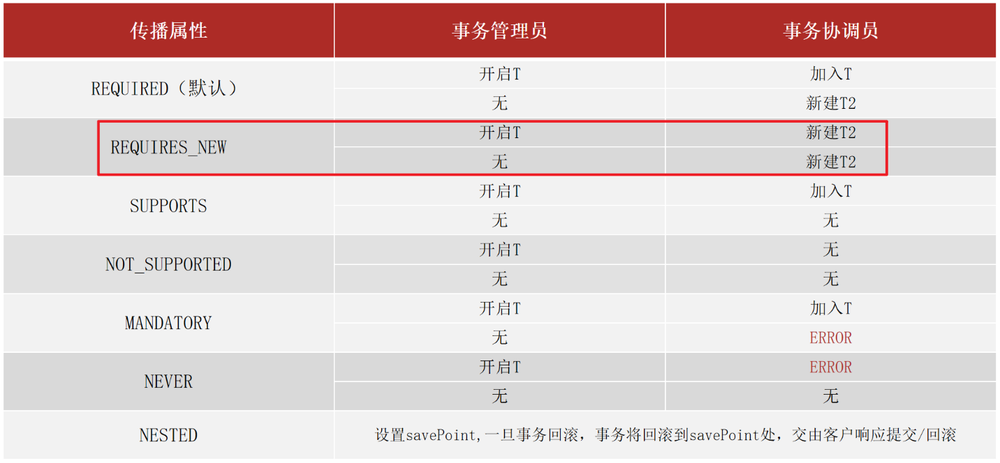

## 一、Spring

### 1.1 初识Spring

Spring提供了若干个项目，每个项目用于完成特定的功能

* Spring Framework：是Spring生态圈中最基础的项目，是其他项目的基础
* Spring Boot
* Spring Cloud

### 1.2 Spring Framework系统架构

* Core Container：核心容器
* AOP：面向切面编程
* Aspects：Aop思想实现
* Data Access：数据访问
* Data Integration：数据集成
* Web：web开发
* Test：单元测试与集成测试

### 1.3 核心容器

#### 1.3.1 核心概念

Ioc控制反转：使用对象时，由主动new产生对象转换由外部提供对象，此过程中对象创建控制权由程序转移到外部，此思想成为控制反转

Spring技术对Ioc思想进行了实现：

* Spring提供了一个容器，成为Ioc容器，用来充当Ioc思想中的外部
* Ioc容器负责对象的创建、初始化等一系列工作，被创建或管理的对象在Ioc容器统称为为bean

DI依赖注入：

* 在容器中建立bean与bean之间的依赖关系的整个过程，被称为依赖注入

目标：充分解耦

* 使用Ioc容器管理bean（Ioc）
* 在Ioc容器内将有依赖关系的bean进行关系绑定（DI）

最终效果：

* 使用对象时不仅可以直接从Ioc容器内获取，并且获取到的bean已经绑定了所有的依赖关系

#### 1.3.2 Ioc入门案例

[Ioc入门案例](D:\Java\javawenjian\Spring\spring_01_quickstart)

#### 1.3.3 DI案例

1. 基于Ioc管理bean
2. Service中使用new形式创建的Dao对象是否保留（否）
3. Service中需要的Dao对象如何让进入到Service中（提供方法）
4. Service与Dao间的关系如何描述（配置）

```xml
<!--配置Service与dao的关系-->
<!--property表示配置当前bean的属性
name标签表示配置哪一个具体的属性
ref表示参考哪一个bean-->
<property name="bookDao" ref="bookDao"/>
```

#### 1.3.4 bean配置

bean基础配置

代码实例：

```xml
<!--2.配置bean-->
<!--bean标签表示配置bean
id属性表示给bean起名字
class属性表示给bean定义类型-->
<bean id="bookDao" class="com.itheima.dao.impl.BookDaoImpl"/>
<bean id="bookService" class="com.itheima.service.impl.BookServiceImpl">
```

bean别名设置

| 类别       | 描述                                                         |
| ---------- | ------------------------------------------------------------ |
| 名称、类型 | name、属 性                                                  |
| 所属       | bean标签                                                     |
| 功能       | 定义bean的别名，可以定义多个，使用逗号(,)分号(;)空格()分隔   |
| 范例       | `<bean id="bookService" name="service service4 bookEbi"                                                        class="com.itheima.service.impl.BookServiceImpl">   `   <br>`<bean id="bookDao" name="dao" class="com.itheima.dao.impl.BookDaoImpl" scope="prototype"/>` |

bean作用范围配置

| 类别       | 描述                                                         |
| ---------- | ------------------------------------------------------------ |
| 名称、类型 | scope、属性                                                  |
| 所属       | bean标签                                                     |
| 功能       | 定义bean的作用范围：singleton：单例、prototype：非单例       |
| 范例       | `<bean id="bookDao" name="dao" class="com.itheima.dao.impl.BookDaoImpl" scope="prototype"/>` |

适合交给容器进行管理的bean（单例）：表现层对象、业务层对象、数据层对象、工具对象

不适合交给容器进行管理的bean：封装实体的域对象

#### 1.3.5  bean实例化

bean本质上就是对象，创建bean使用构造方法完成

1. 构造方法

```xml
<!--方式一：构造方法实例化bean-->
<bean id="bookDao" class="com.itheima.dao.impl.BookDaoImpl"/>
```

无参构造方法如果不存在，将抛出BeanCreationException

2. 静态工厂

```xml
<!--方式二：使用静态工厂实例化bean-->
<bean id="orderDao" class="com.itheima.factory.OrderDaoFactory" factory-method="getOrderDao"/>
```

3. 实例工厂

```xml
<!--方式三：使用实例工厂实例化bean-->
<bean id="userFactory" class="com.itheima.factory.UserDaoFactory"/>
<bean id="userDao" factory-method="getUserDao" factory-bean="userFactory"/>
```

4. FactoryBean

```java
public class UserDaoFactoryBean implements FactoryBean<UserDao> {
    //代替原始实例工厂中创建对象的方法
    @Override
    public UserDao getObject() throws Exception {
        return new UserDaoImpl();
    }
    @Override
    public Class<?> getObjectType() {
        return UserDao.class;
    }
    @Override
    public boolean isSingleton() {
        //返回true代表造出单例对象，false代表非单例对象
        return false;
    }
}
```

```xml
<!--方式四：使用FactoryBean实例化bean-->
<bean id="userDao" class="com.itheima.factory.UserDaoFactoryBean"/>
```

#### 1.3.6 bean的生命周期

bean生命周期：bean从创建到销毁的整体进程

bean生命周期的控制：在bean创建后到销毁前做一些事情

1. 方法一：

提供生命周期控制方法

```java
public class BookDaoImpl implements BookDao {
    public void save() {
        System.out.println("book dao save ...");
    }
    //表示bean初始化对应的操作
    public void init(){
        System.out.println("book dao init ...");
    }
    //表示bean销毁前的对应的操作
    public void destroy(){
        System.out.println("book dao destroy ...");
    }
}
```

配置生命周期控制方法

```xml
<bean id="bookDao" class="com.itheima.dao.impl.BookDaoImpl"init-method="init" destroy-method="destroy"/>
```

2. 方法二：

```java
public class BookServiceImpl implements BookService, InitializingBean, DisposableBean {
    public void save() {
        bookDao.save();
    }
    @Override
    public void destroy() throws Exception {
        System.out.println("book service destroy...");
    }
    @Override
    public void afterPropertiesSet() throws Exception {
        System.out.println("book service after properties set...");
    }
}
```

bea生命周期阶段：

* 初始化容器：

  1. 创建对象（内存分配）2.执行构造方法 3.执行属性注入（set操作）4.执行bean初始化方法

* 使用bean：

  1. 执行业务操作

* 关闭/销毁容器

  1. 执行bean销毁方法

     ```java
     public static void main( String[] args ) {
         ClassPathXmlApplicationContext ctx = new ClassPathXmlApplicationContext(
                 "applicationContext.xml");
     //ctx.registerShutdownHook();//注册关闭钩子
         BookDao bookDao = (BookDao) ctx.getBean("bookDao");
         bookDao.save();
         ctx.close();
     }
     ```

#### 1.3.7 依赖注入方式（setter注入）

依赖注入方式：

* setter注入：简单类型	引用类型
	 构造器注入：简单类型	引用类型

在bean中定义引用类型属性并提供可访问的set方法：

```java
public class BookServiceImpl implements BookService {
    private BookDao bookDao;
    public void setBookDao(BookDao bookDao) {
        this.bookDao = bookDao;
    }
}
```

配置中使用property标签ref属性注入应用类型对象

```xml
<bean id="bookService" class="com.itheima.service.impl.BookServiceImpl">
    <property name="bookDao" ref="bookDao"/>
</bean>
```

实例代码xml：

```xml
    <!--注入简单类型-->
    <bean id="bookDao" class="com.itheima.dao.impl.BookDaoImpl">
        <!--property标签：设置注入属性-->
        <!--name属性：设置注入的属性名，实际是set方法对应的名称-->
        <!--value属性：设置注入简单类型数据值-->
        <property name="connectionNum" value="100"/>
        <property name="databaseName" value="mysql"/>
    </bean>

    <bean id="userDao" class="com.itheima.dao.impl.UserDaoImpl"/>

    <!--注入引用类型-->
    <bean id="bookService" class="com.itheima.service.impl.BookServiceImpl">
        <!--property标签：设置注入属性-->
        <!--name属性：设置注入的属性名，实际是set方法对应的名称-->
        <!--ref属性：设置注入引用类型bean的id或name-->
        <property name="bookDao" ref="bookDao"/>
        <property name="userDao" ref="userDao"/>
    </bean>
```

#### 1.3.8 依赖注入方式（构造器注入）

配置中使用constructor-arg标签ref属性注入引用类型对象

```xml
    <bean id="bookDao" class="com.itheima.dao.impl.BookDaoImpl">
        <constructor-arg name="connectionNum" value="10"/>
        <constructor-arg name="databaseName" value="mysql"/>
    </bean>
    <bean id="userDao" class="com.itheima.dao.impl.UserDaoImpl"/>

    <bean id="bookService" class="com.itheima.service.impl.BookServiceImpl">
        <constructor-arg name="userDao" ref="userDao"/>
        <constructor-arg name="bookDao" ref="bookDao"/>
    </bean>
```

依赖注入方式选择：

* 强制依赖使用构造器进行，使用setter注入有概率不进行注入导致null对象出现
* 可选依赖使用setter注入进行，灵活性强
* Spring框架倡导使用构造器，第三方框架内部大多数采用构造器注入的形式进行数据初始化，相对严谨
* 自己开发的项目的模块推荐使用setter注入

#### 1.3.9 依赖自动装配

Ioc容器根据bea所依赖的资源在容器中自动查找并注入到bean中的过程称为自动装配

自动装配方式：按类型、按名称、按构造方法、不启用自动装配

* 自动装配用于引用类型依赖注入，不能对简单类型进行操作


* 使用按类型装配时（byType）必须保障容器中相同类型的bean唯一，推荐使用
* 使用按类型装配时（byName）必须保障容器中具有指定名称的bean，因变量名与配置耦合，不推荐使用
* 自动装配优先级低于setter注入与构造器注入，同时出现时自动装配配置失效

#### 1.3.10 集合注入

```xml
<!--数组注入-->
<property name="array">
    <array>
        <value>100</value>
        <value>200</value>
        <value>300</value>
    </array>
</property>
<!--list集合注入-->
<property name="list">
    <list>
        <value>itcast</value>
        <value>itheima</value>
        <value>boxuegu</value>
        <value>chuanzhihui</value>
    </list>
</property>
```

#### 1.3.11 容器

- 容器创建的两种方式

  - ClassPathXmlApplicationContext[掌握]

    ```java
    ApplicationContext ctx = new ClassPathXmlApplicationContext("applicationContext.xml");
    ```

  - FileSystemXmlApplicationContext[知道即可]

- 获取Bean的三种方式

  - getBean("名称"):需要类型转换
  - getBean("名称",类型.class):多了一个参数
  - getBean(类型.class):容器中不能有多个该类的bean对象

  上述三种方式，各有各的优缺点，用哪个都可以。

- 容器类层次结构

  - 只需要知晓容器的最上级的父接口为 BeanFactory即可

- BeanFactory

  - 使用BeanFactory创建的容器是延迟加载
  - 使用ApplicationContext创建的容器是立即加载
  - 具体BeanFactory如何创建只需要了解即可。

#### 1.3.12 核心容器总结

容器相关

- BeanFactory是IoC容器的顶层接口，初始化BeanFactory对象时，加载的bean延迟加载
- ApplicationContext接口是Spring容器的核心接口，初始化时bean立即加载
- ApplicationContext接口提供基础的bean操作相关方法，通过其他接口扩展其功能
- ApplicationContext接口常用初始化类
  - **==ClassPathXmlApplicationContext(常用)==**
  - FileSystemXmlApplicationContext

bean相关：


其实整个配置中最常用的就两个属性==id==和==class==。

把scope、init-method、destroy-method框起来的原因是，后面注解在讲解的时候还会用到，所以大家对这三个属性关注下。

依赖注入相关：


### 1.4 注解

#### 1.4.1 注解开发定义bean

* 使用@Component定义bean，设置该类为spring管理的bean

  ```java
  @Component("bookDao")
  public class BookDaoImpl implements BookDao {
      public void save() {
          System.out.println("book dao save ..." );
      }
  }
  ```

* 核心配置文件中通过组件扫描加载bean

  ```xml
  <context:component-scan base-package="com.itheima"/>
  ```

#### 1.4.2 纯注解开发bean

Spring3.0开启了纯注解开发模式，使用Java类替代配置文件，开启了Spring快速开发赛道

Java类代替Spring核心配置文件

```java
//声明当前类为Spring配置类
@Configuration
//设置bean扫描路径，多个路径书写为字符串数组格式
@ComponentScan({"com.itheima.service","com.itheima.dao"})
public class SpringConfig {
```

- @Configuration注解用于设定当前类为配置类

- @ComponentScan注解用于设定扫描路径，此注解只能添加一次，多个数据请用数组格式

  ```java
  @ComponentScan({com.itheima.service","com.itheima.dao"})
  ```

- 读取Spring核心配置文件初始化容器对象切换为读取Java配置类初始化容器对象

  ```java
  //加载配置文件初始化容器
  ApplicationContext ctx = new ClassPathXmlApplicationContext("applicationContext.xml");
  //加载配置类初始化容器
  ApplicationContext ctx = new AnnotationConfigApplicationContext(SpringConfig.class);
  ```

#### 1.4.3 bean管理

使用@Scope定义bean作用范围

```java
@Repository
//@Scope设置bean的作用范围
@Scope("singleton")
public class BookDaoImpl implements BookDao {
```

| 名称 | @Scope                                                       |
| ---- | ------------------------------------------------------------ |
| 类型 | 类注解                                                       |
| 位置 | 类定义上方                                                   |
| 作用 | 设置该类创建对象的作用范围<br/>可用于设置创建出的bean是否为单例对象 |
| 属性 | value（默认）：定义bean作用范围，<br/>==默认值singleton（单例），可选值prototype（非单例）== |

使用@PostConstruct、@PreDestroy定义bean生命周期

```java
 @PostConstruct
 public void init() {
     System.out.println("book dao init ...");
 }

 @PreDestroy
 public void destroy() {
     System.out.println("book dao destroy ...");
 }
```

#### 1.4.4 自动装配

使用@AutoWired注解开发自动装配模式（按类型）

```java
@Service
public class BookServiceImpl implements BookService {
    //@Autowired：注入引用类型，自动装配模式，默认按类型装配
    @Autowired
    //@Qualifier：自动装配bean时按bean名称装配
    @Qualifier("bookDao")
    private BookDao bookDao;

    public void save() {
        System.out.println("book service save ...");
        bookDao.save();
    }
}
```

* 注：自动装配基于反射设计创建对象并暴力反射对应的属性为私有属性初始化数据，因此无需提供setter方法
* 注：自动装配建议使用无参构造方法创建对象（默认），如果不提供对应构造方法，请提供唯一的构造方法
* 使用@Qualifier注解，开启指定名称装配bean，@Qualifer注解无法单独使用，必须配合@Autowired注解使用

使用@Value可以实现简单类型注入：

```java
@Repository("bookDao")
public class BookDaoImpl implements BookDao {
    @Value("itheima")
    private String name;
    public void save() {
        System.out.println("book dao save ..." + name);
    }
}
```

使用@PropertySource可以引入配置文件：

- 如果读取的properties配置文件有多个，可以使用`@PropertySource`的属性来指定多个

  ```java
  @PropertySource({"jdbc.properties","xxx.properties"})
  ```

- `@PropertySource`注解属性中不支持使用通配符`*`,运行会报错

  ```java
  @PropertySource({"*.properties"})
  ```

- `@PropertySource`注解属性中可以把`classpath:`加上,代表从当前项目的根路径找文件

  ```java
  @PropertySource({"classpath:jdbc.properties"})
  ```

#### 1.4.5 第三方bean管理

* 使用@Bean配置第三方bean

  ```java
  public class JdbcConfig {
      //1.定义一个方法获得要管理的对象
      //2，添加@Bean，表示方法的返回值是一个Bean
  	@Bean
      public DataSource dataSource(){
          DruidDataSource ds = new DruidDataSource();
          ds.setDriverClassName("com.mysql.jdbc.Driver");
          ds.setUrl("jdbc:mysql://localhost:3306/spring_db");
          ds.setUsername("root");
          ds.setPassword("root");
          return ds;
      }
  }
  ```

* 将独立的配置类加入核心配置

  使用@Import注解手动加入配置类到核心配置，此注解只能添加一次，多个数据请用数组格式、

  ```java
  @Configuration
  @Import({jdbcConfig.class})
  public class SpringConfig {
  }
  ```

* 引用类型注入只需要为bean定义方法设置形参即可，容器会根据类型自动装配对象。

#### 1.4.6 XML配置比对注解配置


### 1.5 整合

#### 1.4.1 Spring整合MyBatis

Mybatis程序核心对象分析：

```java
// 1. 创建SqlSessionFactoryBuilder对象
SqlSessionFactoryBuilder sqlSessionFactoryBuilder = new SqlSessionFactoryBuilder();
// 2. 加载SqlMapConfig.xml配置文件
InputStream inputStream = Resources.getResourceAsStream("SqlMapConfig.xml.xml");
// 3. 创建SqlSessionFactory对象
SqlSessionFactory sqlSessionFactory = sqlSessionFactoryBuilder.build(inputStream);

// 4. 获取SqlSession
SqlSession sqlSession = sqlSessionFactory.openSession();
// 5. 执行SqlSession对象执行查询，获取结果User
AccountDao accountDao = sqlSession.getMapper(AccountDao.class);

Account ac = accountDao.findById(1);
System.out.println(ac);

// 6. 释放资源
sqlSession.close();
```

整合Mybatis：

```xml
<configuration>
    <!--读取外部properties配置文件-->
    <properties resource="jdbc.properties"></properties>
    
    <!--别名扫描的包路径-->
    <typeAliases>
        <package name="com.itheima.domain"/>
    </typeAliases>
    
    <!--数据源-->
    <environments default="mysql">
        <environment id="mysql">
            <transactionManager type="JDBC"></transactionManager>
            <dataSource type="POOLED">
                <property name="driver" value="${jdbc.driver}"></property>
                <property name="url" value="${jdbc.url}"></property>
                <property name="username" value="${jdbc.username}"></property>
                <property name="password" value="${jdbc.password}"></property>
            </dataSource>
        </environment>
    </environments>
    
    <!--映射文件扫描包路径-->
    <mappers>
        <package name="com.itheima.dao"></package>
    </mappers>
</configuration>
```

#### 1.4.1 Spring整合Junit

* 使用Spring整合Junit专用的类加载器

```java
//设置类运行器
@RunWith(SpringJUnit4ClassRunner.class)
//设置Spring环境对应的配置类
@ContextConfiguration(classes = {SpringConfiguration.class}) //加载配置类
//@ContextConfiguration(locations={"classpath:applicationContext.xml"})//加载配置文件
public class AccountServiceTest {

    @Autowired
    private AccountService accountService;

    @Test
    public void testFindById(){
        System.out.println(accountService.findById(2));
    }
}
```

### 1.6 AOP

#### 1.6.1 AOP简介

AOP：面向切面编程，一种编程范式，指导开发者如何组织程序结构

作用：在不惊动原始设计的基础上为其进行功能增强

Spring理念：无侵入式编程

- 连接点(JoinPoint)：程序执行过程中的任意位置，粒度为执行方法、抛出异常、设置变量等
  - 在SpringAOP中，理解为方法的执行
- 切入点(Pointcut):匹配连接点的式子
  - 在SpringAOP中，一个切入点可以描述一个具体方法，也可也匹配多个方法
    - 一个具体的方法:如com.itheima.dao包下的BookDao接口中的无形参无返回值的save方法
    - 匹配多个方法:所有的save方法，所有的get开头的方法，所有以Dao结尾的接口中的任意方法，所有带有一个参数的方法
  - 连接点范围要比切入点范围大，是切入点的方法也一定是连接点，但是是连接点的方法就不一定要被增强，所以可能不是切入点。
- 通知(Advice):在切入点处执行的操作，也就是共性功能
  - 在SpringAOP中，功能最终以方法的形式呈现
- 通知类：定义通知的类
- 切面(Aspect):描述通知与切入点的对应关系

#### 1.6.2 AOP案例

定义通知类和通知：通知就是将共性功能抽取出来后形成的方法，共性功能指的就是当前系统时间的打印

定义切入点：切入点定义依托一个不具有实际意义的方法进行，即无参数、无返回值、方法体无实际逻辑

制作切面：绑定切入点与通知关系，并指定通知添加到原始连接点的具体执行位置

定义通知类受Spring容器管理，并定义当前类为切面类

```java
@Component
@Aspect//设置当前类为AOP切面类
public class MyAdvice {
    @Pointcut("execution(void com.itheima.dao.BookDao.update())")//value（默认）：切入点表达式
    private void pt(){}
    
    //设置当前通知方法与切入点之间的绑定关系，当前通知方法在原始切入点方法前运行
    @Before("pt()")
    public void method(){
        System.out.println(System.currentTimeMillis());
    }
}
```

开启Spring对AOP注解驱动支持：@EnableAspectJAutoProxy

```java
@Configuration
@ComponentScan("com.itheima")
@EnableAspectJAutoProxy//开启注解格式AOP功能
public class SpringConfig {
}
```

#### 1.6.3 AOP工作流程

1. Spring容器启动
2. 读取所有切面配置中的切入点
3. 初始化bean，判定bean对应的类中的方法是否匹配到任意切入点
   * 匹配失败，创建对象
   * 匹配成功，创建原始对象（**目标对象**）的**代理对象**
4. 获取bean的之执行方法
5. * 获取bean，调用方法并执行，完成操作
   * 获取的bean是代理对象时，根据代理对象的运行模式运行原始方法与增强的内容，完成操作

* 目标对象：原始功能去掉共性功能对应的类产生的对象，这种对象是无法直接完成最终工作的
* 代理：目标对象无法完成工作，需要对其进行功能回填，通过原始对象的代理对象实现

#### 1.6.4 AOP切入点表达式

切入点：要进行增强的方法

切入点表达式：要进行增强的方法描述方式

描述方式一：执行com.itheima.dao包下的BookDao接口中的无参数update方法

```java
execution(void com.itheima.dao.BookDao.update())
```

描述方式二：执行com.itheima.dao.impl包下的BookDaoImpl类中的无参数update方法

```java
execution(void com.itheima.dao.impl.BookDaoImpl.update())
```

切入点表达式标准格式：
`execution(访问修饰符 返回值 报名.类名/接口名.方法名 （参数）异常名)`

可以使用通配符描述切入点：

- *：单个独立的任意符号，可以统配任意返回值、包名、类名、方法名、任意类型的一个参数，也可以通过包、类、方法名的一部分

  ```java
  execution(* com.*.service.*.update*(*))
  ```

- ..：单个连续的任意符号，可以统配任意层级的包，或任意类型、任意个数的参数

  ```java
  execution(*com.chen..DeptService.*(..))
  ```


- 根据业务需要，可以使用 且（&&）、或（||）、非（!） 来组合比较复杂的切入点表达式。

  ```java
  execution(* com.itheima.service.DeptService.list(..)) || execution(* com.itheima.service. DeptService.delete(..))
  ```

#### 1.6.5 AOP通知类型

1. @Around：环绕通知，此注解标注的方法旨在目标方法前、后都被执行
2. @Before：前置通知，此注解标注的方法旨在目标方法前被执行
3. @After：环绕通知，此注解标注的方法旨在目标方法后都被执行，无论是否有异常都会被执行
4. @AfterReturning：返回后通知，此注解标注的通知方法在目标方法后被执行，有异常不会执行
5. @AfterThrowing：异常后通知，此注解标注的通知方法发生异常后执行

==**环绕通知注意事项**==

1. 环绕通知必须依赖形参ProceedingJoinPoint才能实现对原始方法的调用，进而实现原始方法调用前后同时添加通知
2. 通知中如果未使用ProceedingJoinPoint对原始方法进行调用将跳过原始方法的执行
3. 对原始方法的调用可以不接收返回值，通知方法设置成void即可，如果接收返回值，最好设定为Object类型
4. 原始方法的返回值如果是void类型，通知方法的返回值类型可以设置成void,也可以设置成Object
5. 由于无法预知原始方法运行后是否会抛出异常，因此环绕通知方法必须要处理Throwable异常

#### 1.6.6 AOP通知获取数据

- 获取切入点方法的参数，所有的通知类型都可以获取参数
  - JoinPoint：适用于前置、后置、返回后、抛出异常后通知
  - ProceedingJoinPoint：适用于环绕通知
- 获取切入点方法返回值，前置和抛出异常后通知是没有返回值，后置通知可有可无，所以不做研究
  - 返回后通知、环绕通知
- 获取切入点方法运行异常信息，前置和返回后通知是不会有，后置通知可有可无，所以不做研究
  - 抛出异常后通知、环绕通知

### 1.7 事务

#### 1.7.1 Spring事务流程

事务作用：在数据层保障一系列的数据库操作同成功同失败

Spring事务作用：在数据层或业务层保障一系列的数据库操作同时成功同失败

步骤：

1. 在业务层上添加Spring事务管理

   ```java
   public interface AccountService {
       @Transactional
       public void transfer(String out,String in ,Double money) ;
   }
   ```

   注：Spring注解式事务通常添加在业务层接口中而不会添加到业务层实现类中，降低耦合。注解式事务可以添加到业务方法上表示当前方法开启事务，也可以添加到接口上表示当前接口所有方法开启事务

2. 设置事务管理器

   ```java
   //配置事务管理器，mybatis使用的是jdbc事务
   @Bean
   public PlatformTransactionManager transactionManager(DataSource dataSource){
       DataSourceTransactionManager transactionManager = new DataSourceTransactionManager();
       transactionManager.setDataSource(dataSource);
       return transactionManager;
   }
   ```

   注：事务管理器要根据实现技术进行选择，Mybatis框架使用的是JDBC事务

3. 开启注解式事务驱动

   ```java
   @Configuration
   @ComponentScan("com.itheima")
   @PropertySource("classpath:jdbc.properties")
   @Import({JdbcConfig.class,MybatisConfig.class})
   @EnableTransactionManagement////开启注解式事务驱动
   public class SpringConfig {
   }
   ```

#### 1.7.2 Spring事务角色

事务管理员：发起事务方，在Spring中通常指代业务层开启事物的方法

事务协调员：加入事务方，在Spring中通常指代数据层的方法，也是业务层的方法

==注意:==目前的事务管理是基于`DataSourceTransactionManager`和`SqlSessionFactoryBean`使用的是同一个数据源

#### 1.7.3 Spring事务属性

Spring的事务只会对`Error异常`和`RuntimeException异常`及其子类进行事务回顾，其他的异常类型是不会回滚的，对应IOException不符合条件所以不回滚，此时就可以使用rollbackFor属性来设置出现IOException异常不回滚

事务配置：


事务传播行为：事务协调员对事务管理员携带的事务的处理态度




## 二、SpringMVC

### 2.1 SpringMVC简介

#### 2.1.1. SpringMVC介绍

当前WEB程序的工作流程:

三层架构

- web程序通过浏览器访问前端页面，发送异步请求到后端服务器
- 后台服务器采用三层架构进行功能开发
  - 表现层负责接收请求和数据然后将数据转交给业务层
  - 业务层负责调用数据层完成数据库表的增删改查，并将结果返给表现层
  - 表现层将数据转换成json格式返回给前端
- 前端页面将数据进行解析最终展示给用户。

表现层与数据层的技术选型:

- 数据层采用Mybatis框架
- 变现层采用SpringMVC框架，SpringMVC==主要==负责的内容有:
  - controller如何接收请求和数据
  - 如何将请求和数据转发给业务层
  - 如何将响应数据转换成json发回到前端

springMVC技术与Servlet技术功能等同，均属于web层开发技术

springMVC是一种基于Java实现MVC模型的轻量级Web框架

优点：使用简单，开发便捷，灵活性强

#### 2.1.2 SpringMVC入门案例

1. 使用SpringMVC技术需要先导入SpringMVC与Servlet坐标

   ```xml
   <dependencies>
       <dependency>
         <groupId>javax.servlet</groupId>
         <artifactId>javax.servlet-api</artifactId>
         <version>3.1.0</version>
         <scope>provided</scope>
       </dependency>
       <dependency>
         <groupId>org.springframework</groupId>
         <artifactId>spring-webmvc</artifactId>
         <version>5.2.10.RELEASE</version>
       </dependency>
     </dependencies>
   ```

2. 创建SpringMVC容器（等同于Servlet功能）

   ```java
   //1.定义表现层控制器bean
   @Controller//设定SpringMVC的核心控制器bean
   public class UserController {

       //2.设置当前操作的访问路径
       @RequestMapping("/save")//设置当前控制器方法请求访问路径
       //3.设置当前操作的返回类型
       @ResponseBody//设置当前控制器方法响应内容为当前返回值，无需解析
       public String save(){
           System.out.println("user save");
           return "{module':'springMvc}";
       }
   }

   ```

3. 初始化SpringMVC环境（同Spring环境），设定SpringMVC加载对应的bean

   ```java
   //创建springmvc的配置文件，加载controller对应的bean
   @Configuration
   @ComponentScan("com.itheima.controller")
   public class SpringMvcConfig {
   }
   ```

4. 初始化Servelt容器，加载SpringMVC环境，并设置SpringMVC技术处理的请求

   ```java
   //定义一个servlet容器启动的配置类，在里面加载spring的配置
   public class ServletContainersInitConfig extends AbstractDispatcherServletInitializer {
       //加载springMVC容器配置
       @Override
       protected WebApplicationContext createServletApplicationContext() {
           AnnotationConfigWebApplicationContext context =
                   new AnnotationConfigWebApplicationContext();
           context.register(SpringMvcConfig.class);
           return context;
       }

       //设置哪些请求归属springMVC处理
       @Override
       protected String[] getServletMappings() {
           return new String[]{"/"};
       }

       //加载spring容器配置
       @Override
       protected WebApplicationContext createRootApplicationContext() {
           return null;
       }
   }
   ```

   > 补充：
   >
   > AbstractDispatcherServletInitializer类是SpringMVC提供的快速初始化Web3.0容器的抽象类：里面提供了三个接口方法供用户实现：
   >
   > * createServletApplicationContext()：创建Servlet容器时，加载SpringMVC对应的bean并放入 WebApplicationContext对象范围内，而 WebApplicationContext的作用范围为ServletContext范围，即整个web容器范围
   > * getServletMappings()：设定SpringMVC对应的请求映射路径，设置/表示拦截所有请求，任意请求都将转入到SpringMVC处理
   > * createRootApplicationContext()：如果创建Servlet容器时需加载非SpringMVC对应的bean，使用当前方法进行，使用方法同createServletApplicationContext()

#### 2.1.3 入门案例工作流程

启动服务器初始化过程：

* 服务器启动，执行ServletContainerInitConfig类，初始化web容器
* 执行createServletApplicationContext()方法，创建了WebApplicationContext对象
* 加载SpringConfig
* 执行@ComponentScan加载对应的bean
* 加载UserController，每个@RequestMapping的名称对应一个具体的方法
* 执行getServletMappings方法，定义所有的请求都通过SpringMVC

单次请求过程：

* 发送请求localhost/save
* web容器发现所有请求都经过SpringMVC，将请求交给SpringMVC处理
* 解析请求路径/save
* 由/save匹配执行对应的save()
* 执行save()
* 检测到有@ResponseBody直接将save()方法的返回值作为响应请求体返回给请求方 

#### 2.1.4 bean加载控制

SpringMVC相关bean：表现层bean（Controller）

Spring控制的bean：业务bean（Service）、功能bean（DataSource）

SpringMVC相关bean加载控制：

* SpringMVC加载的bean对应的包均在com.itheima.controller包内

Spring相关bean记载控制：

- 方式一:Spring加载的bean设定扫描范围为精准范围，例如service包、dao包等
- 方式二:Spring加载的bean设定扫描范围为com.itheima,排除掉controller包中的bean
- 方式三:不区分Spring与SpringMVC的环境，加载到同一个环境中

```java
@Configuration
@ComponentScan(value = "com.itheima",excludeFilters = @ComponentScan.Filter(
        type = FilterType.ANNOTATION, value = Controller.class))
public class SpringConfig {
}
```

| 名称     | @ComponentScan                                               |
| -------- | ------------------------------------------------------------ |
| 类型     | 类注解                                                       |
| 位置     | 类定义上方                                                   |
| 作用     | 设置spring配置类扫描路径，用于加载使用注解格式定义的bean     |
| 相关属性 | excludeFilters:排除扫描路径中加载的bean,需要指定类别(type)和具体项(classes)<br/>includeFilters:加载指定的bean，需要指定类别(type)和具体项(classes) |

### 2.2 Rest风格

#### 2.2.1 REST简介

REST（Representational State Transfer），表现形式状态转换

1. 传统风格资源描述形式

   `http://localhost/user/getById?id=1`

2. REST风格资源描述

   `http://localhost/user/1`

优点：隐藏资源的访问行为，无法通过地址得知对资源是何种操作、书写简化

按照REST风格访问资源时使用==行为动作==区分对资源进行了何种操作

- `http://localhost/users`	查询全部用户信息 GET（查询）
- `http://localhost/users/1`  查询指定用户信息 GET（查询）
- `http://localhost/users`    添加用户信息    POST（新增/保存）
- `http://localhost/users`    修改用户信息    PUT（修改/更新）
- `http://localhost/users/1`  删除用户信息    DELETE（删除）

根据rest风格对资源进行访问称为RESTful

> 注意：上述行为是约定方式，约定不是规范，可以打破，所以称REST风格，而不是REST规范。描述模块的名称通常使用复数，也就是加s的格式描述，表示此类资源，而非单个资源，例如：users、books.....

#### 2.2.2 @RequestBody、@RequestBody、PathVariable对比

区别：

* @RequestParam用于接受url地址传参或表单传参
* @RequestBody用于接受json数据
* @PathVariable用于接受路径参数，使用{参数名称}描述路径参数

应用：

* 后期开发中，发送请求参数超过1 小时，以json格式为主，@RequestBody应用较广
* 如果发送非json格式数据，选用@RequestParam接受请求参数
* 采用RESTful进行开发，当参数数量较少时，可以采用@Pathvariable接受请求路径参数，通常用于传递id值


### 2.3 SSM整合

#### 2.3.1 SSM整合流程

1. 创建工程
2. SSM整合
3. * Spring：SpringConfig
   * Mybatis：MybatisConfig、JdbcConfig、jdbc.properties
   * SpringMVC：ServletConfig、SpringMvcConfig


3. 功能模块：
   * 表与实体类
   * dao（接口+自动代理）
   * service（接口+实现类）业务层接口测试（整合JUnit）
   * controller 表现层接口测试（Postman）

#### 2.3.2 统一结果封装

表现层与前端数据传输协议定义：

- 为了封装返回的结果数据:==创建结果模型类，封装数据到data属性中==
- 为了封装返回的数据是何种操作及是否操作成功:==封装操作结果到code属性中==
- 操作失败后为了封装返回的错误信息:==封装特殊消息到message(msg)属性中==

设置统一数据返回结果类

#### 2.3.3 异常处理器

> 各个层级均可能出现异常，异常代码书写在乃哪一层？
>
> ——所有的异常均抛出到表现层进行处理

如何处理：AOP思想

异常处理器：集中的、统一的处理项目中出现的异常

```java
@RestControllerAdvice//为Rest风格开发的控制器类做增强
public class ProjectExceptionAdvice {
    @ExceptionHandler(Exception.class)//设置指定异常的处理方案，功能等同于控制器方法，出现异常后终									//止原始控制器执行，并转入当前方法执行
    public Result doException(Exception e){
        System.out.println("异常");
        return new Result(666,null,"异常");
    }
}
```

项目异常分类：

* 业务异常（BusinessException）

  规范的用户行为产生的异常、不规范的用户行为操作产生的异常

* 系统异常（SystemException）

  项目运行过程中可预计且无法避免的异常

* 其他异常

  编程人员未预期的异常


### 2.4 拦截器

拦截器（Interceptor）：是一种动态拦截方法调用的机制，在SpringMVC中动态拦截控制器方法的执行

作用：

* 在指定的方法调用前后执行预定设计的代码
* 阻止原始方法的执行

拦截器与过滤器的区别：

* 归属不同：Filter属于Servlet技术，Interceptor属于SpringMVC技术
* 拦截内容不同：FIlter对所有访问进行增强，Interceptor仅针对SpringMVC的访问进行增强


## 三、MyBatisPlus

### 3.1 快速入门

#### 3.1.1 MybatisPlus简介

MybatisPlus(简称MP)是基于MyBatis框架基础上开发的增强型工具，旨在简化开发、提供效率

使用MybatisPlus的基本步骤：

1. 引入MybatisPlus依赖，代替Mybatis依赖

   ```xml
    <dependency>
        <groupId>com.baomidou</groupId>
        <artifactId>mybatis-plus-boot-starter</artifactId>
        <version>3.5.3.1</version>
    </dependency>
   ```

2. 定义Mapper接口继承BaseMapper

   ```java
   public interface UserMapper extends BaseMapper<User> {}
   ```

#### 3.1.2 常见注解

MybatisPlus通过扫描实体类，并基于反射获取实体类信息作为数据库表信息

* 类名驼峰转下划线作为表明
* 名为id的字段作为主键
* 变量名驼峰转下划线作为表的字段名

MybatisPlus中常用的几个注解如下（当不符合上述情况时）：

* @TableName：用来指定表名

* @TableId：用来指定表中的主键字段信息

  常见类型：AUTO、ASSIGN_ID（雪花算法）、INPUT

* @TableField：用来指定表中的普通字段信息

  使用@TableField的常见场景：

  1. 成员变量名与数据库字段名不一致
  2. 成员变量名以is开头，且是布尔值
  3. 成员变量名与数据库关键字冲突
  4. 成员变量名不是数据库字段（@TableField(exist  = false)）

#### 3.1.3 常见配置

MybatisPlus的配置项继承了Mybatis原生配置和一些自己特有的配置

大多数的配置都有默认值，因此我们都无需配置。但还有一些是没有默认值的，例如:

- 实体类的别名扫描包
- 全局id类型

```yaml
mybatis-plus:
  type-aliases-package: com.itheima.mp.domain.po
  global-config:
    db-config:
      id-type: auto # 全局id类型为自增长
```

需要注意的是，MyBatisPlus也支持手写SQL的，而mapper文件的读取地址可以自己配置：

```yaml
mybatis-plus:
  mapper-locations: "classpath*:/mapper/**/*.xml" # Mapper.xml文件地址，当前这个是默认值。
```

可以看到默认值是`classpath*:/mapper/**/*.xml`，也就是说我们只要把mapper.xml文件放置这个目录下就一定会被加载。

### 3.2 核心功能

#### 3.2.1 条件构造器

MybatisPlus支持各种复杂的where条件，可以满足日常开发的所有需求

条件构造器的用法：

* QueryWrapper和LambdaQueryWrapper通常用来构建select、delete、update的where条件部分
* UpdateWrapper和LambdaUpdateWrapper通常只有在set语句比较特殊时才使用

```java
{	@Test
    void testQueryWrapper() {
        //1.查询条件
        QueryWrapper<User> wrapper = new QueryWrapper<User>()
                .select("id", "username", "info", "balance")
                .like("username", "o")
                .ge("balance", 1000);
        ;
        //2.查询
        List<User> users = userMapper.selectList(wrapper);
        users.forEach(System.out::println);
    }

    @Test
    void testLambdaQueryWrapper() {
        //1.查询条件
        LambdaQueryWrapper<User> wrapper = new LambdaQueryWrapper<User>()
                .select(User::getId, User::getUsername, User::getInfo, User::getBalance)
                .like(User::getUsername, "o")
                .ge(User::getBalance, 1000);
        //2.查询
        List<User> users = userMapper.selectList(wrapper);
        users.forEach(System.out::println);
    }

    @Test
    void testUpdateByQueryWrapper() {
        //1.要更新的数据
        User user = new User();
        user.setBalance(2000);
        //2.更新的条件
        QueryWrapper<User> wrapper = new QueryWrapper<User>().eq("Username", "jack");
        //3.执行更新
        userMapper.update(user, wrapper);
    }

    @Test
    void testUpdateByWrapper() {
        List<Long> ids = List.of(1L, 2L, 3L);
        UpdateWrapper<User> wrapper = new UpdateWrapper<User>()
                .setSql("balance=balance-200").
                in("id", ids);
        userMapper.update(null, wrapper);
    }
}
```

#### 3.2.2 自定义SQL

我们可以利用MyBatisPlus的Wrapper来构建复杂的where条件，然后定义SQL语句中剩下的部分

1. 基于wrapper构建where条件

   ```java
   @Test
   void testCustomSqlUpdate() {
       //更新条件
       List<Long> ids = List.of(1L, 2L, 3L);
       int amount =200;
       //2.定义条件
       QueryWrapper<User> wrapper=new QueryWrapper<User>().in("id",ids);
       //3.调用自定义方法
       userMapper.updateBalanceByIds(wrapper,amount);
   }
   ```

2. 在mapper方法参数中用Param注解声明wrapper变量名称，必须是ew

   ```java
   void updateBalanceByIds(@Param("ew") QueryWrapper<User> wrapper, @Param("amount") int amount);
   ```

3. 自定义SQL，并使用Wrapper条件

   ```xml
   <update id="updateBalanceByIds">
       UPDATE tb_user
       SET balance = balance - #{amount} ${ew.customSqlSegment};
   </update>
   ```

#### 3.3.3 Serive接口

MP的Service接口使用流程：

* 自定义Service接口继承IService接口

  ```java
  public interface IUserService extends IService<User> {
  }
  ```

* 自定义Service实现类，实现自定义接口并继承ServiceImpl类

  ```java
  @Service
  public class IUserServiceImpl extends ServiceImpl<UserMapper, User> implements IUserService {
  }
  ```

* 测试代码

  ```java
  @SpringBootTest
  class IUserServiceTest {

      @Autowired
      private IUserService userService;

      @Test
      void testQuery(){
          List<User> users=userService.listByIds(List.of(1L,2L,4L));
          users.forEach(System.out::println);
      } 
  }
  ```

#### 3.3.4 Service的Lambda方法

```java
@ApiOperation("根据复杂条件查询用户接口")
@GetMapping("/list")
public List<UserVO> queryUsers(UserQuery query){
    //1.查询用户PO
    List<User> users=userService.queryUsers(query.getName(),query.getStatus()
            ,query.getMaxBalance(),query.getMinBalance());
    //2.将PO拷贝到VO
    return BeanUtil.copyToList(users, UserVO.class);
}
```

```java
@Override
public List<User> queryUsers(String name, Integer status,
                             Integer maxBalance, Integer minBalance) {
    return lambdaQuery().like(name != null, User::getUsername, name)
            .eq(status != null, User::getStatus, status)
            .gt(minBalance != null, User::getBalance, minBalance)
            .lt(maxBalance != null, User::getBalance, maxBalance)
            .list();
}
```

#### 3.3.5 Service的批量新增

* 普通for循环插入

  ```java
  @Test
  void testSaveOneByOne() {
      long b = System.currentTimeMillis();
      for (int i = 1; i <= 100000; i++) {
          userService.save(buildUser(i));
      }
      long e = System.currentTimeMillis();
      System.out.println("耗时：" + (e - b));
  }
  ```

* IService的批量插入

  ```java
  @Test
  void testSaveBatch(){
      //每次批量插入1000条件，插入100次即10万条记录

      //1.准备一个容器为1000的集合
      List<User> list=new ArrayList<>(1000);
      long b=System.currentTimeMillis();
      for(int i=1;i<100000;i++){
          //2.添加一个user
          list.add(buildUser(i));
          //3.每1000条批量插入一次
          if(i%1000==0){
              userService.saveBatch(list);
              //4.清空集合,准备下一批数据
              list.clear();
          }
      }
      long e = System.currentTimeMillis();
      System.out.println("耗时：" + (e - b));
  }
  ```

* 开启参数

  修改项目中的application.yml文件，在jdbc的url后面添加参数`&rewriteBatchedStatements=true`:

### 3.3 扩展功能

#### 3.3.1 DB静态工具查询

```java
@ApiOperation("根据id查询用户接口")
@GetMapping("{id}")
public UserVO queryUserById(@ApiParam("用户id") @PathVariable("id") Long id){
    return userService.queryUserAndAddressById(id);
}

@Override
public UserVO queryUserAndAddressById(Long id) {
    //1.查询用户
    User user = getById(id);
    if(user==null||user.getStatus()==2){
        throw new RuntimeException("用户状态异常");
    }
    //2.查询地址
    List<Address> addresses = Db.lambdaQuery(Address.class)
            .eq(Address::getUserId, id).list();//静态工具
    //3，封装VO
    //3.1转User的PO为VO
    UserVO userVO= BeanUtil.copyProperties(user, UserVO.class);
    //3.2转地址VO
    if(CollUtil.isNotEmpty(addresses)){
        userVO.setAddress(BeanUtil.copyToList(addresses, AddressVO.class));
    }
    return userVO;

}
```

#### 3.3.2 逻辑删除

逻辑删除就是基于代码逻辑模拟删除效果，但并不会真正的删除数据，思路：

* 在表中添加一个字段标记数据是否被删除
* 当删除数据时把标记置为1
* 查询时只查询标记为0的数据

MybatisPlus提供了逻辑删除的功能，无需改变方式的调用，而是在底层帮我们自动修改CRUD的语句，在配置文件application.yaml中修改即可：

```yaml
mybatis-plus:
  global-config:
    db-config:
      logic-delete-field: deleted # 全局逻辑删除的实体字段名
      logic-delete-value: 1 # 逻辑已删除值(默认为 1)
      logic-not-delete-value: 0 # 逻辑未删除值(默认为 0)
```

#### 3.3.3 枚举处理器

1. 定义枚举类型

   ```java
   @Getter
   public enum UserStatus {
       NORMAL(1,"正常"),
       FROZEN(2,"冻结"),
       ;
       //给枚举中的与数据库对应的value值添加@EnumValue
       @EnumValue
       private final int value;
       @JsonValue
       private final String desc;

       UserStatus(int value,String desc){
           this.desc=desc;
           this.value=value;
       }
   }
   ```

2. 在配置文件中配置统一的枚举处理器，实现类型转换

   ```yaml
   mybatis-plus:
     configuration:
       default-enum-type-handler: com.baomidou.mybatisplus.core.handlers.MybatisEnumTypeHandler
   ```

#### 3.3.4 JSON处理器

首先，我们定义一个单独实体类来与info字段的属性匹配

```java
package com.itheima.mp.domain.po;

import lombok.Data;

@Data
public class UserInfo {
    private Integer age;
    private String intro;
    private String gender;
}
```

接下来，将User类的info字段修改为UserInfo类型，并声明类型处理器

```java
@Data
@TableName(value = "tb_user",autoResultMap = true)
public class User {
    @TableField(typeHandler = JacksonTypeHandler.class)
    private UserInfo info;
}
```

### 3.4 插件功能

MybatisPlus提供了很多的插件功能，进一步拓展其功能。目前已有的插件有：

- `PaginationInnerInterceptor`：自动分页
- `TenantLineInnerInterceptor`：多租户
- `DynamicTableNameInnerInterceptor`：动态表名
- `OptimisticLockerInnerInterceptor`：乐观锁
- `IllegalSQLInnerInterceptor`：sql 性能规范
- `BlockAttackInnerInterceptor`：防止全表更新与删除

#### 3.4.1 分页插件

1. 首先要在配置类中注册MyBatisPlus的核心插件，同时添加分页插件

   ```java
   @Configuration
   public class MybatisConfig {

       @Bean
       public MybatisPlusInterceptor mybatisPlusInterceptor(){
           MybatisPlusInterceptor interceptor=new MybatisPlusInterceptor();
           //1，创建分页插件
           PaginationInnerInterceptor paginationInnerInterceptor=new
                   PaginationInnerInterceptor(DbType.MYSQL);
           paginationInnerInterceptor.setMaxLimit(1000L);
           //2.添加分页插件
           interceptor.addInnerInterceptor(paginationInnerInterceptor);
           return interceptor;
       }
   }
   ```

2. 使用分页的API

   ```java
   @Test
   void testPageQuery() {
       int PageNo = 1;
       int PageSize = 2;
       //1.准备分页条件
       //1.1分页条件
       Page<User> page = Page.of(PageNo, PageSize);
       //1.2排序条件
       page.addOrder(new OrderItem("balance", true));
       page.addOrder(new OrderItem("id", true));
       //2.分页查询
       Page<User> p = userService.page(page);
       //3.解析
       System.out.println("total = " + p.getTotal());
       System.out.println("pages = " + p.getPages());
       List<User> users = p.getRecords();
       users.forEach(System.out::println);
   }
   ```

#### 3.4.2 通用分页实体

现在要实现一个用户分页查询的接口，接口规范如下：

| **参数** | **说明**                                                     |
| -------- | ------------------------------------------------------------ |
| 请求方式 | GET                                                          |
| 请求路径 | /users/page                                                  |
| 请求参数 | `{    "pageNo": 1,    "pageSize": 5,    "sortBy": "balance",    "isAsc": false,    "name": "o",    "status": 1}` |
| 返回值   | `{    "total": 100006,    "pages": 50003,    "list": [        {            "id": 1685100878975279298,            "username": "user_9****",            "info": {                "age": 24,                "intro": "英文老师",                "gender": "female"            },            "status": "正常",            "balance": 2000        }    ]}` |
| 特殊说明 | 如果排序字段为空，默认按照更新时间<br>排序排序字段不为空，则按照排序字段排序 |

这里需要定义3个实体：

- `UserQuery`：分页查询条件的实体，包含分页、排序参数、过滤条件
- `PageDTO`：分页结果实体，包含总条数、总页数、当前页数据
- `UserVO`：用户页面视图实体

`UserController`中定义分页查询用户的接口：

```java
@RestController
@RequestMapping("users")
@RequiredArgsConstructor
public class UserController {

    private final UserService userService;

    @GetMapping("/page")
    public PageDTO<UserVO> queryUsersPage(UserQuery query){
        return userService.queryUsersPage(query);
    }
}
```

然后在`IUserService`中创建`queryUsersPage`方法：

```java
PageDTO<UserVO> queryUsersPage(PageQuery query);
```

接下来，在UserServiceImpl中实现该方法：

```java
@Override
public PageDTO<UserVO> queryUsersPage(PageQuery query) {
    // 1.构建条件
    // 1.1.分页条件
    Page<User> page = Page.of(query.getPageNo(), query.getPageSize());
    // 1.2.排序条件
    if (query.getSortBy() != null) {
        page.addOrder(new OrderItem(query.getSortBy(), query.getIsAsc()));
    }else{
        // 默认按照更新时间排序
        page.addOrder(new OrderItem("update_time", false));
    }
    // 2.查询
    page(page);
    // 3.数据非空校验
    List<User> records = page.getRecords();
    if (records == null || records.size() <= 0) {
        // 无数据，返回空结果
        return new PageDTO<>(page.getTotal(), page.getPages(), Collections.emptyList());
    }
    // 4.有数据，转换
    List<UserVO> list = BeanUtil.copyToList(records, UserVO.class);
    // 5.封装返回
    return new PageDTO<UserVO>(page.getTotal(), page.getPages(), list);
}
```

