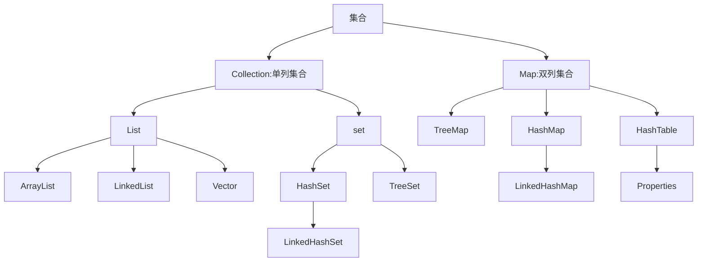

## 一、字符串

### 1.1 API：应用程序接口

API简单理解就是别人已经写好的东西，我们不需要编写，直接使用即可

Java API:指的是JDK中提供的各种功能Java类

### 1.2 String概述

String是java定义好的一个类，定义在java.lang包中，使用的时候不需要导包

java程序中的所有字符串文字，都被视为此类的对象

字符串的内容是不会发生改变的，它的对象在创建后不能被更改

### 1.3字符串构造方法

创建字符串对象的两种方式：

1. 直接赋值`String name="gaoxin"`
2. new

| 构造方法                       | 说明                             |
| ------------------------------ | -------------------------------- |
| public String()                | 创建空白字符串，不含任何内容     |
| public String(String original) | 根据传入的字符串，创建字符串对象 |
| public String(char[] chs)      | 根据字符数组，创建字符串对象     |
| public String(byte[] chs )     | 根据字节数组，创建字符串对象     |

当使用双引号直接赋值时，系统会检查该字符串在串池中是否存在

不存在创建新的，存在复用

而new方法创建时不会复用，只会创建新的

### 1.4 字符串比较

基本数据类型：比较的是数据值

应用数据类型（字符串类型）：比较的是地址值

* boolean equals方法：完全一样结果才是true，否则为false
* boolean equalsIgnoranceCase方法：忽略大小写的比较

比较字符串的内容，就必须用String里的方法

```java
public class demo3 {
    public static void main(String[] args) {
        String str1 = new String("abc");
        String str2 = "abc";

        System.out.println(str1==str2);

        boolean result1=str1.equals(str2);
        System.out.println(result1);

        String str3 = "Abc";
        boolean result2=str1.equalsIgnoreCase(str3);
        System.out.println(result2);

    }
}

//false
//true
//true
```

### 1.5字符串常用方法

indexOf():返回指定字符的索引

charAt():返回指定索引的字符

replace():字符串替换

trim():取出字符串两端的空白

split():分割字符串，返回一个分割后的字符串数组

getBytes():返回字符串的byte类型数组

length():返回字符串长度

toLowerCase():将字符串转成小写字母

toUpperCase():将字符串转成大写字母

substring():截取字符串

equals():字符串比较

### 1.6 StringBuilder基本操作

StringBulider可以看成是一个容器，创建之后里面的内容是可变的

作用：可以提高字符串的操作效率

构造方法：

`public StringBuilder`:创建一个空白可变字符串对象，不含任何内容

`public StringBuilder(str)`:根据字符串的内容来赋值

常用方法：

`public StringBuilder append(任意类型)`:添加数据，并返回对象本身

`public StringBuilder reverse()`:反转容器中的容器

`public int length`: 返回长度

`public String toString()`:将StringBuilder转换为String

使用场景：字符串的拼接与反转

```java
public class demo9 {
    public static void main(String[] args) {
        StringBuilder sb=new StringBuilder();
        //1,添加方法
        sb.append("周杰伦");
        System.out.println(sb);
        //2，反转
        sb.reverse();
        System.out.println(sb);
        //3.长度
        int len=sb.length();
        System.out.println(len);
        //4.把StringBuilder变会字符串
        String str=sb.toString();
        System.out.println(str);

    }
}

//周杰伦
//伦杰周
//3
//伦杰周
```

链式编程：当我们在调用方法的时候，不需要用变量接受他的结果，可以继续调用其他的方法

```java
import java.util.Scanner;

public class demo10 {
    public static void main(String[] args) {
        
        int len = getString().substring(1).replace("A", "a").length();
        System.out.println(len);
    }

    public static String getString() {
        Scanner sc = new Scanner(System.in);
        System.out.println("请输入一个字符串");
        String str = sc.nextLine();
        return str;
    }
}
```

### 1.7 Stringjoiner

StringJoiner跟StringBuilder一样，也可以看成一个容器 ，创建之后里面的内容是可变的

作用：提高字符串的操作效率，而且代码编写特别简洁

构造方法：

| 方法名                                          | 说明                                                         |
| ----------------------------------------------- | ------------------------------------------------------------ |
| public StringJoiner(间隔符号)                   | 创建一个StringJoiner对象，指定拼接时的间隔符号               |
| public StringJoiner(间隔符号,开始符号,结束符号) | 创建一个StringJoiner对象，指定拼接时的间隔符号，开始符号，结束符号 |

成员方法：

`public StringJoiner add(添加的内容)`:添加数据，并返回对象本身

`public int length`: 返回字符的个数

`public String toString()`:将StringJoiner转换为String,返回该字符串

```java
import java.util.StringJoiner;

public class demo13 {
    public static void main(String[] args) {
        StringJoiner sj=new StringJoiner(", ","[","]");

        sj.add("1").add("2").add("3");

        System.out.println(sj.length());
        System.out.println(sj.toString());
    }
}

// 9
// [1, 2, 3]
```

### 1.8 字符串相关类底层原理

1.字符串存储的内存原理：

* 直接赋值会复用字符串常量池中的
* new出来不会复用，而是开辟新的空间

2.==号比较的是什么：

* 基本数据类型比较数据值
* 应用数据类型比较地址值

3.字符串拼接的底层原理：

* 拼接的时候没有变量，都是字符串：

  触发字符串的优化机制，在编译时就已经是最终的结果，会复用串池中的字符串

* 拼接的时候有变量

  每一行拼接的代码，都会在内存中创建新的字符串，浪费内存

  JDK8版本：系统会预估字符串拼接之后的总大小，把要拼接的内容都放在数组中，此时也是产生了一个新的字符串

```java
package String;

public class demo14 {
    public static void main(String[] args) {
        String s1="abc";
        String s2="a"+"b"+"c";
        System.out.println(s1==s2);
    }
}
//true
```

4.StringBuilder提高效率原理：

* 所有要拼接的内容都会往StringBuilder中放，不会常见很多无用的空间，节约内存

5.StringBuilder源码分析

* 默认创建一个长度为16的字节数组
* 添加的内容长度小于16，直接存
* 添加的内容大于16会扩容（原来容量的*2+2：34）
* 如果扩容之后还不够，以实际长度为准

```java
public class demo15 {
    public static void main(String[] args) {
        StringBuilder sb=new StringBuilder();
        //容量:最多装多少
        //长度：已经装多少
        System.out.println(sb.capacity());
        System.out.println(sb.length());

        sb.append("abc");
        System.out.println(sb.capacity());
        System.out.println(sb.length());

        sb.append("hshfiahnfihafkhnaij424oowjfoehja");
        System.out.println(sb.capacity());
        System.out.println(sb.length());

//        sb.append("how");
//        System.out.println(sb.capacity());
//        System.out.println(sb.length());

    }
}

//16
//0
//16
//3
//35
//35
```

## 二、集合

### 2.1ArrayList

- 什么是集合：提供一种存储空间可变的存储模型，存储的数据容量可以发生改变
- ArrayList集合的特点：长度可以变化，只能存储引用数据类型。
- 泛型的使用：用于约束集合中存储元素的数据类型

#### 2.1.1 ArrayList常用方法 

构造方法：

| 方法名             | 说明                 |
| ------------------ | -------------------- |
| public ArrayList() | 创建一个空的集合对象 |
成员方法：

| 方法名                                | 说明                                   |
| ------------------------------------- | -------------------------------------- |
| public boolean add(要添加的元素)      | 将指定的元素追加到此集合的末尾         |
| public boolean remove(要删除的元素)   | 删除指定元素,返回值表示是否删除成功    |
| public E  remove(int   index)         | 删除指定索引处的元素，返回被删除的元素 |
| public E   set(int index,E   element) | 修改指定索引处的元素，返回被修改的元素 |
| public E   get(int   index)           | 返回指定索引处的元素                   |
| public int   size()                   | 返回集合中的元素的个数                 |

#### 2.1.2 ArrayList底层原理

1. 利用空参构造的集合，在底层创建一个默认长度为0的是数组
2. 添加第一个元素时，底层会创建一个新的长度为10的数组
3. 存满时，会扩容1.5倍
4. 如果一次添加多个元素，1.5倍还放不下，则新创建数组的长度以实际为准

### 2.2 集合体系结构

集合必须要使用包装类

Collection:单列集合；Map:双列集合



#### 2.2.1  单列集合顶级接口Collection

List系列集合：添加的元素是有序、可重复、有索引的

Set系列集合：添加的元素是无序、不重复、无索引的

Collection是单列集合的祖宗接口，它的功能是全部单列集合都可以继承使用的

| 方法名称                     | 说明                             |
| ---------------------------- | -------------------------------- |
| boolean add(E e)             | 把给定的对象添加到当前集合中     |
| void clear()                 | 清空集合中所有的元素             |
| boolean remove(E e)          | 把给定的对象在当前集合中删除     |
| boolean contains(Object obj) | 判断当前集合中是否包含给定的对象 |
| boolean isEmpty()            | 判断当前集合是否为空             |
| int size()                   | 返回集合中元素的个数/集合的长度  |

添加元素add：

* 给List系列集合添加元素，那么方法永远返回true， 因为list系列是允许元素重复的
* 给Set系类集合添加元素，如果当前要添加的元素不存在，方法返回true，如果当前要添加的元素存在，方法返回false

删除元素remove：

* 因为此时Collection里面定义的是共性的方法，所以此时不能通过索引进行删除，只能通过元素对象进行删除
* 如果删除的元素不存在，就会删除失败，返回false

包含元素contain:

* 底层是依靠equals方法进行判断是否存在的
* 如果集合中存储的是自定义对象，也是想通过contains方法来判断是否包含，那么在javabean类中，一定要重写equals方法

总结：

1. 如果想要集合中的元素可重复：**用ArrayList集合，基于数组的**
2. 如果想要集合中的元素可重复，而且当前的增删操作明显多于查询：**用LinkedList集合，基于链表的**
3. 如果想对集合中的元素去重：**用HashSet集合，基于哈希表的**
4. 如果想对集合中的元素去重，而且保证存取顺序：**用LinkedHashSet集合，基于哈希表和双链表，效率低于HashSet**
5. 如果相对集合中的元素进行排序：**用TreeSet集合，基于红黑树，后续也可以用List集合实现排序**

#### 2.2.2 双列集合顶层接口Map

特点：

* 双列集合一次需要存一对数据，分别为键和值
* 键不能重复，值可以重复
* 键和值是一一对应的，每一个键只能找到自己对应的值
* 键+值这个整体，我们称之为“键值对”或者“键值对对象”，在Java中叫做“Entry对象”

常见API：

Map是双列集合的顶层接口，它的功能是全部双列集合都可以继承使用的

| 方法名称                            | 说明                                 |
| ----------------------------------- | ------------------------------------ |
| V put(K key,V value)                | 添加/覆盖元素                        |
| V remove(Object key)                | 根据键删除键值对元素                 |
| void clear()                        | 移除所有键值对元素                   |
| boolean containsKey(Object key)     | 判断集合是否包含指定的键             |
| boolean containsValue(Object value) | 判断集合是否包含指定的值             |
| boolean isEmpty()                   | 判断集合是否为空                     |
| int size()                          | 集合的长度，也就是集合中键值对的个数 |

put方法细节：

* 在添加数据时，如果键不存在，那么直接把键值对对象添加到map集合当中，方法返回null
* 在添加数据时，如果键存在，那么把原有的键值对对象覆盖，会把覆盖的值进行返回


### 2.3 Collection遍历方式

#### 2.3.1 迭代器遍历

迭代器不依赖索引

迭代器在Java中的类是Iterator，迭代器是集合专用的遍历方式

Collection集合获取迭代器：

| 方法名称             | 说明                                    |
| -------------------- | --------------------------------------- |
| Iterator<E> iterator | 返回迭代器对象，默认指向当前集合的0索引 |

Iterator中的常用方法：

| 方法名称        | 说明                                                      |
| --------------- | --------------------------------------------------------- |
| boolean hasNext | 判断当前位置是否有元素，有元素返回true，没有元素返回false |
| E next          | 获取当前位置的元素，并将迭代器对象移向下一个位置          |

```java
public class demo {
    public static void main(String[] args) {
        //创建集合添加元素
        Collection<String> coll=new ArrayList<>();
        coll.add("a");
        coll.add("b");
        coll.add("c");
        coll.add("d");
        coll.add("e");

        //获取迭代器对象
        //迭代器就好比一个箭头，默认指向集合的0索引处
        Iterator<String> it=coll.iterator();

        //利用循环不断获取集合中的每一个元素
        while(it.hasNext()) {
            //next方法的两件事情：获取元素，移动指针
            String str = it.next();
            System.out.print(str+" ");
        }

    }
}

//a b c d e
```

注：

1. 如果当前位置没有元素，还要强行获取，会报错NoSuchElementException
2. 迭代器遍历完毕，指针不会复位
3. 循环中只能用一次next方法
4. 迭代器遍历时，不能用集合的方法进行删除和增加，如果要删除。可以使用迭代器提供的remove方法进行删除

#### 2.3.2 增强for遍历

增强for的底层就是迭代器，为了简化迭代器的代码书写的

所有的单列集合和数组才能用增强for遍历

```java
for (元素的数据类型 变量名:数组或者集合){
    
}
```

修改增强for中的变量，不会改变集合中原本的是数据

#### 2.3.3 Lambda表达式遍历

| 方法名称                                          | 说明               |
| ------------------------------------------------- | ------------------ |
| default void forEach(Consumer<? super T> action): | 结合lambda遍历集合 |

```java
public class demo {
    public static void main(String[] args) {
        Collection<String> collection = new ArrayList<>();
        collection.add("A");
        collection.add("B");
        collection.add("C");

        collection.forEach(new Consumer<String>() {
            @Override
            //s一次表示集合中的每个数据
            public void accept(String s) {
                System.out.println(s);
            }
        });
    }
}

//上面可以省略成
//        collection.forEach(s -> System.out.println(s));
```

底层原理：方法的底层也会自己遍历集合，依次得到每一个元素；把得到的每一个元素，传递给下面的accept方法，s依次代表集合中的每个数据

**迭代器：**在遍历的过程中需要删除元素，请使用迭代器

**增强for、lambda:**仅仅想遍历，那么使用增强for或Lambda表达式

### 2.4 List集合

Collection的方法List都继承了；由于List集合因为有索引，所以多了很多索引操作的方法

| 方法名称                       | 说明                                   |
| ------------------------------ | -------------------------------------- |
| E remove(int dex)              | 删除指定索引元素,返回被删除的元素      |
| E   get(int   index)           | 返回指定索引处的元素                   |
| void add(int index, E element) | 将指定的元素插入指定的位置             |
| E set(int index,E   element)   | 修改指定索引处的元素，返回被修改的元素 |

 List系列集合的5种遍历方式：

1. 迭代器

2. 增强for

3. Lambda表达式

4. 普通for循环

5. 列表迭代器：比迭代器额外增加了一个方法，在遍历的过程中可以添加元素

   ```java
   List<String> list = new ArrayList<>();
   list.add("a");
   list.add("b");
   list.add("c");
   ListIterator<String> it1 = list.listIterator();
   while(it1.hasNext()){
       String s = it1.next();
       if(s.equals("a")){
           it1.add("qqq");
       }
   }
   System.out.println(list);
   //[a, qqq, b, c]
   ```

### 2.5 LinkedList集合

底层数据结构是双链表，查询慢，增删快，但是如果操作的是首尾元素，速度也是极快的，所以多了很多操作首尾操作的特有API

| 特有方法                  | 说明               |
| ------------------------- | ------------------ |
| public void addFirst(E e) | 开头插入指定的元素 |
| public void addLast(E e)  |                    |
| public E getFirst()       |                    |
| public E getLast()        |                    |
| public E removeFirst()    |                    |
| public E removeLast()     |                    |

### 2.6 泛型

#### 2.6.1 泛型的定义与好处

泛型是JDK5中引入的特性，可以在编译阶段约束操作的数据类型，并进行检查

泛型的格式：<数据类型>

注：泛型只能支持引用数据类型

集合如果没有被指定类型，默认认为所有的数据类型都是Object类型，可以往集合添加任意的数据类型，带来的坏处是我们在获取数据时，无法使用它的特有行为；

泛型可以使添加数据的时候就把数据类型统一，而且把运行时期的问题提前到了编译期间，避免了强制类型转换可能出现的异常，因为在编译阶段类型就能确定下来

#### 2.6.2 泛型的细节

* 泛型中不能写基本数据类型（基本数据类型不能转换成Object类型）
* 指定泛型的具体类型后，传递数据时，可以传入该类类型或者其子类类型
* 如果不写泛型，类型默认是Object

#### 2.6.3 泛型类

使用场景：当一个类中，某个变量的数据类型不确定时，就可以定义带有泛型的类

```java
修饰符 class 类名<类型>{
    
}
public class ArrayList<E>{
    
}
//此处E可以理解为变量，但是不是用来记录数据的，而是记录数据的类型，可以写成：T、K、E、V等
```

举例：

```java
import java.util.Arrays;

public class MyArrayList<E> {
    Object[] obj = new Object[10];
    int size = 0;

    public boolean add(E e) {
        obj[size] = e;
        size++;
        return true;
    }
    
    public E get(int index) {
        return (E)obj[index];
    }

    @Override
    public String toString() {
        return Arrays.toString(obj);
    }
}

```

```java
import java.util.Arrays;

public class demo {
    public static void main(String[] args) {
        MyArrayList<String> list = new MyArrayList<>();

        list.add("aaa");
        list.add("bbb");
        list.add("ccc");

        System.out.println(list);
        //[aaa, bbb, ccc, null, null, null, null, null, null, null]

        MyArrayList<Integer> list1 = new MyArrayList<>();
        list1.add(1);
        list1.add(2);
        list1.add(3);

        System.out.println(list1);
        //[1, 2, 3, null, null, null, null, null, null, null]

    }
}
```

#### 2.6.4 泛型方法

使用场景：当一个方法形参类型不确定时，就可以使用类名后面定义的泛型`<E>`,也可以方法申明上定义自己的泛型

```java
public static <T> void show(T t){
    
}
```

#### 2.6.5 泛型接口

格式：

```java
修饰符 interface 接口名<类型>{
    
}
```

泛型接口的两种使用方式：

1. 实现类给出的具体类型
2. 实现类延续泛型，创建实现类对象时在确定类型

#### 2.6.6 泛型的继承和通配符

泛型不具备继承性，但数据具备继承性

利用泛型方法有一个小弊端，它可以接受任意的数据类型，此时我们就可以使用泛型的通配符：

* ？表示不确定的类型，它可以进行类型的限定
* ？extends E：表示可以传递E或者E所有的子类类型
* ？super E：表示可以传递E或者E所有的父类类型

应用场景：

1. 如果我们在定义类、方法、接口的时候，如果类型不确定，就可以定义泛型类、泛型方法、泛型接口
2. 如果类型不确定，但是能知道以后只能传递某个继承体系中的，就可以使用泛型的通配符

关键点：可以限定类型的范围

### 2.7 HashSet集合

HashSet集合底层采取哈希表存储结构；

哈希表是一种对于增删改查数据性都较好的结构

哈希值：

* 根据hashCode方法算出来的int类型的整数
* 该方法定义在Object类中，所有对象都可以调用，默认使用地址值进行计算
* 一般情况下，会重写hashCode方法，利用对象内部的属性值计算哈希值

对象的哈希值特点：

* 如果没有重写hashCode方法，不同对象计算出的哈希值是不同的
* 如果已经重写hashCode方法，不同对象只要属性相同，计算出的哈希值就是一样的
* 在小部分情况下，不同的属性值或者不同的地址值计算出来的哈希值也可能是一样（哈希碰撞）


注：

* 如果集合中存储的是自定义对象，必须重写hashCode和equals方法

### 2.8 LinkedHashSet集合

特点：==有序==、不重复、无索引

这里的有序指的是保证存储和取出的元素顺序一致

原理：底层数据结构依然是哈希表，只是每个元素又额外的多了一个双链表的机制记录存储顺序

默认使用HashSet;如果要求去重且存取有序，才使用LinkedHashSet；

### 2.9 TreeSet集合

特点：不重复，无索引，可排序

可排序：按照元素的默认规则（由小到大）排序

TreeSet集合底层是基于红黑树的数据结构实现排序的，增删改查性能良好

TreeSet集合的默认规则：

* 对于数值类型：Interger，Double，默认按照从小到大的顺序进行排序
* 对于字符、字符串类型：按照字符在ASCⅡ表中的数字升序进行排序

TreeSet的两种比较方式：

* 默认排序/自然排序：Javabean类实现Comparable接口指定规则，重写里面的抽象方法

  ```java
  @Override
  public int compareTo(Student o) {
      //指定排序规则
      //按照年龄升序拍序
      return this.age - o.age;
  }

  //this:表示当前添加的元素
  //o：表示已经在红黑树存在的元素

  /*返回值：
  	负数：认为要添加的元素是小的，存左边
  	正数：认为要添加的元素是大的，存右边
  	0：认为要添加的元素已经存在，舍弃
  */
  ```

* 比较器排序：创建TreeSet对象时，传递比较器Comparator指定规则

  ```java
  //o1：表示要添加的元素
  //o2：表示已经在红黑树存在的元素
  //返回值规则：
  //负数：认为要添加的元素是小的，存左边
  //正数：认为要添加的元素是大的，存右边
  //0：认为要添加的元素已经存在，舍弃
  TreeSet<String> ts=new TreeSet<>(new Comparator<String>() {
      @Override
      public int compare(String o1, String o2) {
          //按照长度排序
          int i = o1.length() - o2.length();
          //如果长度一样按照首字母排序
          i = i == 0 ? o1.compareTo(o2) : i;
          return i;
      }
  });
  ```


### 2.10 Map遍历方式

#### 2.10.1 键找值

```java
public class demo {

    public static void main(String[] args) {
        Map<String, String> map = new HashMap<String, String>();

        map.put("尹志平", "小龙女");
        map.put("郭靖", "穆念慈");
        map.put("欧阳克", "黄蓉");

        //添加键值对
        //1.获取所有的键，将这些键放到一个单列集合中
        Set<String> keys = map.keySet();
        //2.遍历单列集合，得到每一个键
        for (String key : keys) {
            //System.out.println(key);
            //3.利用map集合中的键获取对应的值 get
            String value = map.get(key);
            System.out.println(key + "=" + value);
        }
        //

    }
}
```

#### 2.10.2 键值对

```java
public class demo3 {
    public static void main(String[] args) {
        Map<String, String> map = new HashMap<String, String>();

        map.put("尹志平", "小龙女");
        map.put("郭靖", "穆念慈");
        map.put("欧阳克", "黄蓉");

        //通过键值对对象进行遍历
        //1.通过一个方法获取所有的键值对对象，返回一个set集合
        Set<Entry<String, String>> entries = map.entrySet();
        //2.遍历entries这个集合，去得到里面的每一个键值对对象
        for (Entry<String, String> entry : entries) {
            //3. 利用entry调用get方法获取键和值
            System.out.println(entry.getKey() + " " + entry.getValue());
        }

        //方式2
        Iterator<Entry<String, String>> iterator = entries.iterator();
        while (iterator.hasNext()) {
            Entry<String, String> entry = iterator.next();
            System.out.println(entry.getKey() + " " + entry.getValue());
        }

        //方式3
        entries.forEach(new Consumer<Entry<String, String>>() {
            @Override
            public void accept(Entry<String, String> stringStringEntry) {
                System.out.println(stringStringEntry.getKey() + " " + stringStringEntry.getValue());
            }
        });
    }
}
```

#### 2.10.3 lambda表达式

```java
import java.util.HashMap;
import java.util.Map;
import java.util.function.BiConsumer;

public class demo4 {
    public static void main(String[] args) {
        Map<String, String> map = new HashMap<String, String>();

        map.put("尹志平", "小龙女");
        map.put("郭靖", "穆念慈");
        map.put("欧阳克", "黄蓉");

//        map.forEach(new BiConsumer<String, String>() {
//            @Override
//            public void accept(String k, String v) {
//                System.out.println(k + " " + v);
//            }
//        });

        //forEach底层就是利用键值对的方式进行遍历，一次得到每一个键和值，在调用accept方法
        map.forEach((k, v) -> System.out.println(k + " " + v));
    }
}
```

### 2.11 HashMap集合

特点：

* 特点都是由键决定的：无序、不重复、无索引
* HashMap跟HashSet底层原理一致，底层时哈表表结构
* 如果键存储的是自定义对象，需要重写hashCode和equals方法；如果值存储自定义对象，不需要重写hashCode和equals方法

### 2.12 LinkedHashMap集合

* 特点都是由键决定的：有序、不重复、无索引（这里的有序保证存储和取出的的元素顺序一致）
* 底层数据结构仍是哈希表，只是每个键值对元素有额外的多了一个双链表的机制记录存储的顺序

### 2.13 TreeMap集合

* TreeMap跟TreeSet底层原理一样，都是红黑树结构
* 由键决定特性：不重复、无索引、可排序（对键进行排序）
* 默认按照键的从小到大进行排序，也可以自己规定键的排序规则

### 2.14 Collections集合工具类

Collections不是集合，而是集合的工具类

| 方法名称                                                     | 说明                   |
| ------------------------------------------------------------ | ---------------------- |
| public static <T> boolean addAll(Collection<T> c,T... elements) | 批量增加元素           |
| public static void shuffle(List<?> list)                     | 打乱List集合元素的顺序 |

### 2.15 不可变集合

创建不可变集合的应用场景：

- 如果某个数据不能修改，把它防御性的拷贝到不可变集合中是一个很好的实践
- 当即和对象被不可信的库调用时，不可变形式是安全的

在List、Set、Map接口中，都存在静态的of方法，可以获取一个不可变的集合

| 方法名称                           | 说明                               |
| ---------------------------------- | ---------------------------------- |
| static <E> List<E> of(E...Element) | 创建一个具有指定元素的List集合对象 |
| static <E> Set<E> of(E...Element)  | 创建一个具有指定元素的Set集合对象  |
| static <E> Map<E> of(E...Element)  | 创建一个具有指定元素的Map集合对象  |

map里面的of方法，参数是有上限的，最多只能传递20个参数，10个键值对；

```java
public class demo3 {
    public static void main(String[] args) {
        //创建Map的不可变集合，键值对的数量超过10个

        HashMap<String,String> hm = new HashMap<String,String>();
        hm.put("a","b");
        hm.put("b","c");
        hm.put("c","d");
        hm.put("d","e");
        hm.put("e","f");
        hm.put("f","g");
        hm.put("g","h");
        hm.put("h","i");
        hm.put("i","j");
        hm.put("j","k");
        hm.put("高鑫","湖北");

//        //获取到所有的键值对对象
//        Set<Map.Entry<String, String>> entries = hm.entrySet();
//        //把entries变成一个数组
//        Map.Entry[] arr = entries.toArray(new Map.Entry[0]);
//        //不可变的map集合
//        Map map = Map.ofEntries(arr)

        //Map<Object, Object> map = Map.ofEntries(hm.entrySet().toArray(new Map.Entry[0]));

        Map<String, String> map = Map.copyOf(hm);

        System.out.println(map);


    }
}

//{高鑫=湖北, a=b, b=c, c=d, d=e, e=f, f=g, g=h, h=i, i=j, j=k}
```


## 三、面向对象进阶

### 3.1 内部类

一个类的内部再定义一个类

#### 3.1.1成员内部类

**成员内部类特点**：

- 无static修饰的内部类，属于外部类对象的。
- 宿主：外部类对象。

**内部类的使用格式**：

```java
 外部类.内部类。 // 访问内部类的类型都是用 外部类.内部类
```

**获取成员内部类对象的两种方式**：

方式一：外部直接创建成员内部类的对象

```java
外部类.内部类 变量 = new 外部类（）.new 内部类（）;
```

方式二：在外部类中定义一个方法提供内部类的对象

编写成员内部类的注意点：

1. 成员内部类可以被一些修饰符所修饰，比如： private，默认，protected，public，static等
2. 在成员内部类里面，JDK16之前不能定义静态变量，JDK16开始才可以定义静态变量。
3. 创建内部类对象时，对象中有一个隐含的Outer.this记录外部类对象的地址值。

详解：

​	内部类被private修饰，外界无法直接获取内部类的对象，只能通过方式二获取内部类的对象

​	被其他权限修饰符修饰的内部类一般用方式一直接获取内部类的对象

​	内部类被static修饰是成员内部类中的特殊情况，叫做静态内部类。

​	内部类如果想要访问外部类的成员变量，外部类的变量必须用final修饰，JDK8以前必须手动写final，JDK8之后不需要手动写，JDK默认加上。

#### 3.1.2静态内部类

静态内部类只能访问外部类中的静态变量和静态方法，如果想要访问非静态的需要创建对象

* 创建静态内部类对象的格式：外部类.内部类 对象名 = new 外部类.内部类（）;
* 调用非静态方法的格式：先创建对象，用对象调用
* 调用静态方法的格式：外部类名.内部类名.方法名();

#### 3.1.3局部内部类

将内部类定义再方法里面就叫做局部内部类，类似方法里的局部变量

外界是无法直接使用，需要再方法内部创建对象并使用

该类可以直接访问外部类的成员，也可以访问方法内的局部变量

#### 3.1.4匿名内部类（重要）

匿名内部类的本质上就是隐藏了名字的内部类,可以写在成员位置，也可以写在局部位置

```java
new 类名或接口名(){
	重写方法;
}

// 包含继承或实现，方法重写，创建对象
// 整体就是一个类的子类对象或者接口的实现类对象
```

使用场景：

当方法的参数是接口或者类时，

以接口为例，可以传递这个接口的实现类对象，

如果实现类只要使用一次，就可以用匿名内部类简化代码 


## 四、常用API

### 4.1 Math类

Math是一个帮助我们用于进行数学工具的工具类

私有化构造方法，所有方法都是静态的

Math类常用方法：

| 方法名                 | 说明                              |
| :--------------------- | --------------------------------- |
| abs(int a)             | 获取参数的绝对值                  |
| ceil(double b)         | 向上取整                          |
| floor(double a)        | 向下取整                          |
| round(float a)         | 四舍五入                          |
| max(int a,int b)       | 获取两个int值的较大值             |
| pow(double a,double b) | 返回a的b次幂                      |
| sqrt(int a)            | 返回a的立方根                     |
| double random()        | 返回值为double的随机值，范围[0,1) |

### 4.2 System类

时间原点：1970年1月1日，我国在东方区，有8小时时差

System常用方法：

| 方法名                                                      | 说明                           |
| ----------------------------------------------------------- | ------------------------------ |
| exit(int status)                                            | 终止当前系统运行的的Java虚拟机 |
| currentTimeMillis()                                         | 返回当前系统的时间毫秒值形式   |
| arraycopy(数据源数组,起始索引,目的地数组,起始索引,拷贝个数) | 数组拷贝                       |

### 4.3 Runtime类

Runtime表示当前虚拟机的运行环境

| 方法名                       | 说明                                        |
| ---------------------------- | ------------------------------------------- |
| Runtime getRuntime()         | 当前系统的运行环境对象                      |
| exit(int status)             | 停止虚拟机                                  |
| availableProcessors()        | 获取CPU的线程数                             |
| maxMemory()                  | JVM能从系统中获取总内存的大小（单位byte）   |
| totalMemory()                | JVM已经从系统中获取总内存的大小（单位byte） |
| freeMemory()                 | JVM剩余内存大小（单位byte）                 |
| Process exec(String command) | 运行cmd命令                                 |

### 4.4 Object类

Object是Java中的顶级父类，所有的类都直接或间接的继承与Object类

构造方法：

`publc Object()`:空参构造

| 方法名             | 说明                     |
| ------------------ | ------------------------ |
| toSting()          | 返回对象的字符串表示形式 |
| equals(Object obj) | 比较两个对象是否相等     |
| Object clone()     | 对象克隆                 |

对象克隆：把A对象的属性值完全拷贝给B对象，也叫做对象拷贝，对象复制

 浅克隆：不管对象内部的属性是基本数据类型还是引用数据类型都完全拷贝过来

Object中的克隆是浅克隆

深克隆：基本数据类型拷贝过来，字符串复用，引用数据类型会创建新的 

### 4.5 对象工具类Objects类

Objects是一个工具类，提供了一些方法去完成一些功能

| 方法名        | 说明                                              |
| ------------- | ------------------------------------------------- |
| equals(s1,s2) | 先去做非空判断，比较两个对象是否相同              |
| isNull(obj)   | 判断对象是否为null，为null返回true，反之返回false |
| nonNull       | 判断对象是否为null，跟isNull结果相反              |

equals方法细节：

1. 方法的底层会判断是s1是否为null，如果weinull，直接返回false；
2. 如果s1不为null，那么就利用s1再次调用equals方法
3. 此时s1是Student类型，就会调用Student中的equals方法
4. 如果没有重写，比较地址值，如果重写，就比较属性值


### 4.6 BigInteger类

java整型有四种类型：byte、short、int、long

byte占一个字节，short两个字节，int四个字节，long八个字节

注：对象一旦创建，内部记录的值不能发生改变；只要计算都会产生一个新的BigInteger对象

#### 4.6.1 构造方法

| 方法名                           | 说明                             |
| -------------------------------- | -------------------------------- |
| BigInteger(int num,Random rnd)   | 获取随机大整数，范围[0~2^num-1^] |
| BigInteger(String val)           | 获取指定的大整数                 |
| BigInteger(String val,int radix) | 获取指定进制的大整数             |

静态方法：`public static BigInteger valueOf(long val)`

* 静态方法获取BigInteger的对象，内部有优化
* 静态方法能表示的范围较小，只能在long的取值范围之内，如果超出long的范围就不行
* 在内部对常用的数字进行了优化，提前把-16~16范围内的创建好了BigInteger对象，如果多次获取不会重新创建新的

#### 4.6.2 常见成员方法

|方法名|说明|
|----------|------|
|add/substract/multiply/divide|加减乘除（获取商）|
|divideAndremainder|获取商和余数,返回数组|
|equals()|比较是否相同|
|pow|次幂|
|max/min|返回较大值/较小值|
|intValue|转化为int类型整数，超出范围数据引用|

### 4.7 BigDecima类

作用：用于小数的精确计算；用来表示很大的小数

#### 4.7.1 构造方法

| 方法名                  | 说明           |
| ----------------------- | -------------- |
| BigDecimal(String val)  | 获取较大的小数 |
| BigDecimal.valueOf(0.1) | 获取较小的小数 |

#### 4.6.2 常见成员方法

| 方法名                                                     | 说明   |
| ---------------------------------------------------------- | ------ |
| add/substract/multiply                                     | 加减乘 |
| divide（对象，保持的精度,四舍五入： RoundingMode.HALF_UP） | 除法   |

###4.7 正则表达式 

正则表达式可以校验字符串是否满足一定的规则，并用来校验数据格式的合法性

#### 4.7.1 字符类

```
[abc]		    只能是a，b，c  
[^abc]		    除了a，b，c的任意字符
[a-zA-Z]	    a-zA-Z的范围内的都可以
[a-d[m-p]]	    a到d或m到p
[a-z&&[def]] 	a-z和def的交集，结果为def
[a-z&&[^bc]] 	a-z和非bc的交集，结果为[ad-z]
[a-z&&[^m-p]]  	结果为[a-lq-z]
```

#### 4.7.2 预定义字符

```
.  	匹配任何字符，\n火车符号不匹配
\d 	一个数字：[0-9] 
\D 	非数字：[^0-9]
\s 	一个空白字符：[\t\n\x0B\f\r]
\S 	非空白字符:[^\s]
\w 	英文数字下划线
\W 	[^\w]一个非单词字符
```

#### 4.7.3 数量词

```
X?		X,一次或0次
X*  	X,零次或多次
X+		X,一次或多次
X{n}	X,正好n次
X{n,}	X,至少n次
x{n,m}	X,至少n次，不超过m次
```

#### 4.7.4 符号：

```
[] 		里面的内容出现一次
()		分组
|		写在方括号的外面表示并集
&&		交集
(?i)	忽略后面字符的大小写
```

### 4.8 爬虫

#### 4.8.1 本地数据爬取

Pattern：表示正则表达式
Matcher：文本匹配器，作用按照正则表达式的规则去读取字符串，从头开始读取。
         	在大串中去找符合匹配规则的子串。

代码示例：

```java
package com.itheima.a08regexdemo;

import java.util.regex.Matcher;
import java.util.regex.Pattern;

public class RegexDemo6 {
    public static void main(String[] args) {
        /* 有如下文本，请按照要求爬取数据。
                Java自从95年问世以来，经历了很多版本，目前企业中用的最多的是Java8和Java11，
                因为这两个是长期支持版本，下一个长期支持版本是Java17，相信在未来不久Java17也会逐渐登上历史舞台
                要求:找出里面所有的JavaXX
         */

        String str = "Java自从95年问世以来，经历了很多版本，目前企业中用的最多的是Java8和Java11，" +
                "因为这两个是长期支持版本，下一个长期支持版本是Java17，相信在未来不久Java17也会逐渐登上历史舞台";


        //1.获取正则表达式的对象
        Pattern p = Pattern.compile("Java\\d{0,2}");
        //2.获取文本匹配器的对象
        //拿着m去读取str，找符合p规则的子串
        Matcher m = p.matcher(str);

        //3.利用循环获取
        while (m.find()) {
            String s = m.group();
            System.out.println(s);
        }


    }

    private static void method1(String str) {
        //Pattern:表示正则表达式
        //Matcher: 文本匹配器，作用按照正则表达式的规则去读取字符串，从头开始读取。
        //          在大串中去找符合匹配规则的子串。

        //获取正则表达式的对象
        Pattern p = Pattern.compile("Java\\d{0,2}");
        //获取文本匹配器的对象
        //m:文本匹配器的对象
        //str:大串
        //p:规则
        //m要在str中找符合p规则的小串
        Matcher m = p.matcher(str);

        //拿着文本匹配器从头开始读取，寻找是否有满足规则的子串
        //如果没有，方法返回false
        //如果有，返回true。在底层记录子串的起始索引和结束索引+1
        // 0,4
        boolean b = m.find();

        //方法底层会根据find方法记录的索引进行字符串的截取
        // substring(起始索引，结束索引);包头不包尾
        // (0,4)但是不包含4索引
        // 会把截取的小串进行返回。
        String s1 = m.group();
        System.out.println(s1);


        //第二次在调用find的时候，会继续读取后面的内容
        //读取到第二个满足要求的子串，方法会继续返回true
        //并把第二个子串的起始索引和结束索引+1，进行记录
        b = m.find();

        //第二次调用group方法的时候，会根据find方法记录的索引再次截取子串
        String s2 = m.group();
        System.out.println(s2);
    }
}
```
#### 4.8.2 网络数据爬取（了解）

需求：

​	把连接:https://m.sengzan.com/jiaoyu/29104.html?ivk sa=1025883i中所有的身份证号码都爬取出来。

代码示例：

```java
public class RegexDemo7 {
    public static void main(String[] args) throws IOException {
        /* 扩展需求2:
            把连接:https://m.sengzan.com/jiaoyu/29104.html?ivk sa=1025883i
            中所有的身份证号码都爬取出来。
        */

        //创建一个URL对象
        URL url = new URL("https://m.sengzan.com/jiaoyu/29104.html?ivk sa=1025883i");
        //连接上这个网址
        //细节:保证网络是畅通
        URLConnection conn = url.openConnection();//创建一个对象去读取网络中的数据
        BufferedReader br = new BufferedReader(new InputStreamReader(conn.getInputStream()));
        String line;
        //获取正则表达式的对象pattern
        String regex = "[1-9]\\d{17}";
        Pattern pattern = Pattern.compile(regex);//在读取的时候每次读一整行
        while ((line = br.readLine()) != null) {
            //拿着文本匹配器的对象matcher按照pattern的规则去读取当前的这一行信息
            Matcher matcher = pattern.matcher(line);
            while (matcher.find()) {
                System.out.println(matcher.group());
            }
        }
        br.close();
    }
}

```
#### 4.8.3 贪婪爬取和非贪婪爬取


只写+和表示贪婪匹配，如果在+和后面加问号表示非贪婪爬取
+? 非贪婪匹配
*? 非贪婪匹配
贪婪爬取:在爬取数据的时候尽可能的多获取数据
非贪婪爬取:在爬取数据的时候尽可能的少获取数据

举例：
如果获取数据：ab+
贪婪爬取获取结果:abbbbbbbbbbbb
非贪婪爬取获取结果:ab

#### 4.8.4 split方法和replaceAll方法

- String类的split()方法原型：

  ```java
  public String[] split(String regex)
  //参数regex表示正则表达式。可以将当前字符串中匹配regex正则表达式的符号作为"分隔符"来切割字符串。
  ```


- String类的replaceAll()方法原型：

  ```java
  public String replaceAll(String regex,String newStr)
  //参数regex表示一个正则表达式。可以将当前字符串中匹配regex正则表达式的字符串替换为newStr。
  ```

### 4.9 正则表达式分组

分组括号如何识别组号？

只看左括号，不看右括号，按照左括号的顺序，从左往右，依次为第一组，第二组，第三组等等

##### 4.9.1捕获分组

就是把这一组的数据捕获出来，在用一次

```java
//需求1:判断一个字符串的开始字符和结束字符是否一致?只考虑一个字符
//举例: a123a b456b 17891 &abc& a123b(false)
// \\组号:表示把第X组的内容再出来用一次
String regex1 = "(.).+\\1";
System.out.println("a123a".matches(regex1));
System.out.println("b456b".matches(regex1));
System.out.println("17891".matches(regex1));
System.out.println("&abc&".matches(regex1));
System.out.println("a123b".matches(regex1));
System.out.println("--------------------------");


//需求2:判断一个字符串的开始部分和结束部分是否一致?可以有多个字符
//举例: abc123abc b456b 123789123 &!@abc&!@ abc123abd(false)
String regex2 = "(.+).+\\1";
System.out.println("abc123abc".matches(regex2));
System.out.println("b456b".matches(regex2));
System.out.println("123789123".matches(regex2));
System.out.println("&!@abc&!@".matches(regex2));
System.out.println("abc123abd".matches(regex2));
System.out.println("---------------------");

//需求3:判断一个字符串的开始部分和结束部分是否一致?开始部分内部每个字符也需要一致
//举例: aaa123aaa bbb456bbb 111789111 &&abc&&
//(.):把首字母看做一组
// \\2:把首字母拿出来再次使用
// *:作用于\\2,表示后面重复的内容出现日次或多次
String regex3 = "((.)\\2*).+\\1";
System.out.println("aaa123aaa".matches(regex3));
System.out.println("bbb456bbb".matches(regex3));
System.out.println("111789111".matches(regex3));
System.out.println("&&abc&&".matches(regex3));
System.out.println("aaa123aab".matches(regex3));
```

后续还要继续使用本组的数据：

* 正则内部使用：\\\组号
* 正则外部使用：$组号

##### 4.9.2 非捕获分组

分组之后不需要在使用本组数据，仅仅是把数据括起来

| 符号         | 含义                       | 举例              |
| ------------ | -------------------------- | ----------------- |
| （？：正则） | 获取所有                   | Java(?:8\|11\|17) |
| （？= 正则） | 获取前面部分               | Java(?=8\|11\|17) |
| （？！正则） | 获取不是指定内容的前面部分 | Java(?!8\|11\|17) |

```java
//身份证号码的简易正则表达式
//非捕获分组:仅仅是把数据括起来
//特点:不占用组号
//这里\\1报错原因:(?:)就是非捕获分组，此时是不占用组号的。


//(?:) (?=) (?!)都是非捕获分组//更多的使用第一个
//String regex1 ="[1-9]\\d{16}(?:\\d|x|x)\\1";
String regex2 ="[1-9]\\d{16}(\\d Xx)\\1";
//^([01]\d|2[0-3]):[0-5]\d:[@-5]\d$

System.out.println("41080119930228457x".matches(regex2));
```

### 4.10 时间类

全世界的时间有一个统一的计算标准

以前的标准时间为格林尼治时间，简称GMT

计算核心：地球自转一天是24小时，太阳直射时为正午12点，但误差较大

现在标准的时间由原子钟提供

世界标准时间+8小时=中国标准时间

#### 4.10.1 jdk7时间-Date类

Date类是一个JDK写好的javabean类，用来描述时间，精确到毫秒

创建日期对象：

* Date date =new Date();
* Date date =new Date(指定毫秒值);

修改时间对象毫秒值

* setTime(毫秒值);

获取时间对象毫秒值

* getTime(毫秒值)；

```java
import java.util.Date;

public class demo {
    public static void main(String[] args) {
        //创建对象表示当前时间
        Date d=new Date();
        System.out.println(d);

        //创建对象指定时间
        Date d2=new Date(0L);
        System.out.println(d2);

        //setTime 修改时间
        d2.setTime(1000L);
        System.out.println(d2);

        //获取当前时间的毫秒值
        long time=d2.getTime();
        System.out.println(time);
    }
}

//Fri Aug 02 08:55:24 GMT+08:00 2024
//Thu Jan 01 08:00:00 GMT+08:00 1970
//Thu Jan 01 08:00:01 GMT+08:00 1970
//1000

```

#### 4.10.2 jdk7时间-SimpleDate类

作用：

* 格式化：把时间变成我们喜欢的格式
* 解析：把字符串表示的时间变成Date对象

构造方法：

| 构造方法                         | 说明                                    |
| -------------------------------- | --------------------------------------- |
| SimpleDateFormat()               | 构造一个SimpleDateFormat,使用默认格式   |
| SimpleDateFormat(String pattern) | 构造一个SimpleDateFormat,使用指定的格式 |

常用方法：

| 常用方法：          | 说明                     |
| ------------------- | ------------------------ |
| format(Date date)   | 格式化，日期对象->字符串 |
| parse(String souce) | 解析，字符串->日期       |

如何指定格式：

yyyy年MM月dd日 HH:mm:ss E

E表示星期

#### 4.10.3 jdk时间-Calendar类

Calendar表示当前时间得日历对象，可以单独修改、获取时间中的年，月，日

注：Calendar是一个抽象类，不能直接创建对象

获取当前Calendar日历子类对象的方法：

| 方法名                 | 说明                   |
| ---------------------- | ---------------------- |
| Calendar getInstance() | 获取当前时间的日历对象 |

| 方法名                                | 说明                                                         |
| ------------------------------------- | ------------------------------------------------------------ |
| public int get(int field)             | 获取某个字段的值。field参数表示获取哪个字段的值，<br />可以使用Calender中定义的常量来表示：<br />Calendar.YEAR : 年<br />Calendar.MONTH ：月<br />Calendar.DAY_OF_MONTH：月中的日期<br />Calendar.HOUR：小时<br />Calendar.MINUTE：分钟<br />Calendar.SECOND：秒<br />Calendar.DAY_OF_WEEK：星期 |
| public void set(int field,int value)  | 设置某个字段的值                                             |
| public void add(int field,int amount) | 为某个字段增加/减少指定的值                                  |

注:

* 日历类中的月份范围:0-11
* 日历类中星期的特点:星期日是一周中的第一天

#### 4.10.4 jdk8新增时间类

##### 4.10.4.1Date类:

* 1. ZoneId:时区

     ```java
     static Set<string> getAvailableZoneIds() 获取Java中支持的所有时区
     static ZoneId systemDefault() 获取系统默认时区
     static Zoneld of(string zoneld) 获取一个指定时区		
     ```

  2. Instant:时间戳

     ```java
     static Instant now() 获取当前时间的Instant对象(标准时间)
     static Instant ofXxxx(long epochMilli) 根据(秒/毫秒/纳秒)获取Instant对象
     ZonedDateTime atZone(ZoneIdzone) 指定时区
     boolean isxxx(Instant otherInstant) 判断系列的方法
     Instant minusXxx(long millisToSubtract) 减少时间系列的方法
     Instant plusXxx(long millisToSubtract) 增加时间系列的方法
     ```
     代码演示:
     ```java
     //1.获取当前时间的Instant对象(标准时间)
     Instant now = Instant.now();
     System.out.println(now);

     //2.根据(秒/毫秒/纳秒)获取Instant对象
     Instant instant1 = Instant.ofEpochMilli(0L);
     System.out.println(instant1);//1970-01-01T00:00:00z
     Instant instant2 = Instant.ofEpochSecond(1L);
     System.out.println(instant2);//1970-01-01T00:00:01Z
     Instant instant3 = Instant.ofEpochSecond(1L, 1000000000L);
     System.out.println(instant3);//1970-01-01T00:00:027

     //3. 指定时区
     ZonedDateTime time = Instant.now().atZone(ZoneId.of("Asia/Shanghai"));
     System.out.println(time);

     //4.isXxx 判断
     Instant instant4=Instant.ofEpochMilli(0L);
     Instant instant5 =Instant.ofEpochMilli(1000L);

     //5.用于时间的判断
     //isBefore:判断调用者代表的时间是否在参数表示时间的前面
     boolean result1=instant4.isBefore(instant5);
     System.out.println(result1);//true
     //isAfter:判断调用者代表的时间是否在参数表示时间的后面
     boolean result2 = instant4.isAfter(instant5);
     System.out.println(result2);//false

     //6.Instant minusXxx(long millisToSubtract) 减少时间系列的方法
     Instant instant6 =Instant.ofEpochMilli(3000L);
     System.out.println(instant6);//1970-01-01T00:00:03Z
     Instant instant7 =instant6.minusSeconds(1);
     System.out.println(instant7);//1970-01-01T00:00:02Z

     ```

  3. ZoneDateTime:带时区的时间

     ```java
     static ZonedDateTime now() 获取当前时间的ZonedDateTime对象
     static ZonedDateTime ofXxxx(。。。) 获取指定时间的ZonedDateTime对象
     ZonedDateTime withXxx(时间) 修改时间系列的方法
     ZonedDateTime minusXxx(时间) 减少时间系列的方法
     ZonedDateTime plusXxx(时间) 增加时间系列的方法
     ```
     注:JDK8新增的时间对象是不可变的,如果我们修改了,减少了,增加了时间,那么调用者是不会发生改变的,产生了一个新的时间

##### 4.10.4.2 日期格式化类:

* 1. DateTimeFormatter:用于时间的格式化和解析

     | 方法名                                   | 说明               |
     | ---------------------------------------- | ------------------ |
     | static DateTimeFormatter ofPattern(格式) | 获取格式对象       |
     | String format(时间对象)                  | 按照指定方式格式化 |

##### 4.10.4.3 Calendar类:

* 1. LocalDate:年,月,日

  2. LocalTime:时,分,秒

  3. LocalDateTime:年,月,日,时,分,秒

     | 方法名                  | 说明                                   |
     | ----------------------- | -------------------------------------- |
     | static  xxx now()       | 获取当前时间的对象                     |
     | static xxx of(...)      | 获取指定时间的对象                     |
     | get开头的方法           | 获取日历中的年,月,日,时,分,秒等信息    |
     | isBefore,isAfter        | 比较两个LocalDate                      |
     | with开头的              | 修改时间系列的方法                     |
     | minus开头的             | 减少时间系列的方法                     |
     | plus开头的              | 增加时间系列的方法                     |
     | LocalDate toLocalDate() | 将LocalDateTime转换成一个LocalDate对象 |
     | LocalTime toLocalTime() | 将LocalDateTime转换成一个LocalTime对象 |

##### 4.10.4.4工具类:

* 1. Duration:时间间隔(秒,纳秒)

     ```java
     // 本地日期时间对象。
     LocalDateTime today = LocalDateTime.now();
     System.out.println(today);

     // 出生的日期时间对象
     LocalDateTime birthDate = LocalDateTime.of(2000, 1, 1, 0, 0, 0);
     System.out.println(birthDate);

     Duration duration = Duration.between(birthDate, today);//第二个参数减第一个参数
     System.out.println("相差的时间间隔对象:" + duration);

     System.out.println("============================================");
     System.out.println(duration.toDays());//两个时间差的天数
     System.out.println(duration.toHours());//两个时间差的小时数
     System.out.println(duration.toMinutes());//两个时间差的分钟数
     System.out.println(duration.toMillis());//两个时间差的毫秒数
     System.out.println(duration.toNanos());//两个时间差的纳秒数
     ```

  2. Period:时间间隔(年,月,日)

     ```java
     // 当前本地 年月日
     LocalDate today = LocalDate.now();
     System.out.println(today);

     // 生日的 年月日
     LocalDate birthDate = LocalDate.of(2000, 1, 1);
     System.out.println(birthDate);

     Period period = Period.between(birthDate, today);//第二个参数减第一个参数

     System.out.println("相差的时间间隔对象:" + period);
     System.out.println(period.getYears());
     System.out.println(period.getMonths());
     System.out.println(period.getDays());

     System.out.println(period.toTotalMonths());
     ```

  3. ChoronoUnit:时间间隔(所有单位)

     ```java
     // 当前时间
     LocalDateTime today = LocalDateTime.now();
     System.out.println(today);
     // 生日时间
     LocalDateTime birthDate = LocalDateTime.of(2000, 1, 1,0, 0, 0);
     System.out.println(birthDate);

     System.out.println("相差的年数:" + ChronoUnit.YEARS.between(birthDate, today));
     System.out.println("相差的月数:" + ChronoUnit.MONTHS.between(birthDate, today));
     System.out.println("相差的周数:" + ChronoUnit.WEEKS.between(birthDate, today));
     System.out.println("相差的天数:" + ChronoUnit.DAYS.between(birthDate, today));
     System.out.println("相差的时数:" + ChronoUnit.HOURS.between(birthDate, today));
     System.out.println("相差的分数:" + ChronoUnit.MINUTES.between(birthDate, today));
     System.out.println("相差的秒数:" + ChronoUnit.SECONDS.between(birthDate, today));
     System.out.println("相差的毫秒数:" + ChronoUnit.MILLIS.between(birthDate, today));
     System.out.println("相差的微秒数:" + ChronoUnit.MICROS.between(birthDate, today));
     System.out.println("相差的纳秒数:" + ChronoUnit.NANOS.between(birthDate, today));
     System.out.println("相差的半天数:" + ChronoUnit.HALF_DAYS.between(birthDate, today));
     System.out.println("相差的十年数:" + ChronoUnit.DECADES.between(birthDate, today));
     System.out.println("相差的世纪(百年)数:" + ChronoUnit.CENTURIES.between(birthDate, today));
     System.out.println("相差的千年数:" + ChronoUnit.MILLENNIA.between(birthDate, today));
     System.out.println("相差的纪元数:" + ChronoUnit.ERAS.between(birthDate, today));
     ```

### 4.11 包装类

包装类指基本数据类型对应的应用类型

| 基本类型 | 对应的包装类（位于java.lang包中） |
| -------- | --------------------------------- |
| byte     | Byte                              |
| short    | Short                             |
| int      | **Integer**                       |
| long     | Long                              |
| float    | Float                             |
| double   | Double                            |
| char     | **Character**                     |
| boolean  | Boolean                           |

#### 4.11.1 Integer类构造方法及静态方法

| 方法名                                  | 说明                                   |
| --------------------------------------- | -------------------------------------- |
| public Integer(int   value)             | 根据 int 值创建 Integer 对象(过时)     |
| public Integer(String s)                | 根据 String 值创建 Integer 对象(过时)  |
| public static Integer valueOf(int i)    | 返回表示指定的 int 值的 Integer   实例 |
| public static Integer valueOf(String s) | 返回保存指定String值的 Integer 对象    |
| static string tobinarystring(int i)     | 得到二进制                             |
| static string tooctalstring(int i)      | 得到八进制                             |
| static string toHexstring(int i)        | 得到十六进制                           |
| static int parseInt(string s)           | 将字符串类型的整数转成int类型的整数    |

JDK5以后对包装类新增了自动装箱,自动拆箱属性,不需要new,不调用方法,直接赋值即可

基本类型与包装类之间的转换，从Java 5（JDK 1.5）开始，基本类型与包装类的装箱、拆箱动作可以自动完成。例如：

```java
Integer i = 4;//自动装箱。相当于Integer i = Integer.valueOf(4);
i = i + 5;//等号右边：将i对象转成基本数值(自动拆箱) i.intValue() + 5;
//加法运算完成后，再次装箱，把基本数值转成对象。
```
#### 4.11.2 Integer成员方法

| 方法名                                      | 说明                                                        |
| ------------------------------------------- | :---------------------------------------------------------- |
| public static String toBinaryString(int  i) | 得到二进制                                                  |
| public static String toOctalString(int i)   | 得到八进制                                                  |
| public static String toHexString(int i)     | 得到十六进制                                                |
| public static int parseInt(String s)        | 将字符串类型的整数转成int类型的整数(类型中的数字必须是整数) |

在八种包装类中,除了Character都有对应的parseXxx的方法,进行类型转换


## 五、常见算法

### 5.1 查找算法

#### 5.1.1基本查找

​	也叫做顺序查找

​        说明：顺序查找适合于存储结构为数组或者链表。

**基本思想**：顺序查找也称为线形查找，属于无序查找算法。从数据结构线的一端开始，顺序扫描，依次将遍历到的结点与要查找的值相比较，若相等则表示查找成功；若遍历结束仍没有找到相同的，表示查找失败。

示例代码：

```java
public class A01_BasicSearchDemo1 {
    public static void main(String[] args) {
        int[] arr = {131, 127, 147, 81, 103, 23, 7, 79};
        int number = 82;
        System.out.println(basicSearch(arr, number));

    }

    public static boolean basicSearch(int[] arr, int number){
        //利用基本查找来查找number在数组中是否存在
        for (int i = 0; i < arr.length; i++) {
            if(arr[i] == number){
                return true;
            }
        }
        return false;
    }
}
```

#### 5.1.2 二分查找（折半查找）

说明：元素必须是有序的，从小到大，或者从大到小都是可以的。

如果是无序的，也可以先进行排序。但是排序之后，会改变原有数据的顺序，查找出来元素位置跟原来的元素可能是不一样的，所以排序之后再查找只能判断当前数据是否在容器当中，返回的索引无实际的意义。

基本思想：也称为是折半查找，属于有序查找算法。用给定值先与中间结点比较。比较完之后有三种情况：

- 相等：说明找到了
- 要查找的数据比中间节点小：说明要查找的数字在中间节点左边
- 要查找的数据比中间节点大：说明要查找的数字在中间节点右边

代码示例：

```java

public class A02_BinarySearchDemo1 {
    public static void main(String[] args) {
        int[] arr = {7, 23, 79, 81, 103, 127, 131, 147};
        System.out.println(binarySearch(arr, 150));
    }

    public static int binarySearch(int[] arr, int number){
        //1.定义两个变量记录要查找的范围
        int min = 0;
        int max = arr.length - 1;

        //2.利用循环不断的去找要查找的数据
        while(true){
            if(min > max){
                return -1;
            }
            //3.找到min和max的中间位置
            int mid = (min + max) / 2;
            //4.拿着mid指向的元素跟要查找的元素进行比较
            if(arr[mid] > number){
                //4.1 number在mid的左边
                //min不变，max = mid - 1；
                max = mid - 1;
            }else if(arr[mid] < number){
                //4.2 number在mid的右边
                //max不变，min = mid + 1;
                min = mid + 1;
            }else{
                //4.3 number跟mid指向的元素一样
                //找到了
                return mid;
            }

        }
    }
}
```

#### 5.1.3 插值查找

为什么二分查找算法一定要是折半，而不是折四分之一或者折更多：其实就是因为方便，简单，但是如果我能在二分查找的基础上，让中间的mid点，尽可能靠近想要查找的元素，那不就能提高查找的效率了吗？

二分查找中查找点计算如下：

　　mid=(low+high)/2, 即mid=low+1/2*(high-low);

我们可以将查找的点改进为如下：

　　mid=low+(key-a[low])/(a[high]-a[low])*(high-low)，

这样，让mid值的变化更靠近关键字key，这样也就间接地减少了比较次数。

　　基本思想：基于二分查找算法，将查找点的选择改进为自适应选择，可以提高查找效率。当然，差值查找也属于有序查找。

**细节：**对于表长较大，而关键字分布又比较均匀的查找表来说，插值查找算法的平均性能比折半查找要好的多。反之，数组中如果分布非常不均匀，那么插值查找未必是很合适的选择。

代码跟二分查找类似，只要修改一下mid的计算方式即可。

#### 5.1.4 斐波那契查找

　　在数学中有一个非常有名的数学规律：斐波那契数列：1, 1, 2, 3, 5, 8, 13, 21, 34, 55, 89…….

（从第三个数开始，后边每一个数都是前两个数的和）。

然后我们会发现，随着斐波那契数列的递增，前后两个数的比值会越来越接近0.618，利用这个特性，我们就可以将黄金比例运用到查找技术中。

基本思想：也是二分查找的一种提升算法，通过运用黄金比例的概念在数列中选择查找点进行查找，提高查找效率。同样地，斐波那契查找也属于一种有序查找算法。

斐波那契查找也是在二分查找的基础上进行了优化，优化中间点mid的计算方式即可

代码示例：

```java
public class FeiBoSearchDemo {
    public static int maxSize = 20;

    public static void main(String[] args) {
        int[] arr = {1, 8, 10, 89, 1000, 1234};
        System.out.println(search(arr, 1234));
    }

    public static int[] getFeiBo() {
        int[] arr = new int[maxSize];
        arr[0] = 1;
        arr[1] = 1;
        for (int i = 2; i < maxSize; i++) {
            arr[i] = arr[i - 1] + arr[i - 2];
        }
        return arr;
    }

    public static int search(int[] arr, int key) {
        int low = 0;
        int high = arr.length - 1;
        //表示斐波那契数分割数的下标值
        int index = 0;
        int mid = 0;
        //调用斐波那契数列
        int[] f = getFeiBo();
        //获取斐波那契分割数值的下标
        while (high > (f[index] - 1)) {
            index++;
        }
        //因为f[k]值可能大于a的长度，因此需要使用Arrays工具类，构造一个新法数组，并指向temp[],不足的部分会使用0补齐
        int[] temp = Arrays.copyOf(arr, f[index]);
        //实际需要使用arr数组的最后一个数来填充不足的部分
        for (int i = high + 1; i < temp.length; i++) {
            temp[i] = arr[high];
        }
        //使用while循环处理，找到key值
        while (low <= high) {
            mid = low + f[index - 1] - 1;
            if (key < temp[mid]) {//向数组的前面部分进行查找
                high = mid - 1;
                /*
                  对k--进行理解
                  1.全部元素=前面的元素+后面的元素
                  2.f[k]=k[k-1]+f[k-2]
                  因为前面有k-1个元素没所以可以继续分为f[k-1]=f[k-2]+f[k-3]
                  即在f[k-1]的前面继续查找k--
                  即下次循环,mid=f[k-1-1]-1
                 */
                index--;
            } else if (key > temp[mid]) {//向数组的后面的部分进行查找
                low = mid + 1;
                index -= 2;
            } else {//找到了
                //需要确定返回的是哪个下标
                if (mid <= high) {
                    return mid;
                } else {
                    return high;
                }
            }
        }
        return -1;
    }
}

```

#### 5.1.5 分块查找

当数据表中的数据元素很多时，可以采用分块查找。

汲取了顺序查找和折半查找各自的优点，既有动态结构，又适于快速查找

分块查找适用于数据较多，但是数据不会发生变化的情况，如果需要一边添加一边查找，建议使用哈希查找

分块查找的过程：

1. 需要把数据分成N多小块，块与块之间不能有数据重复的交集。
2. 给每一块创建对象单独存储到数组当中
3. 查找数据的时候，先在数组查，当前数据属于哪一块
4. 再到这一块中顺序查找

代码示例：

```java
package com.itheima.search;

public class A03_BlockSearchDemo {
    public static void main(String[] args) {
        /*
            分块查找
            核心思想：
                块内无序，块间有序
            实现步骤：
                1.创建数组blockArr存放每一个块对象的信息
                2.先查找blockArr确定要查找的数据属于哪一块
                3.再单独遍历这一块数据即可
        */
        int[] arr = {16, 5, 9, 12,21, 18,
                     32, 23, 37, 26, 45, 34,
                     50, 48, 61, 52, 73, 66};

        //创建三个块的对象
        Block b1 = new Block(21,0,5);
        Block b2 = new Block(45,6,11);
        Block b3 = new Block(73,12,17);

        //定义数组用来管理三个块的对象（索引表）
        Block[] blockArr = {b1,b2,b3};

        //定义一个变量用来记录要查找的元素
        int number = 37;

        //调用方法，传递索引表，数组，要查找的元素
        int index = getIndex(blockArr,arr,number);

        //打印一下
        System.out.println(index);

    }

    //利用分块查找的原理，查询number的索引
    private static int getIndex(Block[] blockArr, int[] arr, int number) {
        //1.确定number是在那一块当中
        int indexBlock = findIndexBlock(blockArr, number);

        if(indexBlock == -1){
            //表示number不在数组当中
            return -1;
        }

        //2.获取这一块的起始索引和结束索引   --- 30
        // Block b1 = new Block(21,0,5);   ----  0
        // Block b2 = new Block(45,6,11);  ----  1
        // Block b3 = new Block(73,12,17); ----  2
        int startIndex = blockArr[indexBlock].getStartIndex();
        int endIndex = blockArr[indexBlock].getEndIndex();

        //3.遍历
        for (int i = startIndex; i <= endIndex; i++) {
            if(arr[i] == number){
                return i;
            }
        }
        return -1;
    }

    //定义一个方法，用来确定number在哪一块当中
    public static int findIndexBlock(Block[] blockArr,int number){ //100
        //从0索引开始遍历blockArr，如果number小于max，那么就表示number是在这一块当中的
        for (int i = 0; i < blockArr.length; i++) {
            if(number <= blockArr[i].getMax()){
                return i;
            }
        }
        return -1;
    }
}

class Block{
    private int max;//最大值
    private int startIndex;//起始索引
    private int endIndex;//结束索引

    public Block() {
    }

    public Block(int max, int startIndex, int endIndex) {
        this.max = max;
        this.startIndex = startIndex;
        this.endIndex = endIndex;
    }

    /**
     * 获取
     * @return max
     */
    public int getMax() {
        return max;
    }

    /**
     * 设置
     * @param max
     */
    public void setMax(int max) {
        this.max = max;
    }

    /**
     * 获取
     * @return startIndex
     */
    public int getStartIndex() {
        return startIndex;
    }

    /**
     * 设置
     * @param startIndex
     */
    public void setStartIndex(int startIndex) {
        this.startIndex = startIndex;
    }

    /**
     * 获取
     * @return endIndex
     */
    public int getEndIndex() {
        return endIndex;
    }

    /**
     * 设置
     * @param endIndex
     */
    public void setEndIndex(int endIndex) {
        this.endIndex = endIndex;
    }

    public String toString() {
        return "Block{max = " + max + ", startIndex = " + startIndex + ", endIndex = " + endIndex + "}";
    }
}
```

#### 5.1.6 哈希查找

哈希查找是分块查找的进阶版，适用于数据一边添加一边查找的情况。

一般是数组 + 链表的结合体或者是数组+链表 + 红黑树的结合体

为了让大家方便理解，所以规定：

- 数组的0索引处存储1~100
- 数组的1索引处存储101~200
- 数组的2索引处存储201~300
- 以此类推

但是实际上，我们一般不会采取这种方式，因为这种方式容易导致一块区域添加的元素过多，导致效率偏低。

更多的是先计算出当前数据的哈希值，用哈希值跟数组的长度进行计算，计算出应存入的位置，再挂在数组的后面形成链表，如果挂的元素太多而且数组长度过长，我们也会把链表转化为红黑树，进一步提高效率。

#### 5.1.7 树表查找

基本思想：二叉查找树是先对待查找的数据进行生成树，确保树的左分支的值小于右分支的值，然后在就行和每个节点的父节点比较大小，查找最适合的范围。 这个算法的查找效率很高，但是如果使用这种查找方法要首先创建树。 

　　二叉查找树（BinarySearch Tree，也叫二叉搜索树，或称二叉排序树Binary Sort Tree），具有下列性质的二叉树：

　　1）若任意节点左子树上所有的数据，均小于本身；

　　2）若任意节点右子树上所有的数据，均大于本身；

　　二叉查找树性质：对二叉查找树进行中序遍历，即可得到有序的数列。

　　基于二叉查找树进行优化，进而可以得到其他的树表查找算法，如平衡树、红黑树等高效算法。

### 5.2 查找算法

#### 5.2.1冒泡排序

1. 相邻的元素两两比较，大的放右边，小的放左边
2. 第一轮比较完毕之后，最大值就已经确定，第二轮可以少循环一次，后面以此类推
3. 如果数组中有n个数据，总共我们只要执行n-1轮的代码就可以


```java
public class A01_BubbleDemo {
    public static void main(String[] args) {
        //1.定义数组
        int[] arr = {2, 4, 5, 3, 1};

        //2.利用冒泡排序将数组中的数据变成 1 2 3 4 5

        //外循环：表示我要执行多少轮。 如果有n个数据，那么执行n - 1 轮
        for (int i = 0; i < arr.length - 1; i++) {
            //内循环：每一轮中我如何比较数据并找到当前的最大值
            //-1：为了防止索引越界
            //-i：提高效率，每一轮执行的次数应该比上一轮少一次。
            for (int j = 0; j < arr.length - 1 - i; j++) {
                //i 依次表示数组中的每一个索引：0 1 2 3 4
                if(arr[j] > arr[j + 1]){
                    int temp = arr[j];
                    arr[j] = arr[j + 1];
                    arr[j + 1] = temp;
                }
            }
        }
        printArr(arr);
    }

    private static void printArr(int[] arr) {
        //3.遍历数组
        for (int i = 0; i < arr.length; i++) {
            System.out.print(arr[i] + " ");
        }
        System.out.println();
    }
}
```

#### 5.2.2 选择排序

1. 从0索引开始，跟后面的元素一一比较
2. 小的放前面，大的放后面
3. 第一次循环结束后，最小的数据已经确定
4. 第二次循环从1索引开始以此类推
5. 第三轮循环从2索引开始以此类推
6. 第四轮循环从3索引开始以此类推。 


```java
public class A02_SelectionDemo {
    public static void main(String[] args) {
        //1.定义数组
        int[] arr = {2, 4, 5, 3, 1};
        for (int i = 0; i < arr.length -1; i++) {
            //内循环：每一轮我要干什么事情？
            //拿着i跟i后面的数据进行比较交换
            for (int j = i + 1; j < arr.length; j++) {
                if(arr[i] > arr[j]){
                    int temp = arr[i];
                    arr[i] = arr[j];
                    arr[j] = temp;
                }
            }
        }
        printArr(arr);
    }
    
    
    private static void printArr(int[] arr) {
        //3.遍历数组
        for (int i = 0; i < arr.length; i++) {
            System.out.print(arr[i] + " ");
        }
        System.out.println();
    }

}
```

#### 5.2.3 插入排序

将0索引的元素到N索引的元素看做是有序的，把N+1索引的元素到最后一个当成是无序的。

遍历无序的数据，将遍历到的元素插入有序序列中适当的位置，如遇到相同数据，插在后面。

N的范围：0~最大索引


```java
public class A03_InsertDemo {
    public static void main(String[] args) {
        int[] arr = {3, 44, 38, 5, 47, 15, 36, 26, 27, 2, 46, 4, 19, 50, 48};

        //1.找到无序的哪一组数组是从哪个索引开始的。  
        int startIndex = -1;
        for (int i = 0; i < arr.length; i++) {
            if(arr[i] > arr[i + 1]){
                startIndex = i + 1;
                break;
            }
        }

        //2.遍历从startIndex开始到最后一个元素，依次得到无序的哪一组数据中的每一个元素
        for (int i = startIndex; i < arr.length; i++) {
            //记录当前要插入数据的索引
            int j = i;

            while(j > 0 && arr[j] < arr[j - 1]){
                //交换位置
                int temp = arr[j];
                arr[j] = arr[j - 1];
                arr[j - 1] = temp;
                j--;
            }

        }
        printArr(arr);
    }

    private static void printArr(int[] arr) {
        //3.遍历数组
        for (int i = 0; i < arr.length; i++) {
            System.out.print(arr[i] + " ");
        }
        System.out.println();
    }
}
```

#### 5.2.4 快速排序

1. 从数列中挑出一个元素，一般都是左边第一个数字，称为 "基准数";
2. 创建两个指针，一个从前往后走，一个从后往前走。
3. 先执行后面的指针，找出第一个比基准数小的数字
4. 再执行前面的指针，找出第一个比基准数大的数字
5. 交换两个指针指向的数字
6. 直到两个指针相遇
7. 将基准数跟指针指向位置的数字交换位置，称之为：基准数归位。
8. 第一轮结束之后，基准数左边的数字都是比基准数小的，基准数右边的数字都是比基准数大的。
9. 把基准数左边看做一个序列，把基准数右边看做一个序列，按照刚刚的规则递归排序


```java
package com.itheima.mysort;

import java.util.Arrays;

public class A05_QuickSortDemo {
    public static void main(String[] args) {
        System.out.println(Integer.MAX_VALUE);
        System.out.println(Integer.MIN_VALUE);

        int[] arr = {1,1, 6, 2, 7, 9, 3, 4, 5, 1,10, 8};

        long start = System.currentTimeMillis();
        quickSort(arr, 0, arr.length - 1);
        long end = System.currentTimeMillis();

        System.out.println(end - start);//149

        System.out.println(Arrays.toString(arr));

    /*
     *   参数一：我们要排序的数组
     *   参数二：要排序数组的起始索引
     *   参数三：要排序数组的结束索引
     * */
    public static void quickSort(int[] arr, int i, int j) {
        //定义两个变量记录要查找的范围
        int start = i;
        int end = j;

        if(start > end){
            //递归的出口
            return;
        }
        //记录基准数
        int baseNumber = arr[i];
        //利用循环找到要交换的数字
        while(start != end){
            //利用end，从后往前开始找，找比基准数小的数字
            //int[] arr = {1, 6, 2, 7, 9, 3, 4, 5, 10, 8};
            while(true){
                if(end <= start || arr[end] < baseNumber){
                    break;
                }
                end--;
            }
            System.out.println(end);
            //利用start，从前往后找，找比基准数大的数字
            while(true){
                if(end <= start || arr[start] > baseNumber){
                    break;
                }
                start++;
            }
            
            //把end和start指向的元素进行交换
            int temp = arr[start];
            arr[start] = arr[end];
            arr[end] = temp;
        }

        //当start和end指向了同一个元素的时候，那么上面的循环就会结束
        //表示已经找到了基准数在数组中应存入的位置
        //基准数归位
        //就是拿着这个范围中的第一个数字，跟start指向的元素进行交换
        int temp = arr[i];
        arr[i] = arr[start];
        arr[start] = temp;

        //确定6左边的范围，重复刚刚所做的事情
        quickSort(arr,i,start - 1);
        //确定6右边的范围，重复刚刚所做的事情
        quickSort(arr,start + 1,j);

    }
}
```

### 5.2 Arrays类

操作数组的工具类

| 方法名                                          | 说明                     |
| ----------------------------------------------- | ------------------------ |
| String toString(array)                          | 把数组拼成字符串         |
| int binarySearch(array,element)                 | 二分查找法查找元素）     |
| int[] copyOf(oldArray,newArrayLenth)            | 拷贝数组                 |
| int[] copyOfRange(oldArray,startIndex,endIndex) | 拷贝数组（指定范围）     |
| void fill(array,element)                        | 填充数组                 |
| void sort(array)                                | 按照默认方式进行数组排序 |
| void sort(array,sortRule)                       | 按照指定的规则排序       |

binarySearch注：

* 数组中的元素必须是升序的
* 查找的元素是存在的，那么返回的是真实的索引；但如果要查找的元素是不存在的，返回的是（-插入点-1）

sort(array,sortRule)注：

* 只能给引用数据类型的数组进行排序

* 如果数组是基本数据类型，需要变成其对应的包装类

* 第二个参数是个接口，调用方法的时候，需要传递这个接口的实现类的对象，作为排序的规则，如果实现类只能使用一次，就没有必要单独去写一个类，直接采取匿名内部类的方式

* 底层原理：利用插入排序+二分排序的方式进行排序：默认把0索引的数据当作有序的序列，1suoyin到最后认为是无序的序列；遍历无序的序列得到里面的每一个元素，假设当前遍历得到的元素是A元素；把A元素往有序序列中插入，再插入的时候，是利用二分查找确定A元素的插入点；拿着A元素，跟插入点的元素进行比较，比较的规则就是compare方法的方法体；如果方法的返回值是负数，拿着A继续跟着前面的数据比较，如果方法的返回值是整数或0时，拿着A跟后面的数据比较；知道去确定那个A的最终位置

* compare方法的形式参数

  参数一o1：表示在无序序列中得到的每一个元素

  参数二o2：有序序列中的元素

* 返回值

  负数：表示当前插入的元素是小的，放在前面

  正数或0：表示当前插入的元素是大的，放在后面

* ```java
   Integer[] arr={2,3,425,313,6475,253,23,41
   Arrays.sort(arr,new Comparator<Integer>(){
       @Override
       public int compare(Integer o1, Integer o2) {
           System.out.println("-----------");
           System.out.println("o1: " + o1);
           System.out.println("o2: " + o2);
           return o1-o2;
       }

   System.out.println(Arrays.toString(arr));
   ```
  ```java
  -----------
  o1: 3
  o2: 2
  -----------
  o1: 425
  o2: 3
  -----------
  o1: 313
  o2: 425
  -----------
  o1: 313
  o2: 3
  -----------
  o1: 313
  o2: 425
  -----------
  o1: 6475
  o2: 313
  -----------
  o1: 6475
  o2: 425
  [2, 3, 313, 425, 6475]
  ```

### 5.3 Lambda表达式

函数式编程思想：忽略面向对象的复杂语法，强调做什么，而不是谁去做

```java
()->{
    
}
```

注：

* lambda可以用来简化匿名内部类的书写
* lambda表达式只能简化函数式接口的匿名内部类的写法

==函数式接口：有且只有一个抽象方法的接口叫做函数式接口，接口上方可以加@FunctionalInterface注解==

Lambda是一个匿名函数，可以把Lambda表达式理解为是一段可以传递的代码，它可以写出更简洁、更灵活的代码，作为一种更紧凑的代码风格，是使ava语言表达能力得到了提升

Lambda省略规则（可推导，可省略）：

1. 参数类型可以省略不写
2. 如果只有一个参数，参数类型可以省略，同时()也可以省略
3. 如果lambda表达式的方法体只有一行，大括号，分号，return可以省略不写，但需要同时省略