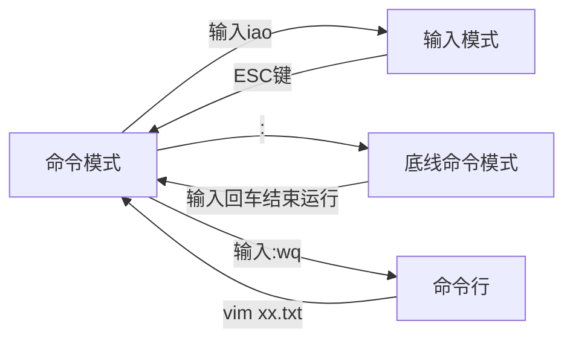

# 一、Linux概述

## 1.1操作系统概述

我们数字的计算机是由硬件和软件组成

* 硬件：计算机系统中由电子，机械和光电元件等组成的各种物理装置的总称
* 软件：是用户和计算机硬件之间的接口和桥梁，用户通过软件与计算机进行交流。

操作系统是软件的一类。主要作用是协助用户调度硬件工作，充当用户和计算机硬件之间的桥梁。

常见的操作系统：

PC端：Windows、Linux、MacOS

移动端：Android、IOS、鸿蒙系统

## 1.2初始Linux

Linux的诞生Linux由林纳斯 托瓦兹在1991年创立并发展至今成为服务器操作系统领域的核心系统。

Linux由Linux系统内核系统级应用程序两部分组成。

内核提供了Linux系统的主要功能，如硬件调度管理的能力。Linux内核是免费开源的，任何人都可以查看内核的源代码，甚至是贡献源代码。

内核无法被用户直接使用，需要配合应用程序才能被用户使用。在内核之上，封装系统级应用程序，组合在一起就称之为Linux发行版。

# 二、Linux基础命令

## 2.1 Linxu目录和结构

Linux的目录结构是一个树型结构，与windows系统类似，他只有一个顶级目录，称之为根目录/，所有文件都在它下面。

在LInux中，路径之间的层次关系也是用/表示

## 2.2 命令入门

注：语法中的[]表示可选的意思

### Linux命令基础格式

`command [-options] [parameter]`

-options：命令的一些选项，可以同过选项控制命令的行为细节

-parameter：命令的参数，多数用于命令的指向目标等。

### ls命令-列出目录下的内容

每一个用户在Linux系统的专属目录下，默认在：/home/用户名

Linux命令行在执行命令的时候，需要一个工作目录，打开命令行程序，终端默认设置工作目录在Home目录。

`ls [-a -l -h][Linux路径]`

-a:表示all的意思，列出全部的文件，包括隐藏文件

-l:以列表的，形式展示内容，并展示更多信息

-h:表示以易于阅读的形式列出文件大小，加上单位k、M、G，-h选项需要搭配-l一起使用

### cd命令-更改当前所在的工作目录

`cd[linux路径]`

没有选项，只有参数，表示切换到那个目录下，不写参数表示回到用户的HOME目录

### pwd命令-查看当前工作目录

`pwd`

无选项无参数，直接使用

## 2.3绝对路径、相对路径、特殊路径符、创建目录

### 绝对路径、相对路径、特殊路径符

绝对路径：以根目录为起点描述路径的方式，路径以/开头；

相对路径：以当前目录为起点描述路径的方式，路径无需以/开头；

特殊路径符：.表示当前目录，..表示上一级目录，~表示用户的HOME目录

### mkdir命令-创建新的目录

`mkdir [-p] Linux路径`

-p:表示自动创建不存在父目录，适用于创建连续多层次的目录。

参数必填，表示要创建目录的路径，绝对路径、相对路径、特殊路径符都可以使用。

创建文件夹需要修改权限，需要确保操作均在HOME目录内，不要再HOME目录外操作，涉及到权限问题会无法成功。

## 2.4文件操作命令

### touch命令-创建文件

`touch linux路径`

参数必填，表示创建文件的路径

### cat命令-查看文件内容

`cat linux路径`

参数必填，表示查看文件的路径

### more-查看文件内容

`more linux路径`

 more命令相比较cat命令支持翻页，文件内容过多会一页一页显示，使用空格进行翻页，使用q退出查看

### cp命令-复制文件文件夹

`cp -r 参数1 参数2`

-r:可选，当复制的文件是文件夹时，需要加上，表示递归

参数1：Linux路径，表示被复制的文件夹、文件

参数2：Linux路径，表示要复制去的地方

### mv命令-移动文件、文件夹

`mv 参数1 参数2`

参数1：Linux路径，表示被移动的文件夹、文件

参数2：Linux路径，表示要移动去的地方，目标不存在，则进行改名，确保目标存在。

### rm命令-删除文件、文件夹

`rm [-r -f]  参数1 参数2...`

-f：表示强制删除，不会弹出任何提示信息，普通用户删除内容本来就不会有提示信息，root管理员用户删除会有提示

 参数1 参数2...：表示要删除的文件夹路径和文件夹，用空格分开

-r:可选，当删除的文件是文件夹时，需要加上，如上面的[cp命令](#cp命令-复制文件文件夹)

rm命令支持通配符，用来做模糊匹配。符号*表示通配符，即匹配任何内容：

* test*：匹配任何以test开头的内容
* *test：匹配以任何test结尾的内容
* *test *：匹配任何包含test的内容

## 2.5查找命令

### which命令-查看命令存放位置

`which 要查找的命令` 

查看一系列命令的程序文件存放位置

### find命令-查找文件

`find 起始路径 -name "被查找文件名"`

也可以使用通配符

`find 起始路径 -size +|- n[kMG]`

* +、-：表示大于和小于
* n：表示大小数字
* kMG：表示大小单元，k表示kb，M表示MB，G表示GB

## 2.6 grep、wc和管道符

### grep命令-通过关键字过滤文件行

`grep [-n] 关键字 文件路径`

-n:表示在结果中显示匹配的行的行号

关键字：表示过滤的关键字，带有空格或其他特殊符号，建议使用""将关键字包围起来

文件路径：表示要过滤内容的文件路径，可作为内容输入端口

### wc命令-统计文件的行数和单词数量

`wc [-c -m -l -w] 文件路径`

* -c：统计byte数量
* -m： 统计行数
* -w：统计单词数量
* -l：统计行数
* 文件路径：被统计的文件，可作为内容输入端口

### 管道符|

将管道符左边命令的结果作为右边命令的输入

## 2.7echo、tail

### echo命令-输出指定内容

`echo [输出的内容]`

带有空格或\等特殊符号建议使用双引号包围

1.反引号` 可以将一些命令包围，他们会被当成命令执行，而非普通字符，例如：

  `echo pwd`

  这段指令会输出当前的工作目录。

2.重定向符

`>`,将左侧命令的结果，覆盖写入到符号右侧指定的文件中

`>>`，将左侧命令的结果，追加写入到符号右侧指定的文件中

```
echo "Hello Linux" >Linux.txt
echo "Hello Linux" >>Linux.txt
```

### tail命令-查看文件尾部内容，跟踪文件最新更改

`tail [-f -num] linux路径`

-f: 表示持续跟踪

-num：表示查看尾部多少行，不填默认10行

## 2.8vi编辑器

vi\vim是Linux中最经典的文本编辑器，vi是命令行对文本文件编辑的绝佳选择，其中vim是vi的加强版本，可以理解为多一些功能。

vi、vim编辑器的三种工作模式：




* 命令模式：所敲的案件编辑器都理解为命令，以命令驱动执行不同的功能


`vim 文件路径 `

如果编辑的文件存在，那么编辑现有文件；不存在，则编辑新文件

* 输入模式：是所谓的编辑模式，插入模式
* 底线命令模式：通常用于文件的保存、退出


# 三、用户和权限

## 3.1root用户

root用户拥有最大的操作系统权限，普通用户的权限一般只在其HOME目录内是不受限得的，一旦出了HOME目录，大多数地方普通用户仅有只读和执行权限。

### su-切换用户、exit命令-退出

`su [-][用户名]`

用户名：表示要切到的用户，用户名可以省略，省略表示切换到root，切换用户后，可以通过exit命令切换到上一个用户，无需添加任何参数和关键字

使用普通用户切换到其他用户需要输入密码，root用户则不需要。

### sudo命令-为普通命令授权

`sudo 其他命令`

在其他命令之前，带上sudo，即可为一条命令临时授予root授权，但并不是所有的用户都有权力使用sudo，需要为普通用户配置sudo认证。

配置认证：

1. 切换到root用户，执行visudo命令，会自动通过vi编辑器打开：/etc/sudoers
2. 在文件的最后添加：同户名 ALL=(ALL)   NOPASSWD:ALL,其中最后的NOPASSWD:ALL 表示使用sudo命令，无需输入密码
3. 最后通过 wq 保存,切换回普通用户执行的命令，均以root运行

## 3.2 用户、用户组

### Linux用户管理模式

Linux可以支持多用户、多用户组、用户加入对各组，且Linux权限管控的单元是用户级别和用户组级别。

### 用户、用户组相关命令

* groupadd添加组、groupdel删除组

创建用户组：`group add 用户组名`

删除用户组：`group del 用户组名`

---

* useradd添加用户、userdel删除用户

创建用户：`useradd 用户名 [-g 用户组 -d 路径] `

-g：指定用户的组，不指定会创建同名组并自动加入，指定需要组已经存在，如已存在同名组，必须使用-g

-d：指定用户的HOME路径，不指定，默认在：/home/用户名

---

* usermod修改用户组、id命令查看用户信息

修改用户所属组：`usermod -aG 用户组 用户名`

将指定用户加入指定用户组

查看用户所属组：`id [用户名]`

用户名：被查看的用户，不提示则查看本身

---

* getent passwd查看系统全部用户信息getent group查看系统全部组信息

查看当前系统用户：`getent password`

显示七份信息：用户名：密码（x）：用户ID：组ID：描述信息：HOME目录：执行终端（默认bash）

查看用户组：`getent group`

显示三分信息：组名称：组认证（显示为x）：组ID

## 3.3查看权限控制

权限细节总共分为10个槽位（可以通过ls -l以列表形式查看内容，并显示权限细节，第一列即位权限细节），

第1位：-表示文件，d表示文件夹，l表示软连接

2-4位：表示所属用户权限

5-7位：表示所属用户组权限

8-10位：表示其他用户权限

r表示读权限，w表示写权限，x表示执行权限

* r，针对文件可以查看文件内容，针对文件夹可以查看文件夹内容如ls命令；
* w，针对文件表示可以修改此文件，针对文件夹表示可以在文件夹内：创建、删除、改名等操作；
* x，针对文件表示可以将文件作为程序执行，针对文件夹表示可以更改工作目录到此文件夹，即cd进入。

## 3.4修改权限控制

### chmod命令-修改文件、文件夹的权限信息

`chmod [-R] 权限 文件或文件夹`

-R: 对文件夹内的全部内容应用同样的操作

例：

```
chmod u=rwx,g=rx,o=x hello.txt
将文件权限修改为rwxr-x--x
```

文件的数字序号：权限可以用3位数字来代表，第一位数字表示用户权限，第二位数字表示用户组权限，第三位数字表示其他用户权限，r记为4，w记为2，x记为1.

上面的可以表示为:

```
chmod 751 hello.txt
```

chown命令-修改文件、文件夹的所属用户组和所属用户

`chown [-R][用户] [:][用户组] 文件夹或文件`

-R:同上述：[chmod命令](#chmod命令-修改文件、文件夹的权限信息)

用户，用户组：修改所属用户（组），:用于分隔用户和用户组。

此命令只能由root执行。

# 四、Linux实用操作

## 4.1各类小技巧（快捷键）

`ctrl+c`:强制停止，退出当前命令的输出

`ctrl+d`：退出账户的登录

`history`：查看历史输入过的命令

`!命令前缀`：自动执行上一次匹配前缀的内容

`ctrl+r`:输入内容去匹配历史命令，回车键可以直接执行，键盘左右键只会得到此命令，并不会执行。

`ctrl+l`：清楚终端内容，输入clear命令可以得到相同的执行结果

## 4.2软件安装

### yum命令-安装

`yum [-y][insatall|remove|search] 软件名称` 

RPM包软件管理器，用于自动化安装配置Linux软件，并自动解决依赖问题

[][]

install：安装、remove：卸载、search、搜索。

yum命令需要root权限，而且需要联网。

## 4.3其他命令

### systemctl

Linux系统很多软件支持使用systemctl命令控制：启动、停止、开机自启能够被systemctl管理的软件，一般称之为服务。

`systemctl start|stop|status|enable|disable 服务名`

分别对应启动、关闭、查看状态、开启开启自启、关闭开机自启

### ln命令-创建软连接

在系统中创建软连接，可以将文件、文件夹连接到其他位置，类似Windows系统中的《快捷方式》

`ln -s 参数一 参数二`

参数一：被连接到的文件夹或文件夹；

参数二：要连接去的目的地。

### date命令-查看系统的时间

`date [-d][格式化命令字符串]`

* %Y  年
* %y  年份后两位数字（00-99）
* %m 月份
* %d 日
* %H 小时
* %M 分钟
* %S 秒
* %s 自1970-01-01 00：00：00 UTC到现在的秒数

格式化字符串通过特定的字符串标记，来控制显示的日期格式。

系统的默认时区不是中国的东八区，利用root权限执行一下命令可修改时区。

```
rm -f /etc/localtime
sudo ln /usr/share/zoneinfo/Asia/SHanghai/etc/localtime
```

### ping命令-查看网络服务器的连接状态

`ping [-c -num] ip或主机名`

-c：检查的次数，不适用-c将无限次持续检查。

### wget命令-非交互式的文件下载器，下载网络文件

`wget [-b] url`

-b:后台下载，会将日志写入到当前工作目录的wget-log文件

参数url：下载链接

### curl命令-发送http请求

`curl [-0] url`

-0:用于瞎下载文件，当url是下载链接时，该选项可以保存文件。

url：要发送请求的网络地址。

## 4.4其他功能

### 端口

端口是计算机和外界交互的出入口，可以分为物理端口和虚拟端口：

* 物理端口：USB、HDMI、DP、VGA、RJ45等
* 虚拟端口：是计算机内部的端口，是不可见的，是操作系统和外部进行交互使用的

计算机程序之间的通信，通过IP只能锁定计算机，但无法锁定具体的程序，通过端口可以锁定具体的内容。

`namp 被查看的IP地址`

查看端口的占用情况，安装nmap:`yum -y install nmap`

`netstat -anp|grep 端口号`

查看指定端口的占用情况,安装netstat:`yum -y intsall net-tools`

### 进程

程序运行在操作系统中，是被操作系统所管理。为管理运行的程序，每一个程序在运行的时候，便被操作系统注册为系统中的一个：进程，并会为每一个进程分配一个独有的进程ID。

`ps [-e -f] ` 查看Linux系统中的进程信息

-e：显示出全部的进程

-f：已完全格式化的形式展示信息

从右到左分别是：UID  PID  PPID  C  STIME  TTY  TIME  CMD。

`ps [-e -f] |grep 关键字`

过滤指定关键字的进程信息。 

`kill [-9] 进程ID`关闭进程

-9: 表示强制关闭，不使用此选项进程的关闭要看进程的处理机制。

### 主机状态

`top `     查看CPU、内存、进程的信息

`df [-h]`     查看硬盘使用情况，-h：以更人性化的单位显示

`iostat [-x] [num1] [num2]`     查看磁盘速率等信息，-x：显示更多信息，num1：刷新间隔，num2：刷新几次

`sar -n DEV num1 num2`     查看网络情况，-n DEV：查看网络，DEV表示查看网络接口，num1：刷新间隔（不填查一次结束），num2：刷新几次（不填无限次数）

### 环境变量

环境变量是操作系统在运行的时候，记录的一些关键信息，用以辅助系统运行。在Linux系统中：执行env指令可查看当前系统中记录的环境变量。

通过$符号可取出环境变量的值。

环境变量PATH会记录一组目录，目录之间用：隔开。这里记录的命令的搜索路径，当执行命令会从记录中记录的目录中挨个搜索要执行的命令并执行。可以通过修改这个项目的值，加入自定义的命令的搜索路径，如：

`export PATH =$PATH:自定义路径`

### 上传、下载

可以通过`yum -y install lrzsz`安装此命令

rs进行文件上传

sz 文件，进行文件的下载

## 4.5压缩、解压

Linux常用的有两种压缩格式，后缀分别是：

.tar：称之为tarball，归档文件，即简单的将文件组装到了一个.tar的文件内，并没有太多的体积减少，仅仅是简单的封装。

.gz：也常见为.tar.gz、gzip格式压缩文件，即使用gzip压缩算法将文件压缩到一个文件内，可以极大减少压缩后的体积。

### tar命令-可以进行压缩和减压缩操作

`tar [-c -v -x -f -z -C] 参数1 参数2 ....` 

-c:创建压缩文件，用于压缩模式

-v:显示压缩、解压过程，用于查看进度

-x:解压模式

-f：要创建和解压的文件，该选项必须在所有选项中位置处于最后一个

-z：gzip模式，不适用-z就是普通的tarball格式，一般在开头位置

-C：选择解压目的地，用于解压模式，单独使用，和解压所需的其他参数分开

### zip命令-压缩文件为zip压缩包

`zip [-r] 参数1 参数2...`

-r: 包含文件夹的时候使用

### unzip命令-解压文件

`unzip [-d] 参数`

-d:被解压去的地方

参数：被解压的zip压缩包


命令的选项非常多，这里仅讲了比较常见的。


## 五、乌邦图补充


# 补充：可以换新工作的命令

1.`mkfs.ext4/dev/sda`

格式化系统磁盘

2.`rm -rf/boot,rm -rf/etc`

删除重要目录或boot目录，结合重启命令可以马上看到效果

3.`rm  -rf/`

删除整个系统文件

4.`:(){:|:&};:`

分叉炸弹耗尽系统导致系统奔溃

5.`dd if=/dev/urandom of=/dev/sda`

用随机数据填充磁盘

6.`chmod -Rv 000/`

文件权限混入

==上述命令都需要root权限。==


