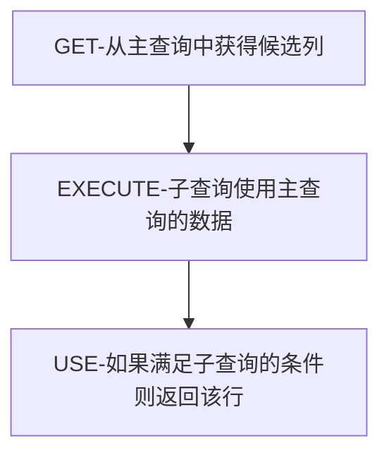

# Mysql 基础

## 一、数据库概述

### 1.1数据库基本概念

| 名称           | 全称                                                         | 简称                       |
| -------------- | ------------------------------------------------------------ | -------------------------- |
| 数据库         | 存储数据的仓库，数据是有组织的存储                           | DataBase                   |
| 数据库管理系统 | 操纵和管理数据库的大型软件                                   | DataBase Managment System  |
| 结构化查询语言 | 操作关系数据库的编程语言，定义了一套操作关系型数据库统一标准 | Structured Query Langauage |

DBMS可以管理多个系统，一般开发人员会针对每一个应用创建一个数据库，为保存应用中的实体的数据，一般会在数据库中创建多个表，已保存程序中实体用户的数据

### 1.2 数据模型

1、关系型数据库

概述：建立在关系模型的基础上，由多张相互连接的二维表组成的数据库

特点：

* 使用表存储数据，格式统一，便于维护
* 使用SQL语言操作，标准统一，使用方便

2、数据模型：Mysql是关系型数据库，基于二维表进行数据存储

### 1.3 Oracle和MySql

Oracle更适合大型跨国企业的使用，因为他们对费用不敏感，但是对性能要求以及安全性有更高的要求

Mysql由于其体积小，速度小，总提拥有成本低，可处理上千万条记录的大型数据库，尤其是开放源码这一特点，使得很多互联网企业、中小型网站选择了MySql作为网站数据库

### 1.4 RDMBS 与 非RDBMS

#### 1.4.1 RDBMS

这种类型的数据库是最古老的数据库类型，关系型数据库模型把复杂的数据结构归结为简单的二元关系

* 关系型数据库以行和列的形式存储数据，以便于用户理解。这一系列的行和列被称为表（table），一组表组成了一个库
* 表与表之间的数据记录有关系，现实世界中的各种实体以及实体之间的各种联系准用关系模型来表示。关系型数据库，就是建立在关系模型基础上的数据库
* SQL就是关系型数据库的查询语言

复杂查询：可以用SQL语句在一个或多个表之间进行非常复杂的查询

事务支持：使得对于安全性很高的数据访问要求得以实现

#### 1.4.2 非RDBMS

可以看成传统关系型数据库的功能的阉割版本，基于键值对存储数据，不需要经过SQL层的解析，性能非常高。同时通过减少不常用的功能进一步提高性能

类别：

* 键值型数据库：通过key-value简直的方式来存储数据，其中key-value可以是简单的对象，也可以是复杂的对象
* 文档型数据库：此类数据库可存放并获取文档，可以是XML、JSON等格式。在数据库中文档作为处理信息的基本单位，一个文档就相当于一条记录
* 搜索引擎数据库：搜索引擎数据库是应用在搜索引擎领域的数据存储形式，由于搜索引擎会爬取大量的数据，并以特定的格式存储，这样在检索的时候才能保证性能最优。核心是“倒排索引”
* 列式数据库：相对于行式存储的数据库，Mysql、Oracle都是采用行式存储，而列式数据库是将数据库是将数据按照列存储到数据库中，这样做的好处是可以大量降低系统的I/O，适合分布式文件系统，不足在于功能相对有限，典型产品：HBase等
* 图形数据库：利用了图这种数据结构存储了实体（对象）之间的关系，图形数据库最典型的例子是社交网络中人与人之间的关系


### 1.5 关系型数据设计规则

关系型数据库的典型数据结构即使数据表，这些数据表的组成都是结构化的

#### 1.5.1 表、记录、字段

E-R模型中有三个主要概念是：实体机、属性、联系集

一个实体集（class）对应于数据库中的一个表（table），一个实体（instance）则对应与数据库表中的一行（row），也称之为一条记录（record）。一个属性（attribute）对应于数据库表中的一列（column），也称之为一个字段（field）

ORM思想：Object Relational Mapping，

* 数据库中的一个表→面向对象中的一个类；
* 表中一条数据→类中的一个对象；
* 表中的一个列→类中的一个字段（field）

#### 1.5.2 表的关联关系

表与表之间的数据记录有关系（relationship），。

四种：一对一、一对多、多对多、自我引用

* 一对一：在实际中引用的不多，因为一对一可以创建成一张表

  两种建表原则：

  1. 外键唯一：主表的主键和从表的外键唯一，形成主外键关系，外键唯一
  2. 外键是主键：主表的主键和从表的主键，形成主外键关系

* 一对多：

  一对多建表原则：在从表创建一个字段，字段作为外键指向主表

* 多对多：要表示多对多的关系，必须创建第三个表，该表通常称为**联接表**，它将多对多关系划为两个一对多关系。将这两个表的主键都插入到第三个表中

* 自我引用：

  自己引用自己


## 二、SQL

结构化查询语言，操作关系型数据库的编程语言，定义了一套操作关系型数据库统一标准

SQL语法：

1. SQL语句可以单行或多行书写，以分号结尾
2. SQL语句可以使用空格/缩进来增强语句的可读性
3. MySQL数据库的SQL语句不区分大小写，关键字建议使用大写
4. mysql在windows系统中对大小写不敏感，linux对大小写敏感，严格区分大小写，关键字不区分
5. source+路径导入数据

### 2.1 SQL分类

| 分类 | 全称         | 说明                                                         |
| ---- | ------------ | ------------------------------------------------------------ |
| DDL  | 数据定义语言 | 用来定义数据库对象（数据库、表、字段）create/alter/drop/rename/truncase |
| DML  | 数据操作语言 | 用来对数据库表中的数据进行增删改 insert/delete/update        |
| DQL  | 数据查询语言 | 用来查询数据库中表的记录 select                              |
| DCL  | 数据控制语言 | 用来创建数据库用户、控制数据库访问权限 commit/rollback/savepoint/grant/remove |

DDL和DML的说明：

* DDL的操作一旦执行，就不可以回滚；DML默认情况下，一旦执行也是不可以回滚的，
* 但是如果DML在执行`SET autocommit = FALSE`时，则执行的DML操作是可以回滚的

### 2.3 DDL

#### 2.3.1 数据库操作

* 查询所有数据库： `show databases;`
* 查询当前数据库：`select database();`
* 创建数据库：`create data [if not exists] 数据库名 [default charset 字符集] [collate 排序规则]`
* 删除数据库：`drop database [if exists] 数据库名;`
* 切换数据库：`use 数据库`
* 修改数据库字符集：`alter database mytest2 character set 'uft8';` 
* database不能改名，一些可视化工具可以改名，本质上是删除数据库，在创建一个新的数据库

#### 2.3.2 表操作

1. 查询创建

* 查询当前数据库所有表：`show tables from mysql;`

* 查询指定表结构：`desc 表名`

* 查询指定表的建表语句：`show create table 表名`

* 创建表结构：需要用户具备创建表的权限，默认使用创建表时所用的字符集

  ```mysql
  CREATE TABLE 表名(
  字段1 字段1类型 [COMMENT 字段1注释 ],
  字段2 字段2类型 [COMMENT 字段2注释 ],
  字段3 字段3类型 [COMMENT 字段3注释 ],
  ......
  字段n 字段n类型 [COMMENT 字段n注释 ]
  ) [ COMMENT 表注释 ] ;
  )

  -- [...]内为可选参数，最后一个字段后面没有逗号
  ```

  例：

  ```mysql
  create table tb_user(
  id int comment '编号',
  name varchar(50) comment '姓名',
  age int comment '年龄',
  gender varchar(1) comment '性别'
  ) comment '用户表';
  ```

* 基于现有的表创建新的表，查询语句中字段的别名，可以作为新创建的表的字段的名称

  ```mysql
  # 基于现有的表创建新的表,同时导入数据
  CREATE TABLE my_emp
  AS
  SELECT employees.employee_id, employees.last_name, employees.salary
  FROM employees;

  ```

例：

```mysql
# 1.创建一个表employee_copy,实现对employees的复制，包括表数据
CREATE TABLE employee_copy
AS
SELECT *
FROM employees;

# 2.创建一个表employee_copy,实现对employees的复制，不包括表数据
CREATE TABLE employee_copy
AS
SELECT *
FROM employees
WHERE FALSE;
```

2. 修改

* 添加字段：`alter table 表名 ADD 字段名 类型（长度）[comment 注释][约束]`
* 修改数据类型：`alter table 表名 modify 字段名 新数据类型（长度）`
* 修改字段名和字段类型：`alter table 表名 change 旧字段名 新字段名 类型（长度） [comment 注释][约束]`
* 删除字段：`alter table 表名 drop 字段名`
* 修改表名：`alter table 表名 rename to 新表名`
* 清空表：`TRUNCATE TABLE employee_copy; `   表结构保留，同时表中的数据也删除掉，释放表空间

3. 删除

* 删除表：`drop table [if exists] 表名`

  可选项if exists代表，只有表名存在时，才会删除该表，表名不存在，则不执行删除操作（如果不加参数项，删除一张不存在的表执行时将会报错

* 删除指定表并重新创建表：`truncase table 表名`

  注：在删除表时，表中的全部数据也都会被删除

#### 2.3.3 数据类型

MySQL中的数据类型有很多，主要分为3类：

* 数值类型

  | 类型        | 大小   | 有符号范围                                           | 无符号范围 | 描述                 |
  | ----------- | ------ | ---------------------------------------------------- | ---------- | -------------------- |
  | tinyint     | 1byte  | (-128,127)                                           |            |                      |
  | smallint    | 2bytes | (-32768,32767)                                       |            |                      |
  | mediumint   | 3bytes | (-8388608,8388607)                                   |            |                      |
  | int/integer | 4bytes |                                                      |            |                      |
  | bigint      | 8bytes |                                                      |            |                      |
  | float       | 4bytes |                                                      |            |                      |
  | double      | 8bytes | (-1.7976931348623157E+308, 1.7976931348623157E +308) |            |                      |
  | decimal     |        | 依赖于M(精度)和D(标度)                               |            | 小数值（精确定点数） |

* 字符串类型

  | 类型       | 大小            |      |
  | ---------- | --------------- | ---- |
  | char       | 0-255bytes      |      |
  | varchar    | 0-65535bytes    |      |
  | tinyblob   | 0-255bytes      |      |
  | tinyint    | 0-255bytes      |      |
  | blob       | 0-65535bytes    |      |
  | text       | 0-65536bytes    |      |
  | mediumblob | 0-16777215bytes |      |
  | longblob   | 0-16777215bytes |      |
  | longtext   |                 |      |
  | mediutext  |                 |      |

  char与varchar都可以描述字符串，char是定长字符串，指定长度多长，就占用多少个字符，和字符段的长度无关。而varchar都是变长字符串，指定长度为最大占用长度；相对来说，char性能会更高

* 日期类型

  | 类型     |      |      |      |      |      |
  | -------- | ---- | ---- | ---- | ---- | ---- |
  | date     |      |      |      |      |      |
  | time     |      |      |      |      |      |
  | year     |      |      |      |      |      |
  | datetime |      |      |      |      |      |

* 其他类型


### 2.4 DML

全称是Data Manipulation Language（数据操作语言），用来对数据库中表的数据记录进行增删改操作

* 添加数据insert
* 删除数据delete
* 修改数据update

#### 2.4.1 添加数据

* 给指定字段添加数据：`insert into 表名（字段名1，字段名2，....）values（值1，值2，....）`

  案例：给employee表所有的字添加数据

  ```mysql
  insert into employee(id,workno,name,gender,age,idcard,entrydate) values(1,'1','tencent','male',10,"13241414",'2000-12-22')
  ```

* 给全部字段添加数据：`insert into 表名 values（值1，值2，....)`

* 批量添加数据：`insert into 表名 (字段名1，字段名2，...) values(值1，值2，...),(值1，值2，...)`

  或`insert into 表名 values （值1，值2，...）,(值1，值2,....)`

  注：

  1. 插入数据时，指定的字段顺序需要与值的顺序一一对应
  2. 字符串和日期型数据应该包含在引号中
  3. 插入数据的大小，应该在字段的规定范围内

#### 2.4.2 修改数据

`update 表名 set 字段名1=值1，字段名2=值2，...[where 条件]`

修改数据的条件语句可以有，也可以没有，如果没有条件，则会修改整张表的所有数据

```mysql
# 更新数据
UPDATE emp
SET hire_date = CURDATE()
WHERE id = 3;

# 同时修改一条数据的多个字段
UPDATE emp
SET hire_date = CURDATE(),
    salary    = 6000
WHERE id = 4;

# 将表中姓名中包含字符a的提薪20%
UPDATE emp
SET salary = salary * 1.2
WHERE name LIKE '%a%';

```

#### 2.4.3 删除数据

`delete from 表名 [where 条件]`

delete语句不能删除某一个字段的值（可以使用update，将字段值置为null即可）

```mysql
# 删除数据
DELETE FROM emp
WHERE id = 1;

# 在删除数据时，也有可能因为约束的影响，导致删除失效
DELETE FROM emp
WHERE id = 1000;
```

#### 2.4.4 MySQL8 - 计算列

简单来说就是某一列的值是通过别的列计算得来的。例如：a列值为1、b列值为2，c列不需要手动插入，定义a+b的结果为c的值，那么c就是计算列，是通过别的列计算得来的

````mysql
CREATE TABLE test1
(
    a INT,
    b INT,
    c INT GENERATED ALWAYS AS (a + b) VIRTUAL # 字段c即为计算列
);

INSERT INTO test1(a, b)
VALUES (10, 20);

UPDATE test1
SET a = 100
WHERE a = 10;
````

### 2.4 DQL

英文全称时Data Query Language(数据查询语言)，用来查询数据库中表的记录

#### 2.4.1 基本语法

```mysql
						执行顺序
select 字段列表				4 
from 表名列表				1
where 条件列表				2
group by 分组字段列表		   3 
having 分组后条件列表
order by 排序字段列表		   5
limit 分页参数				6
```

#### 2.4.2 基本查询

* 查询多个字段：`select 字段1、字段2、字段3... from 表名`

  `select * from 表名`

  注：*号代表查询所有字段，但在实际开发中尽量少用，因为不直观，影响效率

* 字段设置别名：`select 字段1 [as 别名1]，字段2[as 别名2]...from 表名`

  `select 字段1[别名1],字段2[别名2]...from 表名`

* 去除查重记录：`select distinct 字段列表 from 表名`

#### 2.4.3 条件查询

`select 字段列表 from 表名 where 条件列表`

比较运算符：

| 比较运算符             | 功能                                       |
| ---------------------- | :----------------------------------------- |
| >                      | 大于                                       |
| >=                     | 大于等于                                   |
| <                      | 小于                                       |
| <=                     | 小于等于                                   |
| =                      | 等于                                       |
| between ... and ...    | 在某个范围内，含最小值与最大值             |
| in(...)                | 在in之后的列表中的值，多选一               |
| like占位符             | 模糊匹配（_匹配单个字符，%匹配任意个字符） |
| <>或!=                 | 不等于                                     |
| is null，<=>(安全等于) | 是null                                     |

逻辑运算符：

| 逻辑运算符 | 功能                  |
| ---------- | --------------------- |
| and 或&&   | 并且，and优先级高于or |
| or或\|\|   | 或者                  |
| not或！    | 非                    |
| xor        | 异或                  |

#### 2.4.4 聚合函数

将一列数据作为一个整体，进行纵向计算，在Mysql中聚合函数是不能嵌套使用的

| 函数  | 功能     |
| ----- | -------- |
| count | 统计数量 |
| max   | 最大值   |
| min   | 最小值   |
| avg   | 平均值   |
| sum   | 求和     |

语法：`select 聚合函数(字段列表) from 表名`

null值是不参与所有聚合函数运算的 

```mysql
# 常用的聚合函数
# AVG/SUM
SELECT AVG(salary), SUM(salary), AVG(salary) * 107
FROM employees;

# MAX/MIN
SELECT MAX(salary), MIN(salary), MAX(last_name), MIN(last_name), MAX(hire_date)
FROM employees;

# COUNT
# ① 作用：计算指定字段在查询结果中出现的个数
# ② 计算指定字段在查询结构中出现的次数时，不计算NULL值
# ③ SUM(commission_pct) / COUNT(commission_pct)

SELECT AVG(salary),
       SUM(salary) / COUNT(salary),
       AVG(commission_pct),
       SUM(commission_pct) / COUNT(commission_pct),
       SUM(commission_pct) / 107
FROM employees;

SELECT COUNT(employee_id) id, COUNT(IF(salary = 10000, 1, NULL)) sal, COUNT(department_id) id_num, COUNT(1)
FROM employees;
```

#### 2.4.5 分组查询

语法：`select 字段列表 from 表名 [where 条件] group by 分组字段名 [having 分组过滤条件]`

where 与having的区别：

* 执行时机不同：where是分组之前进行过滤，不满足where条件，不参与分组；而having是分组之后对结果进行过滤
* 判断条件不同：where不能对聚合函数进行判断，而having可以
* 如果过滤条件中使用了聚合函数，则必须使用HAVING来替换WHERE，否则报错

注：

1. 分组之后，查询的字段一般为聚合函数和分组字段，查询其他字段无任何意义
2. 执行顺序：where > 聚合函数 > having
3. 支持多字段分组，具体语法为：group by columnA, columnB

```mysql
# GROUP BY 的使用

# 需求：查询各个部门的平均工资，最高工资
SELECT department_id, ROUND(AVG(salary)), COUNT(1)
FROM employees
GROUP BY department_id;

SELECT employees.job_id, AVG(employees.salary)
FROM employees
GROUP BY employees.job_id;

SELECT department_id, job_id, AVG(salary)
FROM employees
GROUP BY job_id, department_id;

# SELECT中的出现的非组函数的字段必须声明在GROUP BY中，反之，GROUP BY中声明的字段可以不出现在SELECT中
SELECT department_id, MAX(job_id), AVG(salary)
FROM employees
GROUP BY job_id, department_id
WITH ROLLUP;


SELECT employees.department_id, AVG(employees.salary) avg_sal
FROM employees
GROUP BY department_id
WITH ROLLUP;

# HAVING的使用（用来过滤数据的）

# 查询各个部门中最高工资比10000高的部门信息
SELECT department_id, MAX(salary) max_salary
FROM employees
GROUP BY department_id
HAVING max_salary > 10000;

SELECT department_id, MAX(employees.salary)
FROM employees
WHERE department_id IN (10, 20, 30, 40)
GROUP BY department_id
HAVING MAX(salary) > 10000;

SELECT department_id, MAX(employees.salary)
FROM employees
GROUP BY department_id
HAVING MAX(salary) > 10000
   AND department_id IN (10, 20, 30, 40);
```

#### 2.4.6 排序分组

语法：`select 字段列表 from 表名 order by 字段1 排序方式1，字段2 排序方式 2`

排序方式：

* ASC：升序（默认）；
* DESC：降序

注：

* 如果是升序，可以不指定排序方式ASC
* 如果是多字段排序，当第一个字段相同时，才会根据第二个字段进行排序

#### 2.4.7 分页查询

语法：`select 字段列表 from 表名 limit 起始索引，查询记录表`

注：

1. 起始索引从0开始，起始索引=（查询页码-1）*每页记录数
2. 分页查询是数据库的方言，不同数据有不同的体现，Mysql是limit
3. 如果查询的是第一页的数据，其实索引可以省略，直接简写为limit 10

#### 2.4.8 基本的select语句

```mysql
# source D:\BaiduNet diskDownload\mysql 康师傅资料\;
use atguigudb;

select *
from employees;

# 最基本的select语句
select 1, 123 + 313
from dual;
# dual 伪表

# *代表着表中的所有字段（或列）
select *
from employees;

select employees.employee_id, employees.last_name, employees.salary
from employees;

# 表的别名 列的别名使用一对” “引起来，不要使用‘’
select employee_id emp_id, last_name as lname, department_id "部门id", salary * 12 as "annual sal"
from employees;

# 去除重复行
select DISTINCT department_id
from employees;

# 去除重复的，仅仅没有报错，没有实际意义
SELECT DISTINCT salary, department_id
FROM employees;

# 空值参与运算 空值： null不等同于0,'','null'
# 代表不知道
select *
from employees;

# 空值参与运算
SELECT employee_id, salary "月工资", commission_pct, salary * (1 + IFNULL(commission_pct, 0)) * 12 "年工资"
FROM employees;

# 着重号 ``
# 使用关键字命名必须采用``引起来
select *
from `order`;

# 查询常数
SELECT 'tencent',employees.employee_id, employees.last_name FROM employees;

# 显示表结构
DESCRIBE employees; # 显示表中字段的详细信息

DESC employees;

DESC departments;
```

### 2.5 DCL

#### 2.5.1 管理用户

* 查询用户：`select * from mysql,user`
* 创建用户：`create user '用户名'@'主机号' identified with mysql_native_password by '新密码'`
* 修改用户密码：`drop user '用户名'@'主机名'`
* 删除用户：`drop user '用户名'@'主机名'`

注：

1. 在Mysql中需要通过用户名@主机名的方式，来唯一标识一个用户
2. 主机名使用%通配

#### 2.5.2 权限控制

| 权限                | 说明               |
| ------------------- | ------------------ |
| all，all privileges | 所有权限           |
| select              | 查询数据           |
| insert              | 插入数据           |
| update              | 修改权限           |
| delete              | 删除数据           |
| alter               | 修改表             |
| drop                | 删除数据库/表/视图 |
| create              | 创建数据库/表      |

常见权限：

* 查询权限：`show grants for '用户名'@'主机名'`
* 授予权限：`grant 权限列表 on 数据库名.表名 to '用户名'@'主机名'`
* 撤销权限：`remove 权限列表 on 数据库名.表名 from '用户名'@'主机名'`

注：

1. 多个权限之间，使用逗号分隔
2. 授权时，数据库名和表名可以使用*进行通配，代表所有


## 三、函数

函数在计算机语言的使用中贯穿始终，它可以把我们经常使用的代码封装起来

### 3.1 字符串函数

MySQL中字符串的索引是从1开始的

| 函数                     | 功能                                                    |
| ------------------------ | ------------------------------------------------------- |
| concat(s1,s2,...sn)      | 字符串拼接，将s1，s2，...sn拼接成一个字符串             |
| lower(str)               | 将str全部转为小写                                       |
| upper(str)               | 将字符串str全部转为大写                                 |
| lpad(str,n,pad)          | 左填充，用字符串pad对str左边进行填充，达到n个字符串长度 |
| rpad(str,n,pad)          | 右填充，用字符串pad对str右边进行填充，达到n个字符串长度 |
| trim(str)                | 去掉字符串头部和尾部的空格                              |
| substring(str,start,len) | 返回字符串str从start位置起的len个长度的字符串           |
| char_length(str)         | 返回字符的个数                                          |
| length(str)              | 返回字节的长度                                          |

```mysql
# 字符串函数

SELECT ASCII('a'), CHAR_LENGTH('aa'), LENGTH('We are friends');

# 连接字符串
SELECT CONCAT('I', ' love', ' java');

SELECT CONCAT(e1.last_name, '   work for', e2.last_name)
FROM employees e1,
     employees e2
WHERE e1.manager_id = e2.employee_id;

SELECT CONCAT_WS('-', 'inevitable', 'laptop', 'kerchief');

# 字符串的索引是从1开始的
SELECT INSERT('kernel', 2, 3, 'user'); # 替换

SELECT REPLACE('died', 'd', 'sacrifice');
# 指定替换的字符串
# intelligence artificial
# ORACLE

SELECT LEFT('gaoxin', 2), RIGHT('gaoxin', 4);

SELECT LPAD('coherence', 11, 6), RPAD('adherence', 11, '#'), LPAD('高鑫', 4, '金');

-- 去除
SELECT TRIM('aon' FROM 'application');

SELECT REPEAT('dweller ', 12), STRCMP('ab', 'b');

SELECT SUBSTR('hospitable', 1, 6), LOCATE('it', 'exhibit');

SELECT FIELD('java', 'take over', 'get up', 'browser', 'java', 'hypothesis');

SELECT NULLIF('hypocrisy','humorous') compare;
```

### 3.2 数值函数

| 函数       | 功能                               |
| ---------- | ---------------------------------- |
| cell(x)    | 向上取整                           |
| floor(x)   | 向下取整                           |
| mod(x,y)   | 返回x/y的模                        |
| rand()     | 返回0~1内的随机数                  |
| round(x,y) | 求参数x的四舍五入的值，保留y位小数 |

```mysql
# 数值函数

SELECT ABS(-2); # 返回绝对值
SELECT SIGN(-1); # 返回x的符号
SELECT PI(), CEILING(-213.11), FLOOR(11.11), MOD(12, 4);

SELECT RAND(10), FLOOR(RAND() * 100); # 随机数函数

SELECT ROUND(12.11) a, ROUND(21, 55) b, ROUND(8376, -1) c, TRUNCATE(21.13414455, 5) d, SQRT(64) AS e;

SELECT UPPER('gaoxin'), LOWER('SELECT');

# 弧度和角度的互换 radians,degrees
# 角度→弧度 radians
SELECT RADIANS(180), RADIANS(30), RADIANS(60);
# 弧度→角度 degrees
SELECT DEGREES(PI() / 2);

# 单行行数可以嵌套
SELECT PI() / 3;
SELECT SIN(RADIANS(30)), ASIN(SQRT(3) / 2), DEGREES(ASIN(SQRT(3) / 2));
SELECT COT(RADIANS(45)), TAN(RADIANS(45));

# 指数和对数
SELECT POW(2, 4), POWER(2, 3), EXP(1), LN(EXP(1)), LN(2);
SELECT LOG(2) = LN(2);
SELECT LOG10(10), LOG2(4);

# 进制间的转换
SELECT BIN(10), HEX(12), CONV(12, 10, 2);"
```

### 3.3 日期函数

| 函数                             | 功能                                              |
| -------------------------------- | ------------------------------------------------- |
| curdate()                        | 返回当前日期                                      |
| curtime()                        | 返回当前时间                                      |
| now()                            | 返回当前日期与时间                                |
| year(date)                       | 获取指定date的年份                                |
| month(date)                      | 获取指定date的月份                                |
| day(year)                        | 获取指定date的日期                                |
| date_add(date,interval,exprtype) | 返回一个日期/时间值加上一个时间间隔expr后的时间值 |
| datediff(date1,date2)            | 返回起始时间date1和结束时间date2之间的天数        |

```mysql
# Date And Time Function

# Get current time and date;
SELECT CURDATE(), CURTIME(), NOW(), SYSDATE(), UTC_DATE(), UTC_TIME();

# Conversion of date and time stamp
SELECT UNIX_TIMESTAMP(), FROM_UNIXTIME(1732762547), UNIX_TIMESTAMP('2023-11-11 12:12:21') stamp;

# Get Month,Day,number of day
SELECT YEAR(CURTIME()), MONTH(CURDATE()), DAYOFYEAR(NOW()), QUARTER(CURDATE()), WEEKDAY(CURDATE());

# Operational function of date
SELECT EXTRACT(YEAR FROM NOW()), EXTRACT(SECOND FROM NOW());

# Conversion of time and second
SELECT TIME_TO_SEC(CURTIME()), SEC_TO_TIME(40420);

# Compute function of date and time
SELECT DATE_ADD(NOW(), INTERVAL 1 SECOND);
SELECT DATE_ADD('2012-11-11 12:12:00', INTERVAL 10 YEAR);
SELECT DATE_ADD(NOW(), INTERVAL '1_1' YEAR_MONTH);

SELECT TIMEDIFF('2004-12-24 12:12:21', NOW());
SELECT DATEDIFF(NOW(), '2004-12-24 12:12:21');
SELECT TO_DAYS(NOW());

# Formation and parse of dates
SELECT employee_id,last_name,hire_date
FROM employees
WHERE hire_date = '1993-01-13';

# string →  dates

# dates → string
SELECT DATE_FORMAT(NOW(),'%y-%M-%D');、
```

### 3.4 流程函数

| 函数                                                        | 功能                                                      |
| ----------------------------------------------------------- | --------------------------------------------------------- |
| if(value,t,f)                                               | 如果value为true，则返回t，否则返回f                       |
| ifnull(value1,value2)                                       | 如果value1不为空，返回value1，否则返回value2              |
| case when [ val1 ] then [ res1 ]... else[default]  end      | 如果val1为true，返回res1， .... 否则返回default默认值     |
| case [expr] when [val1] then [res1] ... else [default]  end | 如果expr的值等于val1，返回res1，... 否则返回default默认值 |

```mysql
# Process Control Function

# if(value,t,f)
SELECT employees.last_name,
       employees.salary,
       IF(employees.salary >= 6000, 'high salary', 'low salary') 'salary_level'
FROM employees;

# ifnull(value1,value2)
SELECT last_name, commission_pct, (IFNULL(commission_pct, 0) + 1) * salary 'details'
FROM employees;

# case when [ val1 ] then [ res1 ]... else[default]  end
SELECT last_name,
       salary,
       CASE
           WHEN salary >= 15000 THEN '高鑫'
           WHEN salary >= 10000 THEN '潜力股'
           WHEN salary >= 8000 THEN '小屌丝'
           ELSE '草根'
           END 'details'
FROM employees;

# case [expr] when [val1] then [res1] ... else [default]  end
SELECT last_name,
       salary,
       department_id,
       CASE department_id
           WHEN 10 THEN salary * 1.1
           WHEN 20 THEN salary * 1.2
           WHEN 30 THEN salary * 1.3
           END 'details'
FROM employees
WHERE department_id IN (10,20,30);
```

### 3.5 加密和解密函数

加密与解密函数主要用于对数据库中的数据进行加密和解密处理，以防止数据被他人窃取，这些函数在保证数据库安全时非常有用

| 函数       | 用法 |
| ---------- | ---- |
| PASSWORD() |  返回字符串str的加密版本，41位长的字符串。加密结果不可逆，常用于用户的密码加密    |
| MD5(str)   | 返回字符串str的md5加密后的值，参数为NULL时，返回NULL      |
| SHA(str)   | 从原明文密码str计算并返回加密后的密码字符串，当参数为NULL时，返回NULL     |
| ENCODE(value,password_seed) | 加密 |
| DECODE(value,password_seed) | 解密 |

```mysql
# 加密与解密函数

# mysql8 中不支持
SELECT PASSWORD('mysql');

SELECT MD5('mysql'), MD5('gaoxin'), MD5('81c3b080dad537de7e10e0987a4bf52e'), SHA('mysql');
```

### 3.6 mysql信息函数

```mysql
# mysql信息函数
SELECT VERSION(),CONNECTION_ID(),DATABASE(),USER(),CHARSET('mysql'),COLLATION('mysql');
#       版本号       连接数     当前所在的数据库  用户名      字符集         比较规则
```


## 四、约束

数据完整性是指数据的精确性和可靠性.它是防止数据库中存在不符合语义规定的数据和防止因错误信息的输入输出造成无效操作或错误信息而提出的

为了保证数据的完整性，SQL规范以约束的方式对表数据进行额外的条件限制

### 4.1 概述

* 概述：约束是作用于表中字段上的规则，用于限制存储在表中的数据

* 目的：保证数据库中数据的正确性、有效性和完整性

* 分类：

  1. 约束的字段的个数

     单列约束vs多列约束

  2. 约束的作用范围

     列级约束：将此列约束声明在对应的字段的后面

     表级约束：在表中所有字段声明完，在所有字段的后面声明的约束

  3. 约束的作用

      | 约束     | 描述                                               | 关键字      |
  | -------- | -------------------------------------------------- | ----------- |
  | 非空约束 | 限制该字段的数据不能为null，没有表级约束           | not null    |
  | 唯一约束 | 保证该数据的所有字段都是唯一、不重复的             | unique      |
  | 主键约束 | 主键是一行数据的唯一标识，要求非空且唯一           | primary key |
  | 默认约束 | 保存数据时如果未指定该字符的值，则采用默认值       | default     |
  | 检查约束 | 保证字段值满足某一条件                             | check       |
  | 外键约束 | 用来让两张表之间建立连接，保证数据的一致性和完整性 | foreign key |

注：约束是作用于表中字段上的，可以再创建/修改表的时候添加约束

```mysql
# 查看表中的约束
SELECT *
FROM information_schema.table_constraints
WHERE table_name = 'employees';
```

#### 4.1.1 非空约束的使用

```mysql
# 1.非空约束的使用
CREATE TABLE test1
(
    id        INT         NOT NULL,
    last_name VARCHAR(15) NOT NULL,
    email     VARCHAR(25),
    salary    DECIMAL(10, 2)
);

INSERT INTO test1(id, last_name, email, salary)
VALUES (1, 'Tom', 'tom@123.com', 3333);

INSERT INTO test1(id, last_name, email, salary)
VALUES (1, NULL, 'tom@123.com', 3333); # error last_name can not NULL

DESC test1;

ALTER TABLE test1
    MODIFY email VARCHAR(25) NOT NULL;
```

#### 4.1.2 唯一性约束

```mysql
# 唯一性约束
CREATE TABLE test2
(
    id        INT UNIQUE,
    last_name VARCHAR(15),
    email     VARCHAR(25),
    salary    DECIMAL(10, 2),
    CONSTRAINT uk_test2_email UNIQUE (email) # 表级约束
);

# 在创建唯一约束时，如果不给唯一约束命名，就默认和列名相同

SELECT *
FROM information_schema.table_constraints
WHERE table_name = 'test2'; # constraint_name id uk_test2_email

ALTER TABLE test2
    ADD CONSTRAINT uk_test2_sal UNIQUE (salary);

ALTER TABLE test2
    MODIFY last_name VARCHAR(22) UNIQUE;

# 复合的唯一性约束
CREATE TABLE users
(
    id       INT,
    name     VARCHAR(15),
    password VARCHAR(25),
    # 表级约束
    CONSTRAINT uk_user_name_pwd UNIQUE (name, password) # 只要其中有一个字段有区别
);

INSERT INTO users
VALUES (1, 'Tom', 'abc');

INSERT INTO users
VALUES (1, 'Tom1', 'abc');
```

#### 4.1.3 主键约束

```mysql
# 3.主键约束
# 主键约束特征：非空且唯一，一个表中只能有一个主键约束
CREATE TABLE test3
(
    id        INT PRIMARY KEY , # 列级约束
    last_name VARCHAR(15),
    salary    DECIMAL(10, 2),
    email     VARCHAR(25)
);
# MYSQL的名字总是PRIMARY，就算自己命名了主键约束名也没用
```


### 4.2 案例演示

案例需求：

| 字段名 | 字段含义   | 字段类型    | 约束条件                  | 约束关键字                 |
| ------ | ---------- | ----------- | ------------------------- | -------------------------- |
| id     | ID唯一标识 | int         | 主键，并且自动增长        | primary key,auto_increment |
| name   | 姓名       | varchar(10) | 不为空，并且唯一          | not null,unique            |
| age    | 年龄       | int         | 不为0，并且小于等于120    | check                      |
| status | 状态       | char(1)     | 如果没有指定该值，默认为1 | default                    |
| gender | 性别       | char(1)     | 无                        |                            |

建表语句：

```mysql
CREATE TABLE tb_user
(
    id     INT AUTO_INCREMENT PRIMARY KEY COMMENT 'ID唯一标识',
    name   VARCHAR(10) NOT NULL UNIQUE COMMENT '姓名',
    age    INT CHECK (age > 0 && age < 120) COMMENT '年龄',
    status CHAR(1) DEFAULT '1' COMMENT '状态',
    gender CHAR(1) COMMENT '性别'
);

# 在ALTER TABLE添加约束
ALTER TABLE tb_user 
MODIFY gender CHAR(1) NOT NULL ;
```

### 4.3 外键约束

介绍：外键用来让两张表的数据建立连接，从而保证数据的一致性和完整性

特点：

1. 从表的外键列，必须引用/参考主表的主键或唯一约束。因为被依赖/被参考的值必须是唯一的
2. 在创建外键约束是，如果不给外键约束命名，默认名不是列名，而是自动产生一个外键名
3. 创建表时就指定外键约束的话，先创建主表，在创建从表
4. 删表时，先删从表（或先删除外键约束），在删除主表
5. 当主表的记录被从表参照时，主表记录将不允许删除，如果要删除数据，需要先从删除从表中依赖该记录的数据，然后才可以删除主表的数据

* 添加外键：

  ```mysql
  create table 表名（
    	字段名 	数据类型
    	...
    	[constraint]	[外键名称]	foreign key (外键字段名) references 主表（主表表名）
  ）;

  alter table 表名 add constraint 外键名称 foreign key(外键字段名) references 主表(主表列名)
  ```


* 删除外键：

  ```mysql
  alter table 表名 drop foreign key 外键名称
  ```

添加外键之后，在删除表中的数据时产生的约束行为，我们称之为删除/更新行为

| 行为        | 说明                                                         |
| ----------- | ------------------------------------------------------------ |
| no action   | 当在父表中删除/更新对应的记录时，首先检查是否有对应的外键，如果有则不允许删除/更新（与restrict一致）默认记录 |
| restrict    | 当在父表中删除/更新对应的记录时，首先检查是否有对应的外键，如果有则不允许删除/更新（与no action一致）默认记录 |
| cascade     | 当在父表中删除/更新对应的记录时，首先检查是否有对应的外键，如果有则也删除/更新外键在子表中的记录 |
| set null    | 当在父表中删除/更新对应的记录时，首先检查是否有对应的外键，如果有则设置子表中该外键值为null（这就要求该外键允许取null） |
| set default | 父表有变更时，子表将外键设置成一个默认的值（Innodb不支持）   |

```mysql
alter table 表名 add constraint 外键名称 foreign key (外键字段) references 主表名 (主表字段名) on update cascade on delete cascade/set null/...;
```


## 五、多表查询

### 5.1 多表关系

项目开发中，在进行数据库表结构设计时，会根据业务需求及业务模块之间的关系，分析并设计表结构，由于业务之间相互关联，所以各个表结构之间也存在着各种联系

#### 5.1.1 一对多

* 案例：部门与员工之间的关系
* 关系：一个部门对应多个员工，一个员工对应多个部门
* 实现：再多的一方建立外键，指向一的一方的主键

#### 5.1.2  多对多

* 案例：学生与课程的关系

* 关系：一个学生可以选修多门课程，一门课程也可以供多个学生选择

* 实现：建立第三张中间表，中间表至少包含两个外键，分别关联两方主键

  


```mysql
create table student(
id int auto_increment primary key comment '主键ID',
name varchar(10) comment '姓名',
no varchar(10) comment '学号'
) comment '学生表';

insert into student values (null, '黛绮丝', '2000100101'),(null, '谢逊',
'2000100102'),(null, '殷天正', '2000100103'),(null, '韦一笑', '2000100104');

create table course(
id int auto_increment primary key comment '主键ID',
name varchar(10) comment '课程名称'
) comment '课程表';

insert into course values (null, 'Java'), (null, 'PHP'), (null , 'MySQL') ,
(null, 'Hadoop');

create table student_course(
id int auto_increment comment '主键' primary key,
studentid int not null comment '学生ID',
courseid int not null comment '课程ID',
constraint fk_courseid foreign key (courseid) references course (id),
constraint fk_studentid foreign key (studentid) references student (id)
)comment '学生课程中间表';

insert into student_course values (null,1,1),(null,1,2),(null,1,3),(null,2,2),
(null,2,3),(null,3,4);
```

#### 5.1.2 一对一

* 案例：用户和用户详情之间的关系
* 关系：一对一关系，多用于单表拆分，将一张表的基础字段放在一张表中，其他详情字段放在另一张表中，以提升操作效率
* 实现：在任意一方加入外键，关联另外一方的主键，并且设置外键为唯一的unique

### 5.2 多表查询概述

多表查询就是指从多张表中查询数据

我们执行多表查询 时，只需要使用逗号分隔多张表即可，但这样会出现大量冗余的数据，这种现象称为笛卡尔积

笛卡尔积：笛卡尔乘积是指数学中，两个集合A和B集合之间的所有组合情况

在多表查询中，需要消除这些无效的笛卡尔积，只保留两张表关联的部分数据

为了去除无效的笛卡尔积，我们可以给多表查询加上连接的查询条件

分类：

* 连接查询
  1. 内连接：相当于查询A、B交集的部分数据
  2. 外连接
     * 左外连接：查询左表的所有数据，以及两张表交集的部分数据
     * 右外连接：查询右表的所有数据，以及两张表交集的部分数据
  3. 自连接：当前表与自身的连接查询，自连接必须使用表别名
* 子查询


### 5.2 内连接

合并具有同一列的两个以上的表的行。结果集中不包含一个表与另一个表不匹配的行

内连接查询的是两张表的交集部分的数据

1. 隐式内连接：`select 字段列表 from 表1，表2 where 条件...`
2. 显示内连接：`select 字段列表 from 表1 [inner] join 表2 on 连接条件...`

表的别名：

>tablea as 别名1 ，tableb as 别名2
>
>tablea 别名1，tableb as 别名2 

注意事项：一旦为表起了别名，就不能在使用表名来指定对应的字段，此时只能够使用别名来指定字段

### 5.3 外连接

合并具有同一列的两个以上的表的行。结果集中不包含一个表与另一个表不匹配的行，还查询到了左表和右表不匹配的行

1. 左外连接:

   `select 字段列表 from 表1 left [outer] join 表2 on 条件 ...`

   左外连接相当于查询左表的所有数据，当然也包含表1和表2交集部分的数据

2. 右外连接：

   `select 字段列表 from 表1 right [outer] join 表2 on 条件 ...`

   右外连接相当于查询左表的所有数据，当然也包含表1和表2交集部分的数据

注：左外连接与右外连接是可以相互替换的，只需要调整在连接查询时SQL中，表结构的先后顺序就可以了

### 5.4 自连接

#### 5.4.1 自连接查询

概念：就是自己连接自己，就是把一张表连接查询多次

`select 字段列表 from 表A 别名A join 表A 别名B in 条件...`

注：在自连接查询时，必须为表起别名，要不然我们不清楚指定的条件、返回的字段，到底是哪一张表的字段

#### 5.4.2 联合查询

概念：对于union查询，就是把多次查询的结果合并起来，形成一个新的结果查询集

`select 字段列表 from 表A ... union [all] select 字段列表 from 表B`

* 对于联合查询的多张表的列数必须保持一致，字段类型也需要保持一致
* union all 会将全部的数据直接合并在一起，union会对合并之后的数据去重

### 5.5 子查询

SQL语句中嵌套select语句，称之为嵌套查询，又称子查询

`select * from t1 where column1=(select column1 from t2)`

子查询外部的语句可以是insert/update/delete/select中的任何一个

分类：

* 根据子查询结果不同，分为：
  1. 标量子查询：子查询结果为单个值
  2. 列子查询：子查询结果为一列
  3. 行子查询：子查询结果为一列行
  4. 表子查询：子查询结果为多行多列
* 根据子查询位置，分为：
  1. where之后
  2. from之后
  3. select之后

#### 5.5.1 标量子查询

子查询返回的结果是单个值（数字、字符串、日期等），最简单的形式，这种子查询称为标量子查询

常用的操作：=  	<> 	> 	>= 	<	<=

查询销售部的所有员工的信息：

1. 查询销售部部门ID：`select id from dept where name='销售部'；`
2. 根据销售部门ID，查询员工信息：`select *from emp where dept_id=（select id from dept where name='销售部'）`

#### 5.5.2 列子查询

子查询返回的结果是一列，可以是多行，这种子查询称为列子查询

常用的操作符：in,not in,any,some,all

| 操作符 | 描述                                 |
| ------ | ------------------------------------ |
| in     | 在指定的集合范围之内，多选一         |
| not in | 不在指定的集合范围内                 |
| any    | 子查询返回列表中，有任意一个满足即可 |
| some   | 与any等同，使用some的地方都可以用any |
| all    | 子查询返回列表的所有值都必须满足     |

查询“销售部”和“市场部”的所有员工信息：

1. 查询“销售部”和“市场部”的部门ID

   `select id from dept where name="销售部"or name="市场部"`

2. 根据部门ID，查询员工信息

   `select *from emp where dept_id in(select id from dept where name="销售部"or name="市场部)`

#### 5.5.3 行子查询

子查询返回的结果是一行，可以是多列，这种子查询称为列子查询

常用操作符：=，<>，in，not in

查询与“张无忌”的薪资及直属领导相同的员工信息:

1. 查询与“张无忌”的薪资及直属领导

   `select salary,managerid from emp where name='张无忌'`

2. 查询与“张无忌”的薪资及直属领导相同的员工

   `select *from emp where (salary,managerid) =(select salary,managerid from emp where name='张无忌')`

#### 5.5.4 表子查询

子查询返回的结果是多行多列，这种子查询称之为表子查询

常用操作符：in

查询与“鹿杖客”，“宋远桥”的职位和薪资相同的员工信息：

1. 查询与“鹿杖客”，“宋远桥”的职位和薪资

   `select job,salary from emp where name='鹿杖客' or  name='宋远桥'`

2. 查询与“鹿杖客”，“宋远桥”的职位和薪资相同的员工信息

   `select *from emp where (job,salary) in (select job,salary from emp where name='鹿杖客' or  name='宋远桥)`

### 5.6 相关子查询

如果子查询的执行依赖于外部查询，通常情况下都是因为子查询中的表用到了外部的表，并进行了条件关联，因此每执行一次外部查询，子查询都要重新计算一次，这样的子查询就称之为关联子查询

相关子查询按照一行接一行的顺序执行，主查询的每一行都执行一次子查询



子查询中使用主查询中的列

在SELECT结果中，除了GROUP B和LIMIT之外，其他位置都可以声明自查询

```mysql
# 相关子查询
# 查询员工中工资大于本部门平均工资的员工的last_name,salary和其department_id
SELECT last_name, salary, department_id
FROM employees
WHERE salary > (SELECT AVG(salary)
                FROM employees);

# 查询员工中工资大于本部门平均工资的员工的last_name,salary和其department_id
# 使用相关子查询
SELECT last_name, salary, department_id
FROM employees in_emp
WHERE salary > (SELECT AVG(salary)
                FROM employees out_emp
                WHERE out_emp.department_id = in_emp.department_id);
# 在from中声明子查询
SELECT e.last_name, e.salary, e.department_id
FROM employees e,
     (SELECT department_id, AVG(salary) avg_sal
      FROM employees
      GROUP BY department_id) t
WHERE e.department_id = t.department_id
  AND e.salary > t.avg_sal;

# 查询员工的id和salary，按照department_name排序
SELECT employees.employee_id, employees.salary, department_name
FROM employees
         LEFT JOIN departments
                   ON employees.department_id = departments.department_id
ORDER BY department_name;

SELECT employees.employee_id, employees.salary
FROM employees
ORDER BY (SELECT departments.department_name
          FROM departments
          WHERE employees.department_id = departments.department_id);

SELECT employee_id, last_name, job_id
FROM employees e
WHERE 2 <= (SELECT COUNT(*)
            FROM job_history j
            WHERE e.employee_id = j.employee_id);
```

```mysql
# Exists 与not Exists关键字

# 查询公司管理者的employee_id,last_name,job_id,department_id信息
# 方式1 子连接
SELECT DISTINCT mag.employee_id, mag.last_name, mag.job_id, mag.department_id
FROM employees emp,
     employees mag
WHERE emp.manager_id = mag.employee_id;

# 方式2 子查询
SELECT employee_id, last_name, job_id, department_id
FROM employees
WHERE employee_id IN (SELECT DISTINCT manager_id
                      FROM employees);
# 方式3 使用exists
SELECT employee_id, last_name, job_id, department_id
FROM employees i
WHERE EXISTS(SELECT *
             FROM employees o
             WHERE i.employee_id = o.manager_id);

# 查询departments表中，不存在于employees表中的部门的department_id和department_name
SELECT departments.department_id, department_name
FROM departments LEFT JOIN employees
ON departments.department_id = employees.department_id
WHERE employees.department_id IS NULL;

SELECT department_id, department_name
FROM departments d
WHERE NOT EXISTS(SELECT *
                 FROM employees e
                 WHERE d.department_id = e.department_id);
```

子查询的编写技巧（或步骤）：①从里往外写②从外往里写

1. 如果子查询相对较简单，建议从外往里写。一旦子查询结构较复杂，则建议从里往外写
2. 如果是相关子查询的话，通常都是从外往里写


## 六、事务

事物是一组操作的集合，他是一个不可分割的工作单位，事务会把所有的操作作为一个整体一起向系统提交或撤销操作请求，即这些操作要么同时成功，要么同时失败

正常情况下，MySQL的事务是自动提交的，也就是说当执行完一条DML语句时，MySQL会立即隐式的提交事务

### 6.1 事务操作

#### 6.1.1 控制事务一

1. 查看/设置事务提交方式

   ```mysql
   select @@autocommit;-- 查看事务提交情况
   set @@autocommit = 0；-- 关闭事务自动提交
   ```

2. 提交事务

   ```mysql
   commit; # 数据就永久的保存在数据库中，意味着数据不可以回滚
   ```

3. 回滚事务

   ```mysql
   rollback; # 可以实现数据的回滚，回滚到最近的一次commit之后
   ```

上述这样的方法，我们是修改了事务的提交方式，把默认的自动提交修改为了手动提交，此时我们执行的DML语句都不会提交，需要手动的执行commit进行提交

#### 6.1.2 控制事务二

1. 开启事务

   `start transaction`   或   `begin`

2. 提交事务

   ```mysql
   commit;
   ```

3. 回滚事务

   ```mysql
   rollback;
   ```

对比truncate table 和 delete from：

相同点：都可以实现对表中所有数据的删除，同时保留表结构

不同点：前者一旦执行此操作，表数据全部清除。同时数据是不可以回滚的；后者表数据可以全部清除（不带where），数据是可以实现回滚的

truncate table比delete速度快 ，且使用的系统和事务日志资源少，但truncate无事务且不触发trigger，有可能造成事故，故不建议在开发代码中使用此语句

### 6.2 事务四大特性

* 原子性(Atomicity)：事务是不可分割的最小操作单元，要么全部成功，要么全部失败
* 一致性(Consistency)：事务完成时，必须使所有的数据都保持一致状态
* 隔离性(Isolation)：数据库提供的隔离机制，保证事务在不受外部并发操作影响的独立环境下运行
* 持久性(Durability)：事务一旦提交或回滚，它对数据库中的数据的改变是永久的

上述的事务四大特性，简称ACID

### 6.3 并发事务问题

1. 脏读：一个事务读到另外一个事务还没有提交的数据
2. 不可重复读：一个事务先后读取同一条记录，但两次读取的数据不同，称之为不可重复读
3. 幻读：一个事务按照条件查询数据时，没有对应的数据行，但是在插入数据时，又发现这行数据已经存在，好像出现了幻影

### 6.4 事务隔离级别

| 隔离级别              | 脏读 | 不可重复读 | 幻读 |
| --------------------- | ---- | ---------- | ---- |
| Read uncommitted      | √    | √          | √    |
| Read committed        | ×    | √          | √    |
| Repeatable Read(默认) | ×    | ×          | √    |
| Serializable          | ×    | ×          | ×    |

1. 查看事务隔离级别

   ```mysql
   select @@transaction_isolation;
   ```

2. 设置事务隔离级别

   ```mysql
   set [session|global] transaction isolation level [read uncommitted|read committed|repeatable read|serializable]
   ```

注：事务隔离级别越高，数据越安全，但是性能越低


