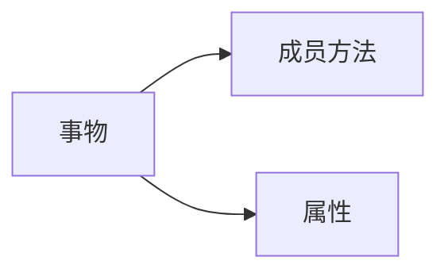

## python面向对象

### 1.1初识对象

我们可以通过设计类来进行数据的处理：

```python
class Student:
    name=None
    gender=None
    nationality=None
    native_place=None
    age=None

stu_1=Student()
stu_1.name="林俊杰"
stu_1.gender="男"
stu_1.nationality="中国"
stu_1.native_place="山东省"
stu_1.age=32

print(stu_1.name)
print(stu_1.gender)
print(stu_1.nationality)
print(stu_1.native_place)
print(stu_1.age)


# 林俊杰
# 男
# 中国
# 山东省
# 32
```

### 1.2类的成员方法

类的使用语法：

```python
class 类名称:
    # class是关键字，表示定义了类
    类的属性
    # 类的属性，即定义类中的变量（成员变量）
    类的行为
    # 类的行为，即定义类中的函数（成员方法）
```

创建类的对象的语法：

```python
对象=类名称()
```

定义成员方法：

```python
def 方法名(self,形参1,形参2,形参3,……):
    方法体
    
```

self关键字是成员方法定义的时候必须填写的：

* 表示类对象的意思
* 当我们使用类对象调用方法时，self会自动被python传入
* 方法内部，想要访问类的成员变量，必须使用self
* 传入参数的时候，self是透明的，不用理会它

```python
class Student:
    name=None

    def say_hi(self):
        print(f"大家好，我是{self.name},好嗨哟")

    def say_hello(self,msg):
        print(f"大家好，我是：{self.name},{msg}")

stu = Student()
stu.name="高鑫"
stu.say_hi()
stu.say_hello("元婴期修士")

stu2 = Student()
stu2.name="周杰伦"
stu2.say_hi()
stu2.say_hello("哎呦不错哟")

# 大家好，我是高鑫,好嗨哟
# 大家好，我是：高鑫,元婴期修士
# 大家好，我是周杰伦,好嗨哟
# 大家好，我是：周杰伦,哎呦不错哟

```

### 1.3类和对象



类只是一种程序内的”设计图纸“，需要基于图纸生产实体（对象），才能正常工作，称之为面向对象编程

```python
class Clock:
    def ring(self):
        import winsound
        winsound.Beep(18000,1000)

c=Clock()
c.ring()
```

设计类，基于类创建对象，并使用对象来完成具体的工作

### 1.4 构造方法

使用`__init__()`方法，称之为构造方法

在创建类对象的时候，会自动执行，将传入参数自动传递给`__init__`方法使用

```python
class Student:
    name=None
    age=None
    tel=None
    # 上面可以省略
    # 变量是定义在构造方法内部，如果要成为成员变量，需要用self来表示

    def __init__(self,name,age,tel):
        self.name=name
        self.age=age
        self.tel=tel
        print("Student创建了一个类对象")

stu=Student("高鑫",18,"18888888888")
print(stu.name,stu.age,stu.tel)

# Student创建了一个类对象
# 高鑫 18 18888888888
```

### 1.5 魔术方法

1. `__str__`字符串方法：控制类转换为字符串的行为

   ```python
   class Student:
       def __init__(self,name,age):
           self.name=name
           self.age=age

   stu=Student("周杰伦",31)
   print(stu)
   print(str(stu))

   # <__main__.Student object at 0x000001FDB0D29640>
   # <__main__.Student object at 0x000001FDB0D29640>
   ```

   ```python
   class Student:
       def __init__(self,name,age):
           self.name=name
           self.age=age

       def __str__(self):
           return f"Student类对象，name:{self.name},age:{self.age}"

   stu=Student("周杰伦",31)
   print(stu)
   print(str(stu))

   # Student类对象，name:周杰伦,age:31
   # Student类对象，name:周杰伦,age:31
   ```

2. `__lt__`小于符号比较法

   ```python
   class Student:
       def __init__(self,name,age):
           self.name=name
           self.age=age

       def __lt__(self, other):
           return self.age<other.age

   stu1 = Student("周杰伦", 31)
   stu2 = Student("高鑫", 18)
   print(stu1<stu2)
   print(stu1>stu2)

   # False
   # True
   ```

3. `__le__`小于等于比较符号方法

   ```python
   class Student:
       def __init__(self,name,age):
           self.name=name
           self.age=age

       def __le__(self, other):
           return self.age<=other.age

   stu1 = Student("周杰伦", 31)
   stu2 = Student("高鑫", 18)
   print(stu1<=stu2)
   print(stu1>=stu2)

   # False
   # True
   ```

4. `__eq__`使用==符号进行比较

   ```python
   class Student:
       def __init__(self,name,age):
           self.name=name
           self.age=age

       def __eq__(self, other):
           return self.age==other.age

   stu1 = Student("周杰伦", 31)
   stu2 = Student("高鑫", 18)
   print(stu1==stu2)

   # False
   ```

### 1.6封装

封装表示的是，将现实世界的属性、行为封装到类中，描述为成员变量、成员方法，从而完成程序对现实世界的描述。

现实事物有部分属性和行为是不公开对使用者开放的。同样在类中描述属性和方法的时候也需要达到这个要求，就需要定义私有成员了。

类中提供私有成员的形式来支持:私有成员变量和私有成员方法，定义私有成员只需变量名或方法名以__开头。

* 私有变量无法获值，也无法获取值
* 私有方法无法直接被类对象使用
* 私有成员可以被类中其他成员使用

```python
class Phone:
    __current_voltage=0.5

    def __keep(self):
        print("手机CPU保持单核模式运行")

    def call_by_5G(self):
        if self.__current_voltage>=1:
            print("5G通话一开始")
        else:
            self.__keep()
            print("变量不足，使用单核模式运行")


phone=Phone()
phone.call_by_5G()

# 手机CPU保持单核模式运行
# 变量不足，使用单核模式运行
```

### 1.7 继承

#### 1.7.1继承的基础语法

继承表示将从父类那里继承（复制）来成员变量和成员方法（不含私有）

单继承：

```python
class 类名(父类名):
    类内容体
```

多继承：

```python
class 类名(父类1,父类2,父类3,父类4....):
    类内容体
```

```python
class Phone:
    IMEI =None
    producer="apple"

    def call_by_4g(self):
        print("4g通话")

class Phone2024(Phone):
    face_id="10001"

    def call_by_5g(self):
        print("5g通话")

class  NFCReader:
    nfc_type="第五代"
    producer="mi"

    def read_card(self):
        print("NFC读卡")

    def write_card(self):
        print("NFC写卡")

class RemoteControl:
    rc_type="红外遥控"

    def control(self):
        print("开启红外线遥控")

class MyPhone(Phone2024,NFCReader,RemoteControl):
    pass

phone=MyPhone()
print(phone.producer)
phone.call_by_5g()
phone.read_card()
phone.control()

# apple
# 5g通话
# NFC读卡
# 开启红外线遥控
```

注:多个父类中，如果有同名的成员，那么默认以继承顺序（从左向右）为优先级

即：先继承的先保留，后继承的被覆盖

#### 1.7.2 复写

定义：在子类中重新定义同名的属性

一旦复写父类成员，那么类对象调用成员的时候，就会调用复写后的新成员

如果需要使用被复写的父类成员，需要特殊的调用方式：

1. 调用父类成员

   `父类名.成员变量`

   `父类名.成员方法(self)`

2. 使用super调用父类成员

   `super().成员变量`

   `super().成员方法()`

注：只可以在子类内部调用父类的同名成员，子类的实体类对象调用默认是调用子类复写的

### 1.8类型注解

类型注解：在代码中涉及数据交互的地方，提供数据类型的注解（显示的说明）

支持：

* 变量的类型注解
* 函数(方法)形参和返回值的类型注解

基础语法：变量:类型

#### 1.8.1变量的类型注解

基础类型注解：

```python
var_1:int=11
var_2:str="gao"
var_3:bool=False
```

类对象类型注解：

```python
class Student:
    pass

stu:Student=Student()

```

基础容器类型注解：

```python
my_list:list=[1,2,3]
my_tuple:tuple=("gao",666,True)
my_set:set={1,2,3}
my_dict:dict={"gaoxin":100}
```

容器类型详细注解：

```python
my_list:list[int]=[1,2,3]
my_tuple:tuple[str,int,bool]=("gao",666,True)
my_set:set[int]={1,2,3}
my_dict:dict[str,int]={"gaoxin":100}
```

注：

1. 元组类型设置类型详细注解，需要将每一个元素都标记出来
2. 字典类型设置类型详细注解，需要两个类型，第一个Key，第二个是Value

在注释中进行类型解释

语法：type：类型

```python
var_1=random.randint(1,10) # type: int
var_2=json.loads('{"name":"zhnagsan"}') # type: dict[str,str]
def func():
    return 10
var_3=func() # type: int
```

一般，无法直接看出变量类型之时会添加变量的类型注解

类型注解仅仅是提示性的，不是决定性的

```python
var_4: int="dada"
var_5: str=123
# 不会报错
```

#### 1.8.2函数（方法）的类型注解

对形参和返回值进行类型注解：

```python
def func (形参名：类型，形参名：类型....)-> 返回值类型:
	pass

```

#### 1.8.3 Union联合类型注解

```python
from typing import Union
my_list:list[Union[str,int]]=[1,2,"gao","xin"]
my_dict:dict[str,Union[str,int]]={"名字":"周杰伦","年龄":"22"}
```

### 1.9 多态

多态：多种状态，即完成某个行为时，使用不同的对象会得到不同的状态

多态常作用于继承关系上：

比如

* 函数（方法）形参声明接收父类对象
* 实际传入父类的子类对象进行工作

即：

* 以父类做声明工作
* 以子类做实际工作
* 用以获得同一行为，不同状态

```python
class Animal:
    def speak(self):
        pass

class Dog(Animal):
    def speak(self):
        print("汪汪汪")

class Cat(Animal):
    def speak(self):
        print("喵喵喵")

def make_noise(animal:Animal):
    animal.speak()

dog=Dog()
cat=Cat()

make_noise(dog)
make_noise(cat)

# 汪汪汪
# 喵喵喵
```

* 父类用来确定有那些方法
* 具体的方法实现，由子类自行决定

这种写法被称为抽象类（也可以称之为接口）

抽象方法：方法体是空实现（pass）称之为抽象方法

抽象类：含有抽象方法的类被称为抽象类


