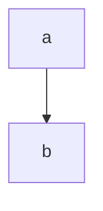
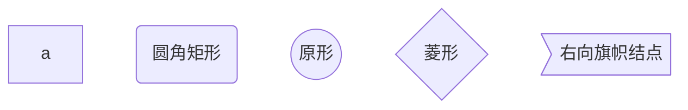
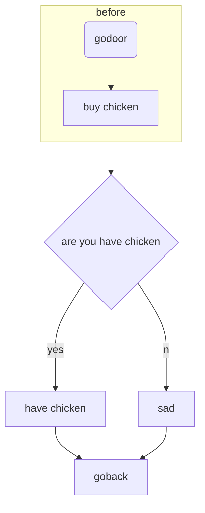
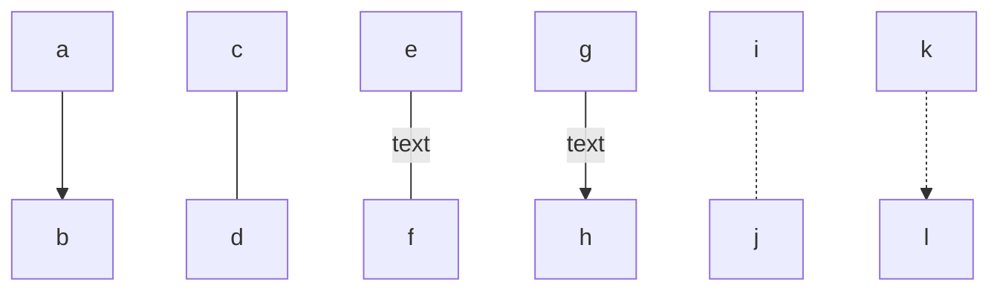

# Markdow

###### 最多支持六级标题

这是~~删除线~~（）波浪号

这是*斜体*

这是**加粗**

这是***斜体加加粗***

这是<u>下划线</u>

<u>nxnasc</u>(ctrl+u)

这是==高亮==

H~2~O

m^2^

:smile::100:

:man:

:

name|price

---|---

gaoxin|19

cola|12

| name | prie |      |
| ---- | ---- | ---- |
|      |      |      |
|      |      |      |
|      |      |      |

> 计算
>
> 

* ​


* 啊的农村

*+space

1. 1
2.  ​

```java
public static void main(String[] args)
    ```+语言名称
```

***

------

***横线

[开头](#Markdow)

[link text](https://www/baidu.com)

要ctrl点击

<https://www.baidu.com>


# 图

## 流程图

TB,BT,RL,LR

> top,bottom,right,left










